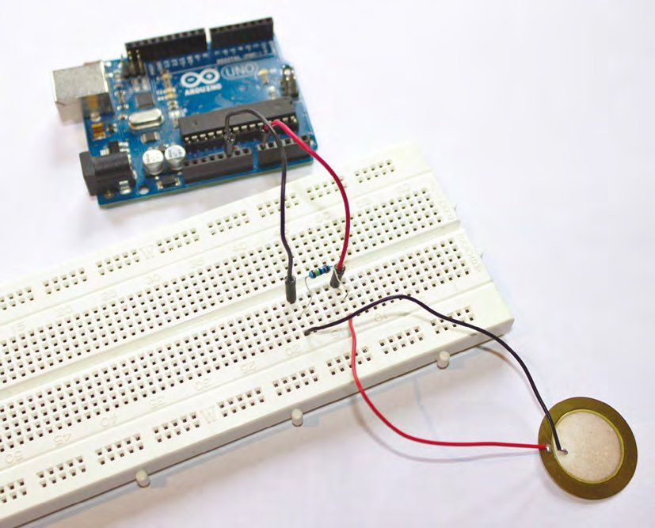
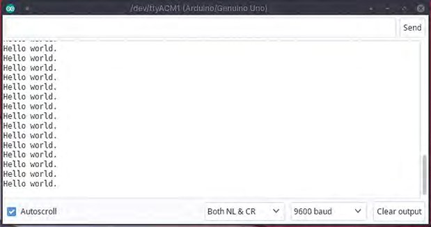
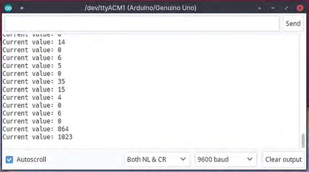
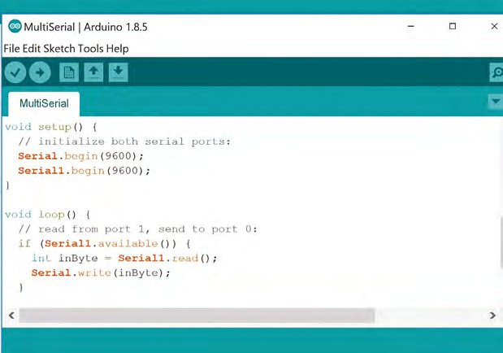
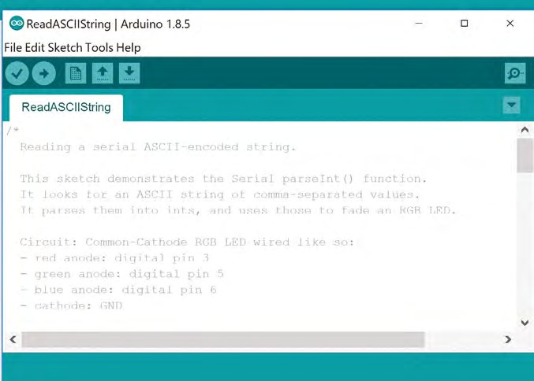
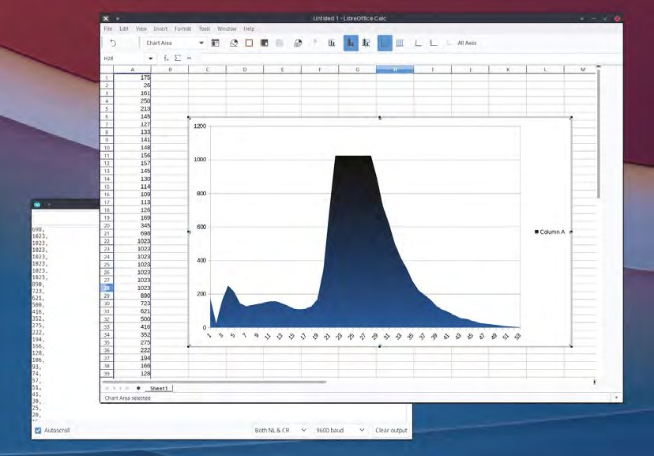
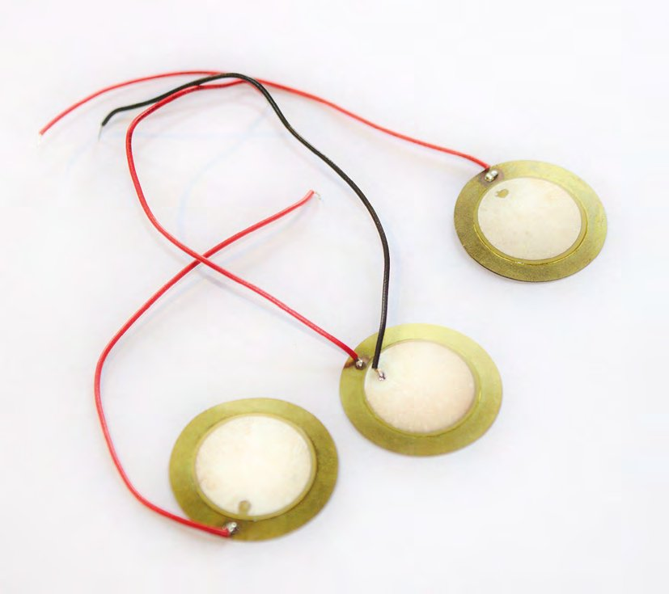
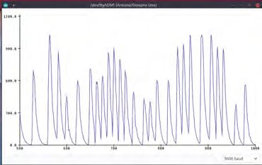

# Capitolul 13 – Programare Arduino: depanarea

> *Pătrunde în arta obscură a depanării și află unde anume merg lucrurile prost*

> **DESPRE AUTOR**
> **Graham Morrison** (@degville) este un jurnalist Linux veteran, aflat într-o căutare de-o viață a muzicii din aranjamentul perfect al siliciului.



*Crearea unui circuit cu un senzor piezo nu ar putea fi mai simplă. Leagă plusul la un pin analogic, minusul la masă și pune un rezistor de 1 MΩ între cele două*

Un aspect al programării Arduino pe care abia l-am atins este arta atentă, prudentă și necesară a depanării (*debugging*). Depanarea este un termen foarte general, care acoperă o varietate uriașă de procese, de la simpla încercare de a afla de ce nu merge codul tău sau de ce produce rezultate neașteptate, până la monitorizarea performanței, profilare și optimizare. Majoritatea mediilor și cadrelor de dezvoltare moderne oferă unelte pentru aceste procese de depanare, permițându-ți de obicei să parcurgi codul linie cu linie în timp ce monitorizezi starea hardware-ului (cu un depanator precum „gdb”), sau să generezi informații de profil din execuția codului, cum ar fi timpul petrecut într-o funcție sau cantitatea de memorie folosită. Dar pe un Arduino nu avem același nivel de lux.

Cu Arduino nu există nicio unealtă grafică pentru monitorizarea memoriei, nici profilare a performanței sau depanator grafic. În acest fel, depanarea unui proiect Arduino poate semăna foarte mult cu depanarea unui proiect pe un calculator de acasă din anii 1980, pentru că trebuie să îți inventezi propriile teste și să îți scrii propriul cod direct în proiecte. Nu e neapărat un lucru rău, pentru că înveți despre codul tău și înveți cum să eviți cel mai bine greșelile, prin încercări și erori. Dar sunt multe lucruri pe care le poți face ca să îți ușurezi procesul, și multe pe care le poți face ca să îți accelerezi codul; pe ambele le vom aborda cu monitorul serial și cu niște minunați senzori piezo.

> *Depanarea unui proiect Arduino poate semăna foarte mult cu depanarea unui proiect pe un calculator de acasă din anii 1980*

## Schela serială

La scrierea oricărui cod Arduino, există un element mereu necesar și totuși aproape întotdeauna tăiat înainte de publicare sau lansare. Este codul folosit pentru a depana programul, și seamănă puțin cu schela din jurul unei clădiri în construcție. Are un rol esențial, pe care rareori îl mai vezi după ce proiectul e gata. Rareori (niciodată!) codul funcționează de la prima scriere, și adesea trebuie să te întorci prin ce ai scris și să îți compari așteptările cu ce se întâmplă de fapt. Greutatea vine din a afla ce se întâmplă. De fapt, e foarte aproape de felul în care funcționează dezvoltarea profesionistă, pentru că adesea trebuie să scrii, în același timp, teste care măsoară acele așteptări față de ce se poate demonstra că se întâmplă. Testele sunt rulate apoi de fiecare dată când codul este actualizat, ca să te asiguri că nimic din ce s-a adăugat nu schimbă comportamentul codului vechi; este un proces cunoscut drept QA (*quality assurance*, asigurarea calității).

Programarea pentru Arduino ridică mai multe provocări unice. Cea mai mare de depășit este că nu rulezi codul pe același sistem, sau pe aceeași arhitectură, pe care îl scrii. Un Arduino nu e, de fapt, decât un microcontroler. De aceea nu există unelte native de depanare la îndemână, pentru că acestea trebuie de obicei să ruleze și să interpreteze rezultatul compilat al codului pe sistemul pentru care a fost construit. În schimb, codul Arduino „viu” rulează doar după ce a fost încărcat pe dispozitiv și, în afară de un LED care clipește, dispozitivul nu are cum să îți comunice starea de funcționare sau dacă a întâmpinat probleme, decât dacă adaugi tu, în mod explicit, acest feedback în cod. Mai mult, deși poți crea, evident, codul care să trimită mesaje către LED-uri, ecrane și emițătoare de sunet atașate, nu poți depana apoi ieșirea către acele dispozitive dacă nici ele nu funcționează. Răspunsul este să folosești portul serial.



*Partea cea mai bună a monitorului serial este că nu ai nevoie de hardware suplimentar, cum ar fi un ecran, ca să primești informații cu sens de la Arduino*

> **VITEZĂ SPORITĂ CU REGISTRE**
> Platforma Arduino a fost proiectată să fie cât mai larg compatibilă. Asta îi permite să funcționeze pe multe tipuri de dispozitive și în multe medii diferite. Dar flexibilitatea vine uneori cu prețul performanței, mai ales pe dispozitive specifice. Iar unul dintre cele mai bune exemple este funcția `digitalWrite`, folosită de aproape orice proiect Arduino pentru a trimite un semnal unui pin. Documentația Arduino recunoaște că `digitalWrite` are o duzină de linii de cod, compilate într-un multiplu de instrucțiuni specifice mașinii, dintre care una este executată la fiecare ciclu de ceas de 16 MHz. Asta ia timp. Dar te poți lipsi complet de `digitalWrite` și poți scrie direct pe pinul respectiv, folosind ceea ce se numește un „registru”. Mai mult, se poate face cu o singură comandă:
>
> ```cpp
> PORTD &= ~_BV(PD2);
> ```
>
> Un registru este un tip special de stocare, legat de o locație hardware anume, care este apoi citit direct de hardware când se execută o anumită funcție. Cipurile de pe un Arduino au trei tipuri diferite de registre, care acoperă toți pinii analogici și digitali, inclusiv `PORTD`, pentru acces de citire/scriere la pinii digitali 0–7, așa cum arată exemplul de mai sus. Șmecheria cu `&=` vine din faptul că lucrăm la un nivel hardware jos: este un operator de atribuire cu ȘI pe biți. Urmează un NU pe biți, tilda (`~`), care îți permite efectiv să comuți starea pinului 2 (`PD2` pe Uno), cu macroul `_BV` pentru comoditate. O formă mai lungă de a scrie același lucru este echivalentul lui `PORTD = PORTD & (~_BV(0b00000100))`. Dar nu trebuie să aibă sens ca să funcționeze. În experimentele noastre, codul de mai sus ia circa două cicluri de procesor, în timp ce `digitalWrite` ia circa 36, cel puțin pe Uno-ul nostru.

„S”-ul din cordonul ombilical USB pe care îl folosim pentru a încărca codul pe Arduino vine de la „serial”, și chiar și USB-ul modern descinde din această formă foarte timpurie de comunicare între dispozitive, în care biții sar de la un pin hardware la altul, câte un bit o dată. Acești pini erau pur și simplu pentru „transmitere” și „recepție”, și chiar și pe multe dispozitive moderne, cum ar fi Echo de la Amazon sau routerul furnizorului tău de internet, hackerii pot găsi adesea padurile sau pinii TX și RX pe placa de bază. Și Raspberry Pi are acești doi pini și este o platformă de testare convenabilă pentru a lucra sau a experimenta cu alte plăci. Aceste conexiuni sunt mai cunoscute sub numele de UART (*universal asynchronous receiver/transmitter*) atunci când pinii sunt folosiți așa, pentru o conexiune serială, lucru reflectat în numele dispozitivului Linux de pe Raspberry Pi. Dar UART este folosit pe scară largă și pe Arduino, atât manual, prin conexiunea la pini, cât și prin conexiunea USB, pentru a trimite date din codul tău înapoi spre un sistem gazdă.



*Fără feedback e foarte greu să îți dai seama ce valori apar și când pe un senzor, ca să poți apoi genera funcții*

Ca o conexiune serială să funcționeze, atât emițătorul, cât și receptorul trebuie să știe cât de repede circulă datele. Aceasta era rata *baud* în terminologia vechilor modemuri și corespunde direct numărului de biți binari trimiși pe un fir într-o secundă. Ca să setezi rata baud a conexiunii seriale cu Arduino, adaugă `Serial.begin(9600);` în funcția `setup`. Cu asta gata, poți trimite acum date din codul care rulează pe Arduino înapoi spre calculatorul gazdă, folosind `Serial.println`:

```cpp
void setup() {
  Serial.begin(9600);
}

void loop()
{
  Serial.println("Hello world.");
  delay (500);
}
```

> *Atât emițătorul, cât și receptorul trebuie să știe cât de repede circulă datele*

115.200 de biți pe secundă este adesea cea mai mare viteză serială pe care o vei obține pe plăcile Arduino, și la fel pe multe dispozitive care folosesc pinii RX și TX. Dacă ai probleme, încearcă viteze mai mici, cum ar fi 57.600, 38.400, 19.200 sau 9600. După cum arată codul de mai sus, pornim de la cea mai mică viteză, pentru că aceasta are întotdeauna cele mai mari șanse să funcționeze. Ca să testezi codul de mai sus, trimite-l la Arduino și deschide „Serial Monitor” din meniul „Tools” al IDE-ului. Este echivalentul, în IDE, al vechilor programe de terminal care ajutau calculatoarele de demult să se conecteze la sistemele BBS de la distanță. Fereastra principală arată ce s-a primit prin conexiune, iar câmpul mic „Send” îți permite să trimiți date înapoi prin conexiunea serială. Dar înainte de asta, trebuie să sincronizezi viteza monitorului cu rata baud a conexiunii, din meniul derulant „baud” din dreapta jos. Dacă e setată greșit, vei primi un ecran plin de rebus. Când e selectată corect, ar trebui să vezi un nou mesaj „Hello world” la fiecare 500 de milisecunde, adică o jumătate de secundă.



*Majoritatea plăcilor Arduino au mai mult de o conexiune serială, iar această conexiune suplimentară poate fi folosită pentru a comunica cu alt hardware. Sketch-ul exemplu MultiSerial arată cum*

## Depanarea

Desigur, afișarea unui singur mesaj nu ajută la nimic. Dar poți folosi acum conexiunea serială pentru a rezolva tot felul de probleme altfel greu de rezolvat, folosind aceeași comandă `Serial.println` pentru a indica momentul în care codul ajunge într-o anumită secțiune, pentru a vedea valoarea unei anumite variabile sau momentul în care un anumit eveniment a declanșat o funcție. Și ca să dăm acestor exemple mai multă consistență, arătând `Serial.println` în acțiune, vom crea un exemplu concret, cu o singură componentă: un senzor piezoelectric de lovituri sau vibrații. Sunt ieftini și incredibil de versatili și, după cum le spune numele, pot fi folosiți pentru a crea orice, de la detectoare de mișcare și monitoare de uși până la paduri de tobe și manometre.



*Poți trimite date către Arduino prin serial și în sens invers. Exemplul Communication > ReadASCIIString arată cum*

Un senzor piezoelectric de lovituri este strâns înrudit cu „piezo”-ul folosit pentru a genera sunet într-un capitol anterior, precum și cu „piezo”-ul din dozele chitarelor electrice și, în cele din urmă, din multe microfoane. Ele generează tensiuni din forțe de îndoire și schimbări de presiune. Se leagă ușor la Arduino, cu plusul (firul roșu) la intrarea analogică 1 și minusul (firul negru) la masă, cu un rezistor de 1 MΩ (megaohm) între cele două, ca să amortizeze tensiunea potențială a senzorului. Dar acești senzori sunt și imprevizibili, și adesea nu ai idee ce fel de valori analogice vor genera până când nu încep să le genereze. Asta e important dacă vrei să declanșezi ceva la un anumit prag, de exemplu, sau să te asiguri că pragul nu se schimbă în condiții diferite. Iar asta înseamnă că trebuie să primești datele înapoi de la Arduino prin conexiunea serială.



*Generarea de date CSV de la senzori este un mod genial de a face experimente și de a vizualiza rezultatul, cum ar fi curba de răspuns a unui senzor piezo de lovituri*

Pentru acest exemplu simplu, adaugă următoarele la începutul codului, ca să setezi pinul analogic pe care îl folosim și întregul în care păstrăm citirea:

```cpp
const int PIEZO = A0;
int piezo_value = 0;
```

Bucla principală poate fi apoi actualizată cu următoarele:

```cpp
void loop()
{
  piezo_value = analogRead(PIEZO);
  Serial.print("Current value: ");
  Serial.println(piezo_value);
  delay (500);
}
```

Există două mici diferențe în codul de „afișare” de mai sus. Prima este că folosim `print`, nu `println`, pentru că nu vrem un sfârșit de rând după textul „Current value: ”, de care se ocupă următoarea instrucțiune `println`, deși există coduri de control care pot face asta chiar în interiorul textului. Dar împărțirea în două linii face ușor de văzut că afișăm `piezo_value` cu a doua linie. Când încarci acum codul, îl rulezi și deschizi monitorul serial ca înainte, ar trebui să vezi următorul rezultat:

```
Current value: 0
Current value: 0
```



*Senzorii piezo sunt ieftini, ușor de integrat și incredibil de flexibili. Merită mereu să ai câțiva prin preajmă*

Încearcă acum să apeși pe senzorul piezo. Ar trebui să vezi valoarea sărind, deși nu mereu într-un mod previzibil. Valoarea maximă a convertorului analog-digital de la intrare este 1023, și uneori se obține cu o apăsare ușoară, nu cu o lovitură puternică, dar atât timp cât valoarea nedeclanșată este 0, poți folosi senzorul ca declanșator.

Dacă ai vrea să folosești piezo-ul ca declanșator de tobă, te-ai putea întreba în ce punct ar trebui să pornească declanșarea, iar asta e o problemă complicată. Ai putea folosi trecerea de la zero la o valoare diferită de zero, de exemplu, dar dispozitive ca acesta, și butoanele de moment, includ adesea mai multe treceri de la zero într-o singură lovitură, și nu e mereu ușor de spus când ar trebui să aibă loc declanșarea principală. Este un exemplu grozav de situație în care ai vrea să te uiți mai adânc la partea de depanare a codului, cartografiind valorile tipice ale unui senzor pe parcursul unui eveniment, cum ar fi o declanșare. Putem face asta ușor cu propriul cod, cu doar câteva modificări:

> *Te-ai putea întreba în ce punct ar trebui să pornească declanșarea, iar asta e o problemă complicată*

```cpp
void loop()
{
  piezo_value = analogRead(PIEZO);
  if (piezo_value){
    Serial.print(piezo_value);
    Serial.println(", ");
  }
  delay (10);
}
```

Codul de mai sus înlocuiește funcția `loop` cu o instrucțiune `if`, declanșată doar când `piezo_value` nu este 0. Apoi afișează această valoare urmată de o virgulă, înainte de a aștepta zece milisecunde și a încerca din nou. Ceea ce face, de fapt, este să scoată o listă separată prin virgule, în formatul cunoscut de obicei drept CSV (*comma-separated values*). Este un format foarte simplu, suportat de multe tipuri diferite de unelte de vizualizare, atât online, cât și offline, și poți copia și lipi acele valori direct din fereastra monitorului serial într-una dintre ele, cum ar fi LibreOffice Calc, și de acolo poți genera un grafic al valorilor. Apoi poți analiza graficul ca să vezi care ar putea fi răspunsul tipic al senzorului, mai ales dacă combini mai multe declanșări. Ar trebui să poți deduce apoi o serie de valori care constituie un eveniment adevărat, fără vibrații sau repetiții, și poți face asta doar datorită ieșirii de depanare din monitorul serial.

> **PLOTTER-UL SERIAL**
> În textul principal am terminat prin a scoate un set de date în format CSV, care poate fi analizat cu oricare dintre zecile de aplicații și servicii web care suportă CSV. Dar există și o funcție puțin cunoscută a Arduino IDE, care îți permite să primești feedback în timp real de la senzori, fără să exporți deloc datele. Această funcție este „Serial Plotter”, aflată chiar sub „Serial Monitor” în meniul Tools. Trebuie deschisă separat și cere aceeași setare a ratei baud ca monitorul. Dar, cel mai important, cere un anumit format al datelor trimise din cod. Este aproape identic cu formatul CSV folosit în codul nostru inițial, dar înlocuiește virgula cu un singur spațiu. De exemplu, codul nostru ar arăta așa:
>
> ```cpp
>   if (piezo_value){
>     Serial.print(piezo_value);
>     Serial.println(" ");
>   }
> ```
>
> Cu această mică schimbare și cu codul încărcat pe Arduino, nu mai ai decât să deschizi plotter-ul și să începi să atingi piezo-ul. Vei vedea graficul desenat aproape în timp real în plotter, ceea ce e un mod grozav atât de a vizualiza senzorii și datele pe care le generează, cât și de a-ți face un model al felului în care ai vrea să folosești anumite intervale de valori din date.



*Plotter-ul serial desenează în timp real valorile primite de la senzor*
