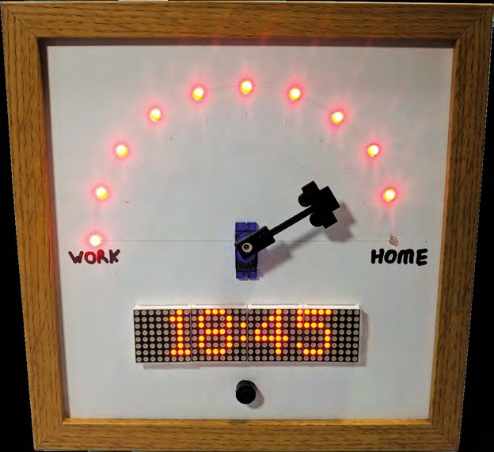
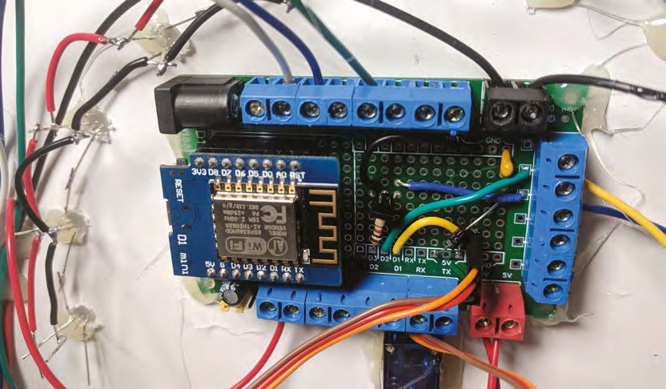
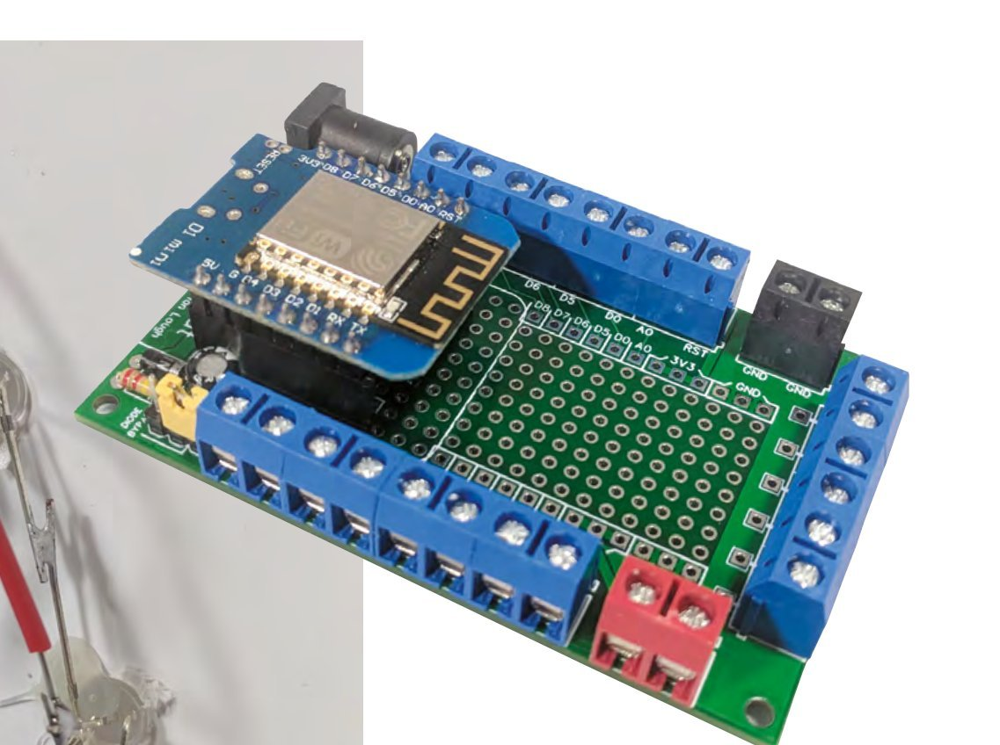
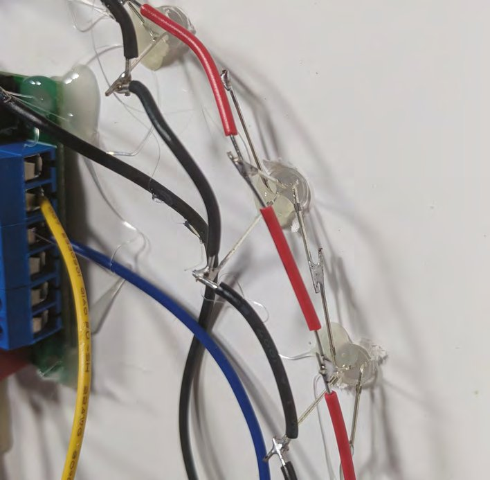
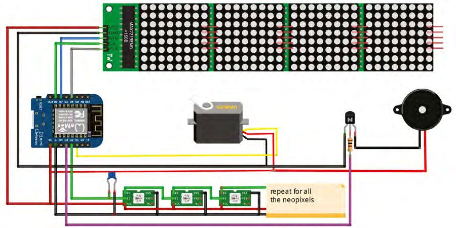
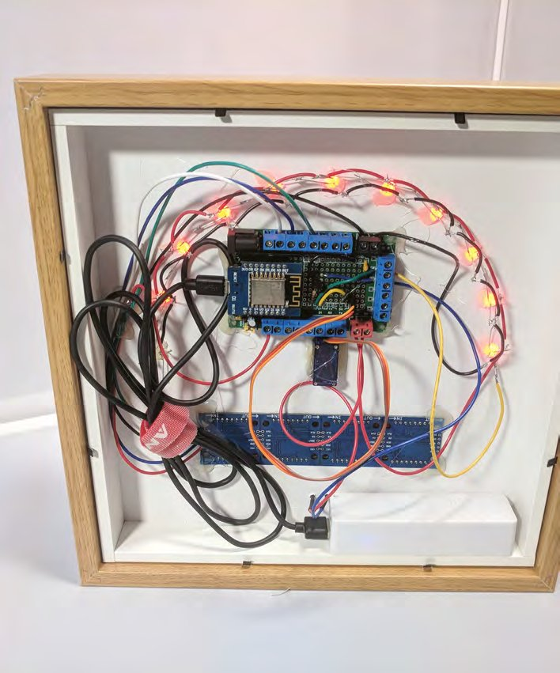
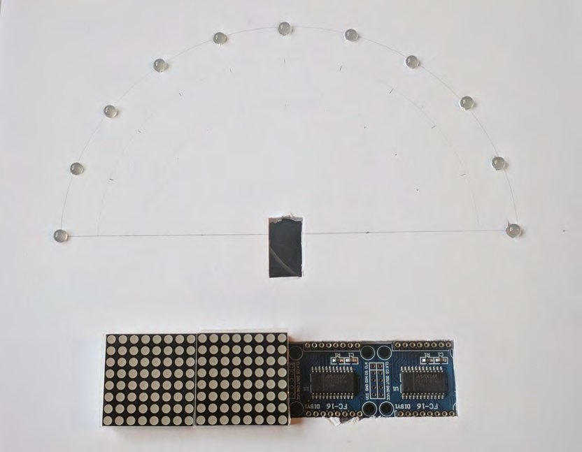
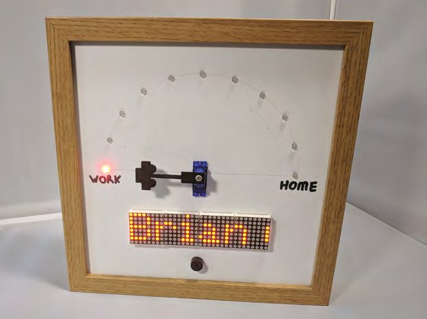

# Capitolul 14 – Way Home Meter: contorul drumului spre casă

> *Folosește un ESP8266 și câteva NeoPixels ca să le spui celor dragi când ajungi acasă*

> **DESPRE AUTOR**
> **Brian Lough** (@witnessmenow) este un maker din Irlanda, care creează în principal proiecte și biblioteci pentru microcontrolerele ESP. Vezi ce face pe canalul lui de YouTube și pe [blough.ie](https://blough.ie).



„Spune-mi la ce oră ajungi acasă” este un refren obișnuit în casele din toată țara. Încercăm să dăm răspunsuri bune, dar e greu de știut cum ne va afecta traficul pe drum. În loc să ne bazăm pe ghicit, hai să încercăm să construim ceva care să le spună familiilor noastre când ajungem înapoi.

În acest proiect vom construi un dispozitiv care dă ore de sosire acasă actualizate, pe baza condițiilor de trafic în timp real. Ca dispozitivul să fie mai util și când nu este folosit în acest scop, el funcționează ca un ceas care își ia automat ora de pe internet și se ajustează automat la ora de vară.

L-am construit cu un ESP8266, un microcontroler surprinzător de puternic, cu WiFi încorporat, care poate fi programat din Arduino IDE.

Dispozitivul folosește câteva servicii de internet diferite, gratuite:

- **Telegram:** un serviciu de mesagerie instantanee, care permite crearea de boți cu care utilizatorii pot interacționa. Este un mod foarte bun de a comunica cu proiectele tale cu ESP8266 sau ESP32 de oriunde din lume, gratuit.
- **Google Maps API:** poate fi folosit pentru a obține timpul de călătorie și informații despre trafic între două locuri.
- **Servere NTP:** Network Time Protocol, un mod prin care dispozitivele conectate la rețea obțin ora. Asta elimină nevoia unui ceas de timp real și nici nu cere ca ora să fie setată manual.

Ca să îl folosească, persoana care vine acasă folosește Telegram pe telefon pentru a partaja locația în timp real cu un bot Telegram care rulează pe Way Home Meter. Acesta va actualiza Way Home Meter cu coordonatele GPS ale persoanei la fiecare 20 sau 30 de secunde.

Way Home Meter ia aceste coordonate și trimite o cerere la Google Maps API pentru a obține timpul de călătorie și distanța în timp real între locația persoanei și casă.

Way Home Meter adaugă apoi timpul de călătorie la ora curentă și afișează ora estimată de sosire a persoanei, actualizând cadranul și NeoPixel-urile ca să reprezinte ce procent din drum (ca distanță) a fost parcurs.

> **NOTA TRADUCĂTORULUI**
> Proiectul se bazează pe servicii externe care s-au schimbat de la apariția cărții (2019): Google Maps API cere un cont de facturare și și-a modificat tarifele și cota gratuită, biblioteca ArduinoJson a ajuns la versiuni noi, iar adresa pentru plăcile ESP8266 din Boards Manager este acum `https://arduino.esp8266.com/stable/package_esp8266com_index.json`. Verifică fișierul README al proiectului de pe GitHub pentru versiunile actuale ale bibliotecilor.

## Scrie codul

Codul acestui proiect este disponibil pe GitHub. Mergi la adresa [hsmag.cc/ybAcHB](https://hsmag.cc/ybAcHB), apasă pe butonul Clone or Download din partea dreaptă a paginii, apoi pe Download Zip. Dezarhivează fișierul. În dosarul dezarhivat, deschide dosarul WayHomeMeter și apoi fișierul `WayHomeMeter.ino`.

Acest sketch are nevoie de câteva biblioteci Arduino suplimentare; începe prin a deschide Arduino Library Manager, din Sketch > Include Library > Manage Libraries.

Va trebui să adaugi următoarele biblioteci:

- **Universal Arduino Telegram Bot** de Brian Lough, pentru crearea unui bot Telegram pe ESP8266.
- **Google Maps API** de Brian Lough, pentru obținerea datelor de trafic în timp real.
- **Arduino JSON** de Benoît Blanchon, folosită de biblioteci pentru a interpreta răspunsurile. Notă: versiunea 6 a acestei biblioteci are o schimbare incompatibilă, care o va face să nu funcționeze cu bibliotecile Telegram și Google Maps, așa că folosește meniul derulant din stânga ferestrei pentru a alege versiunea 5.13.2.
- **MD_MAX72XX** de majicDesigns, pentru comunicarea cu afișajul cu matrice de puncte.
- **MD_Parola** de majicDesigns, care se ocupă de animațiile de pe afișajul cu matrice de puncte.
- **Adafruit NeoPixel** de Adafruit, pentru controlul NeoPixel-urilor.
- **NTPClient** de Fabrice Weinberg, pentru obținerea orei de pe internet.
- **Timezone** de Jack Christensen, pentru trecerea automată la ora de vară.



*Terminalele cu șurub sunt utile în proiectele în care componentele sunt separate de PCB*

> **VEI AVEA NEVOIE DE**
> - Un microcontroler ESP8266 Wemos D1 mini (sau echivalent, de exemplu Adafruit Feather Huzzah sau NodeMCU)
> - Un afișaj cu matrice de puncte 4-în-1 cu Max7219
> - Un servomotor mic (SG90)
> - Un ac de cadran imprimat 3D pentru servo (opțional, poate fi făcut din orice!)
> - 11 NeoPixel-uri cu terminale (eu am folosit LED-uri PL9823)
> - Un condensator de 220 pF
> - Un buzzer pasiv
> - Un rezistor de 1 kΩ
> - Un tranzistor NPN
> - Protoboard (eu am folosit un PCB de prototip proiectat de mine, dar proiectul se poate construi ușor pe protoboard obișnuit)
> - Terminale cu șurub (opțional)
> - O ramă IKEA RIBBA
> - O coală A3 de carton spumat de 3 mm
> - Un pistol cu lipici fierbinte
> - Un burghiu pentru lemn de 4 mm
> - Un cuțit ascuțit
> - O riglă metalică
> - Un compas și un raportor
> - Un încărcător de telefon micro-USB (pentru alimentarea proiectului)

> **PROGRAMAREA ESP8266**
> Arduino IDE standard nu este configurat pentru a programa ESP8266, așa că, înainte de a putea programa placa, trebuie să facem această configurare (poți sări peste acest pas dacă ai mai folosit IDE-ul cu un ESP8266).
>
> Mai întâi, să luăm IDE-ul propriu-zis. Îl poți descărca de pe site-ul Arduino și îl instalezi ca pe orice alt program: [hsmag.cc/TAfEJp](https://hsmag.cc/TAfEJp).
>
> Apoi trebuie să configurezi IDE-ul astfel încât să știe cum să comunice cu un ESP8266. Deschide Arduino IDE, mergi la File > Preferences și lipește următoarea adresă în câmpul Additional Boards Manager URLs, apoi apasă OK:
>
> ```
> http://arduino.esp8266.com/versions/2.4.2/package_esp8266com_index.json
> ```
>
> Înapoi în ecranul principal al Arduino IDE, mergi la Tools > Board > Boards Manager. Când se deschide acest ecran, caută „ESP8266” și instalează-l; poate dura câteva minute, în funcție de conexiunea ta la internet.
>
> După configurarea unei plăci noi, se recomandă să rulezi simplul sketch exemplu Blink înainte să încerci ceva mai complicat; asta poate scuti o grămadă de bătăi de cap mai târziu! Îl găsești în File > Examples > 01. Basics > Blink.
>
> Încarcă-l pe ESP8266 și ar trebui să vezi un LED aprinzându-se și stingându-se. Dacă primești o eroare sau nu vezi lumina clipind, asigură-te că ai instalat totul corect și că ESP8266 este conectat cum trebuie.

După instalarea acestor biblioteci, apasă pe butonul „verify” (în formă de bifă) al sketch-ului WayHomeMeter, ca să te asiguri că totul se compilează fără probleme.

## Ceva configurare este necesară

Va trebui să faci câteva configurări ca acest sketch să funcționeze pentru tine, dar mai întâi trebuie să obții:

- un token de bot Telegram;
- un token pentru Google Maps API;
- coordonatele GPS ale casei tale.

Pentru a obține un token de bot Telegram, descarcă aplicația Telegram pe telefon și fă-ți un cont. Deschide aplicația și apasă pe butonul de căutare din dreapta sus. Caută „botfather”. Scrie `/newbot` și urmează instrucțiunile de pe ecran. BotFather îți va da un link către bot și un token de acces. Linkul este pentru conversația în care oamenii își vor partaja locația; tokenul de acces este folosit în sketch pentru a-ți autentifica ESP8266-ul ca fiind botul pe care tocmai l-ai creat.



*Pinii de adresă ai LED-urilor ar trebui să se poată atinge între ei fără fire suplimentare. Pinii de alimentare trebuie uniți cu fir*



*Acesta este un PCB personalizat, care scoate toți pinii lui D1 Mini la terminale cu șurub, dar poate fi recreat ușor cu un protoboard obișnuit*

Apoi va trebui să obții o cheie Google Maps API. Începe mergând la adresa [hsmag.cc/mPqFqh](https://hsmag.cc/mPqFqh). Bifează opțiunea Routes și apasă Continue. Ți se va cere apoi să creezi un proiect; îi poți da orice nume. Va trebui să adaugi un cont de facturare, dar acest dispozitiv va funcționa confortabil în limita gratuită oferită de Google. Vei primi apoi un token API, care poate fi folosit în sketch.

> **FACTURAREA GOOGLE**
> Google Maps oferă un credit lunar gratuit, echivalent cu 20.000 de cereri. Este puțin sub ce ar fi necesar pentru a trimite o cerere la fiecare două minute, timp de o lună (circa 22.000). Acest dispozitiv face cererea o dată la două minute doar cât timp monitorizează activ drumul cuiva spre casă, așa că ar trebui să rămână sub limită dacă este folosit ocazional. E posibil ca această limită să se schimbe în viitor. Cât de des verifică se poate configura în sketch, schimbând `delayBetweenGoogleMapsChecks`.

Și, la final, va trebui să obții locația GPS a casei tale. O cale simplă este să folosești Google Maps. Într-un browser web (nu în aplicație), navighează la casa ta pe Google Maps, apasă clic dreapta și alege „Directions from here”. Asta va modifica adresa URL, care va conține acum coordonatele casei tale; copiază-le din URL, de exemplu `51.5546466,-0.2794867`.

Ai acum tot ce îți trebuie ca să configurezi WayHomeMeter. Deschide sketch-ul WayHomeMeter și apasă pe fila `config.h`. Primul lucru pe care trebuie să îl introduci sunt datele rețelei WiFi, ca ESP8266 să se poată conecta la WiFi-ul tău. Apoi trebuie să adaugi tokenul botului Telegram, cheia Google Maps API și locația casei tale. La final, dacă nu ești în Marea Britanie sau Irlanda, cel mai probabil va trebui să îți schimbi fusul orar. Decomentează fusul orar potrivit și comentează fusul orar pentru Marea Britanie și Irlanda.

## Ce îl face să ticăie

Va trebui să legi totul așa cum arată **Figura 1**. LED-urile sunt LED-uri RGB adresabile, așa că au nevoie de un singur pin GPIO al microcontrolerului și poți seta culoarea fiecărui LED individual. Intrarea primului LED (cel din stânga, privind din față) va fi legată la Wemos, iar ieșirea lui va fi legată la intrarea celui de-al doilea LED. Pentru toate LED-urile următoare, intrarea LED-ului următor se leagă la ieșirea celui anterior. Ieșirea ultimului LED nu se leagă la nimic. Lipirea acestor LED-uri ar trebui lăsată pentru etapa de asamblare finală.



*Figura 1 – Schema de cablare a lui Way Home Meter*

> **NEOPIXELS CU UN DISPOZITIV DE 3,3 V**
> Poți avea adesea probleme folosind LED-uri NeoPixel cu un dispozitiv cu nivel logic de 3,3 V, cum ar fi ESP8266 sau Raspberry Pi. Poți ocoli problema folosind un convertor de nivel logic, care transformă cei 3,3 V în 5 V pentru conexiunea Data In a primului LED. Totuși, noi am constatat că funcționează bine și doar cu un mic condensator între Data In al primului LED și masă (ca în acest proiect).

## Crearea suportului

Scoate panoul din spate al ramei și folosește-l pentru a trasa un pătrat pe cartonul spumat. Cu o lamă ascuțită, decupează pătratul.

Apoi va trebui să separi panourile de afișaj, pentru că vei pune PCB-ul pe spatele cartonului și panourile în față; așa afișajul stă la locul lui, iar tăieturile rămân ascunse.

Scoate cu grijă fiecare panou cu matrice de puncte de pe afișaj. Pe marginea fiecărui panou există marcaje; notează-ți în ce direcție sunt orientate față de PCB, ca să le pui la loc în orientarea corectă.

Dacă PCB-ul are pini de conectare atașați, dezlipește-i și scoate-i. Înlocuirea lor cu fir va face PCB-ul să stea lipit de cartonul spumat.

Măsoară dreptunghiul format de pini și marchează acea formă acolo unde vrei să o pui pe cartonul spumat. Scopul este să decupezi o formă prin care să încapă pinii PCB-ului, dar prin care PCB-ul în sine să nu treacă.



*O privire la ce se ascunde în spate*

> **NU AI TIMP?**
> Dacă nu ai timp sau vrei doar să încerci rapid proiectul, redu-l la afișajul cu matrice de puncte și Wemos D1 Mini, legate cu cabluri DuPont. Funcția-cheie, afișarea orei estimate de sosire, folosește doar afișajul.

LED-urile din acest proiect sunt toate pe un arc în jurul punctului central al servomotorului. Marchează unde vrei să fie punctul central al brațului servomotorului și, cu compasul, desenează ușor un semicerc pe unde vrei să fie LED-urile. Pune raportorul pe punctul central și marchează din 18 în 18 grade. Apoi, cu o riglă, aliniază punctul central cu aceste marcaje noi; acolo unde linia intersectează semicercul este locul fiecărui LED. Pornind de pe partea pe care vrei să fie fața, folosește burghiul de 4 mm cu mâna (fără mașină de găurit) ca să faci o gaură pentru fiecare LED, acolo unde ai marcat.

> **SFAT RAPID**
> E o idee bună să exersezi decuparea formelor și găurirea pentru LED-uri pe bucăți rămase din cartonul spumat!

Măsoară dimensiunile servomotorului și marchează-le în jurul punctului central. Amintește-ți că partea care se rotește a servomotorului trebuie să fie punctul central, așa că decalează forma servomotorului în consecință. Decupează forma din cartonul spumat și introdu servomotorul prin față.

La final, trebuie să plasezi modulul buzzer. Poți pune pur și simplu pinii modulului în carton, ca să marchezi unde trebuie să fie găurile, și, cu o bucată de sârmă, străpunge cele două găuri prin cartonul spumat.



*Cartonul spumat decupat, cu LED-urile puse la loc. Cartonul va fi prins între modulul de afișaj și PCB*

## Pe ultima sută de metri

Pune toate LED-urile în cartonul spumat, prin spate. Îndoaie pinul de intrare al fiecărui LED înapoi spre LED-ul anterior și pinul de ieșire al fiecăruia spre pinul de intrare al LED-ului următor, și lipește-i împreună. Îndoaie ușor toți pinii de masă ai LED-urilor spre centrul cercului și toți pinii VCC în afara cercului. Lipește fir între toți pinii de masă și între toți pinii VCC.

Pune PCB-ul cu matrice de puncte în decupaj și pune toate panourile la loc. Fii foarte atent la orientarea panourilor, pentru că e foarte greu să le scoți din nou fără să strici cartonul spumat.

Apoi treci firul servomotorului prin gaura pentru servo și introdu servomotorul. Lipește acul cadranului pe unul dintre conectorii livrați cu servomotorul și atașează-l la servo după ce s-a uscat. Modelul 3D folosit în acest proiect poate fi descărcat de aici: [hsmag.cc/iqOPiP](https://hsmag.cc/iqOPiP). Totuși, poți folosi orice vrei (și o mașinuță de jucărie ar merge, dacă nu ai acces la o imprimantă 3D).

La final, lipește fir pe fiecare pin al modulului buzzer și împinge-l prin fața cartonului spumat.

Leagă toate modulele la Wemos, pe protoboard, și testează totul. Când ești mulțumit că totul funcționează corect, fixează componentele cu puțin lipici fierbinte. Ești gata pentru ore de sosire acasă super-precise!

> *Când ești mulțumit că totul funcționează corect, fixează componentele cu puțin lipici fierbinte*

> **SFAT RAPID**
> Fii mereu generos cu lungimea firelor pe care le folosești, mai ales într-un proiect în care spațiul nu e o problemă. Dacă trebuie să faci ajustări, e mai ușor să le scurtezi decât să le lungești.



*Numele afișat provine din numele de Telegram al utilizatorului*

> **MERGI MAI DEPARTE**
> Poți lua acest proiect și îl poți face altfel, în funcție de nevoile tale. Iată câteva sugestii:
>
> - Adaugă posibilitatea de a trimite dispozitivului o locație și o oră, iar el să calculeze când trebuie să pleci de acasă ca să ajungi la timp.
> - Adaugă suport pentru mai multe persoane. În acest moment, dispozitivul cere timpul de călătorie pentru persoana care a trimis ultima coordonată și afișează numele și informațiile corecte pentru ea, dar ar putea fi îmbunătățit ca să gestioneze mai multe persoane.
> - Alarme configurabile. Primește o notificare când o persoană este la X minute distanță. Util ca să știi când să pui cina!

> **UN POTENȚIAL CEAS WEASLEY?**
> Mulți dintre cei care au văzut versiunile timpurii ale acestui proiect au spus că le amintește de ceasul familiei Weasley din Harry Potter, un ceas care arăta locația curentă a fiecărui membru al familiei. Această soluție bazată pe Telegram ar putea fi folosită pentru un astfel de proiect, dar cere ca fiecare utilizator să activeze partajarea locației. O soluție mai pasivă ar putea fi mai bună.
