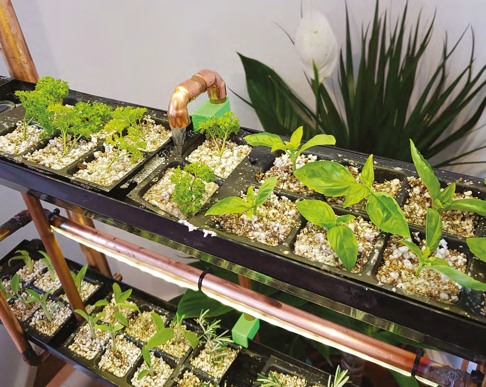
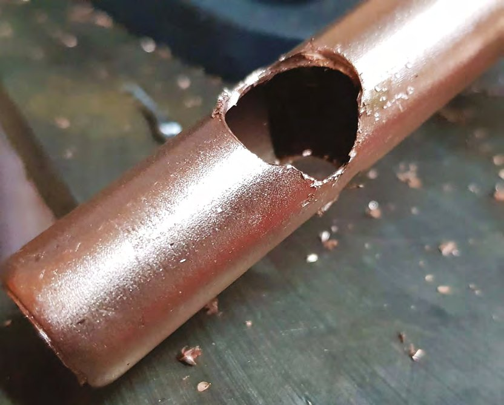
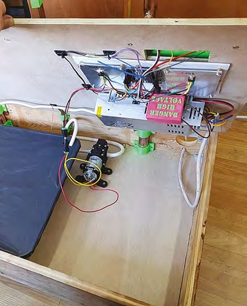
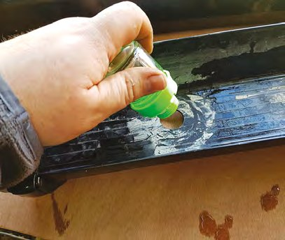
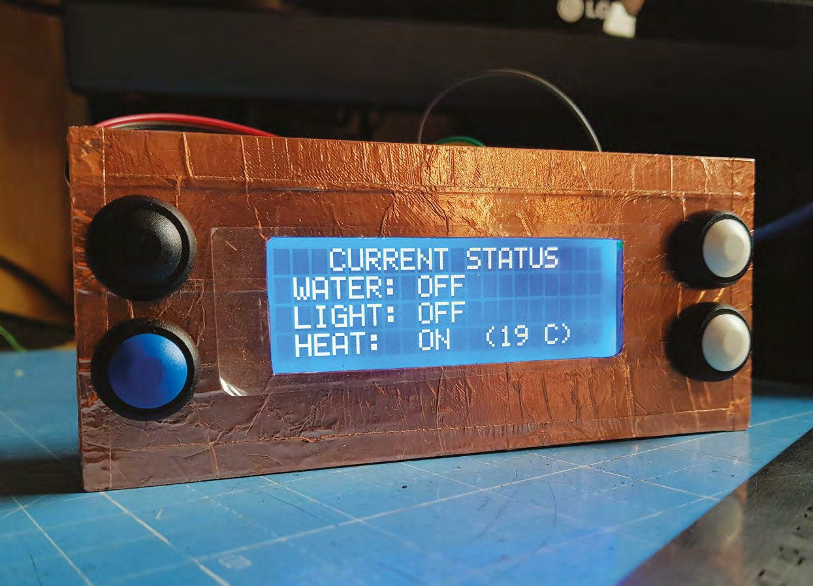
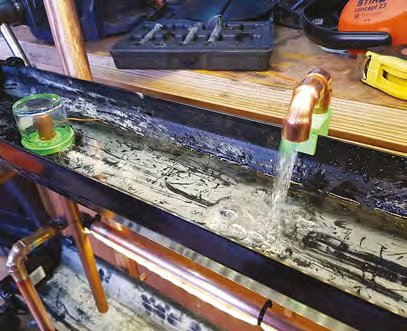
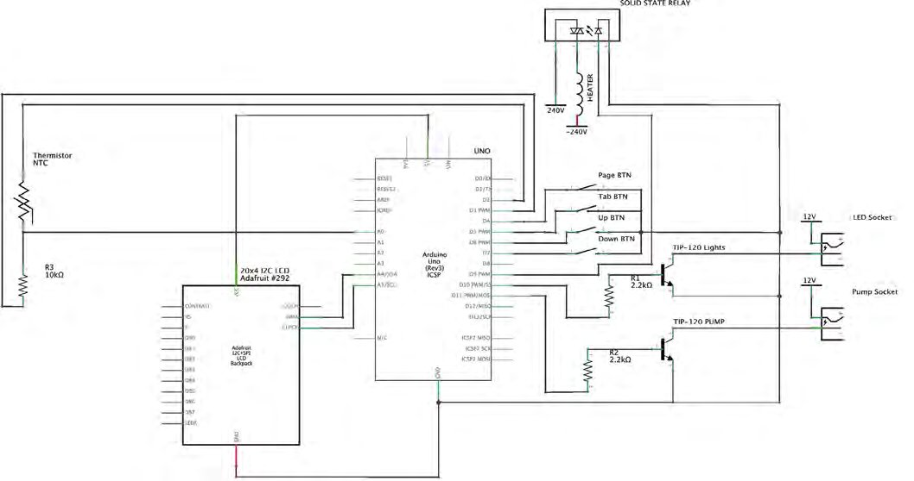
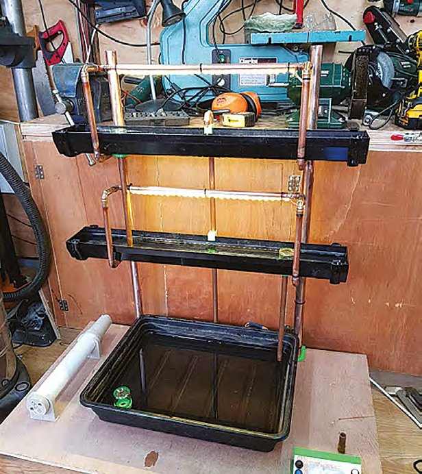
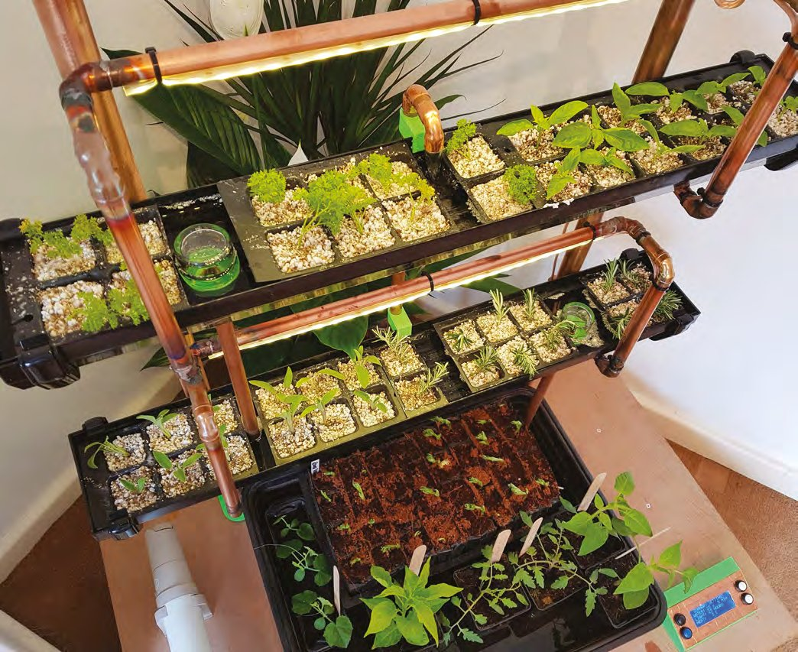
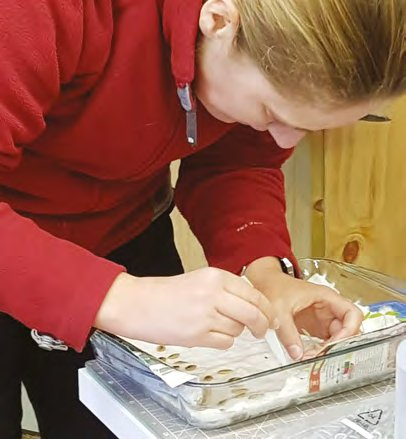

# Capitolul 15 – Grădina hidroponică de birou

> *Cultivă-ți propria hrană cu un Arduino și câteva jgheaburi de ploaie*

> **DESPRE AUTOR**
> **Dr Andrew Lewis** (@monkeysailor) este proprietarul Shedlandia.com, restaurator de unelte vechi, constructor la comandă, cercetător și membru fondator al Guild of Makers.

> **SIGURANȚĂ**
> Acest proiect combină electricitatea cu apa, o combinație care poate fi delicată și periculoasă. Trebuie să ai destule cunoștințe ca să lucrezi cu această combinație înainte să te apuci de construcție. Poți reduce problemele de siguranță folosind o sursă de alimentare externă. Recomandăm și folosirea unui dispozitiv de protecție diferențială (RCD), pentru protecție suplimentară.
>
> **Nota traducătorului:** partea cu tensiune de rețea (încălzitorul de 230 V, releul și sursa) nu este pentru copii. Lucrează la ea doar împreună cu un adult cu experiență în instalații electrice, sau înlocuiește încălzitorul cu unul de 12 V, ca tot sistemul să rămână la tensiune joasă.

În acest proiect vei face un sistem hidroponic de cultivare scalabil, care folosește componente ușor de găsit pentru a controla fluxul de apă, lumina și căldura pentru plantele tale. Sistemele hidroponice folosesc fluxuri regulate sau constante de apă îmbogățită cu nutrienți pentru a crește plante fără sol, și sunt un mod grozav de a crește legume dacă ai spațiu limitat sau acces redus la lumină naturală.

Acest proiect reprezintă câțiva ani de experimente cu sisteme de cultivare făcute în casă și este o variantă a unei tehnici hidroponice numite flux și reflux (*ebb-and-flow*), în care apa este ca mareea și inundă sistemul de mai multe ori pe zi. Plantele sunt înrădăcinate într-un substrat absorbant, care ține apa lângă rădăcinile plantei atunci când fluxul de apă se oprește.

Dacă pompa unui sistem cu flux constant se defectează, plantele mor foarte repede, în timp ce un sistem cu flux și reflux poate supraviețui câteva ore în cazul unei pene de curent.

## Crește pe verticală ca să economisești spațiu

Sistemul hidroponic descris aici are trei părți principale: sistemul de susținere, sistemul de apă și sistemul de control. Sistemul de susținere este, în esență, o cutie de lemn și un raft, și este partea cea mai ușor de făcut.

Așază orizontal bucata mai mică de placaj și folosește câteva monede sau piulițe ca să o ridici puțin de pe suprafața pe care stă. Apoi ia cele patru scânduri și aranjează-le într-o cutie dreptunghiulară în jurul bucății mai mici de placaj. Înșurubează scândurile între ele cu colțare metalice, sus și jos la fiecare colț, apoi fixează baza de placaj de scânduri cu șuruburi și lipici. Ar trebui să ai acum o cutie simplă, pe care o poți folosi ca bază a sistemului hidroponic.

Vei folosi țeavă de cupru pentru a face consolele rafturilor. Măsoară 450 mm de la capătul țevilor de 28 mm și găurește cu un burghiu de 15 mm dintr-o parte în alta. Fă o a doua gaură prin țevi, la 750 mm de capăt. Țeava de 15 mm ar trebui să alunece prin gaura din țeava de 28 mm și să formeze o consolă rudimentară de raft.

Ca să afli lungimea consolelor, măsoară lățimea jgheabului și adaugă circa 40 mm. Taie patru bucăți de țeavă de 15 mm la această lungime și pune un cot de cupru la capătul fiecăreia. Dacă ai o lampă de lipit și aliaj de lipit, le poți folosi pentru a îmbina țevile și coturile; altfel, poți folosi pur și simplu lipici fierbinte.

Fixează țevile de 28 mm la 150 mm de laturile din spatele cutiei, folosind bridele de 28 mm pentru a ține fiecare țeavă în poziție verticală. Acum poți glisa consolele de 15 mm la locul lor și le poți fixa cu aliaj de lipit sau lipici.

> *Hidroponia este un mod grozav de a crește legume dacă ai spațiu limitat*

> **VEI AVEA NEVOIE DE – ELECTRONICĂ**
> - O sursă de alimentare de 12 V, 20 A
> - Arduino Uno
> - Un încălzitor tubular de seră, impermeabil, de 60 W
> - Un ecran LCD 20×4 cu I2C
> - 4 butoane de moment (normal deschise)
> - 2 tranzistoare TIP120 (sau asemănătoare)
> - 1 releu în stare solidă de 10 A
> - 2 rezistoare de 2,2 kΩ
> - Un rezistor de 10 kΩ
> - Un termistor de 10 kΩ
> - 5 m de bandă LED pentru creșterea plantelor (sunt necesari doar 2 m)
> - O pompă de apă de 12 V
> - 3 m de cablu flexibil cu 3 fire pentru 230 V
> - Un ștecher cu siguranță de 13 A
> - Cabluri de semnal DuPont și cablu pentru 3 A
>
> **VEI AVEA NEVOIE DE – ALTE MATERIALE**
> - 2 m de tub flexibil de silicon, cu diametrul interior de circa 6 mm
> - 2 bucăți de 1 m de țeavă de cupru de 28 mm
> - 2 bucăți de 3 m de țeavă de cupru de 15 mm
> - 20 de coturi egale de cupru de 15 mm
> - 4 bride pentru țeavă de 28 mm
> - 2 bride pentru țeavă de 15 mm
> - 2 bucăți de 900 mm de jgheab pătrat
> - 4 capace exterioare pentru jgheab pătrat
> - 2 tăvi premium pentru pietriș Stewart, de 52 cm
> - O bucată pătrată de polietilenă, de 60 cm
> - 2 scânduri de circa 900 mm × 150 mm × 25 mm
> - 2 scânduri de circa 500 mm × 150 mm × 25 mm
> - 8 colțare metalice
> - O foaie de placaj de 12 mm, 950 mm × 550 mm
> - O foaie de placaj de 12 mm, 850 mm × 500 mm
> - O foaie de plastic de 3 mm, de aproximativ format A4
> - 2 bucăți de aluminiu, ca radiatoare pentru tranzistoare
> - Distanțiere de alamă M3 pentru PCB

Apoi vei extinde consolele ca să susțină luminile LED deasupra jgheaburilor. Taie patru bucăți de țeavă de cupru de 250 mm și potrivește-le vertical în coturile de pe consolele rafturilor. Taie alte patru bucăți de țeavă de cupru, puțin mai scurte decât jumătate din lățimea jgheabului, și leagă-le de verticalele de 250 mm cu coturi, astfel încât să atârne deasupra jgheabului. Taie două ultime bucăți de țeavă de cupru pentru a uni consolele din stânga și din dreapta deasupra jgheabului.

Ultima bucată de țeavă va duce apa de la pompă la canalul de udare de sus. Țeava este montată vertical în mijlocul spatelui cutiei, cu bride de 15 mm, și are circa 800 mm lungime, cu o secțiune în formă de U la capătul de sus, care dirijează apa în jgheab. E mult mai ușor să folosești țeava de cupru drept canal pentru un tub de silicon cu diametru mic, împins pe pompă, decât să te conectezi direct la țeava de cupru. Trece tubul de silicon prin țeava de cupru de 15 mm și în jurul U-ului, lăsând circa 30 cm să atârne în fundul cutiei.

Cu țevile gata, poți termina tâmplăria. Fă, prin găurire sau tăiere, o gaură de 10 mm prin spatele cutiei, pe partea dreaptă, pentru cablul de alimentare, apoi fă o gaură mai mare pe ambele laturi ale spatelui, pentru ventilație. Ca să termini cutia, taie fante în bucata mai mare de placaj, ca să se așeze pe cutie ca un capac, fără să lovească țevile. Marchează mijlocul laturii celei mai lungi a placajului și aliniază acest semn cu mijlocul cutiei (pe unde urcă țeava de apă). Folosește acum un echer ca să marchezi poziția țevilor pe bucata mai mare de placaj și decupează crestăturile cu un fierăstrău pendular sau de traforaj.

*Interiorul bazei: electronica montată pe partea de dedesubt a capacului și rezervorul de apă în stânga jos a cutiei, cu pompa legată la el*

## E timpul să te uzi pe picioare!

Apa este pompată din rezervor în partea de sus a sistemului, apoi se scurge printr-o serie de canale de apă, sub acțiunea gravitației, până ajunge înapoi în rezervor. Rezervorul se face foarte simplu dintr-o tavă pentru pietriș Stewart de 52 cm. Pune bandă dublu-adezivă sau lipici pe marginea de sus a tăvii și lipește pur și simplu folia de polietilenă deasupra, astfel încât tava să fie complet acoperită. Tava este acum un rezervor de apă închis.

Pune a doua tavă Stewart pe capacul cutiei, între cele două țevi de 28 mm. Această tavă va susține plantele mai mari, în ghivece, și va avea mereu câțiva centimetri de apă. Fă o gaură cu diametrul de 25 mm prin secțiunea ușor ridicată din partea stângă jos a tăvii și continuă gaura prin capacul de placaj al cutiei. Prin această gaură, un fiting de apă se va lega la rezervorul de dedesubt, deci trebuie să existe o gaură și în rezervor, în acest loc.

> *Această tavă va susține plantele mai mari, în ghivece, și va avea mereu câțiva centimetri de apă*

Scoate tava și capacul de placaj de pe cutie. Pune rezervorul de apă în partea stângă și fă o tăietură în polietilenă, lângă spatele rezervorului. Prin această tăietură va trage pompa apa. Pune capacul la loc și taie plasticul prin gaura pe care tocmai ai făcut-o în placaj. Lipește rezervorul la locul lui cu lipici fierbinte și întărește polietilena din jurul găurii cu o șaibă de 15 mm sau cu bandă adezivă groasă.

Înșurubează pompa de apă la locul ei, lângă rezervor, și leagă ieșirea la tubul de silicon, apoi folosește o altă bucată de tub de silicon ca să legi intrarea pompei la rezervor, prin tăietura din polietilenă. Ca să te asiguri că tubul de intrare stă pe fundul rezervorului, pune-i o greutate sau folosește țeavă rigidă de cupru ca să îl ții la locul lui. Sigilează tăietura din polietilenă cu bandă.

*Montarea cupei lacome în gaura din canalul de apă, cu puțin cauciuc siliconic, pentru o etanșare impermeabilă*

Două bucăți de jgheab (cu capacele de capăt montate) formează canalele de creștere de la nivelul de sus. Controlul fluxului de apă de la un canal la altul este esențial pentru funcționarea corectă a instalației hidroponice, iar acest proiect folosește o variantă specială, imprimată 3D, a unei cupe lacome (cupa lui Pitagora) pentru asta. Ca să faci cupele lacome, ai nevoie de trei borcane mici de gem, trei piese de cupă imprimate 3D și trei bucăți de țeavă de cupru de 15 mm, destul de lungi ca să ajungă de puțin sub marginea de sus a unui canal până puțin deasupra marginii de sus a canalului următor.

Fă o gaură de 25 mm în fiecare canal de apă, alternând găurile între partea stângă și cea dreaptă. Montează piesele de cupă imprimate 3D în găuri și înșurubează-le strâns, cu puțin etanșant impermeabil pe filet. Montează a treia cupă lacomă în gaura din tava Stewart și folosește o bucată scurtă de țeavă de 15 mm pentru a lega tava de rezervorul de apă de dedesubt.

*Cu ochii pe starea sistemului*

Nu mai rămâne decât să dezvoltăm un sistem de control pentru Arduino și să cablăm electronica. Am scris deja niște cod comentat și o schemă de cablare, ca acest pas să fie mai puțin complicat. Sistemul de control folosește un LCD de 20×4 și patru butoane, pentru a naviga între pagini, a trece de la un element la altul și a modifica valorile în sus și în jos. Imprimă panoul pentru LCD și butoane și carcasa pentru montarea panoului pe capacul cutiei, apoi cablează butoanele așa cum arată schema (**Figura 1**).

> *Nu mai rămâne decât să dezvoltăm un sistem de control pentru Arduino și să cablăm electronica*

*Sistemul în teste: se vede fluxul de apă de la ieșire și mecanismul cupei lacome, în stânga fotografiei*

Poziționează carcasa LCD-ului pe capacul cutiei, aproape de față. Fă o gaură prin placaj pentru firele LCD-ului și înșurubează sau lipește suportul la locul lui. Montează Arduino și radiatoarele pe o foaie de plastic și înșurubează foaia pe partea de dedesubt a capacului, lângă gaura pentru firele LCD-ului. Montează tranzistoarele TIP120 pe radiatoare. Adaugă sursa de 12 V pe partea de dedesubt a capacului, lângă gaura pentru cablu pe care ai făcut-o în spate. Asigură-te că toată electronica, dar mai ales partea de înaltă tensiune, este montată astfel încât să fie protejată de apă. Trebuie să te asiguri și că nu există riscul ca un cablu de înaltă tensiune să se desprindă, și că tot ce trebuie împământat este legat la pământ. Lucrul în siguranță cu tensiunea de rețea cere experiență, iar dacă nu ai destulă experiență ca să lucrezi în siguranță cu tensiunea de rețea, cere sfatul cuiva care are, înainte de a continua construcția. Ia-ți siguranța în serios, pentru că nu primești mereu o a doua șansă! Poți monta sursa cu patru bride metalice.

> **SFAT RAPID**
> Nu pune ambele tranzistoare TIP120 pe același radiator. Talpa de montare este legată la baza tranzistorului.

*Figura 1 – Schema sistemului de control al instalației hidroponice*

Adaugă luminile LED pe țevile de deasupra canalelor de apă și du firele în jos, spre cutie, fixându-le cu coliere de plastic. Poziționează termistorul cam la jumătatea țevii din dreapta, cu coliere, și leagă firele la Arduino așa cum arată schema (**Figura 1**).

Adaugă încălzitorul în partea stângă a cutiei și fă o gaură prin care să treci cablul spre partea de dedesubt a capacului. Du cablul de-a lungul părții de dedesubt a capacului până la sursă. Montează releul în stare solidă pe latura sursei, găurind carcasa și folosind șuruburi sau bolțuri. Cablează electronica așa cum arată schema și asigură-te că toate contactele sub tensiune sunt bine protejate cu material izolator. Cablurile trebuie ghidate cu coliere și cleme. Încarcă pe Arduino sketch-ul pentru hidroponie (de la [hsmag.cc/issue20](https://hsmag.cc/issue20)) și testează interfața doar cu alimentare de la USB, ca să te asiguri că totul funcționează.

*Sistemul complet, în teste. Se văd încălzitorul în stânga, canalele de apă cu cupele lacome atașate și panoul de control în partea dreaptă*

Dacă Arduino pare să funcționeze, testează canalele de apă turnând apă în canalul de sus și urmărindu-i drumul înapoi spre rezervor. Fii atent la scurgeri sau blocaje. Dacă totul pare în regulă, toarnă o găleată întreagă de apă în tava Stewart. Apa se va scurge în rezervor, iar tu poți reconecta alimentarea după ce ești sigur că nu există scurgeri de care să te temi. Acum poți testa pompa setând fluxurile de apă și îți poți regla setările de lumină. Se recomandă să pornești pompa la o setare mică (poate 25% din putere). Dacă plănuiești să folosești încălzitorul, va trebui să pui unitatea hidroponică într-un cort de polietilenă, ca să păstrezi căldura. Cortul se poate face din câțiva araci de grădină sau bucăți de țeavă PVC, ținute împreună cu cleme de birou.

> **SFAT RAPID**
> Termistorul primește curent doar chiar înainte de o citire, pentru că alimentarea lui constantă îl poate face să se încălzească în timp.

*Aproape gata de recoltat*

*Semințe germinate, gata de pus la crescut*
