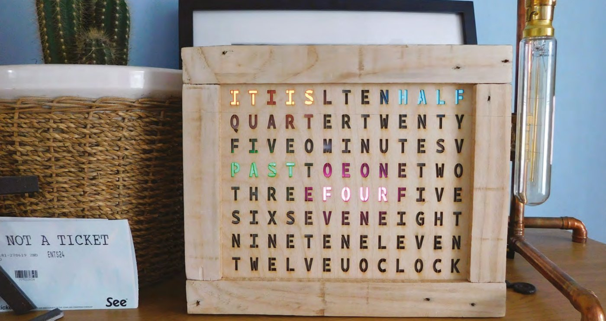
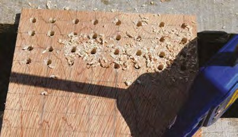
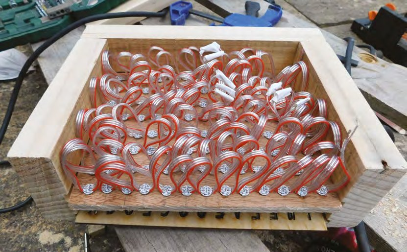
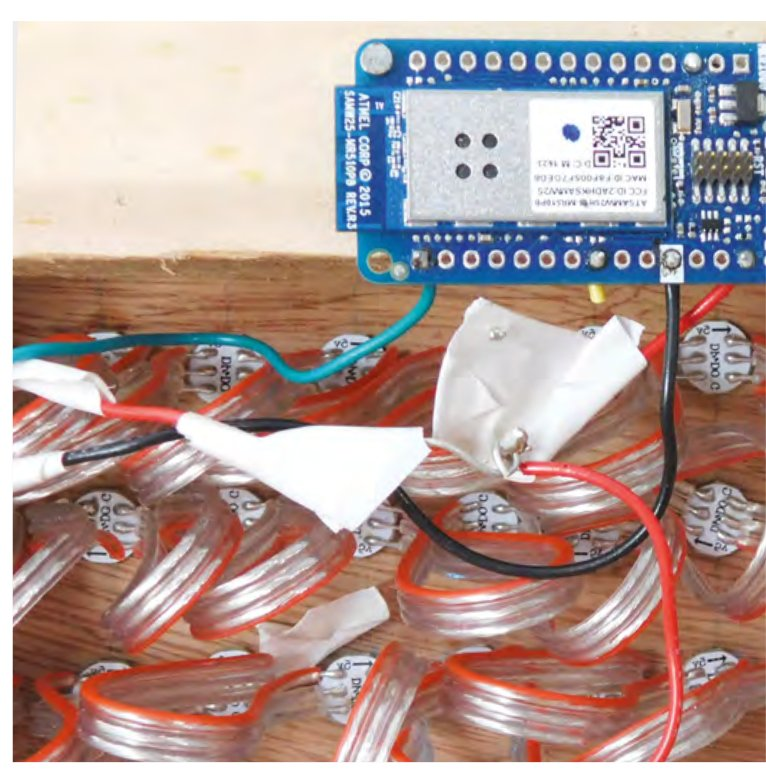
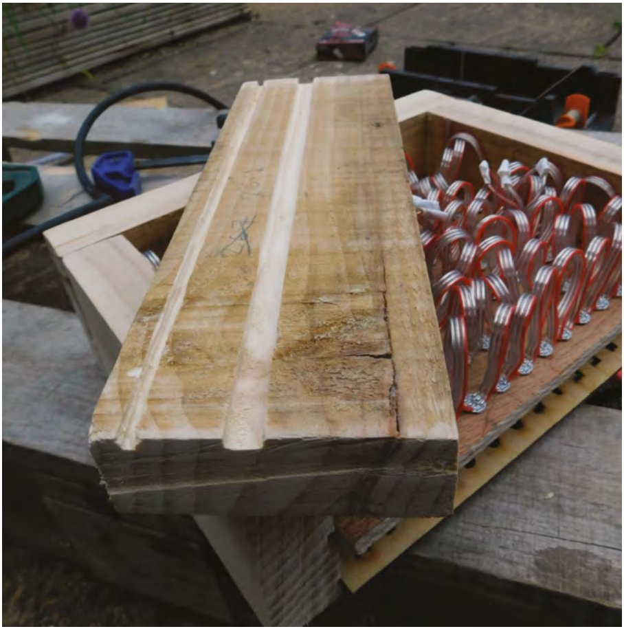
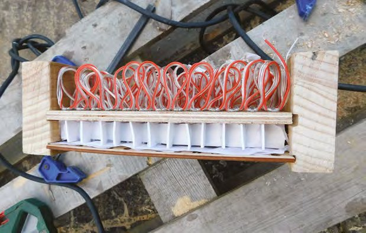
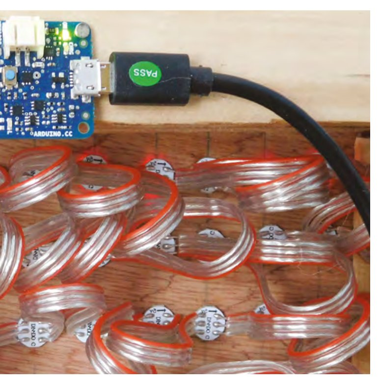
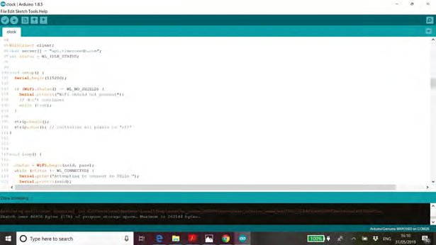
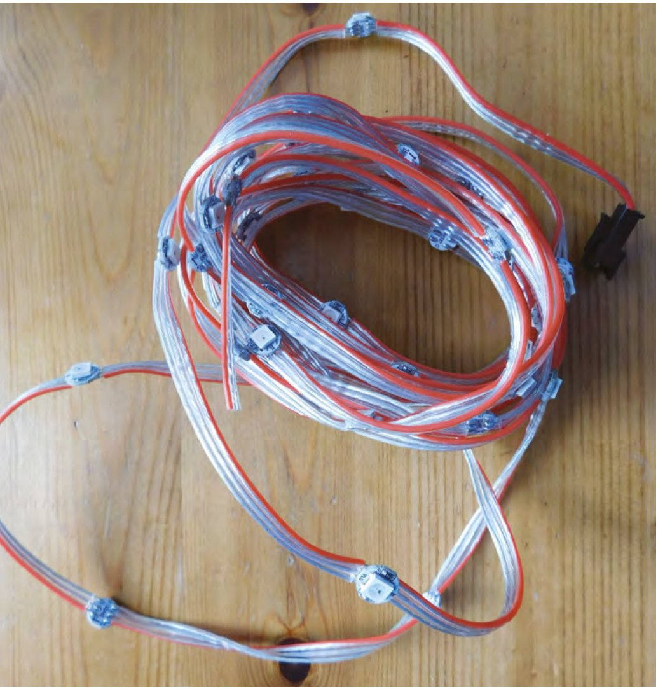

# Capitolul 16 – Un ceas cu cuvinte

> *Construiește-ți propriul ceas arătos, care spune ora în cuvinte*

> **DESPRE AUTOR**
> **Ben Everard** (@ben_everard) adoră să taie lucruri, orice lucruri. Nu mai are un raft pe care să își țină uneltele (acum sunt două rafturi), iar ușa e în pericol.



*Ceasul cu cuvinte finalizat, la locul lui*

OK, așază-te comod. Acest proiect s-a dovedit a fi un pic mai complex decât ne așteptam. De fapt, complex nu e chiar cuvântul potrivit. Nu e nimic fundamental greu aici, dar ne-a pus la încercare abilitățile în destul de multe zone ale meșteșugului, și fiecare zonă a venit cu propriile mici provocări de depășit. Te vom ghida cât putem de bine.

În acest proiect am folosit o gamă destul de largă de echipamente și piese. Ele reprezintă uneltele și piesele pe care le aveam la dispoziție, nu un set canonic de lucruri de care ai nevoie neapărat. Nu există un mod „corect” de a-l face, și poți găsi alternative la aproape tot ce am folosit noi, dacă ai nevoie.

Modul de bază în care funcționează un ceas cu cuvinte este că luminează, prin litere, cuvintele care spun ora. Inima ceasului nostru sunt, așadar, aceste litere și LED-urile care fac lumina. Noi am folosit placaj de 3 mm tăiat cu laser pentru fața ceasului, dar alții au avut succes cu folii de acetat imprimate (de felul celor folosite la retroproiectoare, de care cititorii mai în vârstă, dar nu prea în vârstă, își amintesc din școală). Ar merge și foi mai subțiri tăiate cu laser, dar recomandăm să nu treci de 3 mm, pentru că asta reduce unghiul de vizibilitate.

Poți lua designul nostru de la [hsmag.cc/issue20](https://hsmag.cc/issue20), dar e destul de ușor să îți creezi propriul design (sau să îl modifici pe al nostru, dacă preferi). Punctul crucial la litere este că trebuie să folosim un font de tip șablon (*stencil*): acesta asigură o legătură cu orice parte izolată a unei litere (cum ar fi mijlocul literei O), ca să nu cadă la tăierea cu laser. Așezarea e mai ușoară dacă fontul este monospațiat; noi am folosit BP Mono Stencil ([hsmag.cc/BPMonoStencil](https://hsmag.cc/BPMonoStencil)).



*Găurile pentru LED-uri. Precizia nu e esențială la acest pas*

LED-urile trebuie ținute în locul potrivit, în spatele literelor. Ai două abordări posibile: poți proiecta literele astfel încât să se alinieze cu benzile LED din comerț, sau poți folosi șiruri de LED-uri, care se aliniază la orice spațiere folosești pentru litere. Noi am ales-o pe a doua, dar prima ar face construcția mai simplă dacă nu ești pretențios la mărimea ceasului.

Apoi avem nevoie de un mod de a ține LED-urile în spatele literelor. Sunt câteva părți aici: mai întâi, ai nevoie de o cale de a ține LED-urile destul de departe în spatele literelor, ca să le lumineze uniform; apoi ai nevoie de o cale de a reduce „scurgerea” de lumină, prin care luminarea unei litere luminează și literele de o parte și de alta; în sfârșit, ai nevoie de ceva care să difuzeze lumina.

Montajul nostru a folosit placaj cu găuri de 7 mm. Sunt destul de mari cât să împingi LED-uri SMD 5050 în ele și să le fixezi cu o picătură de superglue. Acestea luminau prin găurile din placaj într-un fagure pătrat făcut din spumă de modelaj lipită cu lipici fierbinte. La final, lumina trecea printr-un strat dublu de material de difuzie înainte să iasă prin fața tăiată cu laser. Nu ne mai trebuia decât o ramă care să țină totul la un loc. Am făcut-o din lemn recuperat de 4×1 inch (circa 100×25 mm), cu caneluri frezate, care țin fața și panoul de placaj cu LED-uri.

> *Lumina trece printr-un strat dublu de material de difuzie înainte să iasă prin fața tăiată cu laser*

Hai să ne uităm mai atent la acest proces înainte de a intra în creierul cu microcontroler.

> **VEI AVEA NEVOIE DE**
> - Un microcontroler cu WiFi (cum ar fi MKR1000)
> - Un șir de 104 NeoPixel-uri
> - O diodă de 1 A
> - Placaj de 9 mm
> - Placaj de 3 mm pentru laser
> - Lemn pentru ramă
> - Un cutter laser
> - Spumă de modelaj

## Construcția

Mai întâi, trebuie să tai cu laserul fața ceasului; asta e partea ușoară a tâmplăriei. Acum, la partea manuală…

După cum am spus, am început rama cu lemn recuperat de 4×1 inch, care ne-a costat doar 1 £ de la proiectul local de reciclare a lemnului. L-am șlefuit ca să aibă un finisaj neted, dar îi lipsesc muchiile drepte ale lemnului rindeluit. Are și găuri de la cuie vechi, care, combinate cu tehnica rustică de îmbinare, dau aspectul pe care îl voiam pentru ceasul nostru.

Dacă ești un tâmplar experimentat, poți alege o metodă mai elegantă de a face rama, dar cum noi nu suntem, o vom păstra simplă. Am folosit îmbinări cap la cap la colțuri, ținute cu câte două șuruburi fiecare. Mai întâi am frezat două caneluri pe o latură a lemnului: una pentru fața de 3 mm și una pentru panoul de placaj de 9 mm cu LED-uri. Placajul de 9 mm e exagerat pentru o astfel de ramă, dar se întâmpla să avem ceva rămas de la un proiect anterior; te-ai descurca ușor cu placaj de 3 mm sau 6 mm, iar MDF-ul ar merge la fel de bine. Am frezat aceste caneluri la 3 mm adâncime în lemn.



*Șirul de LED-uri montat. A trebuit să unim trei șiruri ca să obținem 104 LED-uri pentru ceas. Privind înapoi, sunt necesare doar 100, pentru că unele litere nu se aprind niciodată*

> **CABLAREA**
> Cea mai simplă cablare a ceasului este să legi pinii de 5 V și GND și un pin de date (noi am folosit pinul 6) de la microcontroler la pinii de 5 V, GND și intrare de date ai primului LED. Lanțul de LED-uri va propaga apoi alimentarea și datele de-a lungul șirului. Există însă câteva probleme cu asta.
>
> În primul rând, rezultă o situație de alimentare în afara specificațiilor, cu care s-ar putea să scapi sau nu (vezi caseta „Probleme de alimentare”). În al doilea rând, fluctuațiile de pe linia de alimentare pot cauza probleme; un condensator între liniile de 5 V și GND le poate netezi. În al treilea rând, ar trebui să pui un rezistor de 470 Ω între pinul Arduino și linia de intrare de date. S-ar putea să scapi și fără el, dar el va preveni orice problemă cu un curent prea mare.

Dacă ai o freză cu pătrundere, poți alege să tai canelurile mai târziu și să nu frezezi până la marginea fiecărei secțiuni a ramei, pentru un finisaj mai bun.

Apoi a trebuit să tăiem lemnul în patru secțiuni de lungimi potrivite. Ai nevoie de două pentru sus și jos, cu:

lungime = lățimea feței + (2 × lățimea lemnului ramei) – (2 × adâncimea canelurii)

și de două pentru laturi, cu:

lungime = înălțimea feței – (2 × adâncimea canelurii)

Ar trebui să le poți ține acum pe toate în mână și totul să se potrivească (nu le înșuruba și nu le lipi încă). Dacă nu se potrivesc, va trebui să faci ajustări înainte de a merge mai departe. Asta poate însemna frezarea canelurilor un pic mai adânc sau scurtarea ramei de lemn.



*Cele două caneluri frezate în rama de lemn, care țin fața ceasului și panoul cu LED-uri*

## Măruntaiele

Cel mai rapid mod de a marca suportul de placaj pentru LED-uri este din ochi. Trebuie să aibă aceeași mărime ca fața ceasului, și poți marca cu creionul locurile LED-urilor foarte repede, fără ruletă (deși poți măsura și marca riguros, dacă preferi).

Cum am spus, le-am găurit cu un burghiu de 7 mm. Diagonala unei piese SMD 5050 este puțin mai mare de 7 mm, deci intră strâns. Am folosit șiruri de LED-uri WS2812 (cunoscute adesea ca NeoPixels). Fiecare LED este pe un mic PCB rotund. Am pus o picătură de superglue pe marginea fiecărui LED, apoi l-am împins în gaura din placă. E nevoie de ceva forță ca să intre, dar ai grijă, pentru că noi am apăsat prea tare pe unul și am dislocat un rezistor (dacă pățești asta, taie LED-ul respectiv și unește firele cu aliaj de lipit).



## Testarea

Construcția ta va fi aproape sigur puțin diferită de a noastră, așa că, în loc să urmezi pașii mecanic și să speri că rezultatele sunt aceleași, acum e un moment bun să faci o pauză și să verifici că totul funcționează cum vrei.

Leagă microcontrolerul la NeoPixel-uri (noi am folosit cleme crocodil, dar poți lipi, dacă nu le ai). Vezi caseta „Cablarea”.

Am folosit codul de test din Adafruit NeoPixel Überguide ca să ne asigurăm că totul funcționează corect ([hsmag.cc/ArduinoLibraryUse](https://hsmag.cc/ArduinoLibraryUse)). Ține cont că aprinderea tuturor pixelilor deodată va consuma destul de mult curent, așa că vei vrea fie să folosești o sursă externă, fie să reduci luminozitatea (noi am testat cu culoarea (10,10,10) și a mers cu regulatorul de pe placa MKR1000).



*Fagurele din spumă. Dacă l-am fi potrivit mai bine, am fi avut mai puțină scurgere de lumină între litere*

Cu asta gata, și cu o încâlceală de fire, dar totul funcțional, hai să trecem la asamblare. Înșurubează trei laturi ale ramei (o latură lungă și două scurte). Ca să fie sigur la locul potrivit, e o idee bună să folosești o menghină de tip F, care să țină totul împreună, cu fața ceasului și panoul de placaj la locul lor, în timp ce găurești și înșurubezi.

Lasă o menghină F la locul ei, ținând împreună cele două capete ale lemnului de pe latura expusă, cât timp termini asamblarea interioară.

Am folosit spumă albă de modelaj de 1 mm grosime pentru fagurele pătrat din interiorul ramei. Poți lua în calcul tăierea lui cu laserul, folosind ceva precum modelul de separator de tavă de la [hsmag.cc/TrayInsert](https://hsmag.cc/TrayInsert); noi însă nu am făcut asta. Am tăiat fâșii lungi, cât lățimea ramei și cât înălțimea spațiului dintre placaj și spatele feței, și fâșii mici de „separator”, care să îl împartă pe verticală. Lipirea lor a fost un pic mai grea decât anticipam, dar cu tehnica potrivită nu e prea complicat.

Mai întâi, fixează un capăt al unei fâșii lungi de ramă și așteaptă să se întărească lipiciul. Apoi pune un „U” de lipici acolo unde vrei să meargă unul dintre separatoare și strecoară separatorul în lipici (nu încerca să îl ții la locul lui în timp ce pui lipiciul). Cu practică, poți face mai multe astfel de „U”-uri de lipici deodată (noi am constatat că patru sau cinci e un număr bun), apoi introduci toate separatoarele dintr-o dată. Înainte să termini un rând, fixează de ramă următoarea fâșie lungă, ca lipiciul să aibă timp să se întărească înainte să începi acel rând.



*Nu aveam șuruburi destul de mici pentru gaura de montare, așa că am folosit cuie. Privind înapoi, a fost o mișcare foarte riscantă, pe care nu îți recomandăm să o copiezi*

## Difuzia

Ultimul lucru de adăugat înainte de asamblare este difuzia. Poate fi orice este translucid și destul de subțire cât să încapă în spațiu. Noi am folosit material de difuzie fotografic (în esență, un material subțire, alb, din nailon) și am constatat că aveam nevoie de două straturi ca să obținem aspectul dorit, dar nu e un material standard, așa că experimentează cu ce ai, ca să vezi ce creează estetica pe care o vrei.

L-am tăiat la dimensiune și l-am pus peste fagurele pătrat. Câteva picături de lipici fierbinte pe colțuri l-au ținut la locul lui (și nu se vor vedea odată ce totul e asamblat).

> *Experimentează cu ce ai, ca să vezi ce creează estetica pe care o vrei*

Când ești mulțumit de cantitatea de difuzie, poți atașa ultima latură a ramei, și cu asta partea hardware e completă. Acum hai să ne uităm la software.



*Codul Arduino verifică ora pe internet în fiecare minut și o afișează pe ceas*

## Software-ul

Codul complet este disponibil la [hsmag.cc/ClockCode](https://hsmag.cc/ClockCode), dar hai să ne uităm la părțile cele mai relevante.

Evident, ceasul nostru trebuie să știe cât e ora. Am fi putut folosi un ceas de timp real, dar tot ar fi trebuit să setăm ora manual și să ajustăm ora de vară. În schimb, am decis să luăm ora de pe internet, mai exact de la timezonedb.com.

Va trebui să te înregistrezi pentru o cheie API gratuită, dar vom rămâne cu mult în limitele utilizării gratuite. Odată ce o ai, poți obține ora curentă dintr-un anumit loc îndreptându-ți browserul spre:

```
api.timezonedb.com/v2/get-time-zone?key=KEYHERE&format=xml&fields=formatted&by=zone&zone=Europe/London
```

Va trebui să înlocuiești `KEYHERE` cu cheia ta și, dacă nu ești în Marea Britanie, să actualizezi zona cu locația ta (pentru România, `Europe/Bucharest`). Rezultatul vine în XML și ar trebui să arate cam așa:

```xml
<?xml version="1.0" encoding="ISO-8859-1"?>
<result>
<status>OK</status>
<message/>
<formatted>2019-05-30 14:52:07</formatted>
</result>
```

Obținerea și prelucrarea acestor date în Arduino au două părți. Mai întâi trebuie să descărcăm acest XML, apoi să extragem ora din el. Metoda de conectare la WiFi diferă puțin în funcție de hardware-ul folosit. Noi am folosit biblioteca WiFi101, dar dacă folosești alt hardware (cum ar fi un ESP8266), s-ar putea să trebuiască să o faci ușor diferit. Uită-te la sketch-urile exemplu pentru WiFi ale plăcii tale, pentru detalii.

Odată conectați, avem un obiect `client` legat de serverul api.timezonedb.com (vezi codul complet pentru mai multe informații). Putem extrage apoi linia potrivită din răspuns cu următoarele:

```cpp
    client.println("GET /v2/get-time-zone?key=YOURKEY&format=xml&fields=formatted&by=zone&zone=Europe/London HTTP/1.1");
    client.println("Host: api.timezonedb.com");
    client.println("Connection: close");
    client.println();
    }
delay(10000);
payload = "";
    Serial.println("stand by for data");
    while (client.available()) {
    char c = client.read();
    Serial.write(c);
    if (c == '\n') {
    payload = "";
    }
    payload += c;
    if(payload.endsWith("</result>")) {
    parse_response();
    }
```

Acest cod citește răspunsul HTTP caracter cu caracter și construiește un șir numit `payload`. Dacă ajunge la un caracter de linie nouă, golește `payload`, pentru că vrem o singură linie. Dacă ajunge la șirul `</result>`, știe că are datele de care are nevoie, așa că apelează funcția `parse_response`.

> *Acest cod citește răspunsul HTTP caracter cu caracter și construiește un șir numit „payload”*

Părțile-cheie ale acestei funcții sunt următoarele:

```cpp
    int colon = payload.indexOf(':');
    // Set the first colon in time as reference point
    nowday = payload.substring(colon - 5, colon - 3);
    d = nowday.toInt();
    nowmonth = payload.substring(colon - 8, colon - 6);
    mo = nowmonth.toInt();
    nowyear = payload.substring(colon - 13, colon - 9);
    y = nowyear.toInt();
    nowhour = payload.substring(colon - 2, colon);
    h = nowhour.toInt();
    nowmin = payload.substring(colon + 1, colon + 3);
    mi = nowmin.toInt();
    nowsec = payload.substring(colon + 4, colon + 6);
    s = nowsec.toInt();
```

Cum ora și data au un format precis, putem găsi partea care ne interesează în raport cu primele două puncte. Acest cod desface șirul și transformă segmentele relevante în valori întregi pentru oră, minute și secunde. Extrage și data, dar nu o folosim. Am adaptat acest cod de la utilizatorul Aggertroll de pe forumul Arduino; mulțumim, Aggertroll!



*Șirurile de NeoPixel-uri sunt mai ușor de montat la spațieri personalizate decât benzile de NeoPixel-uri, dar păstrează avantajul de a nu trebui să lipești fiecare LED*

Acum că avem ora, avem nevoie de un mod de a o afișa pe șirul de NeoPixel-uri. Se face creând mai întâi o serie de tablouri, care țin pozițiile pixelilor din diferitele cuvinte, de exemplu:

```cpp
int itis[] = {8,9,11,12};
int five[] = {35,36,37,38};
int ten[] = {4,5,6};
```

Am creat și o funcție care aprinde LED-urile dintr-unul dintre aceste tablouri într-o anumită culoare:

```cpp
void lightup(int letters[], int letters_len, int red, int green, int blue) {
    for(int i = 0; i<letters_len; i++) {
    strip.setPixelColor(letters[i], red, green, blue);
    }
    strip.show();
    }
```

Codul final pentru aprinderea orei corecte este următorul:

```cpp
strip.fill();
lightup(itis, 4, 100,100,0);
int hour = h;
if (mi > 33) { hour+=1;}
 if (hour > 12) { hour -= 12;}
if (hour==1) { lightup(h_one, 3, hour_red, hour_green, hour_blue); }
if (hour==2) { lightup(h_two, 3, hour_red, hour_green, hour_blue); }
...
//past or to?
if (mi > 3 && mi < 34) { lightup(past, 4,0, 150, 0); }
if (mi > 33 && mi < 58) {lightup(to,2,0,150,0);}
if (mi > 57 || mi < 4) {lightup(oclock,6,50, 50, 100);}
// minutes
if (mi > 3 && mi < 8) {lightup(five, 4, mins_red, mins_green, mins_blue); lightup(minutes, 7,mins_red,mins_green, mins_blue);}
if (mi > 7 && mi < 14) {lightup(ten, 3, mins_red, mins_green, mins_blue); lightup(minutes, 7,mins_red,mins_green, mins_blue);}
...
```

Prima linie a acestui cod stinge tot șirul, apoi linia `lightup(itis, 4, 100,100,0);` aprinde cuvintele „it is”. Apoi trebuie să găsim ora, ținând cont că, de îndată ce minutele trec de 34, se trece la „twenty-five to” (douăzeci și cinci până la) ora următoare. Codul se încheie cu o serie de instrucțiuni `if`, care găsesc literele corecte.

> **NOTA TRADUCĂTORULUI**
> Fața ceasului și tablourile de litere sunt gândite pentru limba engleză („IT IS TEN PAST FIVE”). Pentru o versiune în română („ESTE CINCI ȘI ZECE”), proiectează-ți propria grilă de litere cu cuvintele ORA, ESTE, ȘI, FĂRĂ, UN SFERT, JUMĂTATE și numerele, apoi refă tablourile cu pozițiile LED-urilor și condițiile din codul final.

> **PROBLEME DE ALIMENTARE**
> După ce am cablat ceasul, am constatat că avea des defecțiuni și clipea în culori ciudate. După ce am dezlipit toate conexiunile și am recablat totul, ne-am dat seama că problema nu era o lipitură rece, și nici codul, ci o nepotrivire de tensiune.
>
> Am alimentat LED-urile de la pinul de 5 V al microcontrolerului (putem ține numărul de LED-uri și luminozitatea destul de mici ca asta să funcționeze); totuși, pinii de date ai lui MKR1000 sunt de 3,3 V. Intrarea LED-urilor ar trebui să fie (conform fișei tehnice) de cel puțin 0,7 ori tensiunea de alimentare (3,5 V), deci ieșim din specificații comandându-le cu 3,3 V. De obicei scăpăm cu asta, dar LED-urile pe care le-am folosit s-au dovedit deosebit de pretențioase în această privință.
>
> Există două soluții de bază: crești tensiunea de intrare sau scazi tensiunea de alimentare. Noi am ales-o pe a doua, punând pe linia de alimentare o diodă cu o cădere de tensiune de 0,8 V. Această diodă trebuie să suporte tot curentul LED-urilor (noi am folosit o diodă de 1 A, care ar trebui să ne lase destulă marjă). Ca alternativă, poți folosi un convertor de nivel (disponibil atât ca modul, cât și ca circuit integrat), care să ridice tensiunea semnalului de date la 5 V.
