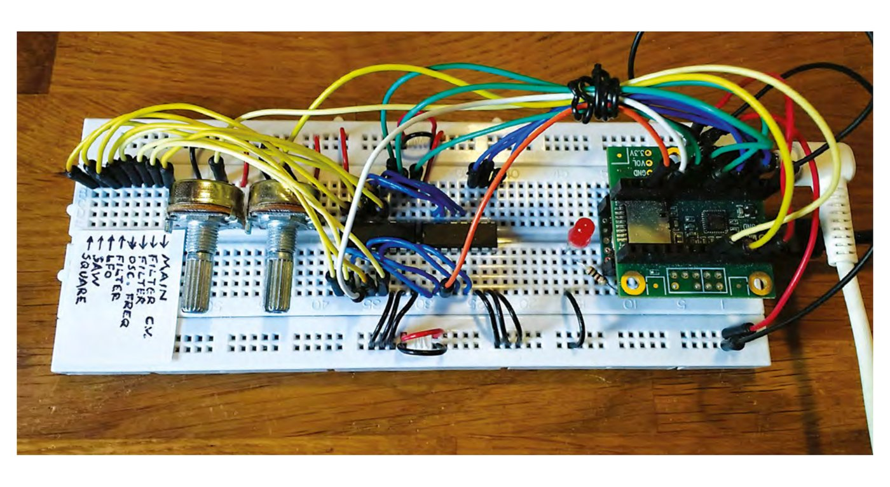
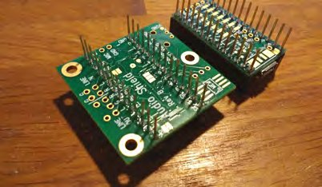
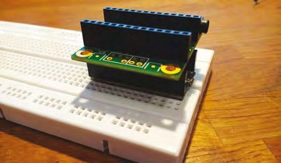
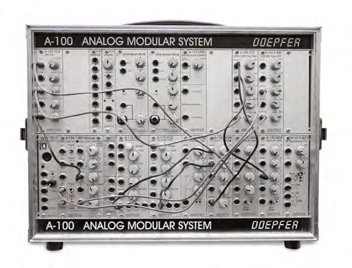
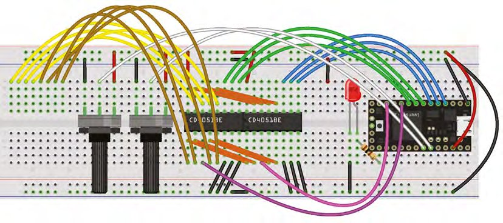
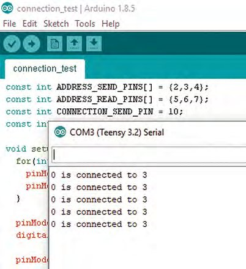
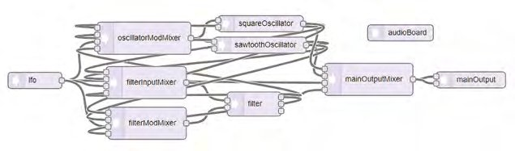
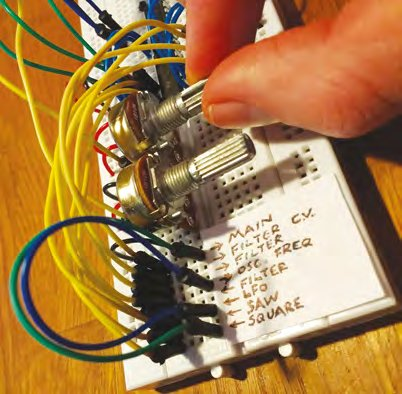
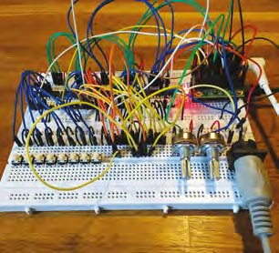

# Capitolul 17 – Sintetizator digital polifonic (partea 1)

> *Construiește un sintetizator digital polifonic complet, în ghidul nostru în două părți*

> **DESPRE AUTOR**
> **Matt Bradshaw** este programator, maker și muzician din Oxford. Îi place să construiască instrumente cu care să cânte în trupa lui, Robot Swans. Mai multe proiecte de-ale lui găsești la [mattbradshawdesign.com](https://mattbradshawdesign.com).



*Acest design combină aspecte ale sintetizatoarelor digitale și analogice, ca să îți ofere un instrument versatil, dar ieftin de construit*

Sintetizatoarele analogice au revenit în forță în ultimii ani, dar construirea unui sintetizator care să poată cânta mai multe note deodată (adică acorduri) folosind doar circuite analogice este o mare provocare. În acest capitol vei vedea cum să construiești un sintetizator versatil, cu un lanț de semnal „patchabil”, dar în care sunetul este generat digital, de cod pe care îl poți scrie tu. Este un tutorial în două părți, dar chiar și la sfârșitul primei părți vei putea deja să scoți niște sunete grozave.

## Trecem pe digital

Sintetizatoarele modulare sunt minunate. Îți permit să îți creezi propriul lanț de semnal, băgând cabluri în diferite puncte ale circuitului, dându-ți libertatea de a crea orice sunet îți poți imagina. Un sintetizator modular adevărat este, în esență, o cutie pe care o umpli cu module individuale, pe care fie le cumperi, fie le construiești (vezi capitolul 22 pentru un exemplu). Unele module generează semnale, în timp ce altele iau un semnal și îl schimbă într-un fel.

Acest capitol îți va arăta cum să creezi o versiune digitală, în miniatură, a unui sintetizator modular analogic. Procesul de „patching”, adică legarea diferitelor semnale unele de altele, se va face pe breadboard cu fire de legătură, iar informația va fi prelucrată de microcontrolerul Teensy.

Mai întâi trebuie să pregătim Teensy 3.2, care e un fel de Arduino, dar destul de puternic ca să prelucreze audio. Când cumperi un Teensy, de obicei vine fără pini, așa că va trebui să lipești puțin. Și placa audio, care stă fie direct deasupra, fie sub Teensy, are nevoie de lipire. E o idee bună să folosești pini stivuibili (conectori mamă cu pini tată lungi pe cealaltă parte), pentru că aceștia fac atât Teensy, cât și placa audio compatibile cu un breadboard.



*Pinii extra-lungi sunt lipiți sub Teensy și sub placa audio*



*Așa ar trebui să arate Teensy și placa audio pe breadboard; asigură-te că numerele pinilor se aliniază*

Odată ce Teensy e gata, descarcă software-ul Teensyduino de la [hsmag.cc/aRWmgD](https://hsmag.cc/aRWmgD) și încearcă să rulezi un sketch audio exemplu, cum ar fi File > Examples > Audio > Synthesis > PlaySynthMusic. Ar trebui să auzi apoi muzică în căști.

> **VEI AVEA NEVOIE DE**
> - Teensy 3
> - Placa adaptor audio pentru Teensy
> - 4 rânduri de pini stivuibili tată/mamă cu 14 pini (2 kituri)
> - 2 breadboard-uri
> - Fire de legătură
> - 2 potențiometre rotative (10 kΩ, liniare)
> - 5 cipuri multiplexor 4051
> - 8 butoane tactile
> - Un LED
> - Un cip optocuplor 6N139
> - O mufă MIDI
> - Un condensator (0,1 µF)
> - Rezistoare (diverse)
> - Un cablu micro-USB
> - Echipament de lipit
> - Căști
> - Un calculator

## Începe cu puțin

Înainte să putem lega multe module împreună, ar trebui să încercăm un sketch simplu, ca să prindem gustul scrierii de cod care produce audio. Teensy are propria bibliotecă de cod pentru a adăuga audio în proiecte, și funcționează foarte asemănător cu un sintetizator modular.

De exemplu, în sketch-ul exemplu `sine_wave`, un oscilator este legat la o ieșire prin două instanțe `AudioConnection` (câte una pentru fiecare canal stereo), ceea ce înseamnă că în căști se aude o undă sinusoidală. Descarcă acest sketch de la [hsmag.cc/issue16](https://hsmag.cc/issue16) și încearcă-l.

> *Teensy are propria bibliotecă de cod pentru a adăuga audio în proiecte*

Sintetizatorul nostru va avea opt mufe și va trebui să știm care mufe sunt legate între ele. De exemplu, dacă mufa oscilatorului este legată la mufa ieșirii principale, Teensy trebuie să poată citi asta și apoi să recreeze conexiunea digital, producând audio. Pe un sintetizator „adevărat”, aceste mufe ar fi conectori robuști de 3,5 mm (practic, mufe de căști), dar pentru acest sintetizator vom folosi pur și simplu un rând de socluri de pe breadboard. Deocamdată nu contează cu adevărat ce mufă corespunde cărei intrări sau ieșiri; vrem doar să știm dacă mufa A este legată de mufa B, și așa mai departe.



*Așa arată un sintetizator modular complet, cu module detașabile și cabluri de patch*

> **EVITAREA SPAGHETELOR**
> Acest sintetizator, mai ales după ce termini partea a doua, va avea o mulțime de fire într-un spațiu relativ mic. Dacă folosești multe fire de legătură de lungime standard, vei ajunge repede la un cuib de șobolan imposibil de întreținut (deși foarte frumos). Ca să ușurezi problema, merită să îți faci un lot de fire de legătură minuscule, din fir monofilar, de vreo 4 cm fiecare, cu circa 5 mm de izolație îndepărtată la fiecare capăt.

## Un singur lucru o dată

Ca să testăm conexiunile dintre mufe, vom folosi un circuit integrat numit 4051. Este un multiplexor sau demultiplexor cu opt canale; în termeni simpli, opt „lucruri” sunt legate la cip și poți vorbi cu ele pe rând. Trei pini sunt folosiți pentru a alege cu ce „lucru” vrei să vorbești (aceștia sunt legați la Teensy), iar opt pini sunt legați la „lucruri” (în cazul nostru, mufele).

Începe prin a construi circuitul pe breadboard, așa cum arată **Figura 1**. Observă că există două cipuri 4051, adresate separat, dar cu canalele legate la mufe comune. Folosind două cipuri 4051 în acest fel, poți trimite un semnal de test pe fiecare canal, pe rând, al primului cip, apoi poți asculta acel semnal pe fiecare canal, pe rând, al celui de-al doilea cip. Dacă un semnal este trimis pe canalul A al primului cip, de exemplu, și poate fi citit pe canalul B al celui de-al doilea cip, mufa A trebuie să fie legată de mufa B.



*Figura 1 – Schema completă a breadboard-ului, cu placa audio omisă pentru claritate. Asigură-te că legi canalele celor două cipuri 4051 (vezi firele portocalii)*

> **SFAT RAPID**
> Odată ce ai pregătit Teensy și placa audio, caută pe web „Teensy synth” pentru mai multă inspirație despre ce poți face.

Ca să încerci, descarcă sketch-ul `connection_test` de la [hsmag.cc/issue16](https://hsmag.cc/issue16) și deschide-l în Arduino IDE. Vei vedea o buclă `for` imbricată, cu bucla exterioară adresând cipul de „trimitere” și bucla interioară adresând cipul de „citire”.

```cpp
for(int a=0;a<8;a++) {
    setSendChannel(a);
    for(int b=0;b<8;b++) {
    setReadChannel(b);
    delayMicroseconds(10);
    if(a < b) {
      boolean connectionReading = !digitalRead(CONNECTION_READ_PIN);
      if(connectionReading) {
        Serial.print(a);
        Serial.print(" is connected to ");
        Serial.print(b);
        Serial.print("\n"); }}}}
```

Încarcă întregul sketch pe Teensy și deschide monitorul serial. Încearcă acum să legi două dintre mufele de la capătul din stânga al breadboard-ului cu un fir de legătură. Dacă totul funcționează, monitorul serial ar trebui să raporteze că a fost detectată o conexiune (vezi **Figura 2**), și suntem gata să trecem la codul propriu-zis al sintetizatorului.



*Figura 2 – În sketch-ul „connection_test” poți verifica dacă circuitul funcționează corect*

## Intrările și ieșirile

Cipul 4051 ne dă maximum opt mufe de folosit, alocate astfel:

- Ieșirea oscilatorului nr. 1 (undă dreptunghiulară)
- Ieșirea oscilatorului nr. 2 (undă în dinți de fierăstrău)
- Intrarea de modulație a frecvenței oscilatorului
- Ieșirea oscilatorului de joasă frecvență (LFO)
- Intrarea filtrului
- Intrarea de modulație a filtrului
- Ieșirea filtrului
- Etajul de ieșire principal

Aceste mufe merită explicate ceva mai în detaliu, mai ales dacă nu ești prea familiarizat cu sintetizatoarele. Cele două ieșiri ale oscilatorului sunt pur și simplu tonuri cu sunete ușor diferite (dinții de fierăstrău sunt un pic mai „bâzâitori”). Intrarea de modulație a oscilatorului schimbă înălțimea oscilatorului, ceea ce înseamnă că, atunci când legi oscilatorul de joasă frecvență (LFO) la ea, vei auzi un ton care urcă și coboară ca o sirenă de ambulanță. Filtrul este un efect care restricționează anumite frecvențe și le amplifică pe altele, și poate fi modulat și el de LFO. La final, etajul de ieșire principal reprezintă ultima parte a lanțului de semnal: nu vei auzi nimic până nu legi ceva la el. Nu-ți face griji dacă nu înțelegi toate intrările și ieșirile; odată ce începi să te joci cu sintetizatorul, totul ar trebui să capete sens.



*Așa arată sintetizatorul în unealta online Teensy Audio System Design Tool; liniile reprezintă conexiunile audio posibile*

## Fă niște zgomot

Cel mai ușor mod de a începe să scrii cod audio pentru un Teensy este să folosești „Audio System Design Tool”, online, la [hsmag.cc/OiKbYH](https://hsmag.cc/OiKbYH). Este o interfață simplă, de tip drag-and-drop, pentru legarea modulelor audio între ele, și merită cu siguranță să te familiarizezi cu ea. Pentru acest sintetizator, însă, poți pur și simplu să copiezi și să lipești codul direct, ca lucrurile să fie un pic mai ușoare. Descarcă sketch-ul principal de la [hsmag.cc/issue16](https://hsmag.cc/issue16).

E o idee bună să te uiți prin cod ca să înțelegi ce se întâmplă. Sketch-ul combină, în esență, cele două sketch-uri mai simple de mai devreme și adaugă câteva funcții în plus. Începe prin a declara diversele obiecte audio și felul în care sunt legate; acest cod a fost generat în unealta de design online. Apoi declarăm un tablou de referințe la cele patru obiecte mixer de intrare, ca să le putem referi ușor după număr mai târziu.

În funcția `setup()`, inițializăm diverșii pini de intrare și ieșire și setăm câțiva parametri inițiali pentru obiectele audio; nu ezita să modifici aceste numere ca să produci sunete diferite. Funcția `loop` funcționează cam ca în sketch-ul exemplu de mai devreme, dar, în loc să trimită un mesaj serial când se face (sau se desface) o conexiune, volumul canalului de mixer relevant este setat fie la unu (pentru o conexiune), fie la zero (pentru lipsa conexiunii).

La sfârșitul buclei, LED-ul se aprinde dacă este detectată o conexiune greșită (intrare la intrare sau ieșire la ieșire). Spre deosebire de un sintetizator analogic, conexiunile greșite nu fac niciun rău în acest design, dar e util să știi de ele. La final, valorile celor două potențiometre sunt citite și folosite pentru a controla frecvența LFO-ului și frecvența oscilatorului principal. Nu ezita să schimbi această secțiune a codului ca să îți personalizezi sintetizatorul, făcând butoanele să controleze alți parametri.



*Joacă-te cu un patch simplu, dar distractiv, în care frecvența oscilatorului este modulată de LFO*

Ultima treabă este să etichetezi zona de patching din stânga breadboard-ului. Fie folosești un pix fin, fie imprimi o etichetă de pe calculator, cu un font mic, și o lipești pe breadboard cu Blu Tack sau bandă adezivă. Acum poți începe să cânți!

Încearcă să legi diferite ieșiri la diferite intrări și vezi ce se întâmplă. Rotește butoanele în sus și în jos ca să controlezi sunetul. Sintetizatorul e capabil de basuri murdare și de efecte în stil Doctor Who, dar dacă vrei să faci muzică pe bune, va trebui să aștepți partea a doua!

> **SFAT RAPID**
> Dacă acest sintetizator ți-a stârnit interesul, încearcă programul gratuit și open-source „VCV Rack”, un sintetizator modular virtual.



*O privire furișă la cum va arăta sintetizatorul după partea a doua, cu o mini-claviatură și intrare MIDI*

> **VERSIUNEA ECONOMICĂ**
> Acest proiect este o cale destul de ieftină de a-ți construi propriul sintetizator, dar dacă ești dispus să depui puțin mai mult efort, îl poți face și mai ieftin. Placa audio folosită în acest capitol e grozavă, dar există alternative mai ieftine. Cipul audio PT8211 îți dă ieșire audio pe 16 biți pentru foarte puțini bani, dacă nu te deranjează niște lipituri foarte delicate. Ca alternativă, poți obține o ieșire audio de calitate mai slabă direct de la Teensy, prin pinul lui DAC. Reține că ambele opțiuni vor cere mici modificări ale codului.

> **DATA VIITOARE**
> În a doua și ultima parte a acestui tutorial vom adăuga câteva funcții care să transforme cu adevărat acest proiect într-un sintetizator utilizabil. Vom adăuga un al doilea breadboard, cu o claviatură simplă (care îți permite să cânți melodii) și o intrare MIDI (care îți permite să controlezi sintetizatorul de la o altă claviatură sau de la un calculator). Vom dubla și numărul de conexiuni pe care le poți face și vom folosi un truc ingenios ca să adăugăm polifonie sintetizatorului, ca să poți cânta muzică mai complexă.
