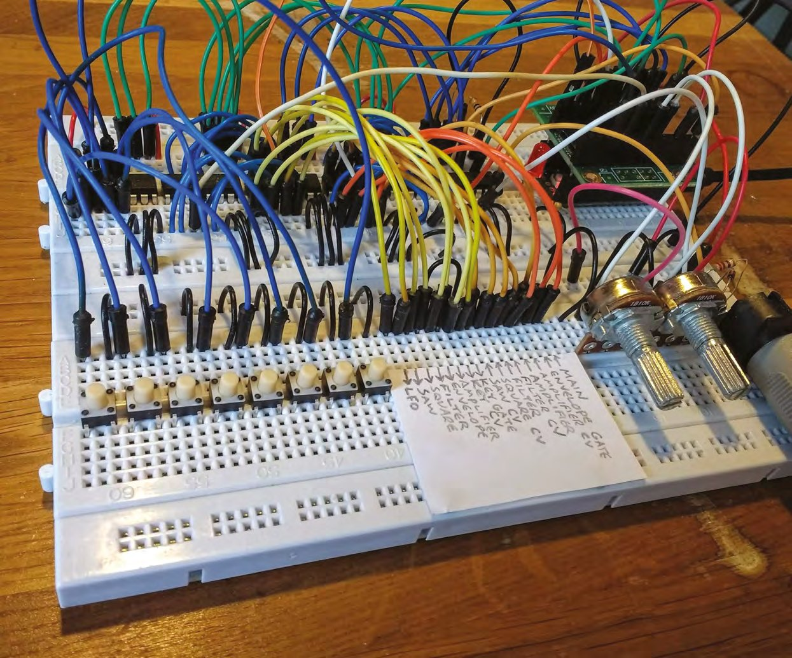
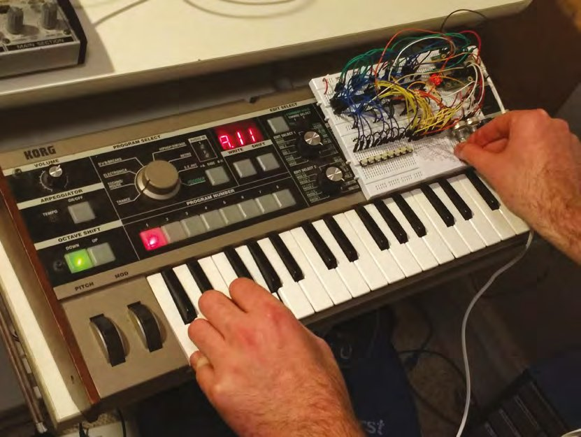
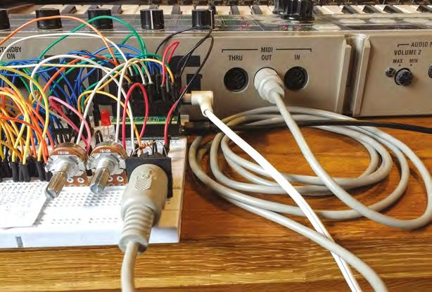
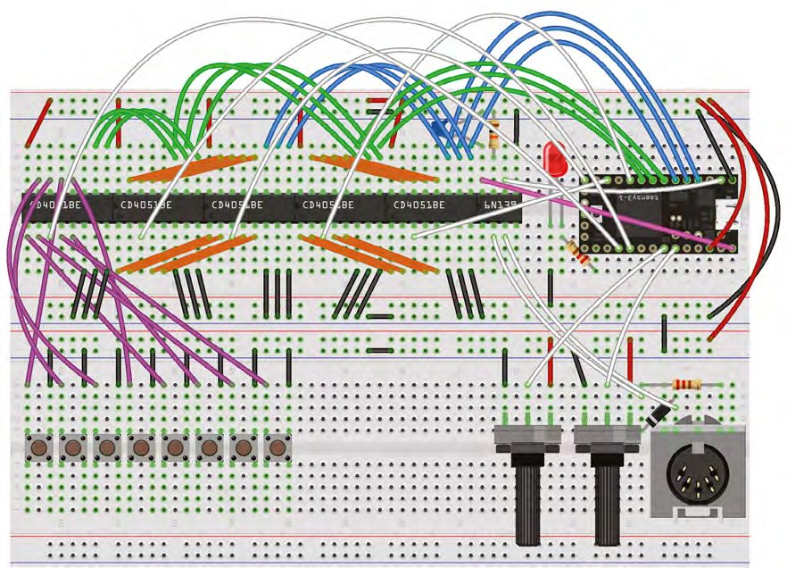
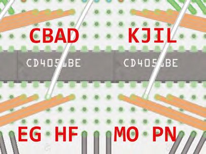
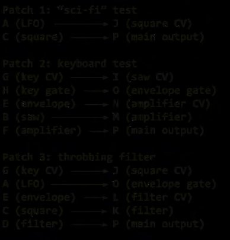
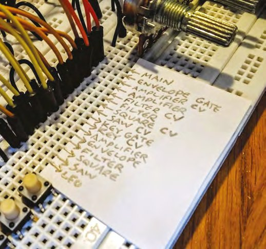

# Capitolul 18 – Sintetizator digital polifonic (partea 2)

> *Încheierea ghidului nostru în două părți pentru construirea unui sintetizator digital polifonic*

> **DESPRE AUTOR**
> **Matt Bradshaw** este programator, maker și muzician din Oxford. Îi place să construiască instrumente cu care să cânte în trupa lui, Robot Swans. Mai multe proiecte de-ale lui găsești la [mattbradshawdesign.com](https://mattbradshawdesign.com).



*Sintetizatorul finalizat, cu 16 puncte de patch, două comenzi analogice, o claviatură în miniatură și o intrare MIDI*

Data trecută am construit un sintetizator digital pe un breadboard. Putea scoate niște zgomote amuzante, dar nu era prea util pentru a cânta muzică. De data aceasta vom remedia asta, adăugând o claviatură simplă și un port de „intrare MIDI”, ca să poți controla sintetizatorul de la o claviatură externă. Vom dubla și numărul de puncte de patch, ca să poți crea sunete mai complexe. La final, vom modifica codul ca să permitem sintetizatorului să cânte mai multe note simultan.

Dacă nu ai citit încă prima parte, întoarce-te și începe de acolo (capitolul 17); altfel, hai la treabă. Am umplut deja primul breadboard, așa că trebuie să mai adăugăm unul. Putem lăsa la locul lor multe din primul sintetizator: Teensy, placa audio, LED-ul, rezistorul și cele două cipuri 4051 pot rămâne neatinse pe primul breadboard. Totuși, ca să facem loc noilor funcții grozave, ar trebui să scoți cele două potențiometre (și firele lor), rândul de opt fire care leagă „punctele de patch” de cipurile 4051 și eticheta care arăta ce face fiecare punct de patch.

Noua schemă completă se vede în **Figura 1**. Există un optocuplor 6N139 (explicat mai târziu) și trei cipuri 4051 în plus. Două dintre cipurile 4051 fac același lucru ca în prima parte, detectând care puncte de patch sunt legate între ele, dar adăugând încă două cipuri putem dubla numărul de puncte de patch.

Ultimul cip 4051 (cel din stânga) funcționează ca multiplexor pentru cele opt butoane ale mini-claviaturii de pe breadboard-ul din față. Aceste opt butoane vor cânta o simplă gamă majoră, deși poți schimba asta în cod, dacă preferi un set de note mai interesant.

Breadboard-ul din față conține acum și intrarea MIDI, cele 16 puncte de patch și cele două potențiometre, astfel încât toate componentele „de mână” (lucrurile pe care ai vrea să le accesezi în timpul unei interpretări) sunt ușor accesibile.



*Sintetizatorul, într-un test în forță: cântatul de la o claviatură adevărată, prin MIDI, deschide o gamă mai largă de note decât butoanele de pe breadboard*

> **VEI AVEA NEVOIE DE**
> - Teensy 3
> - Placa adaptor audio pentru Teensy
> - 4 rânduri de pini stivuibili tată/mamă cu 14 pini (2 kituri)
> - 2 breadboard-uri
> - Fire de legătură
> - 2 potențiometre rotative (10 kΩ, liniare)
> - 5 cipuri multiplexor 4051
> - 8 butoane tactile
> - Un LED
> - Un cip optocuplor 6N139
> - O mufă MIDI
> - Un condensator (0,1 µF)
> - Rezistoare (diverse)
> - Un cablu micro-USB
> - Echipament de lipit
> - Căști
> - Un calculator
> - O diodă 1N4148

## Ce e nou?

Înainte să asamblăm totul, hai să vedem ce „module” noi adăugăm. Sintetizatorul are deja două oscilatoare, un oscilator de joasă frecvență (LFO) și un filtru. De data aceasta vom adăuga un amplificator, un generator de anvelopă și un convertor MIDI-la-CV.

Pe scurt, un amplificator ia un semnal audio și îi schimbă volumul. Dacă îi dai modulului un semnal de control ridicat, sunetul va fi tare, în timp ce un semnal de control scăzut va face sunetul mai încet. Poți folosi, așadar, acest modul ca să faci un oscilator să „pornească” atunci când apeși o clapă și să se „oprească” atunci când o eliberezi. Totuși, notele care pornesc și se opresc brusc nu sunt prea interesante, și aici intră în joc generatorul de anvelopă.

Un generator de anvelopă (EG) imită sunetul unui instrument acustic. Când este declanșat de un semnal de control de intrare, adesea de la apăsarea unei clape, EG-ul scoate un semnal de control care, legat la un amplificator sau la un filtru, poate evoca sunetul unei chitare, al unei viori sau al unui pian (în funcție de setări).

La final, un convertor MIDI-la-CV ia un semnal MIDI de la o claviatură externă și îl transformă într-un semnal CV (tensiune de control). Acest modul scoate un semnal de „notă” (care comunică ultima notă apăsată) și un semnal de „gate” (poartă), care este pur și simplu ridicat sau scăzut, după cum o clapă este sau nu apăsată în acel moment.

Nu-ți face griji dacă aceste descrieri sunt noi pentru tine; YouTube are o mulțime de clipuri care explică în detaliu cum funcționează diferitele module de sintetizator, dacă vrei să afli mai multe, iar noi am oferit câteva exemple de patch-uri ca să te ajute să începi.



*Multe dispozitive MIDI au trei porturi: „in”, „out” și „thru”; asigură-te că legi portul MIDI out al dispozitivului extern la portul MIDI in de pe breadboard*

> **CE ESTE MIDI?**
> MIDI vine de la „musical instrument digital interface” (interfață digitală pentru instrumente muzicale) și este un sistem prin care un instrument poate controla un altul printr-un cablu special. Standardul MIDI se descurcă cu tot felul de informații muzicale, cum ar fi tempoul, îndoirea înălțimii (*pitch bend*) și pedala de susținere, dar pentru acest sintetizator vom implementa doar comenzile de bază „notă pornită” și „notă oprită”.

## Vom reconstrui

Acum că avem o idee despre noile module, hai să adăugăm câteva componente. Are sens să construim circuitul pas cu pas, ca să putem verifica erorile la fiecare etapă. Mai întâi, folosind **Figura 1** ca referință, adaugă cele două potențiometre, precum și cele două cipuri 4051 imediat în stânga celor existente, și cablează-le așa cum arată schema.

> *Are sens să construim circuitul pas cu pas, ca să putem verifica erorile*

Amintește-ți că sintetizatorul original avea nevoie de două dintre aceste cipuri cu opt canale ca să ofere opt puncte de patch: un cip trimite un semnal de test, iar celălalt îl citește. Adăugând încă două cipuri, putem avea 16 puncte de patch.



*Figura 1 – O schemă a întregului sintetizator (placa audio și cablarea punctelor de patch sunt omise pentru claritate); observă dioda, rezistoarele și condensatorul necesare pentru intrarea MIDI*

Ai putea face patch-urile direct între cipuri, dar, ca data trecută, e mult mai ușor dacă tragem un fir de legătură de la fiecare punct de patch la o zonă de patching separată, etichetată. Aceste fire sunt omise în schema breadboard-ului, pentru claritate (sunt deja prea multe fire acolo!), dar există o schemă separată, mărită (**Figura 2**), cu punctele de patch etichetate astfel:

- A) LFO (ieșire)
- B) Oscilator cu dinți de fierăstrău (ieșire)
- C) Oscilator dreptunghiular (ieșire)
- D) Filtru (ieșire)
- E) Generator de anvelopă (ieșire)
- F) Amplificator (ieșire)
- G) CV claviatură (ieșire)
- H) Gate claviatură (ieșire)
- I) Frecvență dinți de fierăstrău (intrare)
- J) Frecvență dreptunghiulară (intrare)
- K) Filtru (intrare)
- L) Frecvență filtru (intrare)
- M) Amplificator (intrare)
- N) CV amplificator (intrare)
- O) Gate anvelopă (intrare)
- P) Etaj de ieșire principal (intrare)

Ca și înainte, fă-ți o etichetă și lipește-o pe breadboard cu Blu Tack.



*Figura 2 – Există 16 „puncte de patch”, care se leagă unele de altele, creând lanțul de semnal; trage fire de legătură de aici spre al doilea breadboard*

> **CE CONEXIUNI SUNT PERMISE?**
> În prima parte am discutat pe scurt despre LED-ul de „conexiune greșită”, care se aprinde dacă faci o conexiune alta decât intrare-la-ieșire. Este o funcție utilă pentru a diagnostica de ce nu funcționează patch-ul tău (poate ai legat din greșeală un oscilator la ieșirea filtrului în loc de intrare). Totuși, există și patch-uri valide care vor declanșa LED-ul. Dacă, de exemplu, legi atât oscilatorul dreptunghiular, cât și pe cel cu dinți de fierăstrău la ieșirea principală, sintetizatorul va mixa bucuros cele două semnale, dar LED-ul se va aprinde. Asta pentru că, electric, cele două ieșiri ale oscilatoarelor sunt acum legate una de alta într-un circuit. Dacă vrei o mică provocare interesantă de programare, ai putea extinde codul LED-ului ca să detecteze astfel de conexiuni valide și să le ignore.

## Găsește diferențele

Descarcă codul de la [hsmag.cc/issue17](https://hsmag.cc/issue17) și uită-te peste el; sunt destul de multe diferențe față de prima parte. În primul rând, codul conexiunilor audio (generat de unealta online de design audio pentru Teensy) a fost mutat într-un fișier separat. Asta pentru că sunt mult mai multe conexiuni virtuale de data aceasta, așa că păstrarea lor în propriul fișier face sketch-ul principal mult mai ordonat. Codul care gestionează datele polifonice ale notelor de la claviatură a fost mutat și el în fișiere separate. Un alt element nou este biblioteca MIDI, inclusă și inițializată la începutul codului.

Următoarea schimbare este că tabloul `inputMixers` este acum un tablou multidimensional, mult mai complicat. În loc să fie o simplă listă de referințe la patru module, el conține acum două tablouri separate, de care avem nevoie pentru că creăm un sintetizator polifonic (cu mai multe note), cu două copii ale fiecărui modul.

Cealaltă diferență semnificativă este că bucla `for` principală este acum mai complexă. Înainte era o buclă `for` imbricată pe două niveluri, ceea ce era suficient, pentru că aveam un singur cip care trimitea date și unul care le citea, dar noul nostru circuit are nevoie de o buclă pe patru niveluri. Principiul este același, dar trebuie să alternăm cipurile active la un moment dat, de aici nivelurile în plus.

În interiorul buclei `for` verificăm și datele MIDI primite, le trimitem clasei `KeyboardHandler`, ca polifonia să fie gestionată corect, apoi transformăm notele în semnale virtuale CV și gate, ca să poată fi folosite la patching.

> **CUM FUNCȚIONEAZĂ POLIFONIA?**
> Multe sintetizatoare clasice, și marea majoritate a sintetizatoarelor modulare moderne, cântă o singură notă o dată. Când proiectezi un sintetizator care cântă mai multe note deodată, trebuie să te gândești care va fi numărul maxim de note care pot fi cântate și care note ar trebui reduse la tăcere dacă depășești acest maxim.
>
> În acest sintetizator am creat două copii ale fiecărui modul virtual din cod, obținând o polifonie de două note. Încearcă să ții apăsate trei sau mai multe note și vezi ce se întâmplă. Dacă vrei să schimbi comportamentul actual, de exemplu ca să dai prioritate notei celei mai înalte, poți modifica fișierele clasei `KeyboardHandler`.
>
> Polifonia acestui sintetizator a fost păstrată la două note ca să fie codul mai ușor de înțeles, dar ar trebui să o poți crește la patru note sau chiar mai multe, ajustând codul, fără să schimbi nimic în circuit.

## Bagă în priză, iubito

Încarcă codul pe Teensy. Dacă totul a mers bine, ar trebui să ai acum un sintetizator foarte asemănător cu cel din prima parte, dar cu 16 puncte de patch. Încearcă niște patch-uri simple, cum ar fi unda dreptunghiulară direct la ieșire; ar trebui să producă un ton simplu. Acum, consultând diagrama de patch-uri, recreează patch-ul 1 cu fire de legătură și reglează potențiometrul din dreapta; dacă sună ca un efect SF, probabil funcționează. Dacă nu, verifică-ți conexiunile.



*Te întrebi ce să faci cu noul tău sintetizator? Iată câteva lucruri de încercat*

```
Patch 1: test „SF”
A (LFO)        -> J (CV oscilator dreptunghiular)
C (dreptunghi) -> P (ieșire principală)

Patch 2: test claviatură
G (CV claviatură)   -> I (CV dinți de fierăstrău)
H (gate claviatură) -> O (gate anvelopă)
E (anvelopă)        -> N (CV amplificator)
B (dinți)           -> M (amplificator)
F (amplificator)    -> P (ieșire principală)

Patch 3: filtru pulsatoriu
G (CV claviatură) -> J (CV oscilator dreptunghiular)
A (LFO)           -> O (gate anvelopă)
E (anvelopă)      -> L (CV filtru)
C (dreptunghi)    -> K (filtru)
D (filtru)        -> P (ieșire principală)
```

Apoi adaugă și leagă ultimul cip 4051, plus cele opt butoane care alcătuiesc claviatura noastră în miniatură. Ar trebui să poți folosi acum punctul de patch G (CV claviatură) ca să controlezi frecvența oscilatoarelor, și punctul de patch H (gate claviatură) ca să controlezi amplificatorul sau generatorul de anvelopă; încearcă să recreezi patch-ul 2 ca să vezi claviatura în acțiune. Sketch-ul va lăsa claviatura de pe breadboard să funcționeze până când este detectat un semnal MIDI, moment în care claviatura de pe breadboard va fi dezactivată.



*Am păstrat punctele de patch în ordine pentru acest design (ieșirile în stânga, intrările în dreapta), dar le poți rearanja ușor într-o ordine mai convenabilă*

La final, adaugă componentele intrării MIDI. Pentru că o intrare MIDI ne permite să ne conectăm la un alt dispozitiv, folosim un optoizolator, care transformă datele primite într-o serie de impulsuri de lumină, apoi din nou într-un semnal digital. Dacă vrei mai multe detalii sau idei de depanare, mergi la [hsmag.cc/vTjPpc](https://hsmag.cc/vTjPpc); circuitul MIDI al acestui sintetizator s-a bazat pe acel design.

Dacă totul pare să funcționeze, felicitări! Ai construit un sintetizator digital polifonic semi-modular și ești gata să faci lumea un loc mai interesant din punct de vedere muzical.

> **CE SĂ FACI MAI DEPARTE**
> Sunt o mulțime de lucruri pe care le-ai putea face în continuare cu acest sintetizator. Ai putea adăuga cod ca să recunoască mai multe comenzi MIDI, permițând controlul MIDI al filtrului și al anvelopei. Ai putea schimba ce fac punctele de patch: poate ți-ar plăcea un generator de zgomot alb în locul celui de-al doilea oscilator? Dacă da, uită-te la [hsmag.cc/WzjFUw](https://hsmag.cc/WzjFUw); acolo sunt detaliate o mulțime de blocuri virtuale pentru construirea de sintetizatoare pe Teensy.
>
> Poate cel mai satisfăcător pas următor ar fi însă să treci acest design de la o frumoasă încâlceală de fire pe breadboard la o formă mai permanentă, pe stripboard. Ai putea folosi în continuare fire de legătură pentru patching, lipind tot restul la locul lui, și ai putea face o carcasă solidă din lemn, metal sau plastic imprimat 3D.
