# Capitolul 19 – Ceas Tetris cu WiFi

> *Un ceas conectat la internet, care desenează ora din piese de Tetris!*

> **DESPRE AUTOR**
> **Brian Lough** (@witnessmenow) este un maker din Irlanda, care creează în principal proiecte și biblioteci pentru microcontrolerele ESP8266 și ESP32. Proiectează și vinde plăci pe magazinul lui de pe Tindie. Vezi ce face pe canalul lui de YouTube și pe [blough.ie](https://blough.ie).

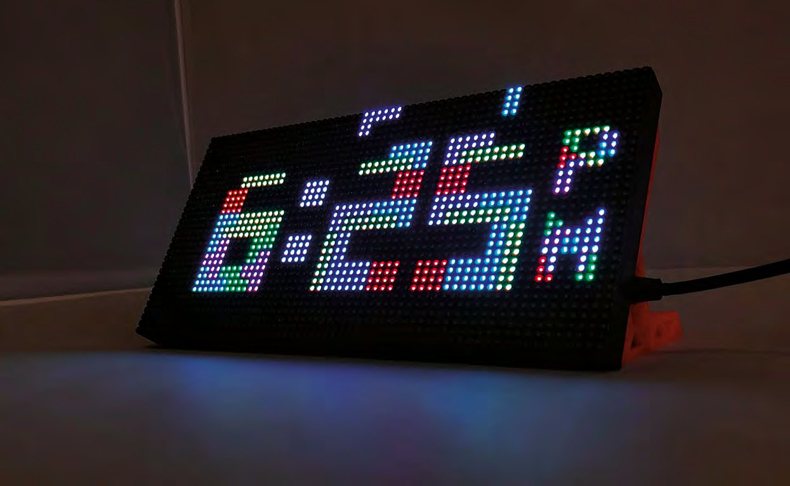

*Fiecare cifră este făcută din piese de Tetris, care cad la locul lor*

Tetris distrează oamenii încă de la lansarea lui, în 1984. Au existat multe versiuni ale jocului, inclusiv Tetris 99, în stil battle royale multiplayer, lansat chiar anul acesta. Este un clasic nemuritor, care a traversat multe generații de jucători. Piesele lui iconice, care cad, sunt recognoscibile instantaneu de aproape oricine, indiferent de interesul pentru jocurile video. Dar în loc să folosim piesele ca să curățăm linii, le vom folosi ca să spunem ora!

Acest proiect desenează cifrele unui ceas folosind formele clasice din Tetris, pe un afișaj cu matrice de LED-uri. Cu dimensiunile de circa 19 × 9,5 cm, este un afișaj destul de mare fizic și, în plus, foarte luminos, așa că rezultatul atrage incredibil de mult privirea.

O altă noutate a acestui proiect este că, spre deosebire de proiectele tradiționale de ceas cu Arduino, nu folosește un modul RTC (ceas de timp real) pentru a ține ora; în schimb, ora ceasului este setată de pe internet. Un mare avantaj este că trebuie să setezi doar fusul orar, iar ceasul va afișa apoi automat ora corectă; se va ajusta chiar și la ora de vară.

Este un proiect surprinzător de ușor de pus cap la cap, care ar trebui să ia doar câteva ore în total. Așa că, înarmat cu acest ghid, nu ai nicio scuză să nu îți faci unul!

> **UN POTENȚIAL ACCESORIU DE MODĂ?**
> În HackSpace numărul 16 ([hsmag.cc/issue16](https://hsmag.cc/issue16)) am arătat cum să modifici o „Pixel Purse” (o poșetă cu LED-uri) ca să îi folosești matricea de LED-uri. Afișajul din acea jucărie folosește aceeași interfață HUB75 ca matricea de LED-uri din acest proiect, dar are o rezoluție mai mică (32×16).

## Afișajul cu matrice de LED-uri

Scopul pentru care au fost gândite aceste afișaje este să fie înlănțuite pentru a forma ecrane uriașe, ca cele de la concerte, dar pot fi controlate și individual, cu un microcontroler. Afișajele vin în multe configurații diferite, dar majoritatea ar trebui să funcționeze cu acest proiect.

Când alegi unul dintre aceste afișaje, sunt câteva informații-cheie. Prima este pasul (*pitch*), adică distanța dintre centrele LED-urilor. Este marcat în descrierea afișajelor prin numărul de după „P”; de exemplu, P3 indică un afișaj cu pasul de 3 mm. Afișajele cu pas mai mare vor fi fizic mai mari.

Al doilea lucru de reținut este rezoluția afișajului, adică numărul de LED-uri disponibile. Un afișaj cu rezoluția 64×32 are 64 de LED-uri pe orizontală și 32 pe verticală. Acest proiect este scris pentru afișaje de 64×32, dar ar putea fi adaptat și pentru altele, dacă e nevoie.

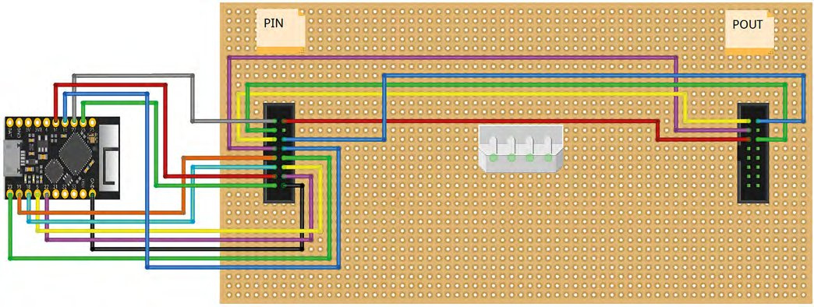

*Schema de cablare pentru un TinyPICO. Detalii pentru alte plăci bazate pe ESP32 găsești la [hsmag.cc/QXmJtz](https://hsmag.cc/QXmJtz)*

> **VEI AVEA NEVOIE DE**
> - O matrice de LED-uri RGB P3 de 64×32 (disponibilă pe AliExpress, eBay sau Adafruit)
> - TinyPICO ([tinypico.com](https://www.tinypico.com)), dar orice placă ESP32 ar trebui să meargă, de exemplu HUZZAH32
> - O sursă de 5 V, de 4 A sau mai mult
> - Cabluri DuPont mamă-mamă de 20 cm
> - Un adaptor de la mufă jack DC mamă la terminale cu șurub (depinde de mufa sursei tale)
> - Suporturi imprimate 3D pentru matricea de LED-uri, sau altceva care să o țină în picioare!

Aceste afișaje pot fi comandate cu multe microcontrolere diferite. Oamenii le folosesc adesea cu plăci Raspberry Pi, dar pentru acest proiect vom folosi un ESP32. ESP32 este un microcontroler ieftin, compatibil Arduino, cu WiFi încorporat.

> **SFAT RAPID**
> ESP32 este succesorul foarte popularului ESP8266. Este mai puternic și are mai mulți pini GPIO.

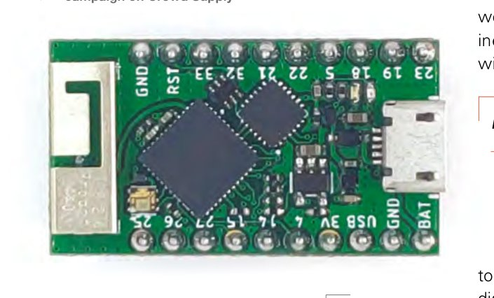

*TinyPICO este o placă de dezvoltare cu ESP32, care a trecut recent printr-o campanie de finanțare colectivă de succes pe Crowd Supply*

Când cablezi afișajul, fii atent la săgețile imprimate pe PCB-ul afișajului: ESP32 trebuie legat la conectorul de la care săgețile pleacă. Aceste săgeți se văd în **Figura 1**.

Pentru a alimenta afișajul, folosește un adaptor de la mufă jack DC mamă la terminale cu șurub și introdu în fiecare terminal câte unul dintre firele cablului de alimentare livrat cu afișajul, legând firul negru la terminalul marcat cu „-” și firul roșu la cel marcat cu „+”. Când ești mulțumit de conexiune, folosește bandă izolatoare sau tub termocontractabil ca să o întărești puțin.

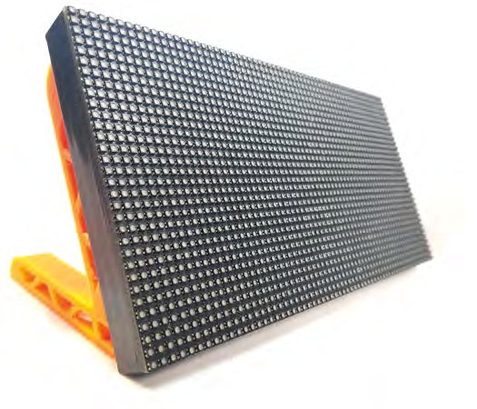

*Afișajul nostru ne dă 64×32 LED-uri cu care să ne jucăm*

Cel mai simplu mod de a alimenta ESP32 este printr-o sursă USB separată, dar poate fi legat și la aceeași sursă ca afișajul, prin pinul „5V” sau „USB” al plăcii ESP32. Lucrul la care trebuie să fii atent este să nu ajungi în situația în care curentul de la USB-ul PC-ului alimentează întregul afișaj, pentru că afișajul va trage mai mult curent decât poate furniza portul USB al PC-ului. Cea mai bună cale de a preveni asta este să folosești o diodă (Schottky 1N5817, de exemplu). Pune partea negativă a diodei spre microcontroler, astfel încât cei 5 V de la sursă să poată ajunge la ESP32, dar cei 5 V de la ESP32 să nu poată ajunge la afișaj.

> *Cel mai simplu mod de a alimenta ESP32 este printr-o sursă USB separată*

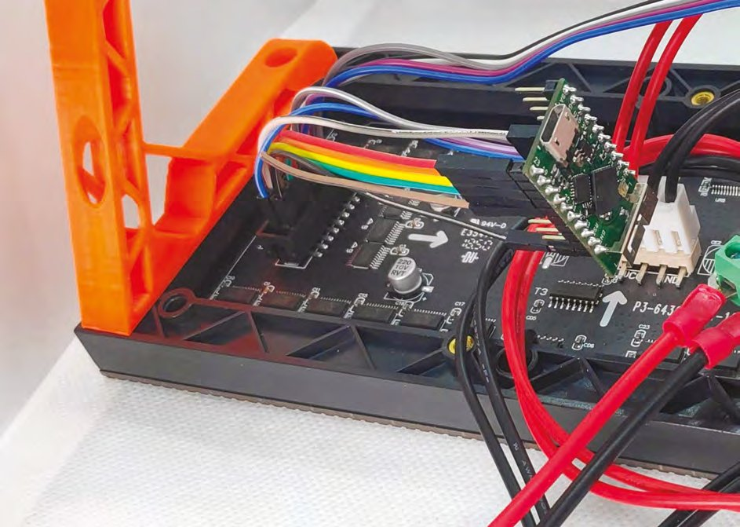

*Așa ar trebui să arate cablarea ta când ești gata de start*

Afișajul stă destul de instabil în picioare de unul singur, așa că e foarte recomandat să îi faci un suport. Dacă ai acces la o imprimantă 3D, aceste suporturi proiectate pentru matricea P3 merg grozav: [hsmag.cc/bGLDTh](https://hsmag.cc/bGLDTh). Vei avea nevoie de câteva șuruburi M3 de 10 mm ca să le prinzi de afișaj.

Dacă ai vrea să porți acest proiect pe afișajul din poșetă, ar trebui doar să elimini scalarea textului și să faci câteva mici ajustări de poziție ale textului, și ar funcționa fără probleme.

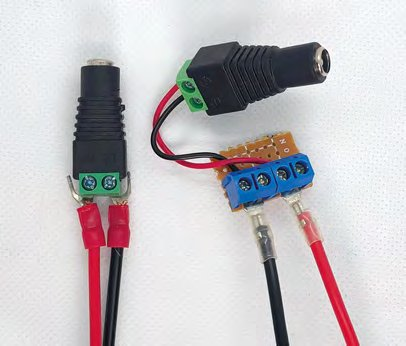

*Terminalele cu șurub fac ușoară adăugarea unui conector de alimentare*

> **SFAT RAPID**
> Dacă placa ESP32 pe care o folosești nu are aceiași pini ca în schemele de cablare, ar trebui să îi poți înlocui cu alți pini GPIO, dar va trebui să reflecți asta în cod.

> **PROGRAMAREA ESP32**
> Dacă nu ești deja pregătit pentru programarea unui ESP32, va trebui să faci următoarele:
>
> Mai întâi, descarcă Arduino IDE de pe site-ul Arduino și instalează-l: [hsmag.cc/UHQfXs](https://hsmag.cc/UHQfXs).
>
> Apoi trebuie să configurezi Arduino IDE pentru a fi folosit cu un ESP32. Deschide Arduino IDE, mergi la File > Preferences, lipește următoarea adresă în câmpul Additional Boards Manager URLs și apasă OK: `dl.espressif.com/dl/package_esp32_index.json`.
>
> Înapoi în ecranul principal al Arduino IDE, navighează la Tools > Board > Boards Manager. Când se deschide acest ecran, caută „ESP32” și instalează-l. Reține că poate dura câteva minute, în funcție de viteza conexiunii tale la internet.
>
> După configurarea unei plăci noi, se recomandă să încerci un sketch Blink simplu înainte să te apuci de ceva mai complicat. Asta poate scuti o grămadă de bătăi de cap mai târziu!
>
> **Nota traducătorului:** adresa actuală pentru plăcile ESP32 este `https://raw.githubusercontent.com/espressif/arduino-esp32/gh-pages/package_esp32_index.json`, iar în Arduino IDE 2 pachetul „esp32 by Espressif Systems” se instalează direct din Boards Manager.

## Pregătirea codului

Codul acestui proiect este disponibil pe GitHub. Îndreaptă-ți browserul spre [hsmag.cc/rpULls](https://hsmag.cc/rpULls), apasă pe butonul Clone or Download din partea dreaptă a paginii, apoi pe Download Zip. Dezarhivează fișierul. În dosarul dezarhivat, deschide dosarul ESP32 sau TinyPICO, apoi dosarul EzTimeTetrisClockESP32 și deschide fișierul `EzTimeTetrisClockESP32.ino`.

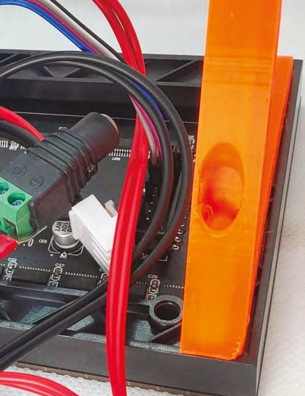

Acest sketch are nevoie de câteva biblioteci Arduino suplimentare:

- **Tetris Animation** de Tobias Blum, care se ocupă de animația în stil Tetris a ceasului;
- **PxMatrix** de 2Dom, pentru controlul afișajului cu matrice;
- **EzTime** de ropg, folosită pentru a lua ora de pe internet;
- **Adafruit GFX** de Adafruit, biblioteca de bază pe care este construită PxMatrix.

Detalii despre versiunile necesare ale bibliotecilor și de unde le poți lua se găsesc în partea de sus a sketch-ului Arduino. După instalarea acestor biblioteci, apasă pe butonul „verify” (în formă de bifă) al sketch-ului EzTimeTetrisClockESP32, ca să te asiguri că totul se compilează fără probleme.

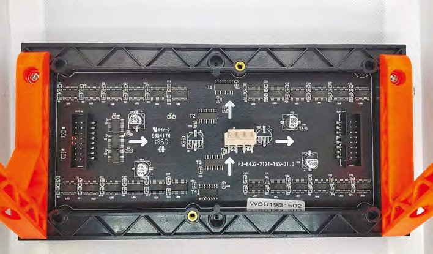

*Figura 1 – Fii atent la săgețile de pe placă atunci când o cablezi*

> **SFAT RAPID**
> Dacă afișajul nu arată corect sau pare că îi lipsesc culori, verifică de două ori că ai cablat corect.

> **NU DOAR PENTRU MATRICE DE LED-URI**
> Biblioteca Tetris Animation, folosită în acest proiect, funcționează cu mult mai mult decât aceste matrice de LED-uri. Biblioteca funcționează cu orice afișaj care folosește biblioteca Adafruit GFX.
>
> Adafruit GFX oferă un set de metode pentru desenat și pentru scris text, abstractizate față de hardware-ul ecranului. Trebuie combinată cu o bibliotecă specifică hardware-ului, care poate comunica cu afișajul.
>
> Cum biblioteca Tetris Animation folosește doar metode din biblioteca Adafruit GFX, înseamnă că poate fi folosită cu orice afișaj care are o bibliotecă bazată pe Adafruit GFX (și sunt o mulțime!).

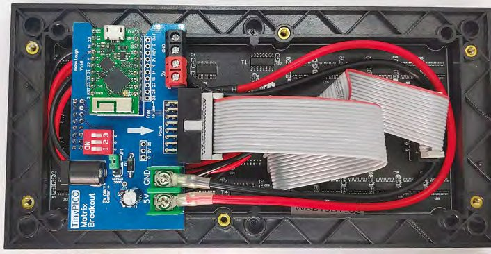

*Un PCB personalizat, care folosește cablul panglică livrat cu afișajul, ca să țină cablarea mai ordonată*

Va trebui să faci câteva modificări în sketch, ca ceasul să funcționeze corect pentru tine. În secțiunea „Stuff to configure”, setează SSID-ul și parola rețelei tale WiFi.

Imediat sub ele, setează fusul orar, în formatul „Europe/Dublin” (pentru România, „Europe/Bucharest”); în sketch există un comentariu cu un link către lista completă a fusurilor orare posibile.

Și, la final, dacă folosești o altă placă ESP32 decât TinyPICO, va trebui să schimbi cablarea. Caută „Generic” în sketch și decomentează cele două linii pe care le găsești, apoi comentează liniile alăturate, care conțin un comentariu „TinyPICO”.

Când ai terminat de configurat, încarcă codul pe ESP32 și ar trebui să îl vezi animându-se în toată gloria lui pătrățoasă!

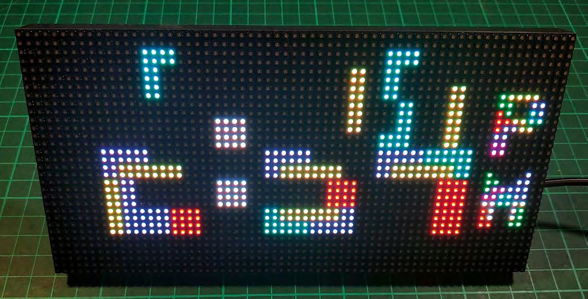

*Cifrele cad la locul lor*

## Ajustarea setărilor

Există câteva ajustări pe care le poți face ceasului, ca să funcționeze exact cum vrei.

Dacă preferi un ceas în format de 24 de ore, setează `twelveHourFormat` pe `false`.

Opțiunea `forceRefresh` controlează câte dintre cifre sunt desenate în fiecare minut. Dacă este `true`, întregul ceas va fi șters și toate cifrele vor fi desenate din nou. Dacă este `false`, vor fi șterse doar cifrele care trebuie; de exemplu, dacă ora curentă era „10:29” și trebuia actualizată, doar „2” și „9” ar fi înlocuite, iar „10” ar rămâne pe ecran.

Și, la final, poți regla viteza cu care cad piesele de Tetris, schimbând valoarea care declanșează `animationTimer`. În mod implicit, în sketch este 100000, adică 100.000 de microsecunde, sau 0,1 secunde. Reducerea acestui număr va face piesele să cadă mai repede. Schimbarea valorii în 50000 va face animația de două ori mai rapidă.

Odată ce ai făcut aceste schimbări, încarcă din nou codul și vei avea ceasul funcționând exact cum îți place. Nu mai rămâne decât să îți omori timpul privind piesele cum cad.

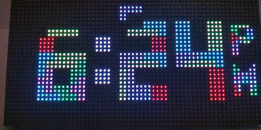

*Ți-ai putea construi propria versiune a acestui ceas animat*

> **PUTEREA OPEN SOURCE**
> Biblioteca Tetris Animation provine dintr-un proiect creat de Tobias Blum (toblum pe GitHub), care a făcut un ceas cu animația Tetris, dar scris fix pentru un afișaj de 32×16, cu codul pentru obținerea orei și codul de animație împletite. Sketch-ul lui era open source și, după ce am discutat cu el, am extras doar partea de animație a sketch-ului într-o bibliotecă Arduino de sine stătătoare, ca să poată fi folosită pentru a desena orice numere, nu doar un ceas. Am profitat de ocazie și ca să schimb biblioteca astfel încât să folosească referințe generice la biblioteca Adafruit GFX, și să adaug câteva funcții în plus, cum ar fi posibilitatea de a scala cifrele.
>
> Un alt dezvoltator, Mike Swan (n00dles101 pe GitHub), a îmbunătățit apoi biblioteca adăugând suport pentru caractere text. Fiecare caracter a trebuit codat manual, așa că Tobias și Mike au făcut o treabă uimitoare!
