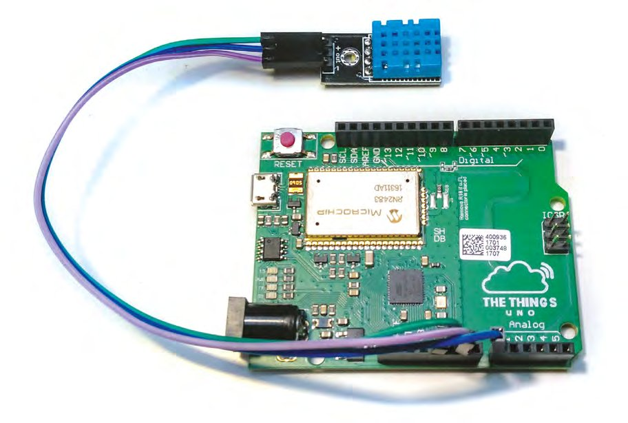
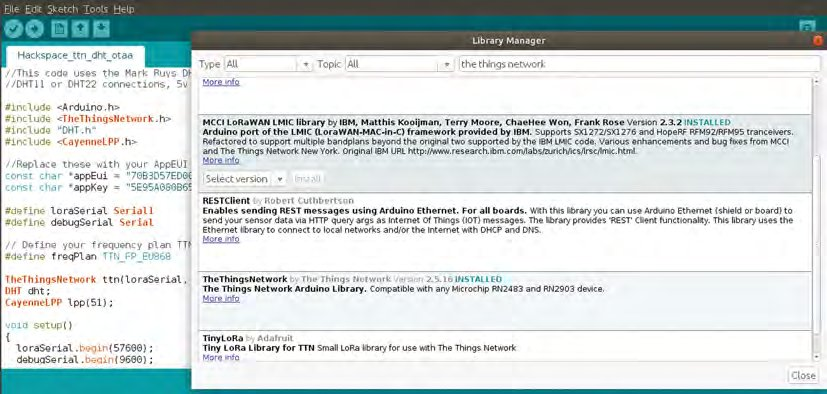
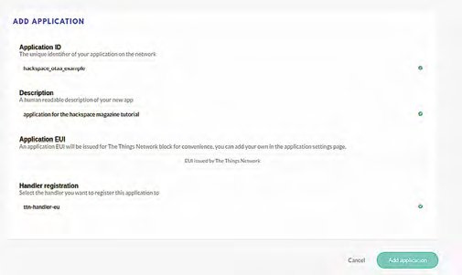
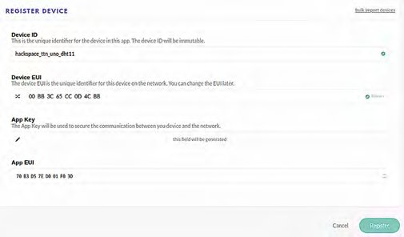
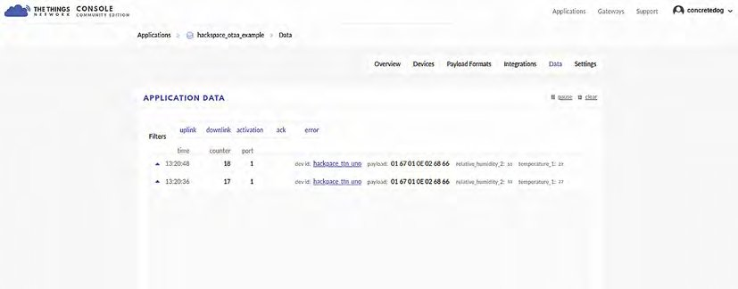
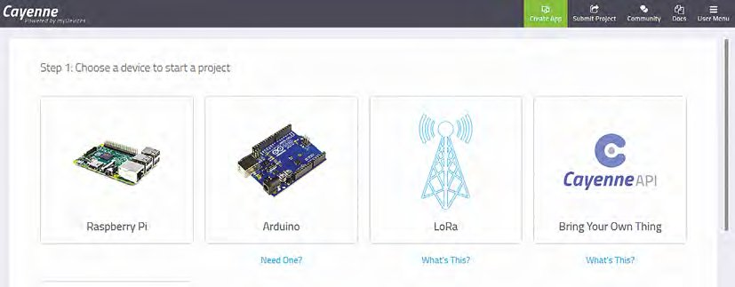
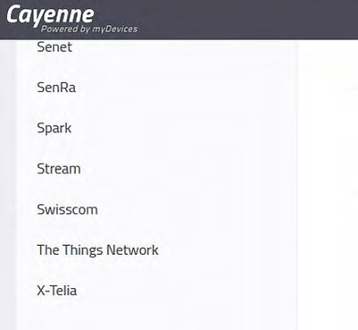
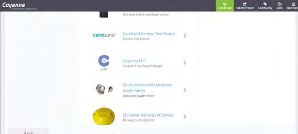
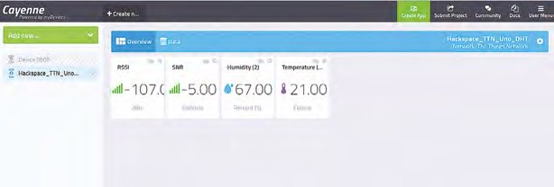
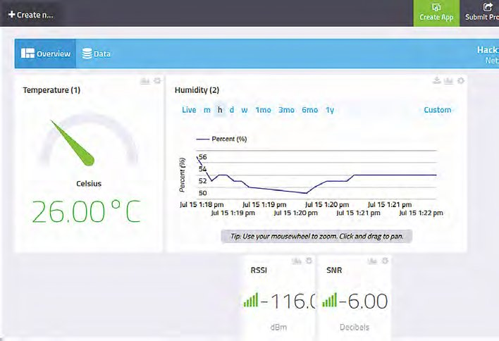

# Capitolul 20 – Să învățăm LoRa!

> *Explorează LoRa și LoRaWAN și transmite temperatura și umiditatea către un panou de control online*

> **DESPRE AUTOR**
> **Jo Hinchliffe** (@concreted0g) contribuie la Libre Space Foundation și este pasionat de tot ce înseamnă spațiu DIY. Adoră să proiecteze și să construiască de la zero rachete, atât modele, cât și rachete de mare putere, și își publică proiectele și componentele ca open-source. Are și un șopron plin de strunguri, freze și echipamente CNC!

*Figura 1 – The Things Uno cablat la un senzor DHT11, care poate măsura temperatura și umiditatea*

Se pare că termenii LoRa și LoRaWAN sunt peste tot în acest moment, dar ce sunt ei? LoRa este o platformă prin care senzorii comunică fără fir, pe distanțe lungi; LoRaWAN este, în esență, același lucru, doar că, atunci când receptorul primește ceva de la un dispozitiv-senzor LoRa, numit de obicei „nod”, el se comportă ca un „gateway” (poartă), trimițând informația mai departe pe internet. În acest capitol vom parcurge câteva activități simple cu LoRaWAN și vom conecta un nod LoRa la „The Things Network”, o rețea de gateway-uri construită de comunitate. Asta ne permite să primim date de la un nod și să transmitem niște date prin internet către un panou de control (*dashboard*) frumos, care afișează datele noastre.

Vom lucra cu The Things Uno, care este, în esență, o placă în format Arduino cu cipul de comunicație LoRa încorporat. Putem programa The Things Uno tot din Arduino IDE, așa că primul lucru este să descărcăm și să instalăm cea mai nouă versiune de Arduino IDE de la [hsmag.cc/APNJVV](https://hsmag.cc/APNJVV).

> **NOTA TRADUCĂTORULUI**
> The Things Network a trecut în 2021 la versiunea 3 a platformei („The Things Stack”), iar consola veche descrisă aici (v2) a fost închisă. Pașii sunt aceiași ca principiu (aplicație, dispozitiv înregistrat prin OTAA, decodor de payload CayenneLPP, integrare), dar ecranele și denumirile diferă. Verifică și dacă există un gateway LoRaWAN în raza ta: harta rețelei este la [thethingsnetwork.org](https://www.thethingsnetwork.org).

Ca să testăm că placa The Things Uno funcționează, hai să încărcăm un program simplu de verificare. Leagă The Things Uno la calculator cu cablul micro-USB. În Arduino IDE, apasă Tools > Board și verifică să fie setată pe „Arduino Leonardo”. Apoi apasă Tools > Port și alege portul care include eticheta „Arduino Leonardo”, ca să te asiguri că Arduino IDE comunică cu portul corect.

Apoi apasă File > Examples > 01.Basics > Blink, apoi butonul de verificare (arată ca o bifă, în stânga sus a ecranului), apoi butonul de încărcare (săgeata spre dreapta de lângă butonul de verificare). Dacă totul merge bine, după câteva secunde placa ta The Things Uno ar trebui să aibă un LED care clipește, legat la pinul 13 de pe placă (unul dintre cele patru LED-uri verzi de lângă portul micro-USB).

> **VEI AVEA NEVOIE DE**
> - The Things Uno
> - Un senzor de temperatură și umiditate DHT11 sau DHT22
> - Câteva fire de legătură pentru breadboard
> - Un cablu micro-USB
> - Acces la un gateway LoRa (vezi detaliile din tutorial)

Apoi trebuie să instalăm câteva biblioteci pe care le vom folosi în acest capitol. Două dintre ele le instalăm din managerul de biblioteci al Arduino IDE, iar una o descărcăm și o instalăm manual de pe internet. Deschide Arduino IDE și apasă Tools > Manage libraries (**Figura 2**). Prima bibliotecă pe care o instalăm se numește „The Things Network”, așa că scrie asta în bara „filter your search” din partea de sus a managerului de biblioteci. Ar trebui să găsești o bibliotecă a cărei descriere începe cu „The Things Network by Johan Stokking, Ludo Teirlinck…”; selecteaz-o și apasă Install. Repetă procesul căutând „cayenne LPP”, ca să instalezi o bibliotecă numită „CayenneLPP by Electronic Cats”. La final, ca să instalăm a treia bibliotecă, trebuie să o descărcăm de la [hsmag.cc/pEDXUY](https://hsmag.cc/pEDXUY). Apasă pe butonul mare verde „Clone or download”, apoi pe opțiunea Download ZIP. Odată descărcată, în Arduino IDE apasă Sketch > Include Library > Add .ZIP Library, apoi navighează la locul în care ai descărcat fișierul zip și selectează-l.

*Figura 2 – Folosirea managerului de biblioteci din Arduino IDE pentru a instala bibliotecile necesare proiectului*

> *Vom lucra cu The Things Uno, care este, în esență, o placă în format Arduino cu cipul de comunicație LoRa încorporat*

## Local

Următoarea treabă este să încărcăm un sketch exemplu din biblioteca The Things Network, pe care tocmai am instalat-o. Apasă File > Examples > TheThingsNetwork > Device info; în sketch-ul care se deschide trebuie să facem o mică schimbare înainte de a-l putea folosi. Frecvența The Things Uno pentru Europa este 868 MHz, așa că trebuie să înlocuim un text. Modifică sketch-ul astfel încât „REPLACE_ME” să fie înlocuit cu „TTN_FP_EU868”. Cititorii din alte regiuni vor trebui să îl înlocuiască cu exemplul care corespunde frecvenței disponibile în regiunea lor; o găsești pe un autocolant de pe spatele plăcii The Things Uno.

Verifică din nou că placa este încă legată și setată pe Arduino Leonardo, și că portul este corect. Verifică și încarcă sketch-ul Device info pe The Things Uno. Odată încărcat, trebuie să deschizi monitorul serial din Arduino IDE, fie apăsând pe pictograma cu lupă din dreapta sus a ecranului, fie apăsând Tools > Serial monitor. În monitorul serial, după câteva secunde, ar trebui să apară niște detalii unice pentru placa ta The Things Uno; copiază-le într-un document text undeva pe calculator, pentru mai târziu.

Acum că avem hardware-ul pregătit și configurat, e timpul să ne uităm la partea de rețea. Aceasta ne dă un loc unde să trimitem datele.

> **REȚEA PUBLICĂ**
> The Things Network este o rețea găzduită de comunitate, formată din gateway-uri conectate la internet. Dispozitivele LoRaWAN, în cazul nostru un The Things Uno, pot fi recepționate de orice gateway, iar pachetele lor de date sunt apoi trimise mai departe către un cont înregistrat de proprietarul dispozitivului pe site-ul The Things Network. Aplicația de pe site poate fi configurată să integreze sau să trimită mai departe aceste informații către alte sisteme, permițând utilizatorului să creeze un panou de control web, o aplicație de telefon, o alertă SMS, un e-mail sau alte opțiuni, declanșate sau alimentate de datele de la dispozitivul sau dispozitivele din teren. Site-ul The Things Network are o hartă a gateway-urilor; verifică dacă ai unul în apropiere, la care te-ai putea conecta.

## La The Things Network

Vom folosi The Things Network ca liant între senzorul nostru și panoul de control (la care ne uităm puțin mai încolo). Navighează la [hsmag.cc/BtGluJ](https://hsmag.cc/BtGluJ) și înregistrează un cont. Odată înregistrat și autentificat, ar trebui să vezi un link „console” într-o listă derulantă, când apeși pe numele tău de utilizator. Navighează la consolă și ar trebui să vezi două pictograme mari: una cu „applications” și una cu „gateways”. Ne bazăm (sperăm) pe faptul că ești în raza unui gateway, așa că ne interesează să configurăm o aplicație: apasă pe pictograma Application.

> **SFAT RAPID**
> Folosește harta de pe site-ul The Things Network ca să vezi dacă ești aproape de vreun gateway LoRa.

O aplicație, în termenii The Things Network, poate fi văzută ca zona în care dispozitivele sau nodurile tale (în acest caz, The Things Uno) își trimit datele. Aici The Things Network va decide unde să trimită și ce să facă cu datele pe care le primește. O aplicație poate primi date de la mai multe noduri sau dispozitive și poate fi integrată și cu alte servicii online, care îți permit să faci lucruri cu datele (de exemplu, să trimiți un mesaj text când o temperatură devine prea mare, să alimentezi un panou de control sau să trimiți informații-cheie într-o foaie de calcul online).

> *Deocamdată vom crea o singură aplicație simplă, care să primească date de la placa noastră The Things Uno*

Deocamdată vom crea o singură aplicație simplă, care să primească date de la placa noastră The Things Uno, adică umiditatea și temperatura de la senzorul DHT11. Apasă pe butonul „Add application” din dreapta sus și dă-i un nume; reține că numele trebuie să fie cu litere mici și unic, așa că dacă încerci „test”, de exemplu, probabil vei descoperi, când încerci să adaugi aplicația, că a fost folosit deja. Cum se cere în a doua secțiune, adaugă un text lizibil care să îți amintească ce este această aplicație; de exemplu, „HackSpace tutorial temperature and humidity example”.

*Figura 3 – Adăugarea unei aplicații în contul nostru The Things Network*

Ultimele două casete ar trebui să fie deja cum vrem: „Application EUI” setat pe „EUI issued by The Things Network” și „Handler registration” setat pe „ttn-handler-eu”. Lasă-le așa și apasă pe butonul turcoaz „Add application” (**Figura 3**) din dreapta jos a paginii.

Aplicația ar trebui să fie acum creată și vei fi trimis pe pagina Application Overview. Dacă derulezi în jos pe această pagină, ar trebui să găsești o secțiune numită „Devices”, care va arăta că nu există dispozitive înregistrate. Așa că hai să adăugăm un dispozitiv, adică placa noastră The Things Uno, ca hardware-ul nostru să se poată conecta la această aplicație. În dreapta sus a casetei cu dispozitive, apasă „Register device”. În pagina Device Registration rezultată, dă dispozitivului un ID și copiază „Dev EUI” din documentul text pe care l-am făcut mai devreme, când am luat informațiile dispozitivului de pe The Things Uno cu sketch-ul Device info. Lasă câmpul App Key de pe această pagină așa cum este (setat să fie generat de The Things Network) și apasă pe butonul turcoaz „Register” din dreapta jos (**Figura 4**).

*Figura 4 – Înregistrarea unui dispozitiv într-o aplicație de pe The Things Network înseamnă, în esență, să prezinți The Things Network plăcii tale The Things Uno, ca să fie conectate și să poată comunica*

Ar trebui să ajungi acum pe pagina „Device Overview” a dispozitivului pe care tocmai l-ai înregistrat. Sunt multe informații pe această pagină, inclusiv metoda de activare (care ar trebui să fie OTAA) și diversele chei pe care le are sau de care are nevoie dispozitivul pentru a comunica cu aplicația. Dacă derulăm până jos, ar trebui să vedem o casetă numită „Example Code”.

## Totul e în cod

În mod minunat, acesta este un fragment de cod care conține cele două informații-cheie de care are nevoie un sketch Arduino de pe The Things Uno ca să se conecteze la aplicația noastră de pe The Things Network. Copiază-le (fie selectezi și apeși clic dreapta > copy, fie apeși butonul de copiere din dreapta sus a casetei) și lipește-le într-un document text sau într-un sketch Arduino gol. Înainte să trecem la partea următoare, vom face o ultimă schimbare aplicației pe care am creat-o pe The Things Network. Întoarce-te la pagina Application Overview (navighează aici apăsând „Applications” în dreapta sus a paginii, lângă numele tău de profil), apoi selectează aplicația tocmai creată. Înapoi în Application Overview, apasă pe fila „Payload Formats” din dreapta sus. Pe pagina rezultată ar trebui să vezi o casetă numită Payload Format, care ar trebui să arate „Custom”. Apasă pe această casetă. În meniul derulant ar trebui să existe o singură altă opțiune, CayenneLPP; selecteaz-o și apoi nu uita să apeși butonul Save din dreapta jos a paginii.

> **SFAT RAPID**
> Amintește-ți, o aplicație de pe The Things Network poate suporta mai multe dispozitive, perfect pentru proiecte mari, cu rețele de senzori la distanță!

> **MESAJE PICANTE**
> Cayenne este o platformă IoT a unei companii numite myDevices. CayenneLPP (Cayenne Low Power Payload) este un format pentru pachetele de date trimise prin LoRa, care permite integrarea câtorva tipuri-cheie de senzori în platforma IoT Cayenne, pur și simplu prin The Things Network. Simplu spus, dacă putem trimite datele senzorilor în format CayenneLPP, o mare parte din munca de despachetare a acestor date și de prezentare a lor într-un mod simplu și lizibil este făcută pentru noi în The Things Network și în mediul Cayenne myDevices.

## Să ne conectăm

Legarea plăcii cu senzor DHT11/22 la The Things Uno este destul de simplă. Leagă fire de breadboard între DHT11/22 și soclurile de 5 V și GND ale The Things Uno. Pinul de date al senzorului DHT11 trebuie legat la pinul A0 al The Things Uno (cum se vede în **Figura 1**).

> *Pinul de date al senzorului DHT11 trebuie legat la pinul A0 al The Things Uno*

Înapoi în Arduino IDE, vom încărca acum pe The Things Uno sketch-ul pentru senzorul nostru; după ce facem câteva schimbări și adăugăm cheile, trebuie să îi permitem să comunice cu aplicația de pe The Things Network. Descarcă sketch-ul de la [hsmag.cc/issue22](https://hsmag.cc/issue22) și deschide-l în Arduino IDE. Sunt doar câteva schimbări de făcut. Prima este să verificăm că planul de frecvențe este corect pentru The Things Uno; e aceeași bucată de cod pe care am înlocuit-o mai devreme în sketch-ul Device info. În codul nostru este setat pe versiunea europeană, „TTN_FP_EU868”, și va trebui schimbat doar dacă folosești planul de frecvențe din SUA.

A doua schimbare este că vei vedea în cod o secțiune asemănătoare cu codul copiat mai devreme din caseta „Example Code” de pe pagina Device Overview de pe The Things Network. (Sunt cele două linii de sub comentariul „//Replace these with your AppEUI and AppKey”.) Așa că, desigur, copiază și lipește acele două linii întregi din caseta Example Code de pe Device Overview, ca să le înlocuiești pe cele asemănătoare din sketch-ul Arduino.

*Figura 5 – Succes! Datele de la dispozitivul nostru sunt primite de aplicația noastră de pe The Things Network*

## Decodarea payload-ului

Salvează sketch-ul și apasă Verify. Dacă codul se compilează corect, verifică din nou că The Things Uno este încă legat corect, ca Arduino Leonardo, și că portul corect este selectat, apoi încarcă sketch-ul pe The Things Uno. Lasă The Things Uno legat la laptop, pentru alimentare, după ce sketch-ul s-a încărcat.

Ai acum un nod LoRaWAN cu un senzor care, sperăm, își transmite payload-ul cu datele de umiditate și temperatură, dacă ești în raza unui gateway (merită să ieși afară cu laptopul și cu The Things Uno, ca să crești șansele!). Înapoi pe site-ul The Things Network, apasă pe fila Applications și selectează aplicația creată, apoi, în pagina Application Overview, alege fila „Data” din dreapta sus. Așteaptă puțin și ar trebui să înceapă să apară pachete de date, cu câteva informații despre ele și, cel mai important, cu payload-ul în ultimele coloane, arătând citirile de temperatură și umiditate de la senzorul tău (**Figura 5**). Cum am setat aplicația să citească payload-ul ca fiind de tip CayenneLPP, payload-ul nostru este decodat și afișat frumos, etichetat corect „temperature” și „humidity”, în loc de o simplă colecție brută de octeți. Dacă apeși pe un anumit pachet de date, primești un meniu derulant cu mai multe informații, cum ar fi puterea semnalului și prin ce gateway-uri a trimis dispozitivul datele.

> *Payload-ul nostru este decodat și afișat frumos, etichetat corect „temperature” și „humidity”, în loc de o simplă colecție brută de octeți*

Așa cum stau lucrurile, datele senzorului ajung la The Things Network, dar poate observi că, dacă reîmprospătezi pagina Applications Data sau o închizi și o redeschizi, datele nu rămân acolo. Aplicațiile simple de pe The Things Network nu păstrează datele; ele sunt o zonă de tranzit, care poate trimite datele mai departe, în alte locuri. Vom crea acum un panou de control simplu pentru dispozitivul nostru, către care aplicația va trimite datele, iar panoul de control le va păstra mai permanent, ca să le putem revedea când avem nevoie.

*Figura 6 – Începutul configurării unui panou de control pe site-ul myDevices*

## Să fie date

Pe lângă faptul că face simplă obținerea unui payload lizibil pe The Things Network, am folosit biblioteca și formatul de payload CayenneLPP pentru că face banală crearea, online, a unui panou de control pentru dispozitivul nostru, care va colecta și afișa toate datele de la placa noastră The Things Uno. Ca să îl configurăm, trebuie mai întâi să ne înregistrăm un cont gratuit pe site-ul Cayenne myDevices: [hsmag.cc/YlgAGf](https://hsmag.cc/YlgAGf).

*Figura 7 – Selectează The Things Network din meniul din stânga*

Odată autentificat, selectează pictograma mare LoRa (**Figura 6**), apoi alege „The Things Network” din partea de jos a barei de meniu din stânga (**Figura 7**). Apoi derulează în jos și apasă pe opțiunea CayenneLPP (**Figura 8**); în fereastra de setări care ar trebui să apară, trebuie să dai un nume panoului de control/dispozitivului, apoi să adaugi Device EUI în caseta DevEUI; lasă modul de activare pe „already registered” și locația de urmărire pe „this device moves”. Salvează aceste setări și lasă fila deschisă în browser.

*Figura 8 – Selectarea opțiunilor CayenneLPP pentru panoul nostru de control*

La final, trebuie să ne întoarcem pe site-ul The Things Network și, în Applications Overview, să selectăm fila „Integrations” și să apăsăm „Add integration”. Derulează în jos și apasă pe pictograma myDevices; în caseta Process ID, dă-i un nume, de exemplu „hackspacedashboard”, iar în meniul derulant „Access Key”, când apeși pe caseta goală, ar trebui să apară o singură opțiune, „Default key”, lângă două butoane, „Devices” și „Messages”. Apasă pe „Default key” ca să o pui în caseta „Access Key”, apoi apasă pe butonul albastru „Add integration” din dreapta jos.

*Panoul de control standard, cu datele noastre*

Dacă treci acum înapoi la pagina myDevices, lăsată deschisă în cealaltă filă, de îndată ce myDevices primește niște date de la The Things Uno, ar trebui să creeze automat un panou de control și să afișeze datele. Ar trebui să creeze un panou cu RSSI (indicatorul puterii semnalului recepționat), SNR (raportul semnal-zgomot) și, desigur, datele de umiditate și temperatură de la senzorul nostru. Acest panou se va actualiza cu cele mai noi date și va stoca datele primite, ceea ce înseamnă că te poți întoarce oricând să le verifici; sau, dacă îți scoți The Things Uno offline, nu va pierde datele deja înregistrate. Elementele panoului de control myDevices pot fi toate editate și personalizate, așa că poți schimba pictogramele sau tipul de indicator sau de grafic, apăsând pe meniul de setări al fiecărui widget.

> *Elementele panoului de control myDevices pot fi toate editate și personalizate, așa că poți schimba pictogramele sau tipul de grafic*

*Panoul nostru de control modificat, care arată datele în formă vizuală*

## Timpul pentru un alt proiect

Felicitări pentru configurarea primului tău dispozitiv și a primei aplicații LoRaWAN. Există zeci de platforme diferite pentru dispozitive și nenumărați senzori care pot fi dezvoltați și adăugați la ele. În plus, fiind o comunitate în creștere rapidă, există o mulțime de tutoriale online de explorat, care să te ajute să îți dezvolți următoarele proiecte.
