# Capitolul 21 – Construiește primul tău robot care merge

> *Fă-ți un animal de companie, un majordom sau un asistent robotic*

> **DESPRE AUTOARE**
> **Jenny List** este inginer și scrie de mulți ani despre electronică și cultura maker.

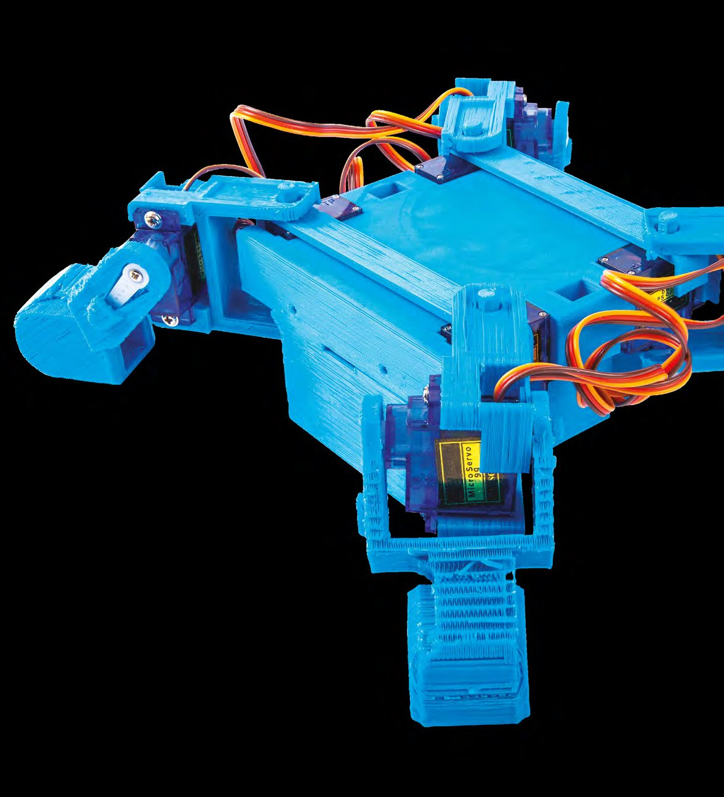

Luăm de bună capacitatea mamiferelor și a altor creaturi de a merge. E ceva ce mințile noastre tinere învață în copilărie, fără să înțeleagă ce sarcină complexă am stăpânit. Suntem binecuvântați cu unele dintre cele mai complicate și capabile mecanisme de acționare imaginabile, sub forma brațelor și picioarelor, dar stăpânirea lor cere o mulțime uriașă de abilități și de informații senzoriale, pe care le prelucrăm în subconștient. Încercarea de a reproduce mișcarea de mers într-un robot este grea, așa că nu e de mirare că majoritatea roboților mobili folosesc roți sau șenile.

Ca oameni, suntem una dintre relativ puținele specii care merg în poziție verticală, pe două picioare. Suntem inerent instabili și predispuși la căzături, așa că creierul nostru ne monitorizează continuu echilibrul și ne ajustează mușchii ca să ne țină drepți. Este o sarcină deosebit de dificilă în programarea roboților, așa că până și roadele programelor de cercetare de multe milioane de lire, cum ar fi ASIMO de la Honda sau roboții bipezi de la Boston Dynamics, abia încep să meargă confortabil. Prin comparație, mersul în patru picioare, așa cum îl practică majoritatea animalelor, este un proces mult mai stabil, iar un robot patruped este la îndemâna majorității oamenilor.

## Construirea șasiului

Noi mergem creând un pas cu ajutorul mușchilor și articulațiilor noastre complexe, dar există și alte mișcări care pot genera deplasare într-un robot. Cele mai simple, de departe, folosesc o mișcare circulară alternativă, de la o camă sau de la un ax excentric, dar există și roboți care folosesc o mișcare de săritură, cu arc. În acest capitol ne vom uita la un robot care imită piciorul unui animal, pentru că, datorită microcontrolerelor, controlul lui este acum la îndemâna oricui.

Membrele noastre au o gamă de articulare cu mult mai mare decât e nevoie pentru mers, în așa măsură încât reproducerea completă a unui membru uman ar fi o piesă de robotică extrem de scumpă. Din fericire, articularea necesară pentru fiecare sarcină pe care o poate face un membru uman este doar o parte din întreg. Așa că, pentru un picior care merge, articularea poate fi redusă doar la axele necesare treburii. Articulațiile șoldului, genunchiului și gleznei pot fi făcute să se miște într-un singur plan, rezultând un picior care are nevoie de doar trei servomotoare. Cu o talpă rotunjită, nevoia de gleznă dispare și ea, ducând la un picior cu doar două servomotoare. Acesta este designul robotului pe care îl facem aici: are patru picioare cu câte două servomotoare fiecare, adică doar opt servomotoare pentru mobilitate completă de mers.

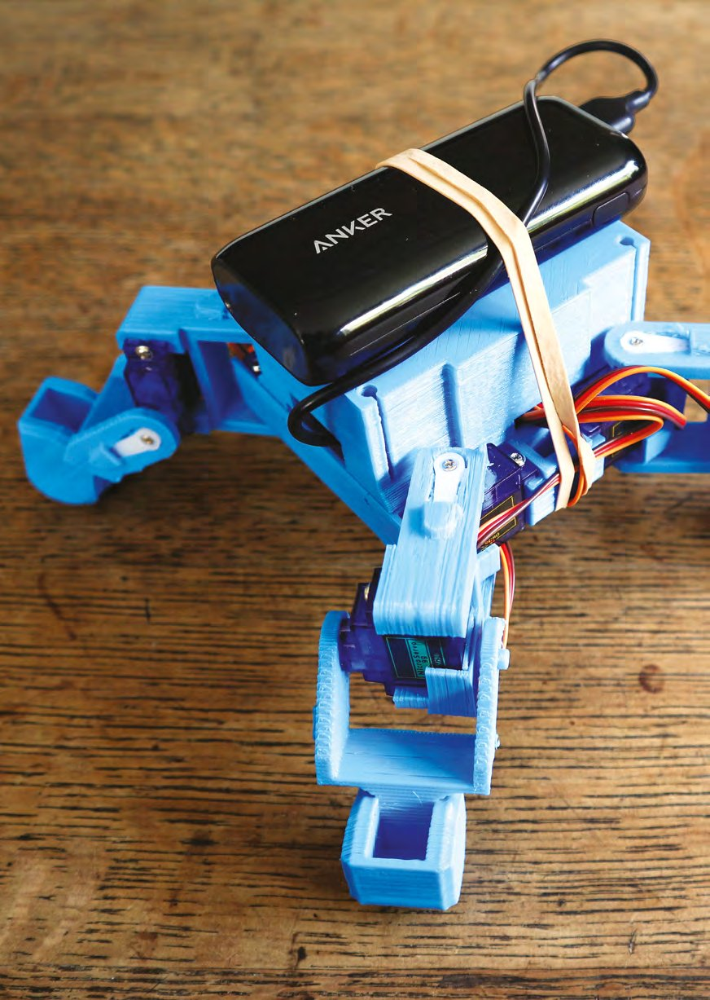

### MiniKame, un design de robot infinit de versatil

Seria de roboți Kame urmează un design open-source, imprimat 3D, care există de câțiva ani și care a cunoscut rafinări semnificative și versiuni alternative ale aceluiași robot patruped de bază. Elementele din versiuni diferite pot fi combinate în construcții personalizate, iar în locul ESP8266-ului din original pot fi puse o mulțime de alte controlere. O căutare în populara bibliotecă de modele 3D Thingiverse va scoate la iveală o mulțime de designuri derivate din Kame. MiniKame-ul pe care l-am construit noi este o versiune mai mică, proiectată inițial pentru HuaDuino, o placă personalizată bazată pe Arduino, care presupunea o așteptare după poșta din Hong Kong, așa că am ales să imprimăm o versiune modificată a corpului, proiectată pentru popularele (și ușor de găsit în Marea Britanie) plăci de extensie pentru Arduino Nano. Dacă poți aștepta livrarea unui HuaDuino, acea variantă este un pic mai compactă. Sau, dacă chiar știi ce faci, alege cu totul altă placă, cum ar fi una cu ESP8266 și WiFi; dar, pentru acest capitol, rămânem la plăcile Arduino. Asta e frumusețea open-source-ului: în locul unui singur design de tip „ia-l sau lasă-l”, există un ecosistem sănătos de remixuri, ceea ce înseamnă că fiecare robot Kame poate fi diferit, pe măsura nevoilor proprietarului.

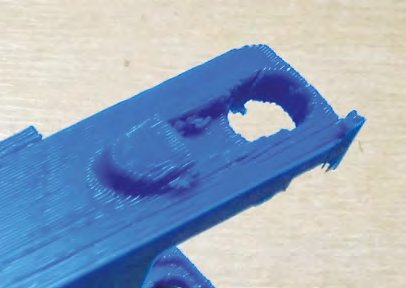

*Piesa coapsei, cu locașul pentru pinul genunchiului*

Diferitele piese imprimate 3D ale MiniKame-ului nostru au venit de pe Thingiverse, iar instrucțiunile de pe pagina lui de pe Instructables. Găsești resursele la [hsmag.cc/CkdDMO](https://hsmag.cc/CkdDMO).

> **STRANDBEEST, O OPERĂ DE ARTĂ CARE MERGE**
> De la începutul anilor 1990, artistul olandez Theo Jansen a creat o serie de sculpturi care merg, puse în mișcare de vânt. Aceste Strandbeesten („fiare de plajă”, în olandeză) sunt făcute de obicei din țeavă PVC și sunt eliberate pe plajele Olandei ca opere de artă autonome.
>
> Sunt caracterizate de picioarele lor multiple, care folosesc mecanismul articulat proiectat de Jansen, cu o pereche de triunghiuri rigide legate printr-un romb, care poate fi manipulat de o manivelă pentru a produce o mișcare de mers practică, în care talpa se mișcă aproximativ ca talpa unui om care merge. Picioarele Strandbeest au fost preluate cu entuziasm de comunitatea maker și transformate în tot felul de mașini care merg; au fost folosite chiar și pentru a înlocui roata din spate a unui cadru de bicicletă.

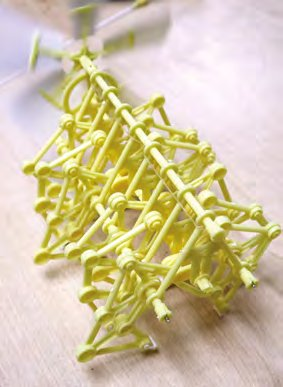

*Un model de Strandbeest*

Corpul principal al Kame-ului este o cutie de plastic dimensionată pentru placa lui de control, cu un capac și cu locașuri pentru cele patru servomotoare SG90 care formează articulațiile șoldurilor. Dedesubt sunt două bare de legătură, care se prind de partea de jos a corpului și se fixează în partea inferioară a balamalei șoldului; în construcția noastră, acestea și ansamblul corpului principal au venit din depozitul de pe Thingiverse pentru placa Arduino Nano. Picioarele, în schimb, sunt piesele standard MiniKame: un ansamblu de coapsă și un ansamblu combinat de gambă și talpă, care se îmbină cu încă un servomotor SG90. Am imprimat patru astfel de ansambluri. Ele, împreună cu corpul, au fost imprimate din PLA, în două sesiuni, pe un HyperCube de la MK Makerspace, pe parcursul unei seri.

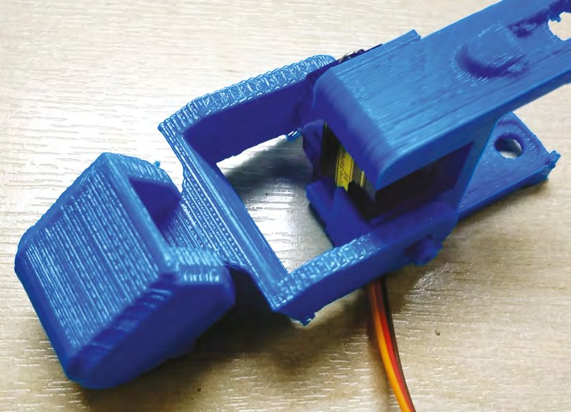

*Un picior asamblat*

Primul pas în asamblarea unui MiniKame este construirea celor patru picioare. Există cele două piese mai mari, pentru coapsă și gambă, plus un mic pin care se montează sub servomotorul genunchiului și devine jumătate din balamaua genunchiului. În ansamblu, la baza piesei coapsei, există o gaură rotundă în care se fixează pinul; apoi servomotorul se montează deasupra, cu axul îndreptat în direcția opusă, pe aceeași axă ca pinul. Toate pozițiile servomotoarelor de pe MiniKame au găuri pregătite pentru șuruburile de fixare; servomotorul tău ar trebui să vină cu elementele de fixare necesare în pachetul de accesorii.

> *Primul pas în asamblarea unui MiniKame este construirea celor patru picioare*

Există două seturi distincte de picioare imprimate, în oglindă; în fiecare caz, axul servomotorului trebuie să fie orientat spre exterior, departe de capătul robotului, atunci când este montat. În toate cazurile, piesa gambei are, pe partea genunchiului, un locaș în forma unui braț de servomotor, care se potrivește pe axul servomotorului, și o gaură simplă pe cealaltă parte, care se potrivește pe pin.

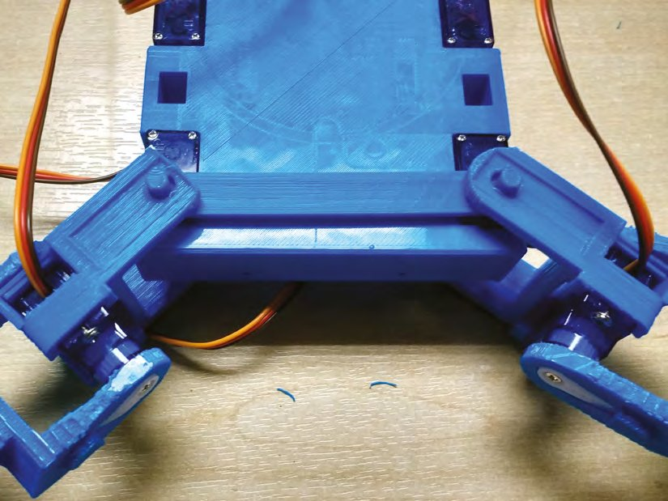

*Brațele servomotoarelor se potrivesc în locașurile din piesele imprimate 3D*

> **PIESELE FOLOSITE ÎN CONSTRUCȚIA NOASTRĂ**
> Piesele folosite la acest robot sunt toate complet standard și ar trebui să fie disponibile din sursele obișnuite pentru makeri. Dacă optezi pentru o placă precum HuaDuino, s-ar putea să trebuiască comandată de peste hotare, dar asta depășește cadrul de aici.
>
> Componentele corpului și ale picioarelor au fost imprimate 3D din PLA. S-ar putea ca unele servicii comerciale de imprimare 3D să ți le vândă gata făcute, dar sunt destul de ușor de imprimat singur. Hackerspace-ul tău local are o imprimantă 3D; du-te și înscrie-te, dacă nu ești deja membru.
>
> Picioarele folosesc opt servomotoare standard SG90, care pot fi cumpărate de la mulți furnizori. Ale noastre au venit de pe Amazon, dar ar fi putut la fel de bine să vină de la HobbyKing sau de la orice alt magazin de piese pentru modelism. Ar trebui să includă toate șuruburile și brațele de servomotor.
>
> Plăcile Arduino Nano și Arduino Nano Shield V3 sunt articole standard, care ar trebui să coste doar câteva lire. Ale noastre erau clone chinezești, nu plăci Arduino originale. Din nou, sunt disponibile de la o varietate uriașă de furnizori; ale noastre erau deja pe masa de lucru. Îți sugerăm să cumperi calitate, dacă poți.
>
> Modulul Bluetooth HC-05 este, la rândul lui, o componentă standard, disponibilă de la mulți furnizori. Al nostru a venit de pe Amazon.
>
> La final, cablurile de legătură sunt de tipul cablu panglică curcubeu, cu socluri DuPont individuale la fiecare capăt. Le vând toți furnizorii obișnuiți; probabil ai deja câteva, dar dacă nu, le vei găsi utile cu mult dincolo de un MiniKame.

Odată ce pinul și servomotorul sunt montate pe piesa coapsei, se poate monta gamba. Glisează pinul în gaura articulației genunchiului, apoi împinge ușor cealaltă parte a genunchiului peste axul servomotorului. Nu monta încă brațele servomotoarelor; avem nevoie ca servomotoarele să se poată mișca liber pentru pasul de calibrare, pe care îl vom face mai târziu.

Corpul nu e cu mult mai mult decât o cutie de plastic cu suporturi pentru cele patru servomotoare care formează articulațiile șoldurilor, care ar trebui să fie destul de ușor de montat și de înșurubat. Potrivește picioarele la colțurile corpului, astfel încât fiecare colț să aibă un picior al cărui ax de servomotor al genunchiului să fie orientat spre exterior. Cu bara de legătură ținută dedesubt, de-a curmezișul robotului, astfel încât pinul ei să fie pe aceeași axă cu axul servomotorului, montează piciorul la fel ca articulația genunchiului, așezând punctul de jos al balamalei pe pin și împingând ușor punctul de sus pe axul servomotorului. Din nou, nu monta încă brațele servomotoarelor. Montează toate cele patru picioare și ghidează toate firele servomotoarelor să se adune în centrul corpului. Asta e tot: ai construit acum ceva ce se recunoaște ca robot MiniKame, deși unul cu picioare moi, pentru că brațele servomotoarelor nu sunt încă instalate.

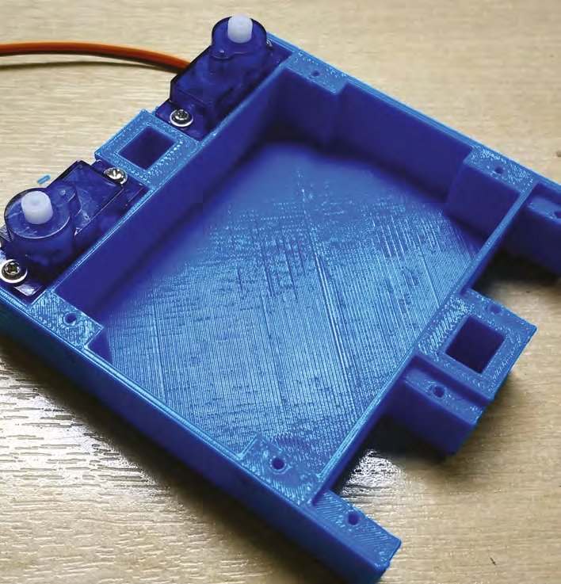

*Servomotoarele coapselor, montate pe corp*

> **CE A MERS PROST?**
> În acest capitol am discutat despre construirea unui robot de jucărie de către un inginer cu ani de experiență în crearea unor dispozitive și sisteme extrem de complexe. Am văzut destule construcții de MiniKame de-a lungul anilor; e o alegere populară pentru că funcționează. În ciuda descrierilor de mai sus, care sună ușor, această construcție s-a dovedit dificilă, plină de probleme și de piedici. E important să îți asumi greșelile și neajunsurile, și e important, dacă nu ai experiență uriașă, să înțelegi că lucrurile merg prost și pentru inginerii profesioniști. Așa că vom trece prin câteva dintre probleme, ca, cu puțin noroc, să le poți evita.
>
> În teorie, imprimarea 3D este o treabă de apăsat un buton, ca la un copiator. În practică, e nevoie de multă grijă și răbdare, și de câteva imprimări ratate. Primul nostru set de picioare MiniKame nu a avut destul material de suport și a ieșit cam lăsat, așa că am mărit suportul și am încercat din nou. Rezultatul a fost o imprimare perfectă, dar suportul suplimentar s-a dovedit foarte greu de îndepărtat. Așa că tălpile noastre au pe dedesubt o rămășiță dezordonată de material de suport dăltuit. E mai bine să recunoști astfel de lucruri.
>
> Citește întotdeauna instrucțiunile. Noi am montat brațele servomotoarelor, apoi a trebuit să le scoatem din nou pentru pasul de calibrare.
>
> Brațele servomotoarelor se pot rupe dacă se aplică prea multă forță. Noi am rupt câteva și a trebuit să tăiem o parte a unui braț dublu ca să facem un înlocuitor.
>
> Modulul nostru Bluetooth a fost extrem de greu de împerecheat cu telefonul. Apărea în lista de dispozitive, apoi dispărea ca prin magie când încercam să ne conectăm. Am pierdut mult timp până s-a conectat în cele din urmă.
>
> Trebuie să recunoaștem, MiniKame-ul nostru a fost capricios. Toate componentele par să funcționeze perfect, și totuși uneori refuză să funcționeze împreună. Ne-am gândit că ar putea fi de vină sursa de alimentare, dar problemele continuă chiar și cu o sursă de laborator. Dacă e o lecție de învățat aici, este să cumperi mereu componente de bună calitate dacă vrei un robot care merge tot timpul, nu doar uneori, și să fii pregătit să nu ai încredere într-o clonă chinezească ieftină de Arduino, care a stat pe masa ta de lucru un an sau așa ceva.

## Punerea în mișcare

Următoarea sarcină hardware este montarea plăcii de control și legarea servomotoarelor. Noi am folosit o clonă de Arduino Nano și o placă de extensie, cu o placă Bluetooth-serial adăugată, pentru că aceasta este configurația de MiniKame cea mai de bază, dar există versiuni de software potrivit pentru multe alte controlere. Cablarea este simplă, placa de extensie a lui Nano oferind conectori numerotați pentru servomotoare, care trebuie legate astfel:

- D2 la servomotorul șoldului din față dreapta
- D3 la servomotorul genunchiului din față dreapta
- D4 la servomotorul șoldului din spate dreapta
- D5 la servomotorul genunchiului din spate dreapta
- D6 la servomotorul șoldului din spate stânga
- D7 la servomotorul genunchiului din spate stânga
- D8 la servomotorul șoldului din față stânga
- D9 la servomotorul genunchiului din față stânga

Modulul Bluetooth se leagă apoi cu patru fire cu socluri la ambele capete: două la pinii de 5 V și GND, iar TX-ul serial al plăcii Nano la RX-ul modulului, și RX-ul la TX.

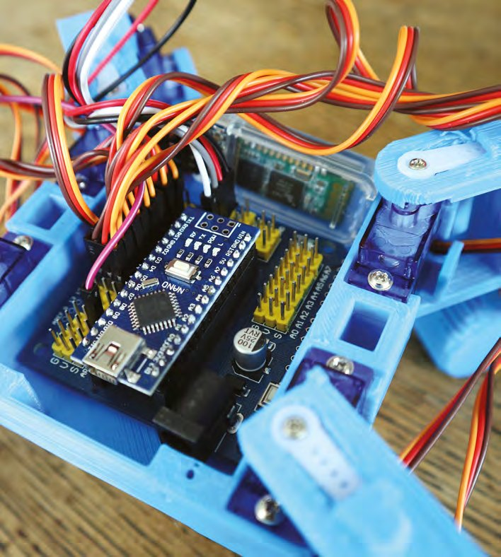

*Nano și shield-ul lui încap frumos în corp. Modulul Bluetooth se vede în fundal*

Mai există o componentă pe care nu am menționat-o încă: sursa de alimentare. Există un număr uriaș de moduri posibile de a alimenta orice proiect Arduino, și aproape toate i-ar putea da unui MiniKame energia necesară. Noi am încercat două metode: robotul nostru a putut funcționa de la o baterie externă de telefon, printr-un cablu USB, sau de la un pachet de baterii AA, prin mufa de alimentare a lui Arduino. Alte opțiuni ar putea fi o baterie LiPo cu o placă de regulator potrivită, sau chiar un cablu lung de la o sursă externă. Merită ținut minte, totuși, că robotului s-ar putea să nu îi placă prea multă greutate; MiniKame-ul nostru a găsit greutatea a opt baterii AA cam mult.

### Software-ul

Suntem aproape gata să instalăm software-ul pe MiniKame, dar mai e un ultim pas înainte de a continua. Implică un alt program, care configurează modulul Bluetooth. Se găsește pe pagina de pe Instructables, dar este arătat și mai jos. Va trebui să folosești Arduino IDE ca să îl încarci pe Arduino Nano și, asigurându-te că modulul Bluetooth este conectat, să resetezi apoi Arduino fără USB conectat și să îl lași să ruleze.

```cpp
void setup() {
  Serial.begin(9600); //change to fit your ble initial baud_rate
  Serial.println("AT+UUID0xDFB0\r"); // uuid
  delay(50);
  Serial.println("AT+CHAR0xDFB1\r"); // characteristic
  delay(50);
  Serial.println("AT+BAUD8\r"); // set baud rate to 115200
}
void loop() {}
```

Software-ul standard pentru un MiniKame vine în două jumătăți: un sketch Arduino pentru robotul în sine și o aplicație pentru telefon. Rezultatul este un simplu robot telecomandat, destul de distractiv, dar adevărata distracție vine din natura accesibilă a programării Arduino. Poți alege să îl folosești ca o jucărie robotică amuzantă, sau poți intra în mintea lui și îi poți modifica software-ul.

Instalarea sketch-ului Arduino final este la fel de simplă ca descărcarea depozitului lui de pe GitHub, dezarhivarea arhivei și compilarea pe Arduino cu Arduino IDE. Între timp, există mai multe aplicații potrivite pentru un Kame în Play Store și în App Store, care pot fi instalate pe dispozitivul tău preferat. Împerechează cu modulul Bluetooth și ar trebui să fii gata să continui.

> **MECANICA MERSULUI**
> Ca să facem cu succes un robot să meargă, trebuie să înțelegem ceva din mecanica mersului, atât structura unui picior, cât și mișcările coordonate ale articulațiilor lui. Una dintre cele mai bune surse vine dintr-un loc neașteptat: nu de la zoologi sau roboticieni, ci de la animatori. Un personaj de desene animate care traversează ecranul trebuie să arate ca o pisică, un câine sau un șoricel antropomorf care stă în picioare, iar una dintre trăsăturile-cheie pe care trebuie să le aibă este să meargă convingător. Astfel, animatorii studiază intens mișcarea de mers, așa că, dacă te interesează mersul, un loc foarte bun de început este o căutare pe web după expresii precum „animation walking tutorial”. S-ar putea să nu ai nevoie să produci mișcarea naturală cerută de animatori, dar înțelegerea secvenței de mișcare a picioarelor unui animal patruped este importantă ca să pricepi cum se poate mișca robotul tău fără să devină instabil.


*Fotograful victorian Eadweard Muybridge a fost unul dintre primii oameni care au studiat în detaliu mișcarea de mers*

Dacă totul a mers bine, ar trebui să ai acum un robot MiniKame cu picioare moi, dar cu tot software-ul și toată cablarea la locul lor. Ultimul pas este calibrarea, adică aducerea tuturor servomotoarelor într-o poziție cunoscută înainte de montarea brațelor. E destul de simplu: pune un fir de legătură între linia D12 a lui Arduino Nano și pinul lui de 3,3 V (ușor de făcut, pentru că pinii respectivi sunt expuși pe placa noastră de extensie pentru Nano), și pornește robotul. Vei auzi servomotoarele mișcându-se în pozițiile lor calibrate; apoi poți opri robotul, scoate firul de pe D12 și instala brațele servomotoarelor.

> *Ar trebui să ai acum un robot MiniKame cu picioare moi*

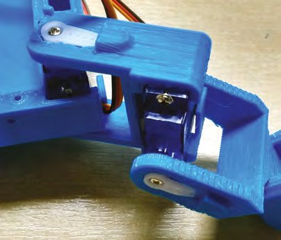

*Brațele servomotoarelor se potrivesc în locașurile din piesele imprimate 3D*

Așază robotul pe orizontală, cu picioarele întinse la 45 de grade față de corp, și fixează cu grijă câte un braț de servomotor cu o singură latură în fiecare locaș. Ar trebui să fie apoi exact destul loc ca să strecori brațul în locaș și să îl împingi pe axul servomotorului, înainte de a-l înșuruba. Dacă ai noroc, ar trebui să ai acum un MiniKame funcțional. Bucură-te de el!

## Mai mulți roboți

*Ți-ai construit primul robot; ce urmează?*

### Câinele care merge al lui Mike

Creat de Mike Rigsby, acest câine ieftin și vesel poate să se plimbe prin curtea ta cu mai puțin de 500 de lire. Mike povestește: „Platformele robotice care merg pot naviga prin clădiri, pot urca scări, pot intra în mașini și pot traversa terenuri agricole. Potențial, pot deveni însoțitori pentru vârstnici sau pot elimina buruienile fără erbicide. Costul excesiv al unei astfel de platforme, de la zeci de mii la milioane de dolari, îi descurajează pe studenți, makeri și startupuri să avanseze tehnologia. Platforma mea deschisă și partajată poate fi construită din piese și materiale care costă sub 600 de dolari.”

„Câinele a evoluat de la o fiară deșirată, care abia putea sta în picioare, la ceva ce acum abia poate merge. Picioarele au fost scurtate, iar articulațiile întărite. Servomotoarele alese reprezintă cel mai mare cuplu pe dolar pe care l-am putut găsi.”

„Sunt scriitor și maker; cel mai bun loc în care poți urmări progresul câinelui (precum și fișierele și instrucțiunile de construcție) este [hsmag.cc/sBBErE](https://hsmag.cc/sBBErE). Cel mai bun clip cu câinele în mișcare se găsește la [youtu.be/kcIfsCcEjcs](https://youtu.be/kcIfsCcEjcs).”

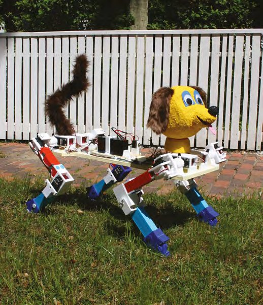

*Nu trebuie să îi pui câinelui tău cap și coadă, dar poți*

### openDog

Vârful roboților care merg trebuie să fie munca ce iese de la Boston Dynamics, după cum am menționat deja. Dar dacă nu ai milioane de dolari de cheltuit pe cercetare și dezvoltare? James Bruton este în plin proces de construire a unui robot patruped open-source, numit openDog, și documentează procesul pe canalul lui de YouTube, ca oricine să îi poată călca pe urme. Până acum l-a costat puțin peste 2000 de lire; poți vedea cu ochii tăi ce poate face robotul la [youtube.com/user/jamesbruton](https://www.youtube.com/user/jamesbruton).

> **NOTA TRADUCĂTORULUI**
> Fotografia robotului openDog din cartea originală este marcată „© James Bruton”, deci nu intră sub licența Creative Commons a cărții; de aceea nu apare în această traducere. O poți vedea pe canalul autorului.

### Nybble

Dacă nu ești un iubitor de câini și ai prefera o pisică robot, Nybble este pentru tine. Corpul ei este făcut din lemn tăiat cu laser, așa că e ușor și ieftin de asamblat. Folosește un microcontroler compatibil Arduino, cu opțiunea de a conecta un Raspberry Pi ca să o faci mai inteligentă, și poate primi date de la senzori încorporați cu ultrasunete, lidar, GPS și nu numai.

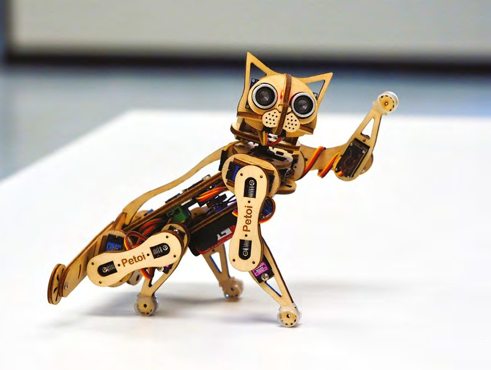

*Exact ca o pisică adevărată, Nybble înțelege comenzile vocale; doar că alege să le ignore*

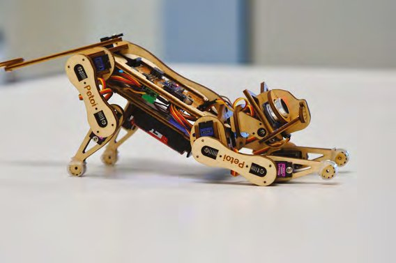

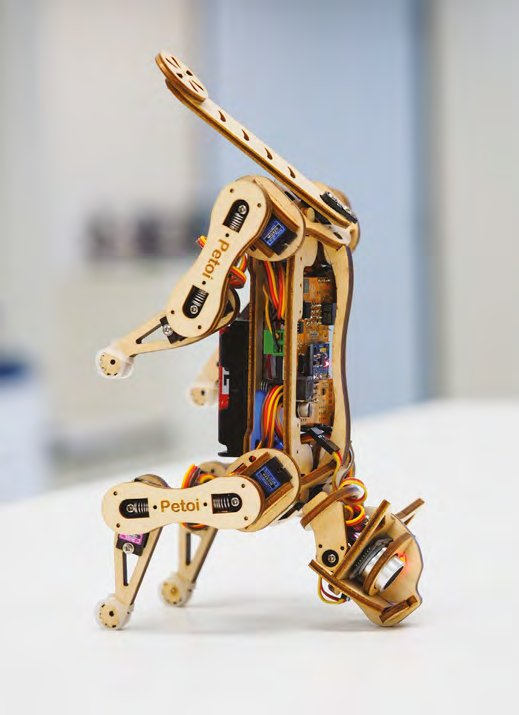

### Marty, robotul

Dacă te simți mai bine urmând un scenariu decât aventurându-te cu propriul design, încearcă asta. Marty este un robot biped care rezolvă problema echilibrului cu o legănare exagerată a șoldurilor și cu tălpi mari și stabile. Unde iese cu adevărat în evidență este accesibilitatea programării lui. Poate fi controlat prin Python, JavaScript și chiar Scratch, așa că e ideal pentru copiii care vor să facă primul pas (la propriu) în lumea androizilor care merg.

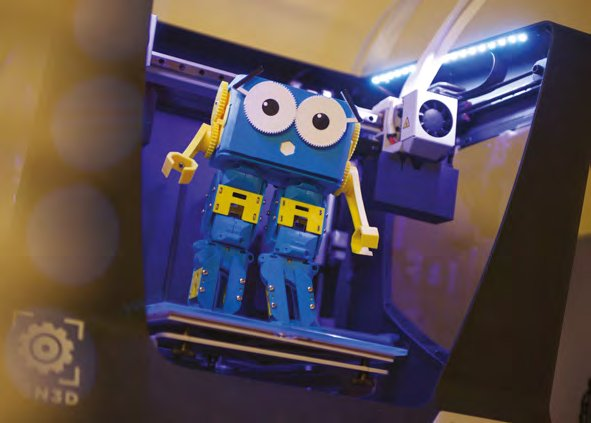

*Un mod ușor de a te legăna la plimbare*

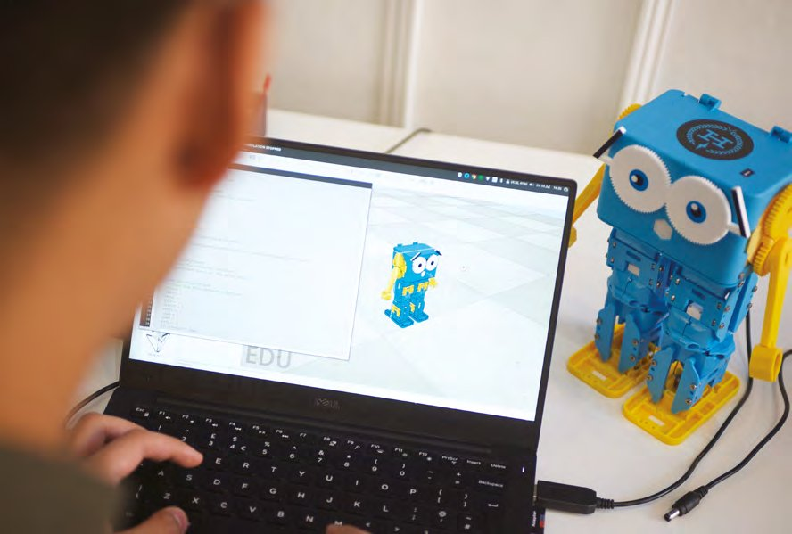

*Marty poate fi programat din Scratch, Python sau JavaScript*
