# Capitolul 22 – Construiește un sintetizator

> *Construiește-ți propriul sintetizator și secvențiator uimitor: generează sunete, secvențiază tensiuni, declanșează porți și cântă de la claviatură*

Nu există nimic în natură care să sune ca un sintetizator clasic. De la munca incredibilă a Deliei Derbyshire la Radiophonic Workshop-ul BBC, care a adăugat SF-ul sintetizatorului temei originale din Doctor Who, până la minimalismul modern al sintetistei și compozitoarei Kaitlyn Aurelia Smith, lăcomia armonică a unui sintetizator este cea care, în mod cât se poate de audibil, dă tonul.

La fel ca și calculatoarele, mașinile care produc sunete au început ca aparate analogice monolitice, care se roteau, trosneau și scânteiau ca să prindă viață. Deși nu foarte mare, unul dintre aceste instrumente timpurii a fost thereminul, o cutie de lemn cu antene extraterestre, care modula un ton atunci când interpretul își mișca mâna, ca un Jedi care dirijează o perturbare a Forței. Iar Robert Moog, construind replici ale thereminului, este cel care a ajutat la definirea a ceea ce este sintetizatorul modern și, cel mai important, a felului în care poate suna.

După ce sintetizatoarele digitale fade au preluat conducerea la sfârșitul anilor 1980 și în anii 1990, sinteza analogică cu o tentă experimentală s-a întors, mai puternică decât oricând. Marii producători, precum Moog, Korg și Roland, construiesc și vând echipamente experimentale, și există o comunitate globală tot mai mare de makeri și hackeri care construiesc și vând propriile componente, kituri și cod, contribuind la o nouă epocă a designului de sunet și a experimentelor DIY. Și exact această lume o vom vizita în paginile următoare, ajutându-te să îți construiești propriul secvențiator și generator de sunet și, sperăm, făcându-te să te lași prins în această lume nouă și curajoasă a designului de sunet, a dronelor și a tonalității. Sau măcar de câteva melodii obsedante à la Brian Eno. Dar înainte să ne grăbim, trebuie să explicăm pe scurt ce sunt exact aceste mașini minunate și cum sunt alcătuite.

> *Sinteza analogică cu o tentă experimentală s-a întors, mai puternică decât oricând*

> **NOTA TRADUCĂTORULUI**
> Schemele electrice ale secvențiatorului și ale oscilatorului din cartea originală (Figurile 1, 2 și 3) sunt creditate explicit lui Sam Battle, „Look Mum No Computer”, și nu intră sub licența Creative Commons a cărții, așa că nu sunt reproduse aici. Le găsești, împreună cu variante actualizate, pe site-ul autorului: [lookmumnocomputer.com](https://www.lookmumnocomputer.com) (proiectele „Arduino Sequencer” și „CEM3340 VCO”). Fără ele nu poți construi modulele, așa că descarcă-le înainte de a începe.

> **CALEA SEMNALULUI**
> Sunetele de sintetizator încep cu un oscilator, pentru că oscilatorul generează semnalul audio brut inițial. Acest sunet trece apoi prin toate celelalte etaje pe care le oferă un sintetizator, înainte de a ajunge la ieșirea finală.
>
> O formă de undă, ca o funcție matematică, are o formă precisă, iar forma cel mai des folosită într-un sintetizator este dinții de fierăstrău. Dinții de fierăstrău arată, previzibil, ca dinții zimțați ai unui fierăstrău. E perfectă pentru audio, pentru că muchiile dure ale formei de undă produc multe armonice. Dinții de fierăstrău sunt, în esență, echivalentul sonor al unei bucăți de lut maleabil, gata să fie modelată și redusă la o infinitate de alte sunete. Alte forme de undă obișnuite în sintetizatoare, inclusiv dreptunghiulară, triunghiulară și sinusoidală, nu sunt la fel de flexibile, dar pot adăuga timbru. Dar următorul etaj este cel care adaugă caracterul: filtrul. Filtrul taie o parte din frecvențele ieșirii bogate în armonice a oscilatorului, și adesea filtrul este cel care dă unui sintetizator sunetul lui definitoriu.
>
> Mai sunt doar câteva alte elemente pe care le poți folosi ca să faci un sintetizator, și ele afectează felul în care sunetul se schimbă în timp. Se numesc modulatoare și există două tipuri obișnuite. Primul este generatorul de anvelopă, folosit pentru a specifica un nivel pentru fiecare etapă în care se cântă un sunet, de la atacul inițial până în momentul în care sunetul este eliberat. Al doilea este LFO-ul, sau oscilatorul de joasă frecvență. Este o versiune mai lentă a oscilatorului folosit pentru a genera sunetul inițial. Frecvența lui va fi, de obicei, prea joasă ca să genereze audio (nu întotdeauna!), dar este folosit pentru a modula amplitudinea, frecvența filtrului sau înălțimea.
>
> Când toate aceste părți separate sunt într-un singur ansamblu, avem un sintetizator modular, și exact asta vom construi. Cele două module ale noastre, un secvențiator și un oscilator controlat în tensiune, ne vor porni sintetizatorul, iar de acolo îl poți extinde.

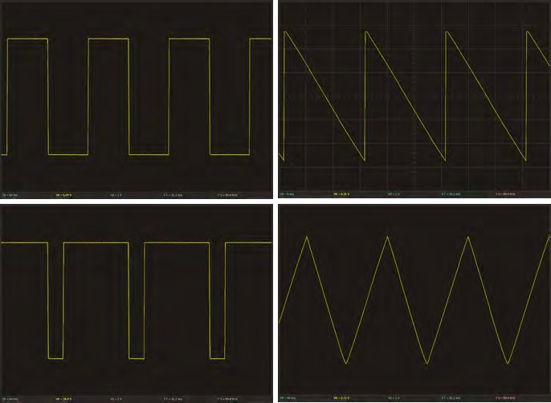

*Aproape orice sunet de sintetizator este alcătuit din una sau mai multe dintre aceste forme de undă. În sensul acelor de ceasornic, din stânga sus: dreptunghiulară, dinți de fierăstrău, triunghiulară și impuls (o undă dreptunghiulară asimetrică)*

## Partea 1 – Construiește un secvențiator

*Construiește-ți propria mașină a timpului à la Vince Clarke*

Sintetizatorul nostru are două părți: un secvențiator și un oscilator controlat în tensiune (VCO). Secvențiatorul este folosit pentru a crea o melodie. Are opt pași, care se cântă unul după altul, înainte de a relua de la început. La fiecare pas există un buton, care stabilește dacă pasul se cântă sau nu, și două butoane rotative (care controlează potențiometre), care reglează notele de cântat dacă pasul este activat. Asta ne permite să programăm melodii simple și să le modificăm în timp ce se cântă.

Secvențiatorul are destul de multe ieșiri și îl poți integra cu alte module de sunet în diverse feluri. Cele mai importante sunt însă CV1 și CV2. Acestea sunt tensiunile de control care pot fi folosite pentru a genera sunete (după cum vom vedea la oscilatorul controlat în tensiune). CV1 ia secvența de pe un rând de potențiometre, iar CV2 ia ieșirea de pe celălalt. Așa poți lega secvențiatorul la două oscilatoare diferite, pentru sunete mai complicate. Nu e nevoie să fie exact această configurație (opt pași și două ieșiri); e doar cea pe care am ales-o noi. Dacă vrei mai mulți sau mai puțini dintre oricare, e în regulă: e sintetizatorul tău. Singurele limite sunt imaginația ta și pinii GPIO ai microcontrolerului (și poți trece la un microcontroler cu mai mulți GPIO, dacă e nevoie).

Toți conectorii de ieșire primesc mufe audio (la fel ca intrările generatoarelor tale de sunet). Le poți lega între ele cu cabluri jack-jack. Aceste cabluri (numite cabluri de patch) sunt folosite pentru a configura sintetizatoarele modulare să scoată sunete diferite. Ele sunt, într-un fel, modul în care programezi sintetizatoarele modulare.

### 1. De ce vei avea nevoie

Înainte să începem, vrem să menționăm câteva lucruri despre acest proiect anume. În primul rând, chiar este destul de simplu și ușor de construit, în ciuda a ceea ce ar putea părea din încâlceala de fire a produsului final. Nu vom crea circuite complicate, cu componente greu de înțeles. Acest secvențiator este, de fapt, opusul unei cutii negre: folosește doar o mână de rezistoare, condensatoare, potențiometre, mufe de intrare și butoane, legate în mare parte direct la pinii lui Arduino, cu doar un cod simplu care le gestionează pe toate. Dar poate deveni ușor și o pânză de interconexiuni, pe măsură ce încerci să legi totul și să faci loc pentru tot ce vrei să încapă. Te sfătuim să iei multe pauze și să nu faci tot proiectul dintr-o dată. Ia-l pe bucăți, apoi lasă-l. Când te simți odihnit, întoarce-te și verifică munca de la pasul anterior. Dacă nu ai făcut greșeli, continuă! Dacă ai făcut, gândește-te să lași pasul următor pentru mâine. Ia-ți timp și bucură-te de proces.

Al doilea lucru important de reținut este că poți, și ar trebui, să schimbi lucrurile pe măsura nevoilor și imaginației tale. În particular, proiectul nostru este gândit să coexiste cu alte module Eurorack, și asta îl face mic. Lipim majoritatea componentelor pe un PCB dublu-strat de 15×9 cm. Dacă acesta e primul tău proiect de lipit, îți recomandăm cu tărie să folosești un format mai mare. La fel, poate vrei să eviți ordinea regimentată a PCB-ului. Formatul PCB e perfect pentru prototiparea unui circuit final, dar are nevoie de fire care se încrucișează ca să facă legăturile.

> **INGREDIENTE**
> - Arduino Nano
> - Un soclu de circuit integrat sau rânduri de pini pentru Nano
> - 14 mufe jack (jack de 3,5 mm pentru Eurorack)
> - 16 potențiometre de 100 kΩ
> - 8 butoane cu apăsare
> - 2 comutatoare basculante de moment
> - 8 LED-uri
> - 35 de diode 1N4148
> - 1 regulator de tensiune 78L05
> - PCB de prototipare sau stripboard
> - 18 rezistoare de 1 kΩ
> - Benzi de socluri mamă
> - Cablu de alimentare Eurorack
> - Panou sau carcasă
> - Șuruburi de montaj
> - Mult fir

### 2. Așezarea pe PCB

E palpitant! Acum ajungi să îți creezi propriul instrument, cu totul unic, care funcționează așa cum vrei tu. Începe prin a aranja temporar componentele pe o masă, ca să găsești o așezare care se potrivește nevoilor și stilului tău. Ca la manipularea oricăror componente electronice, e o idee bună să te descarci mai întâi de electricitate statică. Pentru așezarea noastră ne-am inspirat din minimalism și din utilitarismul muzicii concrete, așa că am ales o abordare pur funcțională: opt LED-uri, două rânduri de câte opt potențiometre și opt ieșiri jack, spațiate egal, și loc pe margine pentru ieșirile, intrările și comutatoarele de control. Ai putea încerca, ca alternativă, să aranjezi potențiometrele și LED-urile în cerc, în arc, într-o grilă 4×4 sau oricum alegi.

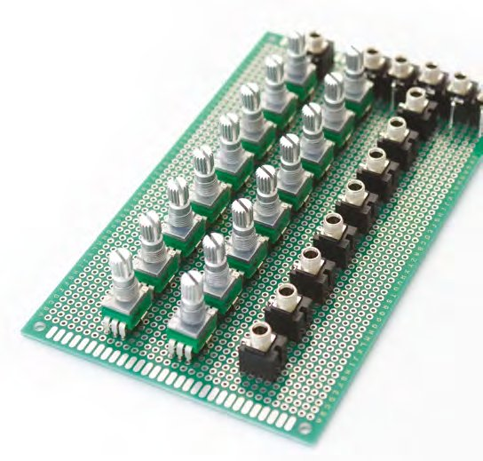

*Începe prin a te juca cu așezarea componentelor, fără să lipești nimic*

Spre deosebire de stripboard, PCB-urile dublu-strat pe care ne vom lipi componentele nu leagă nicio conexiune, așa că va trebui să cablăm sau să lipim totul manual. Trebuie să ții cont de asta când așezi LED-urile, potențiometrele, butoanele și mufele care vor fi legate între ele, sau la aceeași intrare sau ieșire a lui Arduino. Așezând multe dintre componentele adiacente pe orizontală, de exemplu, putem crea ușor o magistrală de masă care să le lege pe toate, apoi putem lega între ele aceiași pași pe coloane și aceleași dispozitive pe rânduri. Dar ajungem la acest pas mai târziu.

Când ți-ai dat seama unde merge fiecare lucru pe PCB, fă toate ajustările necesare și nu te teme să găurești. Noi a trebuit să facem găuri prin PCB pentru butoane și pentru comutatoare, pentru că picioarele lor sunt prea late pentru găurile standard. Acum introdu potențiometrele, mufele și butoanele la locurile lor. Cum pinii se prind prin găurile PCB-ului, ar trebui să își țină pozițiile, chiar și când întorci PCB-ul ca să lipești picioarele. Poți începe apoi prin a lipi câte un singur picior al fiecărei componente. Asta lasă puțină mișcare în poziții atunci când te asiguri că totul este aliniat și că înălțimea la care panoul se va sprijini pe fiecare componentă este aceeași.

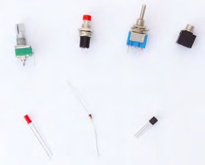

*Vezi lista de ingrediente pentru toate componentele necesare secvențiatorului*

### 3. Lipește aproape tot

În acest punct chiar ar trebui să faci găurile în panoul frontal. Dacă ești înțelept, du-te și fă asta mai întâi, pentru că toate componentele tale sunt încă destul de mobile ca să le potrivești în găurile pe care le faci. Poți lăsa apoi la locul lor cât mai multe componente, mai ales LED-urile, ca să te asiguri că poziția și înălțimea lor sunt perfect aliniate cu panoul. E mult mai greu de făcut mai târziu, când totul e fixat. Noi am mers înainte și am început să lipim, totuși, pentru că am schimbat câteva lucruri în timp ce lucram cu componentele de pe partea din spate a PCB-ului.

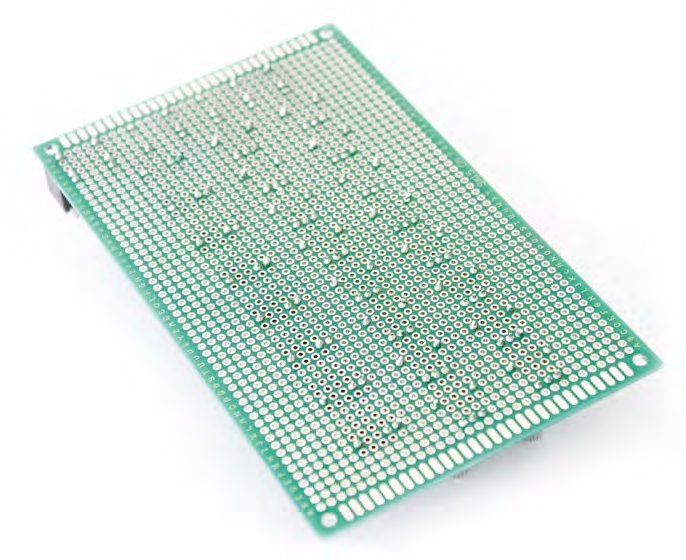

*Ca la toate conexiunile făcute deja, finisajul exterior al lipiturii trebuie să fie lucios, ca să eviți o lipitură rece*

Am lipit în doi pași, începând cu potențiometrele și mufele de intrare, pentru că acestea rămân în PCB când este întors. Un avantaj al lipirii multor componente în linie, așa, este că se lipesc mai repede, ca pe o linie de producție. Dar e și mai ușor de văzut când ceva a mers prost. Una dintre mufele noastre de intrare, de exemplu, avea un picior îndoit sub plastic, lucru ușor de observat lângă toate celelalte.

Asigură-te că toate LED-urile au aceeași orientare. Piciorul lung este plusul, iar cel scurt este minusul; dacă nu e nicio diferență de lungime, ar trebui să existe o margine plată pe plasticul LED-ului, lângă pinul negativ. Acestea sunt și cele mai delicate piese de lipit fără panoul frontal, pentru că nu doar că trebuie să le faci exact la aceeași înălțime, rezolvat prin întoarcerea PCB-ului și așezarea a ceva de înălțime egală sub ele, ci trebuie să te asiguri și că au înălțimea corectă ca să rămână vizibile când montezi panoul pe plăci. Soluția noastră a fost să măsurăm cu grijă, dar e mai bine să le treci prin panoul deja găurit și să lipești de acolo. La fel, butoanele noastre au trebuit lipite individual. Asta pentru că făcuserăm găuri prin PCB ca să le treacă picioarele, dar o bobiță de fludor de fiecare parte a picioarelor, pe spatele PCB-ului, a rezolvat problema.

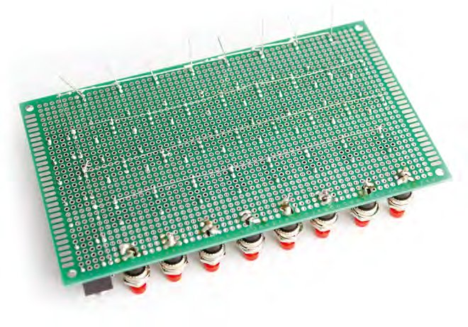

*Trebuie să fii atent ca firul de masă să nu atingă nicio altă componentă*

### 4. Magistrala de masă

Ești acum în punctul în care poți începe să faci circuitul. Poate vrei să te uiți la schema circuitului și să abordezi lucrurile în felul tău, în funcție de așezarea folosită, dar așa a mers pentru noi. Tot merită să consulți schema înainte de fiecare etapă, ca să fii sigur că știi ce se leagă și unde. În particular, trebuie să fii deosebit de atent la diode.

Vom începe cu magistrala de masă. Aceasta șerpuiește peste multe dintre componentele de pe PCB. Am creat cinci bucăți de fir dezizolat, cât lățimea rândului de LED-uri, a ambelor rânduri de potențiometre și a mufelor de gate pentru pași, și peste unul dintre pinii fiecărui buton din ultimul rând. Leagă picioarele negative (scurte) ale LED-urilor la firul lor, al treilea pin al fiecărui potențiometru la al lor, și pinul exterior al fiecărei mufe de gate (de obicei la jumătatea exteriorului carcasei) la firul lor. La final, întinde magistrala de masă a butoanelor și leagă rândurile între ele cu un al șaselea fir dezizolat, care urcă vertical pe una dintre margini. Nu uita, poți ancora orice fir de PCB, dacă e nevoie. Ajută și dacă poți lăsa destul loc pentru celelalte fire despre care știi că se vor lega la ceilalți pini ai potențiometrelor, precum și la mufele și butoanele pe care nu le-am atins încă. La final, asigură-te, cu multimetrul, că fiecare magistrală de masă este legată de celelalte.

### 5. Diodele și rezistoarele de 1 kΩ

Vei adăuga acum o mulțime de diode 1N4148 și de rezistoare, așa că pășește cu grijă și ia-ți timp. Diodele trebuie orientate corect. Începe cu unul dintre rândurile de potențiometre, așezând opt diode de-a lungul PCB-ului, astfel încât capătul fără banda neagră să fie lângă al treilea pin al fiecărui potențiometru. Dacă poți, pune celălalt picior undeva convenabil, ca să le poți uni. Noi am făcut asta împingând dioda de pe partea de sus a PCB-ului, astfel încât ambele picioare să iasă pe partea pe care am lipit totul. Am lipit apoi piciorul dinspre partea fără bandă neagră la fiecare picior al potențiometrului, iar piciorul de lângă banda neagră a fost îndoit la orizontală și lipit de următorul picior de diodă îndoit la fel. Așa am putut lipi toate picioarele dinspre banda neagră, creând o magistrală de-a latul PCB-ului.

Fă la fel cu celălalt rând de potențiometre, creând o magistrală pentru pinii lor cu „bandă neagră”, care se întinde pe lățimea PCB-ului. Ultimul rând de diode nu se leagă între ele și sunt orientate invers, pentru că se vor lega la mufele de ieșire, unde curentul curge în sens opus față de potențiometre. Lipește câte o diodă pe fiecare pin de ieșire al mufei (nu pe masă).

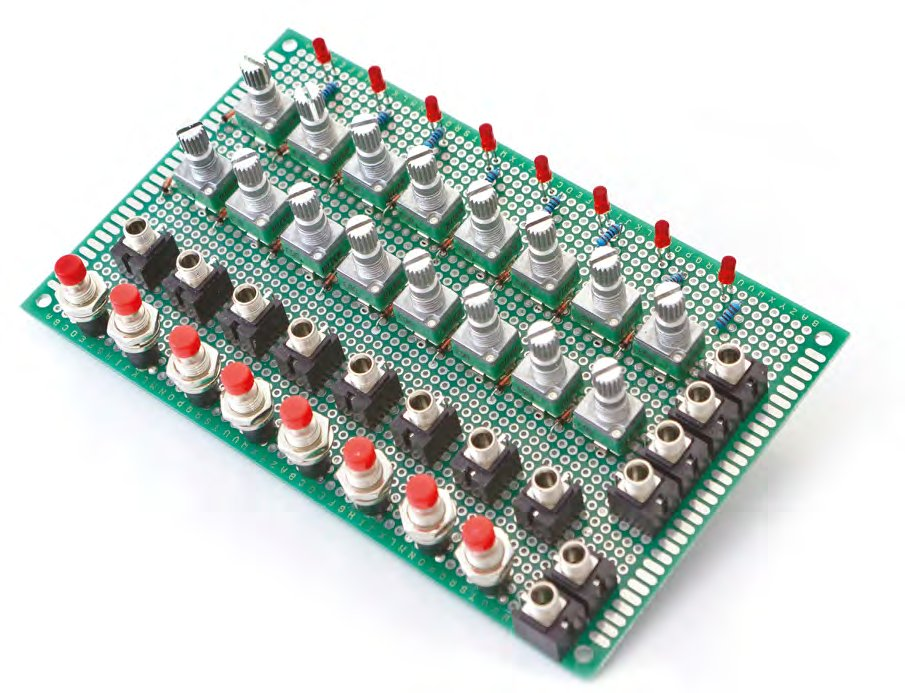

*Ai grijă ca diodele și rezistoarele de 1 kΩ să nu depășească marginea de jos a componentelor de pe panoul de sus*

E acum timpul rezistoarelor; spre deosebire de diode, pe acestea le poți lipi oricum. Introdu-le în PCB lângă piciorul pozitiv al LED-ului (piciorul care nu e legat la magistrala de masă) și, de asemenea, lângă ieșirile jack. Asta ca să poți lipi un picior al rezistorului la celălalt picior al diodelor abia adăugate, în timp ce celălalt picior al rezistorului se leagă la piciorul celui mai apropiat potențiometru din fiecare coloană. La final, adaugă încă trei rezistoare de 1 kΩ la cele două mufe de ieșire CV și la ieșirea de gate a claviaturii, lângă fiecare rând de potențiometre, și leagă ultimele trei diode la un pin al mufelor de intrare pentru înainte, înapoi și reset.

> *Tot merită să consulți schema circuitului înainte de fiecare etapă*

### 6. Legarea coloanelor

Trebuie acum să legi între ele părțile active ale fiecărei coloane-pas, ca să poată fi controlate în cele din urmă de ieșirea de pas a lui Arduino. Pentru asta, taie 16 bucăți scurte de fir și opt bucăți lungi. Fiecare coloană va folosi trei fire. Primul fir scurt leagă între ei pinii al treilea ai fiecărui potențiometru, legat direct la același pin ca rezistorul de pe potențiometrul de jos. Al doilea fir scurt leagă pinul al treilea al potențiometrului de sus la rezistorul de 1 kΩ atașat LED-ului din acea coloană, legând efectiv fiecare coloană laolaltă. Al treilea fir, cel lung, se leagă în orice punct al acestei „magistrale de coloană” și va trebui să ajungă până la placa Arduino. Ca să faci cablurile, dezizolează fiecare capăt și „cositorește-l” cu fludor. Se face atingând capătul de vârful ciocanului de lipit și de o bucată de fludor în același timp, astfel încât puțin fludor să se prindă de capătul cablului. Asta face lipirea îmbinării mult mai ușoară.

### 7. Conectorul pentru Arduino

Ca să poți lega lucruri la Arduino Nano, trebuie să începi lucrul la placa pe care vor sta Nano și sursa de alimentare. Noi am pus Nano pe un PCB separat și, esențial, l-am gândit să fie pe soclu. Înainte să ne apucăm de placă, a trebuit să lipim benzi de pini pe Nano (deși Nano-ul tău poate avea deja pinii lipiți). Pentru asta, încălzește puțin un pin de la colț, apoi atinge cu fludor. Ar trebui să se topească și să intre imediat în gaură, înconjurând pinul și ținând rândul de pini la locul lui.

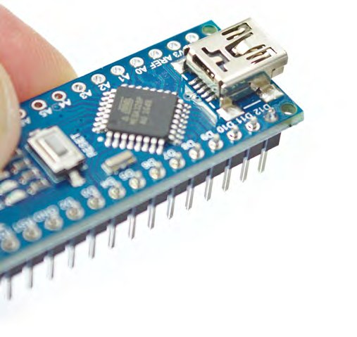

*Lipirea pinilor pe Arduino Nano*

Trebuie să fii un pic atent când lipești pinii pe un Arduino, pentru că se transferă căldură direct în electronică. Dacă ai îndoieli, mergi mereu în pași mici, încălzind și lipind cu blândețe, în loc să încerci să te grăbești. Când lipești rânduri lungi de pini, poate fi mai ușor să lipești un pin de la un capăt și apoi unul de la celălalt, ca să te asiguri că e drept. Așa încă mai poți manipula rândul în poziția corectă. Când ești mulțumit că totul e drept, lipește toți pinii dintre ei.

Trebuie să faci apoi ceva asemănător pe al doilea PCB, mai mic, ca să creezi un soclu pentru Arduino. Noi am folosit două benzi de socluri mamă, tăiate la lungimile corecte și lipite pe PCB. E mai ușor cu Arduino conectat la cele două benzi, dar, din nou, ai grijă să nu încălzești pinii prea mult, ca să protejezi Arduino.

### 8. Adăugarea alimentării

Cu Arduino pe soclu și gata de montat pe PCB-ul mai mic, trebuie acum să adaugi alimentarea pentru întregul proiect. Cum faci asta depinde, evident, de felul în care intenționezi să alimentezi secvențiatorul. Cel mai simplu e, de fapt, să nu faci nimic și să folosești conexiunea USB a lui Arduino pentru alimentare. E suficient ca să ruleze întregul secvențiator și Arduino. Totuși, o soluție mai permanentă este alimentarea externă, și putem folosi ușor alimentarea livrată printr-o magistrală de alimentare Eurorack, pe care o vor folosi și celelalte module.

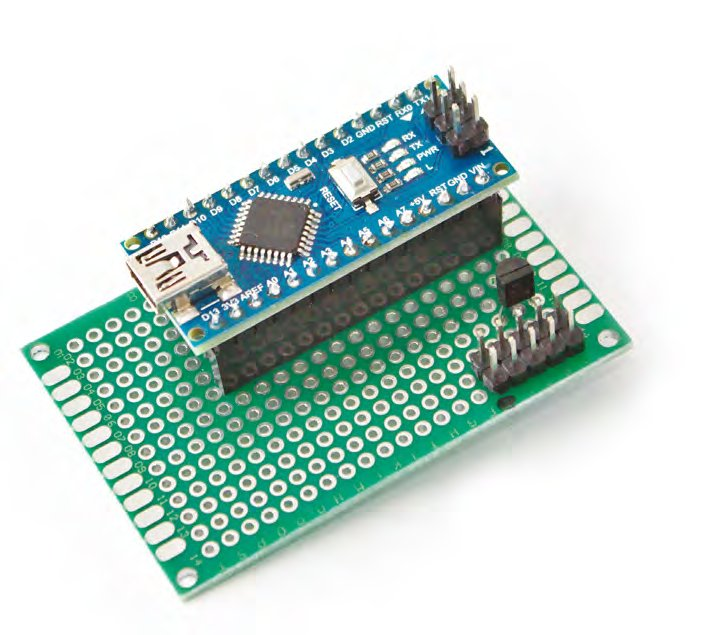

*Conexiunile de masă și alimentare la regulator și la Arduino se fac cu fire scurte, pe partea de dedesubt a PCB-ului*

Conectorul mic tipic de alimentare Eurorack are zece pini, pe două coloane de câte cinci. Fiecare rând e identic și poartă, în ordine, +12 V, GND, GND, GND și -12 V. Trebuie să creăm un rând de pini pentru acest conector pe PCB, apoi să facem o legătură de la +12 V și de la una dintre mase la un regulator de tensiune, care stă între alimentarea care intră și alimentarea și masa pe care le legăm la Arduino. Alimentarea secvențiatorului va lua pur și simplu 5 V și GND direct de la Arduino.

Începe prin a crea rândul de zece pini pentru alimentarea Eurorack. Ar trebui să fie ușor, după ce tocmai ai făcut același lucru pentru Arduino. Pune și regulatorul 78L05 pe PCB și leagă alimentarea la pinul de jos al formei de „D” a regulatorului, iar masa la pinul din mijloc al regulatorului. De acolo, pe partea de dedesubt a PCB-ului, ia alimentarea de la regulator și leag-o acolo unde pinul „VIN” al lui Arduino se va lega la conector, și fă la fel ca să legi masa de la regulator la GND-ul de lângă VIN de pe Arduino. Asta e tot.

### 9. Butoane, comutatoare, mufe, potențiometre și LED-uri

Vom lega acum fiecare pas, toate butoanele și diversele mufe și comutatoare rămase la Arduino, așa că va fi mult fir. Magistrala butoanelor, creată mai devreme, care este izolată de tot restul PCB-ului, va purta cei 5 V de la Arduino, la fel ca pinii din mijloc ai ambelor comutatoare de moment. Ca la toate conexiunile cu Arduino, luăm câte un fir de pe PCB-ul principal spre partea de dedesubt a PCB-ului cu Arduino. Ar fi mai ordonat dacă am ghida toate aceste fire spre un conector separat și am folosi apoi un cablu panglică ca să le legăm, dar lăsăm asta ca exercițiu. Acum că vedem cât spațiu este pe PCB, introducem și cele două comutatoare în dreapta sus a PCB-ului. Ar putea fi lăsate la fel de bine libere, prinse doar de panoul frontal. E important să fie comutatoare de moment, ceea ce înseamnă că nu rămân în poziție. Apasă-le o dată ca să mergi înapoi, și în cealaltă direcție ca să mergi înainte.

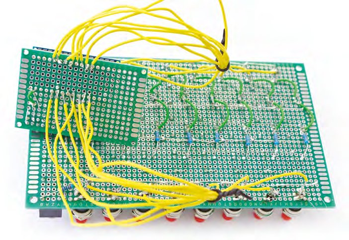

*Dacă ai timp și spațiu, ar fi mai bine să folosești patru conectori și două cabluri panglică pentru a lega PCB-ul principal la Arduino*

Magistrala de masă trebuie legată acum la partea de dedesubt a pinului GND de pe Arduino. E un moment bun să verifici din nou continuitatea, asigurându-te că multimetrul scoate un sunet când un conector e pe GND-ul lui Arduino și celălalt pe oricare dintre magistralele de masă create pe PCB.

Pregătește acum douăsprezece cabluri și lipește opt de la fiecare buton, înainte de diodă, la pinii A0 până la A7 de pe PCB-ul cu Arduino, de la stânga la dreapta. La fel, lipește cele opt cabluri atașate mai devreme la coloanele de LED-uri, potențiometre și mufe la D9 până la D2 pe Arduino, de la stânga la dreapta. Leagă acum mufa de reset la o parte a unui comutator și de la comutator la D10 pe Arduino. Cealaltă parte a comutatorului trebuie legată la D11. Pentru ultimul comutator, leagă o parte la mufa de intrare „înainte” și cealaltă parte la mufa de intrare „înapoi”, legând și partea „înainte” la D12 și partea „înapoi” la D13, pe partea opusă a lui Arduino.

### 10. Găurirea carcasei

Am făcut multe lucruri greșit la acest pas. În primul rând, și cel mai important, ar fi trebuit să îl facem mai devreme, înainte de a lipi totul permanent. Nu am făcut-o pentru că încă inventam așezarea din mers. În al doilea rând, am făcut găuri într-un panou de aluminiu cu o mașină de găurit ținută în mână. Merge, dar nu dă cele mai profesioniste rezultate. Dacă ai acces la o mașină de găurit cu coloană, folosește-o.

Cum am așezat cu grijă toate componentele pe un PCB, poți duplica ușor așezarea pe o foaie de hârtie milimetrică. Noi am făcut asta și am trasat locurile unde aveam nevoie de găuri pe o bucată de carton, pe care am străpuns-o apoi ca să facem găuri și să marcăm panoul de aluminiu pentru găurit.

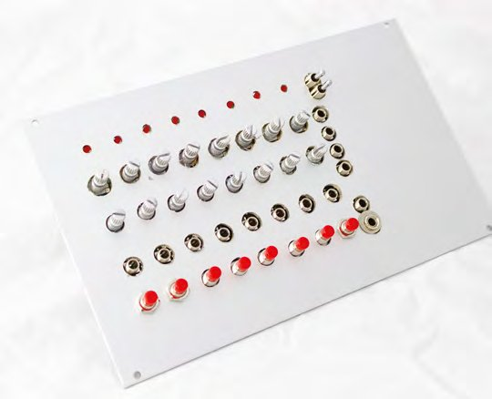

*Dacă îți pui secvențiatorul într-un rack, gândește-te să scoți în exterior un prelungitor USB, ca să poți programa în continuare Arduino*

### 11. Programează Arduino și dă-i drumul!

Trebuie să descarci Arduino IDE pentru sistemul tău de operare ([hsmag.cc/OYiLpN](https://hsmag.cc/OYiLpN)). Leagă Nano la portul USB, apoi deschide codul acestui proiect ([git.io/fpz1h](https://git.io/fpz1h)), alege Arduino Nano ca dispozitiv, alege portul USB la care e legat și apasă „Upload”. Ești gata acum să introduci Arduino în secvențiator! Pune Arduino la locul lui, apoi adaugă alimentarea. Cu puțin noroc, nu ar trebui să vezi nimic. Încearcă să apeși un buton. LED-ul lui se va aprinde. Dacă legi ieșirea de gate la un oscilator sau la o sursă de sunet, ar trebui să declanșeze un sunet. Leagă ieșirile CV1 sau CV2 la înălțimea oscilatorului și acesta va cânta orice înălțime e reglată din potențiometru. Dacă ai o sursă de ceas, leag-o și secvențiatorul va începe să treacă prin coloane, una câte una.

Dacă lucrurile nu merg, nu te descuraja. Proiectele funcționează rareori perfect de prima dată. Dacă un LED e sărit, asigură-te că toate LED-urile sunt legate corect. Dacă lucrurile clipesc și pâlpâie, caută conexiuni scurtcircuitate. Și lasă-l până a doua zi. Cu mintea proaspătă, orice greșeală va fi evidentă și te vei putea bucura de noul tău secvențiator și sintetizator modular.

## Partea 2 – Construiește un oscilator controlat în tensiune

*Ai construit secvențiatorul; acum trebuie doar să construiești ceva care să scoată un sunet*

### 1. De ce vei avea nevoie

Acest proiect nu e la fel de complex ca secvențiatorul și e mai ușor de pus cap la cap. Totuși, în formatul pe care îl folosim, e mai migălos de lipit toate conexiunile.

Cea mai importantă parte a construcției, și cea mai palpitantă, este cipul care generează sunetul. Este venerabilul Curtis CEM3340, un cip care a deschis calea producției de masă a sintetizatoarelor analogice. A fost folosit în multe clasice, inclusiv Memorymoog, Oberheim OB-8, Roland SH-101 și Sequential Circuits Prophet 5 (rev 3). Motivul pentru care cipul a fost atât de revoluționar atunci este același pentru care îl folosim acum. Este un VCO complet de sine stătător, care generează mai multe forme de undă și are nevoie de foarte puține componente suplimentare ca să funcționeze într-un circuit. Înainte de CEM3340, un VCO trebuia construit din multe piese diferite și greu de găsit, mai ales când aveai nevoie să sune la fel și să rămână acordate. Folosind un CEM3340 adevărat, obținem exact același sunet-sursă ca acele sintetizatoare vechi, iar dacă cipul original e prea scump (de obicei în jur de 12 £), există replici care fac același lucru la cam jumătate de preț.

> *Folosind un CEM3340 adevărat, obținem exact același sunet-sursă ca acele sintetizatoare vechi*

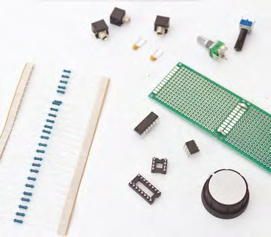

*Iată majoritatea lucrurilor de care avem nevoie ca să construim oscilatorul. E migălos, dar nu sunt prea multe piese*

> **INGREDIENTE**
> - 3 mufe jack (jack de 3,5 mm pentru Eurorack)
> - Un trimer de 10 kΩ, sau un potențiometru, pentru acces de pe panoul frontal
> - Un potențiometru de 100 kΩ
> - Un amplificator TL072
> - Cablu de alimentare Eurorack
> - VCO: CEM3340, sau copia AS3340
> - Socluri de circuit integrat: 1 cu 8 pini, 1 cu 16 pini
> - Stripboard punctat de 46×24 sau PCB
> - Rezistoare: 2 × 100 kΩ, 2 × 470 Ω, 1 × 620 Ω, 1 × 1,8 kΩ, 1 × 5,6 kΩ, 1 × 24 kΩ, 1 × 1,5 MΩ
> - Condensatoare: 1 × 1 nF, 1 × 10 nF
> - Un buton rotativ pentru potențiometru
> - Mult fir

### 2. Soclurile

Cum VCO-ul este cea mai valoroasă parte a construcției, și cea mai sensibilă la deteriorarea electrostatică, îl vom așeza într-un soclu. Asta face cipurile ușor de înlocuit și înseamnă și că putem lipi soclul, și pinii soclului, fără cipul montat, protejând cipul de căldură. Vom face la fel și pentru TL072, folosit pentru condiționarea ieșirii. Am poziționat soclurile în centrul PCB-ului, pentru că vom adăuga componente de fiecare parte. Asigură-te că crestătura fiecărui soclu e orientată în sus; așa putem orienta cipurile în circuit când le montăm.

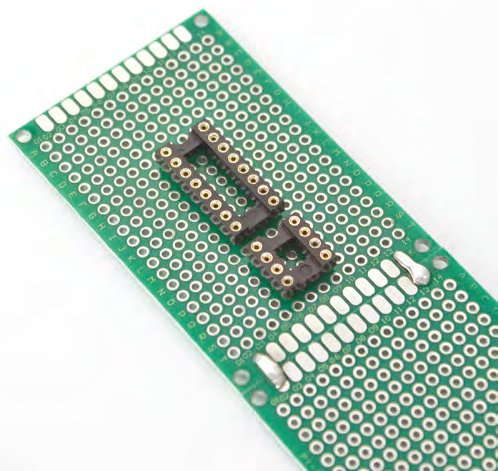

*Nu introduce cipurile în socluri până la finalul procesului de construcție*

Ca să lipești soclurile, atinge cu fludor pinii din colțurile opuse, ca să ții soclurile la locul lor, apoi lipește toate punctele dintre ele. Cum vom folosi ambele fețe ale PCB-ului, va trebui adesea să facem punți între conexiunile adiacente de la pinii soclului, lucru de care merită să ții cont când începi să adaugi componente și fire. Uită-te la unii dintre pașii de mai târziu ca să vezi cum am ghidat firele în jurul cipurilor și al picioarelor pinilor, și ține asta în minte când creezi conectorul de alimentare.

Acest pas va fi diferit dacă vrei să îți alimentezi modulul de la o baterie sau de la altă sursă; spre deosebire de secvențiator, care poate fi alimentat și prin conexiunea USB a lui Arduino. Noi folosim o sursă Eurorack standard. Aceasta are nevoie de opt pini pe PCB, cu +12 V livrați perechii de sus, -12 V perechii de jos, și masa (GND) în secțiunea din mijloc. Îi putem folosi direct cu VCO-ul. Conectorul se creează la fel ca la secvențiator: tai două rânduri de câte opt pini, le pui într-un cablu de alimentare Eurorack și apoi le lipești prin PCB, asigurându-te că conectorul e pe aceeași parte ca PCB-ul.

### 3. Potențiometre și mufe

Să începem cu componentele mari, pentru că vrem să ne asigurăm că încap pe PCB înainte de a atașa multele fire. Sunt două potențiometre, unul folosit pentru a seta înălțimea oscilatorului, celălalt pentru a-l acorda, și cele trei mufe. O mufă va primi o tensiune de intrare, ca înălțimea să poată fi controlată, iar celelalte două scot formele de undă dinți de fierăstrău și triunghiulară de la CEM3340. Acestea merg pe partea opusă a PCB-ului față de cipuri și conectorul de alimentare. Așa sunt prezentate spre panoul frontal, în timp ce cipurile și conectorul de alimentare rămân accesibile din spate. Merită să ții mufele pe același rând, pentru că va trebui să le legăm pinii de masă între ei, de obicei cu un fir de-a lungul tuturor pinilor de sus.

Asigură-te că pinii nu sunt prea apropiați ca să poată fi lipiți și că nimic nu va fi acoperit de elementele de pe panoul frontal. Potențiometrul nostru de 10 kΩ a avut nevoie și de scurtarea picioarelor de ancorare, ca să încapă prin PCB. Cu totul la locul lui, trebuie doar să atingi ciocanul de lipit de puțin fludor și de pini, ca să le lipești.

### 4. Controlul masei

Ne vom ghida strâns după schema circuitului, ca să nu ratăm nicio conexiune sau componentă. Poate ți se pare util să bifezi fiecare pe măsură ce le faci. De asemenea, nu uita că stripboard-ul are rândurile orizontale conectate implicit, ceea ce nu e cazul pe PCB. Asta înseamnă că trebuie să te asiguri că tot ce e pe un rând este interconectat, fie cu un fir, fie lipind peste găurile adiacente. Dar înainte să ajungem la această etapă, trebuie mai întâi să le dăm mufelor o legătură la masă.

Toate conexiunile GND vor veni de la oricare dintre pinii din mijloc ai conectorului de alimentare. Conectorul e pe partea din spate, opusă potențiometrelor, care e și partea pe care vrem să lipim conexiunile. Asta creează o situație ușor delicată, în care trebuie să lipim o gaură adiacentă unui pin, să facem punte până la pin și să ne asigurăm că fludorul trece prin gaură pe cealaltă parte a PCB-ului, de unde putem lipi un fir spre destinație. Sună mai greu decât este. Trebuie să facem asta mai întâi pentru conexiunea de masă, aducând o legătură GND de la conectorul de alimentare pe partea din spate a PCB-ului, ca să putem lipi un fir la pinii de masă ai mufelor de intrare și ieșire. Noi am făcut asta în două etape, mai întâi legând pinii de masă între ei cu o bucată de fir gol, apoi legând acest fir la conexiunea de masă. Deși nu e în schema originală, am legat masa și la al treilea pin al fiecărui potențiometru.

### 5. Cipuri și pini

Trebuie acum să parcurgem toate conexiunile de pe placă. Vei avea nevoie de circa 20 de bucăți de fir în total, dar toate de lungimi ușor diferite. Nu uita să „cositorești” mai întâi fiecare capăt dezizolat cu puțin fludor.

Ca strategie generală, nouă ne-a fost mai ușor să începem cu partea stângă a cipurilor, pe partea din spate a PCB-ului, lucrând în sus de la mufa de intrare CV. Ia-ți timp să vezi unde trebuie făcute conexiunile și mergi pas cu pas, urcând de la mufa de intrare.

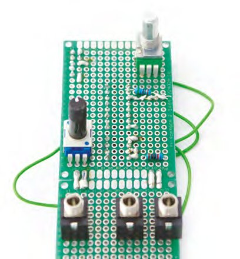

*Ar fi plictisitor să acoperim fiecare conexiune în acest tutorial. E mai ușor să parcurgi metodic fiecare fir și rezistor din schema circuitului*

Conexiunea de -12 V de la sursă se leagă la pinul din stânga jos al soclului TL072. Este pinul 4. Numerele pinilor de pe cipuri merg din stânga sus, care e mereu pinul 1, în jos pe partea stângă, apoi continuă din dreapta jos spre dreapta sus, care e pinul 8 pe TL072 și pinul 16 pe CEM3340. Trebuie să faci punte și între pinii 1 și 2 ai soclului TL072, ceea ce poți face direct de la pinii de pe partea din față a plăcii. Va trebui să faci punte și să lași fludorul să curgă și pentru conexiunea mufei și pentru primul rezistor, cel de 620 Ω, care leagă acest pin la pinul 3 al CEM3340. Continuă așa pentru cele trei rezistoare din partea stângă, plus trimerul și ieșirea de dinți de fierăstrău, care va trebui legată la pinul opus masei de pe mufa folosită pentru ieșirea de dinți de fierăstrău.

### 6. Alimentare și condensatoare

Partea stângă a PCB-ului e completă când pinul 3 al CEM3340 e legat la un picior al trimerului, iar pinul 1 (prin rezistorul de 24 kΩ) e legat la celălalt picior. Cum am menționat, trimerul nostru avea trei picioare, și l-am legat pe al treilea la masă. E acum timpul să abordăm partea dreaptă a circuitului, și e tot mai mult din același lucru, deși cu o densitate mai mare de componente și fire. Pinii 6 și 7 de pe TL072 sunt puși în punte, iar pinul 7 se leagă la vârful mufei de ieșire triunghiulară. Pinul 5 se leagă apoi la pinul 10 al CEM3340. Cea mai înghesuită lipire este de la pinul 15 al CEM3340, lângă dreapta sus a cipului. Acest pin trebuie legat la două rezistoare de 100 kΩ, la rezistorul de 470 Ω, la o conexiune de la +12 V a conectorului de alimentare și la ieșirea spre pinul 3 al potențiometrului de acord grosier. A le lipi ordonat a fost aproape imposibil pe PCB-ul nostru mic, dar fiecare pin al rezistorului poate fi lipit împreună sau folosit ca punte pe o porțiune orizontală a PCB-ului, pentru celelalte conexiuni.

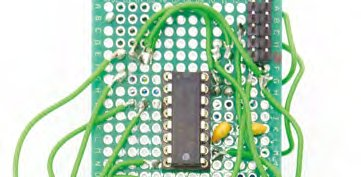

Ia-ți timp și fă fiecare conexiune pe rând. Sunt mult mai puține de făcut decât la secvențiator, și de obicei e destul loc când începi să lipești picioare împreună.

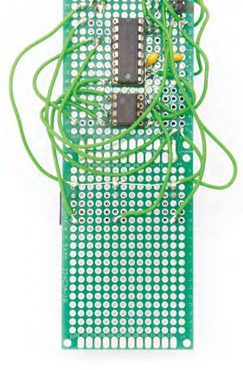

*Ne-a fost mai ușor să împingem condensatoarele prin partea cu soclurile și cipurile*

### 7. Cipuri și alimentare

Odată ce totul e lipit, poți introduce cele două cipuri în socluri. Cipurile noi au picioarele ușor prea depărtate ca să intre în soclu. E normal, și trebuie să folosești o lamă, sau ceva cu o muchie dreaptă, ca să îndoi puțin ambele laturi spre interior. Când apeși cipurile, asigură-te că crestătura cipului e aliniată cu crestătura soclului. Dacă vreun cip nu are crestătură, caută un cerc lângă unul dintre pinii de colț; el marchează pinul numărul 1 și trebuie orientat în poziția din stânga sus a soclului.

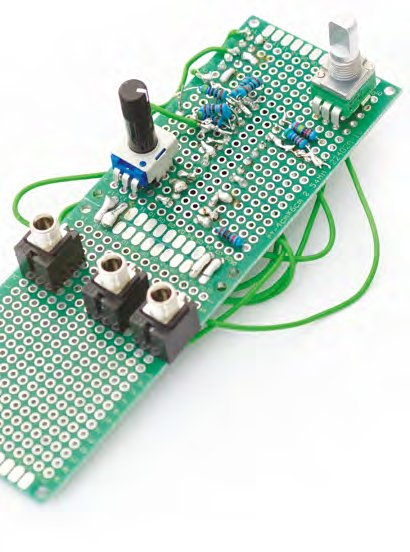

*Dacă trebuie să scoți cipul, folosește o unealtă de plastic ca să ridici cu grijă un capăt, apoi pe celălalt*

Ești gata acum să vezi dacă oscilatorul funcționează. E cel mai palpitant pas; dacă nu merge, deconectează alimentarea și uită-te la circuit. Ca să testezi oscilatorul, leagă alimentarea, asigurându-te că dunga roșie a cablului Eurorack e orientată în jos, unde trebuie să fie -12 V. Leagă ieșirea de dinți de fierăstrău la un mixer sau la o intrare audio de PC, sau la ceva ce poți asculta. Acum pornește-l. Există șansa să nu auzi nimic. Trebuie mai întâi să folosești potențiometrul de acord ca să aduci înălțimea în gamă. Încearcă să îl parcurgi până auzi ceva, chiar și o bufnitură ocazională puternică. De îndată ce obții un sunet, folosește butonul de înălțime ca să reglezi un ton. Felicitări: tocmai ți-ai construit propriul oscilator clasic!

### 8. Testarea și panoul frontal

Oscilatorul va genera un ton constant, cu înălțimea setată fie de potențiometrul de „pitch”, fie de o tensiune de control primită pe mufa de intrare de pitch. Intrarea CV se folosește pentru a cânta note, iar potențiometrul de pitch poate fi apoi folosit pentru a controla notele de bază de la care intrarea CV se abate. Acordarea standard pentru aproape orice modul și claviatură Eurorack este de 1 V pe octavă, ceea ce înseamnă că cele douăsprezece semitonuri dintr-o octavă sunt împărțite pe o creștere sau scădere de un volt. Și partea grozavă a CEM3340, motivul pentru care nu am avut nevoie de circuite mai complicate, este că și el urmărește înălțimea la 1 V pe octavă. Legând una dintre ieșirile CV ale secvențiatorului la intrarea CV a oscilatorului, poți crea acum propriile secvențe.

Nu mai rămâne decât să creezi panoul frontal. Asta va depinde în întregime de felul în care îți vei folosi VCO-ul. Noi am păstrat, șiret, loc lângă panoul frontal al secvențiatorului, ca ambele module să poată fi montate în aceeași unitate, așa că nu a trebuit decât să facem cinci găuri noi pentru potențiometre și mufe. Ca în ambele proiecte, scopul nostru a fost să creăm un motor de sunet care sună grozav și e util. Când prinzi VCO-ul lângă secvențiator și le legi între ele, vei avea un proto-sintetizator puternic și capabil, din care poți crește în aproape orice direcție, și care deja sună absolut fantastic.

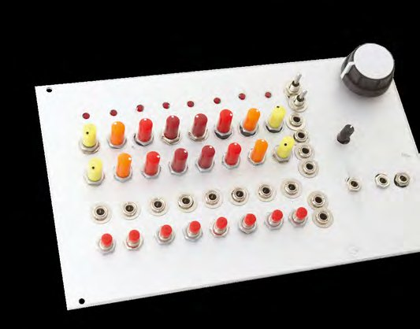

*Iată modulul finalizat, montat lângă secvențiator. Singura treabă rămasă e vopsirea panoului, ca să nu se vadă zgârieturile!*

## Partea 3 – Mai departe cu sintetizatoarele

*Acum că te-ai molipsit, petrece următorii zece ani construindu-ți studioul perfect*

Cu un secvențiator și un VCO, ai acum ceva ce poate fi folosit pentru a face muzică uimitoare, chiar și doar trimițând înălțimea din secvențiator în oscilator. Asta au făcut Kraftwerk, iar Wendy Carlos avea doar câteva oscilatoare în plus când a interpretat Switched-On Bach. Dar acesta e doar începutul, și sperăm că te-ai molipsit de dorința de a duce ambele proiecte mai departe și de a-ți extinde noul „studio” în ceva cu mai multe posibilități.

### Alimentează-ți instalația

Dacă rămâi la Eurorack, și ar trebui, vei avea nevoie de o sursă de alimentare Eurorack. Le poți cumpăra, evident, împreună cu rack-urile care îți țin modulele, dar poate vrei să îți construiești una singur; și cu doar 10 £, poți. Kitul Frequency Central Power DIY ([hsmag.cc/oNEViK](https://hsmag.cc/oNEViK)), recomandat de Look Mum No Computer, este perfect pentru a crea +/-12 V, ~100 mA la 5 V dintr-o sursă de 12 V curent alternativ. Vei putea apoi să îți legi modulele direct la aceeași sursă și să adaugi module noi cu ușurință.

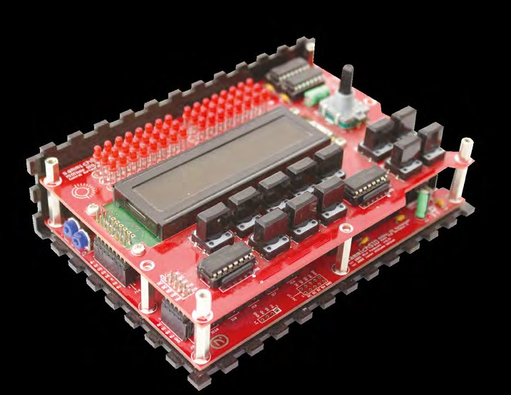

*Recuperează sunetul vechii tale console de jocuri sau al vechiului calculator, transformându-l într-un sintetizator*

Abia am atins potențialul cipului Curtis CEM3340. În particular, el poate genera și forme de undă impuls și dreptunghiulară, fără prea multe circuite în plus. Din punct de vedere tehnic, ambele forme sunt generate, de fapt, din aceeași sursă, pentru că „lățimea” formei dreptunghiulare poate fi modulată printr-o altă intrare de control în tensiune. La o lățime de 95%, de exemplu, forma de undă e un impuls ascuțit, în timp ce la 50% e jumătate sus și jumătate jos, adică forma undei dreptunghiulare. Schimbarea acestui procent se numește modulație în lățime de impuls (PWM) și e o altă sursă clasică de sunet de sintetizator, uimitoare pentru bas ca undă dreptunghiulară, uimitoare împreună cu dinții de fierăstrău când e mai aproape de impuls, și uimitoare când reglezi cantitatea de PWM cu o tensiune de intrare.

Dacă nu ai chef de lipit în plus, partea grozavă a proiectului cu secvențiatorul e că e construit în jurul unui Arduino, ceea ce înseamnă, desigur, că îi poți schimba funcționalitatea prin cod, fără să schimbi nimic din hardware. Așa îl poți face cu adevărat unic și specific nevoilor tale. Ai putea adăuga un mod cu pași aleatorii, de exemplu, sau un ritm cu swing, ca ceasul să nu fie atât de regimentat. Poți schimba și funcțiile comutatoarelor, mai ales că cele de înainte și înapoi pot fi inutile dacă folosești ambele intrări de ceas. Comutatoarele ar putea fi folosite chiar pentru a schimba între diverse moduri de redare ale secvențiatorului, și ai putea arăta ce mod sau preset folosești, deturnând pe scurt LED-urile ca să afișeze un număr de patch. Iar dacă folosești o singură intrare de ceas, schimbă codul ca să folosească cealaltă intrare pentru altceva, cum ar fi schimbarea direcției sau dublarea vitezei. Chiar ăsta e cel mai bun lucru la construirea propriilor module. Dacă faci astfel de schimbări, împărtășește-le cu comunitatea. Nu se știe niciodată unde te pot duce.

> *E construit în jurul unui Arduino, și asta înseamnă, desigur, că îi poți schimba funcționalitatea*

### Adaugă hardware

Deși secvențiatorul și oscilatorul pot genera niște sunete excelente, ele încă nu îndeplinesc rolul unui sintetizator întreg. Pentru asta vei avea nevoie de câteva module în plus, așa cum am explicat la început, și acestea sunt un loc grozav de pornire dacă vrei să îți extinzi colecția de module. Prima ta adăugire ar trebui să fie un filtru, pentru că el va adăuga caracterul și controlul armonic atât de necesare sunetului tău de sintetizator. Există tot atâtea designuri de filtre câte sintetizatoare, și cum ai un sistem modular, poți (și ar trebui) să țintești să ai mai mult de unul.

A doua și a treia adăugire ar trebui să fie un VCA, un amplificator controlat în tensiune, și un EG, un generator de anvelopă. Asta pentru că, în acest moment, nu există nicio cale de a atenua ieșirea oscilatorului, așa că sunetul e mereu pornit. Legând ieșirea audio a oscilatorului într-un VCA, poți controla nivelurile VCA-ului în timp cu EG-ul, și poți declanșa pornirea EG-ului cu ieșirile de gate ale secvențiatorului sau ale claviaturii cu butoane. Dacă vrei ca gate-ul să se potrivească cu schimbarea de înălțime, folosește un „multiplu” ca să împarți ceasul în două, cu un capăt spre secvențiator și celălalt spre EG. Exact așa răspund sintetizatoarele moderne la intrarea de la o claviatură. Multe sintetizatoare au două sau chiar trei EG-uri, pentru că ele pot fi folosite și pentru a schimba cantitatea de filtru în timp, sau pentru a ajusta înălțimea oscilatorului în timp, deși ai putea folosi la fel de bine unul singur, distribuind ieșirile de control spre mai multe destinații. Un multiplu este un modul care ia o singură sursă și oferă mai multe ieșiri; anumite module acceptă cabluri „banană”, care permit legarea mai multor cabluri la o singură ieșire jack.

> **VCV: SINTETIZATOR MODULAR VIRTUAL**
> Dacă te intimidează încă diversele elemente care trebuie să se adune ca să formeze un sintetizator, sau chiar începuturile firave ale unui sistem Eurorack, răspunsul este să experimentezi mai întâi cu software. Și există un program open-source uimitor, care nu doar că te învață cum se potrivesc între ele toate aceste module de sintetizator și cum sună, ci te învață despre exact modulele pe care le poți construi, cumpăra și instala în propriul sistem. VCV ([vcvrack.com](https://vcvrack.com)) este un rack virtual pentru recreări virtuale ale hardware-ului real. Software-ul e gratuit și open-source și modelează cu precizie totul despre un modul, de la designul panoului și interfață până la încărcarea firmware-ului real pe care rulează modulele digitale și emularea tuturor componentelor din circuit.
>
> Poți recrea chiar și modestul nostru proiect fără să lipești o singură componentă. Instalează și rulează VCV pe sistemul tău de operare (sunt suportate Linux, Windows și macOS). Vederea principală e un rack gol, pe care să îl umpli cu module, și nu trebuie să îți faci griji pentru alimentare. Apasă clic dreapta și alege „Fundamental” ca să deschizi meniul modulelor de bază, și alege „SEQ-3” ca să adaugi un secvențiator aproape identic cu cel construit de noi. La fel, alege „VCO-2” ca să adaugi un oscilator simplu. Trebuie să scoatem și sunetul din rack-ul virtual spre căști sau difuzor, și faci asta adăugând „Audio” din modulul „Core”. Acum leagă ieșirea CV a unuia dintre rândurile secvențiatorului la intrarea FM a VCO-ului, dă butonul „FM CV” la maximum și leagă ieșirea VCO-ului la o intrare a modulului audio. Dacă alegi un dispozitiv audio cu clic dreapta, vei auzi imediat înălțimea VCO-ului modulată de potențiometrul secvențiatorului, exact ca la hardware-ul nostru real. Poți experimenta acum cu adăugiri și configurații noi fără să construiești hardware-ul real.

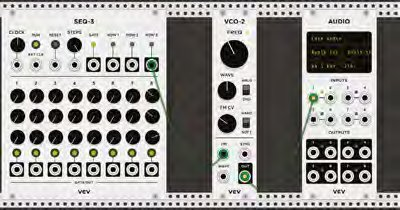

*Dacă nu vrei să te joci cu un ciocan de lipit, poți crea un Eurorack virtual perfect cu programul open-source VCV*

## Partea 4 – Alte proiecte de încercat

*Dacă nu ești încă pregătit să lași jos ciocanul de lipit, acestea sunt proiectele la care merită să te uiți pentru inspirație*

Există o comunitate considerabilă, care a crescut și continuă să crească, în jurul sintetizatoarelor construite acasă, acoperind tot felul de stiluri muzicale și tot felul de capacități inginerești. Aceste proiecte merg de la circuite simple, care iau o oră sau două, până la recreări complete ale unor sintetizatoare clasice vechi, care ar putea lua un an de muncă, și de salariu, ca să fie puse cap la cap. Mulți dintre cei care au început construindu-și propriile creații își vând acum PCB-urile și panourile frontale, iar cumpărarea unui astfel de kit e un mod grozav de a-ți crește colecția fără să proiectezi totul de la zero sau să găurești singur plăci de aluminiu.

### Radio Music

Unul dintre cele mai simple proiecte cu care poți începe, și unul dintre cele mai creative, se numește „Radio Music”. Radio Music a fost proiectat de Tom Whitwell și inspirat de experimentele timpurii de muzică concretă ale unor artiști precum John Cage, Karlheinz Stockhausen și Don Buchla, care s-au jucat, fiecare, cu bucle de radio lo-fi înregistrate la întâmplare. El primește un card SD plin de fișiere audio brute, făcute de tine sau găsite. Radio Music te lasă apoi să controlezi cum se redau acele fișiere, din ce punct și de pe ce „canal”. E o sursă de sunet minunată, care poate funcționa ca un VCO cu un sunet complet netradițional. Dar și hardware-ul e complet deschis, ceea ce înseamnă că schemele, împreună cu designurile, lista de materiale și codul care rulează pe microcontrolerul Teensy, sunt complet open-source (CC BY-SA). E potrivit pentru toate nivelurile, pentru că nu doar că e un proiect ușor de asamblat pentru începători, dar îl poți cumpăra și gata construit, dacă preferi. Îl poți construi singur din informațiile de pe pagina lui de GitHub, poți cumpăra PCB-urile și panoul frontal, și poți cumpăra kituri care includ tot ce ai nevoie, în afară de ciocanul de lipit și fludor.

Un alt lucru grozav la Radio Music e că poate fi și cu totul altceva: o orgă de acorduri și un VCO destul de zgrunțuros. Cu exact același hardware, doar cu un alt firmware pentru Teensy, el trece de la un dispozitiv digital de redare la ceva ce poate cânta diverse acorduri. Butonul „station” comută acum între acorduri, de exemplu, în timp ce butonul „start” reglează nota fundamentală și octava acordului. La final, butonul „reset” alege acum între sinusoidă, dreptunghi, dinți de fierăstrău și lățime de impuls. E genial pentru a genera progresii complexe de acorduri dintr-un singur modul și un kit simplu. Pentru mai multe detalii, vezi pagina de GitHub a lui Tom: [hsmag.cc/UPiAJO](https://hsmag.cc/UPiAJO).

Există sute de alte module Eurorack pe care le poți construi singur, din designuri partajate online sau din kituri puse cap la cap pentru sume de obicei modeste. În Marea Britanie există chiar și o întâlnire anuală a acestor moguli ai sintetizatoarelor modulare de casă, la Brighton. La ediția din 2018 puteai da mâna cu acești makeri și cu hardware-ul lor, puteai asculta muzică făcută cu echipamentele și puteai participa chiar la ateliere care te ajută să îți construiești propriile module, de la începători la experți.

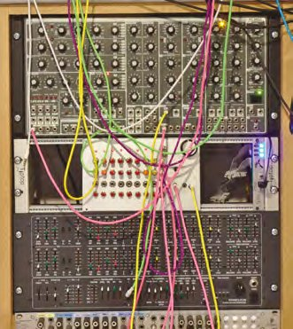

*Secvențiatorul nostru în mediul lui natural, alături de alte module de sintetizator*

### Proiecte avansate

O altă sursă grozavă de proiecte, care cer diverse grade de implicare, este MIDIbox. În loc să se încadreze în formatul Eurorack, multe dintre kiturile și designurile de circuit MIDIbox creează unități de sine stătătoare, care pot fi folosite pentru a controla alte dispozitive sau pentru a transforma hardware audio vechi și ezoteric într-un sintetizator. Există un PCB pentru generarea de sunet din cipul SID al unui Commodore 64, de exemplu, și altul pentru crearea unui banc de fadere care pot controla diverse sintetizatoare prin MIDI. Multe dintre aceste proiecte au și puncte în care se pot adăuga tensiuni de control, și mulți constructori adaptează designurile la propriile cerințe și formate.

> *Kiturile MIDIbox creează unități de sine stătătoare, care pot fi folosite pentru a controla alte dispozitive*

Dar dacă ai stăpânit lipirea și cauți o provocare adevărată, există o mulțime de proiecte de peste o sută de ore, în care pasionații de sintetizatoare își investesc timpul și banii. Multe dintre ele presupun recrearea unor sintetizatoare clasice și de negăsit din anii 1970, și sunt o provocare uriașă din mai multe motive. De obicei se învârt în jurul câtorva indivizi care fac inginerie inversă pe PCB-urile originale ale unor echipamente vechi și proiectează circuite noi, cu componente mai ușor de găsit, punând totul cap la cap de-a lungul mai multor revizii și kituri, până când devine disponibilă o versiune finală stabilă. În acest punct, PCB-urile sunt de obicei fabricate în serii mici, și se creează o listă de materiale (BoM) pentru construcție, pe care să o urmeze și alții.

Un astfel de proiect, care a urmat această cale, este TTSH, acronim pentru „two thousand six hundred” (două mii șase sute), care se întâmplă să fie numărul unui sintetizator foarte clasic și acum foarte scump, din 1971: ARP 2600. TTSH e un proiect complex, care a fost la rândul lui refăcut într-o altă clonă, STP 2600, care promite să fie mult mai ușor de construit, fără a compromite sunetul. Aruncă o privire pe diysynth.de dacă ți se pare genul tău de aventură.

Pentru nostalgia supremă a sunetului de sintetizator, mulți consideră Yamaha CS-80 sintetizatorul definitoriu al anilor 1970, și chiar și acesta a cedat în fața entuziaștilor DIY. CS-80 a fost folosit celebru de Vangelis în epoca lui de aur de la sfârșitul anilor 1970 și începutul anilor 1980, pe coloane sonore precum Antarctica, Blade Runner și Chariots of Fire. Sunetul CS-80 este ceea ce mulți consideră sunetul sintetizatoarelor, cu paduri ample și corzi înecate în opt secunde de reverb, și totuși calea lui de semnal e destul de neobișnuită, cu două voci paralele și opt note de polifonie. Asta face 16 voci în total, alături de un control paralel ciudat al filtrului și de aftertouch polifonic. Și, ca și ARP 2600, te poți lansa acum într-un proiect DIY pentru a construi un sintetizator cu același caracter, dacă ești pregătit să cheltuiești sute de ore și de lire pe componente, PCB-uri și carcase. Această recreare DIY se numește Deckard's Dream ([deckardsdream.com](https://deckardsdream.com)) și ar putea fi echivalentul sonor al unui unicorn care aleargă printr-un luminiș.

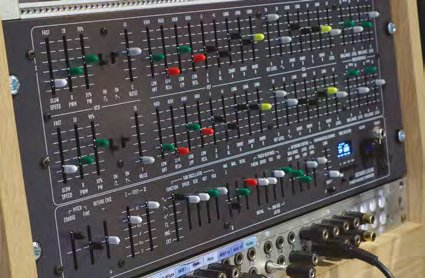

*Un sintetizator Yamaha CS-80 poate costa acum zeci de mii de dolari și ai nevoie de un inginer cu normă întreagă ca să îl ții acordat. Dacă ai răbdarea și timpul să lipești mii de componente, te poți apropia de sunetul CS-80 cu un sintetizator DIY Deckard's Dream*

> **MULȚUMIRI**
> Trebuie să îi acordăm un credit uriaș lui Sam Battle, „Look Mum No Computer”, pentru designurile de circuit pe care le-am folosit ca bază atât pentru oscilator, cât și pentru secvențiator. Site-ul lui, [lookmumnocomputer.com](https://www.lookmumnocomputer.com), și în special pagina lui de Patreon, [patreon.com/lookmumnocomputer](https://www.patreon.com/lookmumnocomputer), sunt ceea ce îți recomandăm să consulți pentru pașii următori. Site-ul lui include circuitele și componentele suplimentare necesare pentru a accesa elementele lipsă ale oscilatorului, și are și scheme pentru extinderea secvențiatorului cu un Arduino Mega și încă opt pași, dacă faci față cablării suplimentare.
