# Capitolul 23 – Inspirație

> *Lasă-te inspirat de aceste proiecte Arduino uimitoare*

Această secțiune a cărții prezintă cinci proiecte remarcabile ale comunității, descrise pe scurt de autorii lor. Nu sunt tutoriale pas cu pas, ci idei care arată cât de departe se poate ajunge cu un Arduino, puțină electronică și multă imaginație.

## Freeduino

*De Jiří Praus, [jiripraus.cz](https://jiripraus.cz)*

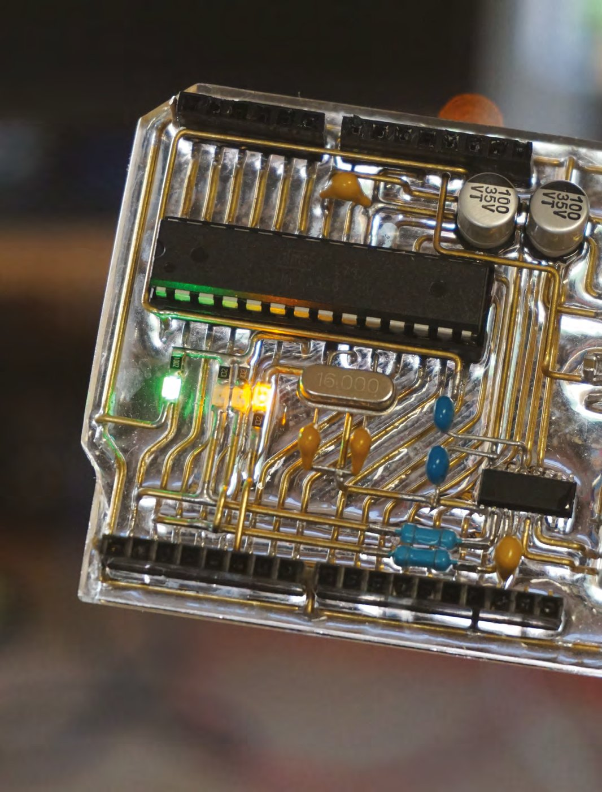

De la crearea lui, în 2003, Arduino Uno a dat viață lumii electronicii open-source. Există plăci mai puternice, dar deschiderea hardware-ului i-a adus o comunitate, care valorează mai mult decât un pic în plus de putere de procesare sau niște intrări și ieșiri mai rapide.

Fiind deschis, Arduino este și foarte ușor de clonat; vei vedea tot felul de versiuni ieftine, de imitație, pe piață. Această clonă, făcută de dezvoltatorul, makerul și artistul Jiří Praus, este orice altceva decât o simplă clonă. El a recreat PCB-ul lui Arduino din fire libere, legând toate componentele reale ca să creeze o versiune-schelet a plăcii, identică din punct de vedere funcțional cu cea adevărată. De ce, ai putea întreba? Ei bine, noi spunem: de ce nu?

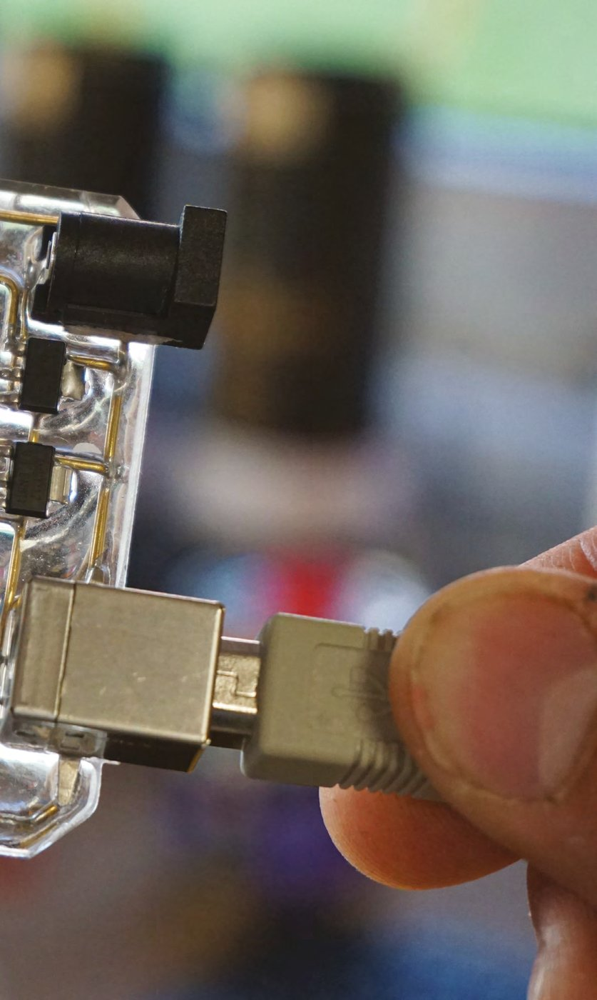

*Construcția a durat câteva zile și, da, funcționează!*

## Chartreuse

*De Anna Lynton și Alex Fiel, [hsmag.cc/NmChjn](https://hsmag.cc/NmChjn)*

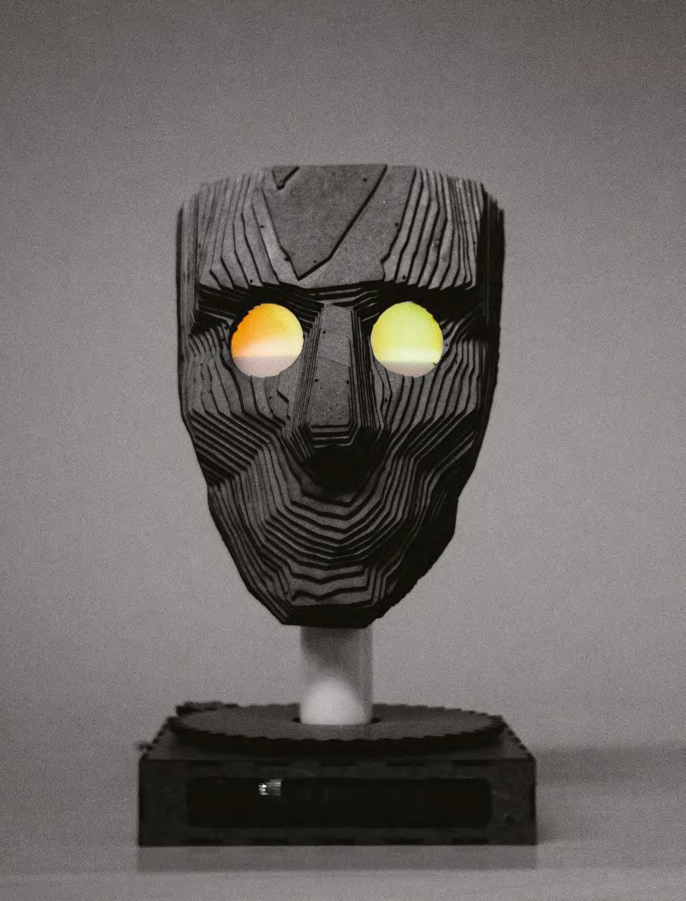

Chartreuse este o față interactivă, care te urmărește când treci pe lângă ea. Când te vede, ochii i se fac galbeni și capătă o expresie fericită în priviri. Când te îndepărtezi, ochii i se fac albaștri și se întoarce, tristă, în altă parte.

Chartreuse este pusă în mișcare de un Arduino Uno, două servomotoare, un motor pas cu pas și câteva LED-uri adresabile. Este construită din câteva bucăți de plăci fibrolemnoase de 1/8 inch (circa 3 mm).

Creatorii, Anna Lynton și Alex Fiel, sunt amândoi studenți la Tehnologie, Arte și Media la Universitatea Colorado din Boulder.

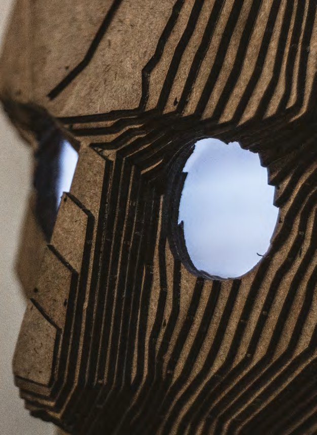

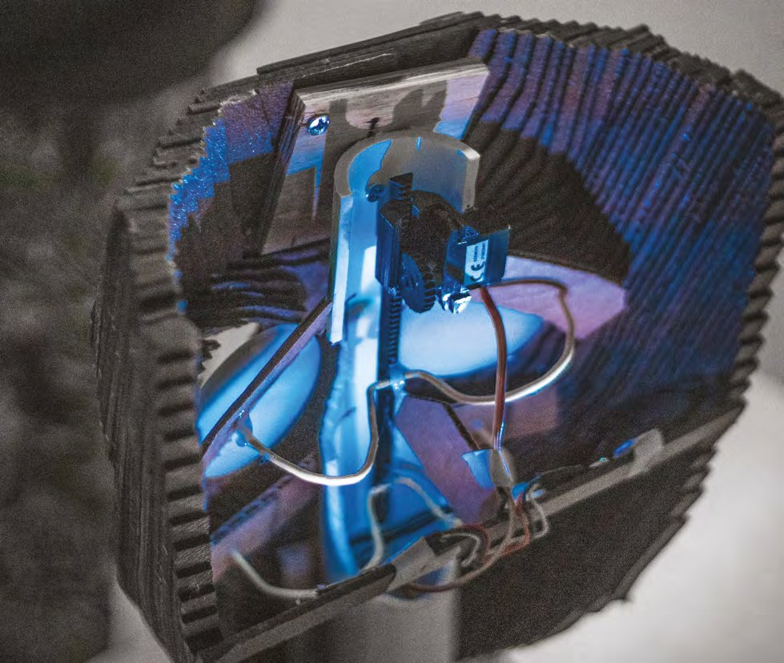

*În soclu se ascunde un senzor de distanță cu ultrasunete, care te urmărește*

## Ceas cu cuvinte

*De Mosivers, [hsmag.cc/SwgwCw](https://hsmag.cc/SwgwCw)*

„Un prieten și cu mine făceam un ceas cu cuvinte obișnuit, cadou de Crăciun pentru prietena lui. În timpul lucrului am observat că literele pot fi proiectate din spate pe o foaie albă de hârtie. Mai mult, am putut crea efecte interesante îndoind hârtia, astfel încât literele individuale să își schimbe mărimea și să devină neclare. După asta, am încercat să găsim un design de ceas cu cuvinte care să folosească acest efect, putând mișca fiecare dintre cele 114 litere și puncte cu câte un servomotor.

Știam că va fi un proiect provocator, dar s-a dovedit chiar mai plictisitor decât credeam, pentru că practic trebuie să repeți fiecare pas de 114 ori. Totuși, la final, cred că am creat ceva original și unic.”

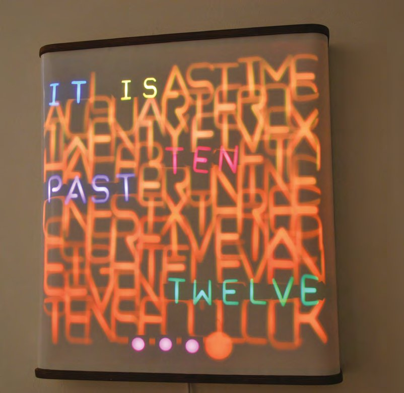

*Deși am văzut multe ceasuri cu cuvinte în trecut, acesta este de departe cel mai arătos*

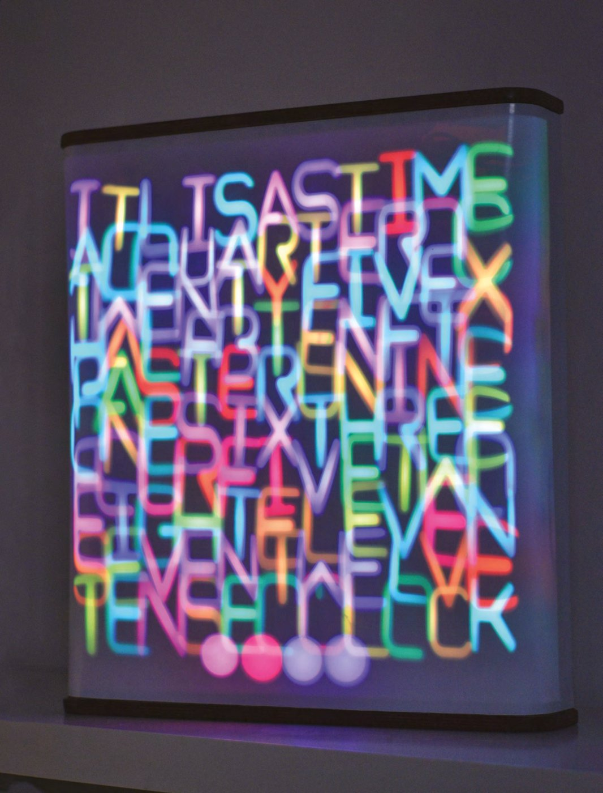

## Lingura asistivă

*De CuriosityGym, [hsmag.cc/jHHMlS](https://hsmag.cc/jHHMlS)*

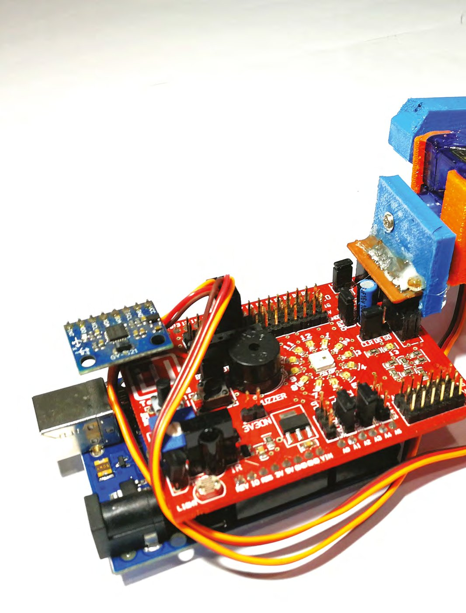

Boala Parkinson este o afecțiune progresivă a sistemului nervos, care afectează mișcarea. Simptomele apar treptat, uneori începând cu un tremur abia sesizabil la o singură mână. Tremurul este frecvent, dar boala provoacă adesea și rigiditate sau încetinirea mișcărilor.

„Ne-a inspirat mult Liftware Steady (vezi [liftware.com/steady](https://www.liftware.com/steady)), un produs vândut exact în acest scop. Ne-am dat seama devreme că va fi un proiect provocator, care va duce echipa în zonele controlului mișcării, fizicii și matematicii 3D, despre care aveam cunoștințe de lucru, iar acest proiect ne-a ajutat să punem teoria în practică.

Designul trebuia să fie ținut în mână și să poată anula tremurul simțit de mâna persoanei, oferind astfel posibilitatea de a nivela și stabiliza o lingură ținută la capătul prototipului.”

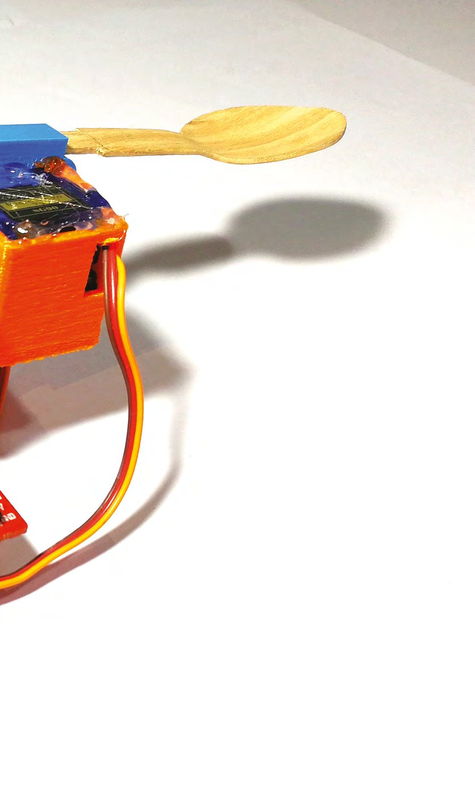

*Proiectul a fost realizat de membrii echipei CuriosityGym: Siddhesh Murudkar, Rupin Chheda și Jehangir Khajotia*

## Arduinoflake

*De Jiří Praus, [hsmag.cc/wwRjLy](https://hsmag.cc/wwRjLy)*

„Sunt inginer senior la Samepage.io și pasionat de hardware. Am început cu un kit Arduino simplu acum doi ani și m-am îndrăgostit de platformă. Acum mă distrez făcând sculpturi și electronică din fire libere. Arduinoflake-ul meu are 30 de LED-uri interconectate cu sârmă de alamă de 0,8 mm, prin așa-numita metodă „dead bug” (în care firele se lipesc direct pe circuitul integrat întors cu picioarele în sus), în forma unui fulg de zăpadă. Rulează pe Arduino Nano și poți interacționa cu el prin senzorul tactil capacitiv. Am vrut să îl construiesc ca jucărie pentru fiica mea, dar s-a dovedit a fi mai mult: e artă din circuite.”

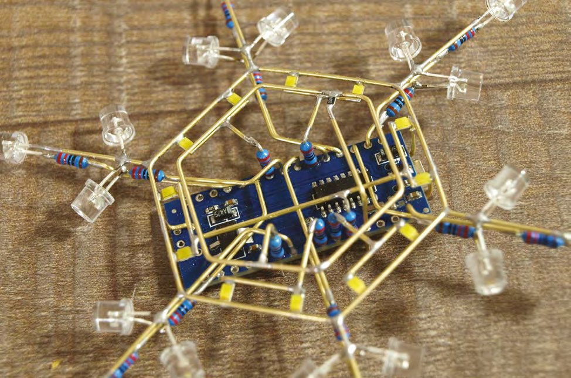

*Această sculptură a fost înscrisă în concursul Hackaday Circuit Sculpture ([hsmag.cc/whrIzk](https://hsmag.cc/whrIzk))*

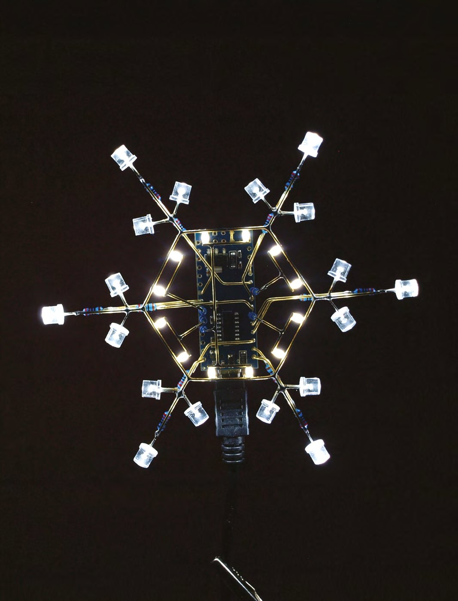
