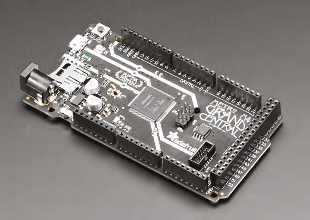
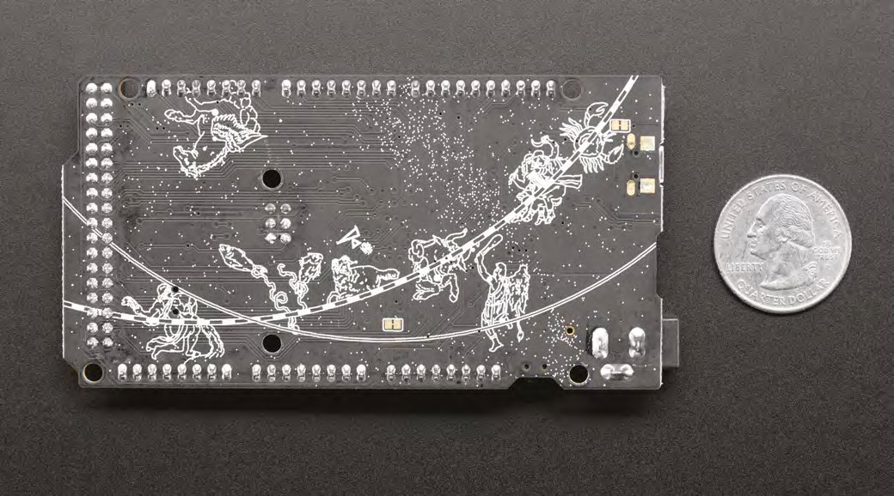
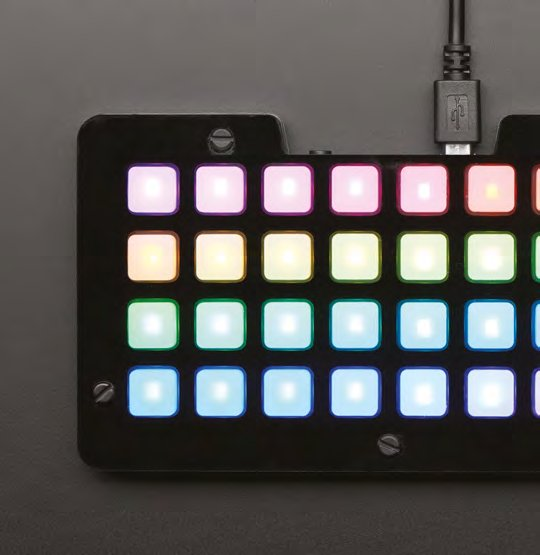
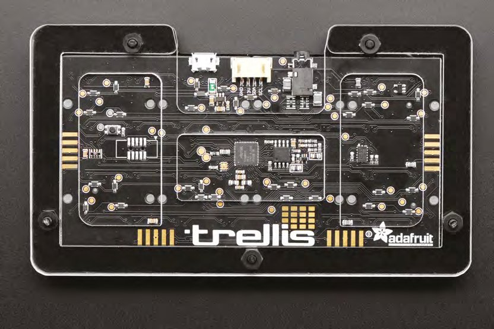
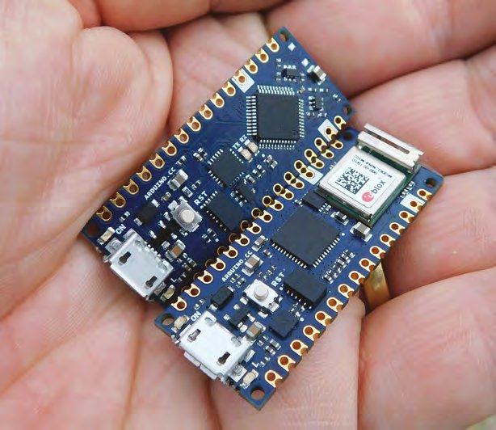
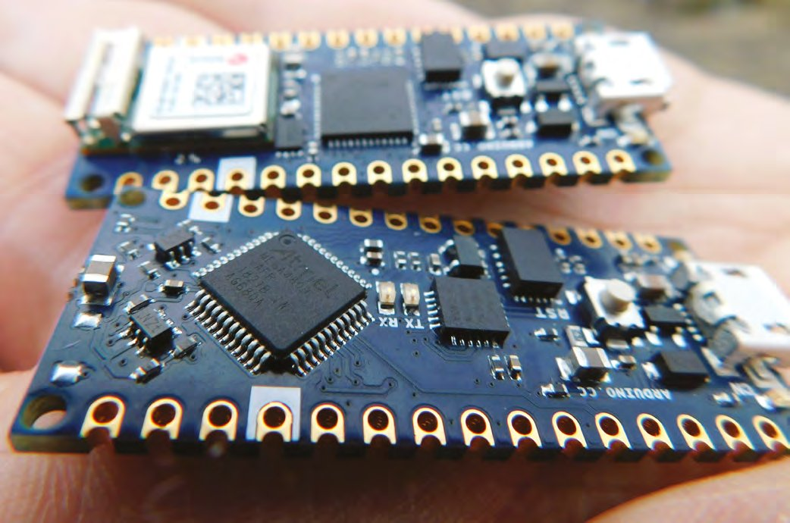
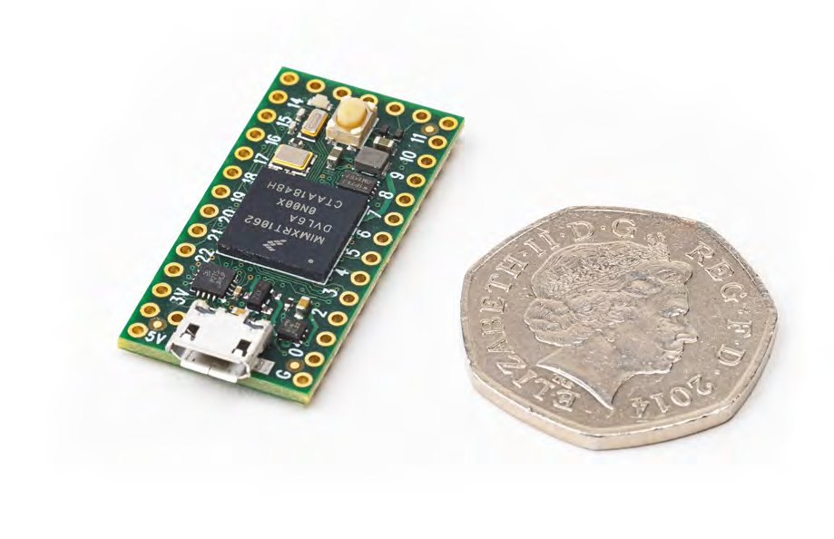
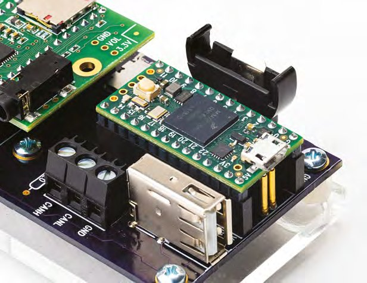

# Capitolul 24 – Teste de plăci

> *Recenzii de la experți ale unora dintre cele mai interesante echipamente Arduino*

> **DESPRE AUTOR**
> Recenziile din acest capitol sunt scrise de **Ben Everard** (@ben_everard), redactorul-șef al revistei HackSpace.

> **NOTA TRADUCĂTORULUI**
> Recenziile datează din 2019. Prețurile și disponibilitatea s-au schimbat, iar unele plăci au primit între timp versiuni noi (de exemplu Teensy 4.1, sau Arduino Nano ESP32). Comparațiile de performanță și observațiile despre arhitecturi rămân însă utile.

## Grand Central M4 Express

*O singură placă, atât de multe intrări. Adafruit, 37,50 $, adafruit.com*

*Dacă multiplexezi (Charlieplexing) toți pinii GPIO, poți comanda 3782 de LED-uri. Să înceapă clipitul!*

Nu lipsesc microcontrolerele construite în formatul Arduino. Totuși, aproape toate sunt construite în stilul lui Uno. Formatul Mega (cu gama lui mult extinsă de pini I/O) a văzut un singur pretendent semnificativ în ultimii nouă ani, Arduino Due, care, în ciuda unor avantaje, nu a devenit niciodată popular. Asta s-a schimbat acum, cu o placă nouă care suportă un număr mare de pini I/O: Adafruit Grand Central M4 Express.

Această placă găzduiește impresionanții 54 de pini digitali I/O și 16 intrări analogice (dintre care două pot fi folosite ca ieșiri analogice, printr-un DAC de 12 biți).

Există câteva indicii despre puterea de procesare a plăcii chiar în numele ei. M4 se referă la versiunea nucleului ARM de pe placă, în timp ce Express, în terminologia Adafruit, înseamnă că există peste 2 MB de memorie flash (de fapt, 8 MB). Încap multe în 8 MB, dar dacă nu e destul, există și un slot de card microSD, așa că poți îngrămădi (aproape) câte date vrei în stocare.

Nucleul M4 rulează la 120 MHz și are atât DSP hardware (procesare digitală a semnalelor), cât și suport pentru virgulă mobilă. E puțin greu de comparat viteza diferitelor microcontrolere, pentru că există multe diferențe în siliciul de dedesubt, pe lângă viteza la care rulează. Virgula mobilă poate fi foarte lentă pe unele microcontrolere, așa că accelerarea poate fi mult mai mare decât sugerează numerele.

> *Nucleul M4 rulează la 120 MHz și are atât DSP hardware, cât și suport pentru virgulă mobilă*

Ca să testăm cât de mult mai rapidă este, am comparat această placă cu un Circuit Playground Express, care are un nucleu M0 la 48 MHz (un microcontroler destul de rapid, după multe standarde), fără unitate de virgulă mobilă. Cu Arduino IDE, le-am programat să facă un milion de înmulțiri de numere întregi și un milion de înmulțiri în virgulă mobilă. Pe CPX, asta a luat 189 de milisecunde pentru întregi și 8308 milisecunde pentru virgulă mobilă.

Pe Grand Central, operațiile cu întregi au luat 67 de milisecunde, cam în linie cu accelerarea așteptată, pentru că nucleul e de 2,5 ori mai rapid și puțin mai puternic. Operațiile în virgulă mobilă au luat 75 de milisecunde, doar puțin mai lent decât cele cu întregi. Pe lângă virgula mobilă, nucleele M4 au suport hardware pentru împărțirea întreagă, cu o accelerare similară, de circa 40 de ori. Această viteză înseamnă că Grand Central poate fi împinsă în zone în care multe microcontrolere pur și simplu nu fac față, cum ar fi manipularea audio și calcularea modelelor complexe de LED-uri.

DSP-ul poate oferi un salt uriaș de viteză, dar folosirea lui nu e ușoară. Dacă nu te interesează să te scufunzi în amănuntele optimizării compilatorului, probabil va conta doar dacă folosești biblioteci care îl suportă. Cel mai popular exemplu este Audio Library, proiectată inițial pentru Teensy (și Teensy 3.x folosește un procesor M4). Pe măsură ce procesoarele M4 devin mai răspândite, probabil vor apărea mai multe biblioteci care suportă DSP-ul.

*Imaginea de pe serigrafie este luată de pe tavanul gării Grand Central din New York*

Formatul, cum am menționat la început, se bazează pe clasicul Arduino Mega, o extensie a lui Arduino Uno, iar asta înseamnă că există deja o gamă de shield-uri disponibile. Ca majoritatea microcontrolerelor moderne, Grand Central este o placă de 3 V, așa că trebuie să te asiguri că shield-urile sunt compatibile cu această tensiune.

Grand Central are o cantitate uriașă de lucruri înghesuite în ea, dar toate microcontrolerele sunt un compromis: pur și simplu nu poți face o placă care să le aibă pe toate, mai ales când „toate” include adesea și mărimea mică și prețul mic. Cel mai evident compromis la Grand Central este lipsa oricărei conectivități fără fir: nu are nici Bluetooth, nici WiFi. Asta nu înseamnă că nu o poți folosi fără fir, dar vei avea nevoie de hardware suplimentar, adică de cost și complexitate în plus.

### O atingere de software

Pe partea de software sunt suportate atât Arduino, cât și CircuitPython, dar Adafruit spune: „Avem un pachet de suport pentru plăci Arduino funcțional, cu multe lucruri care merg, dar ținta noastră principală pentru această placă este CircuitPython”.

Deși sună puțin pesimist pe frontul Arduino, trebuie luat în calcul prin comparație cu suportul de obicei excelent al Adafruit. Pentru majoritatea utilizărilor, mediul Arduino ar trebui să funcționeze cum te aștepți, doar să nu te aștepți la o mulțime de biblioteci și exemple care să vizeze funcțiile mai ezoterice ale plăcii, cum ar fi interfața de cameră PCC.

CircuitPython cu Mu are nevoie de versiunea 1.0.2 sau mai nouă ca să detecteze conexiunea serială, și funcționează cum te aștepți. Există deja ghiduri oficiale pentru crearea unui soundboard și a unei interfețe MIDI.

Grand Central M4 Express înghesuie o cantitate uriașă de lucruri pe o placă de microcontroler. Are destule I/O ca să controleze aproape orice, și puterea de procesare ca să prelucreze cantitatea masivă de date pe care le poate aduce. Cum sugerează și numele, nu e cea mai mică placă, dar dacă ai loc, e un creier grozav pentru proiectele lacome de I/O.

> **VERDICT: 9/10**
> Intrări, ieșiri și putere de procesare din belșug. Este o placă grozavă pentru comenzi și interfețe complexe.

## NeoTrellis M4 Express

*Butoane, lumini și mult sunet. Adafruit, de la 59,95 $, adafruit.com*

*NeoTrellis este destul de mic ca să fie folosit ținut în două mâini, ca un gamepad*

NeoTrellis M4 Express este o matrice de 8×4 butoane, pusă în mișcare de un cip SAM D51 (cu un ARM Cortex-M4 la 120 MHz, cu DSP hardware și virgulă mobilă). Există o mufă jack audio de 3,5 mm legată la două DAC-uri de 12 biți, și doi pini GPIO expuși, care pot rula I2C sau intrare analogică. Există și un accelerometru cu trei axe.

NeoPixel-urile din spatele fiecărui buton îți dau posibilitatea de a aprinde fiecare tastă pentru a indica o utilizare diferită și de a crea un afișaj variabil la nesfârșit. Cum acest afișaj poate fi configurat din mers, formatul buton-plus-NeoPixel este grozav pentru crearea de dispozitive de intrare inedite. Există și 8 MB de memorie flash, destul loc pentru destul de multe mostre audio, și un amplificator pentru microfon electret (accesibil prin al patrulea pin al mufei audio).

Dacă această configurație anume nu e ce cauți, poți obține alte piese în forme asemănătoare. Tastaturile Trellis 4×4 sunt disponibile atât cu LED-uri obișnuite (9,95 $ PCB-ul + 4,95 $ butoanele de silicon), cât și cu NeoPixels (12,95 $ PCB-ul + 4,95 $ butoanele de silicon). Acestea pot fi înlănțuite atât vertical, cât și orizontal, în grupuri de până la opt. Nu includ un microcontroler, așa că poți adăuga unul la alegere.

Asamblarea dispozitivului înseamnă doar să aliniezi totul și să fixezi cu cinci bolțuri. Carcasa tăiată cu laser pare solidă, iar butoanele de silicon sunt destul de moi ca să fie confortabile, dar tot fac clic ferm sub degete.

Există, la momentul scrierii, două moduri de a programa placa: cu Arduino IDE și cu CircuitPython.

Dacă vrei să deblochezi toată puterea audio a plăcii, vei avea mai mult noroc cu Arduino IDE. Există un port al popularei biblioteci Teensy Audio pentru NeoTrellis M4, care îți permite să creezi sunete și să aplici tot felul de efecte audio. Pentru cei interesați mai mult de controlul altui hardware generator de muzică, Trellis poate scoate MIDI fie prin USB, fie prin DIN cu cinci pini (cu un circuit simplu descris aici: [hsmag.cc/RhptgC](https://hsmag.cc/RhptgC)).

Ca un simplu exemplu de putere, recenzentul a creat un sintetizator (pe baza exemplelor) care poate scoate unde sinusoidale, triunghiulare, dreptunghiulare sau dinți de fierăstrău, cu atacul și eliberarea modulației controlate de valorile x și y ale accelerometrului. Ținut în orientări diferite, dispozitivul dă sunete diferite (codul sursă e la [hsmag.cc/DLHQYI](https://hsmag.cc/DLHQYI)). Această interfață buton-plus-înclinare este extrem de flexibilă pentru tot felul de generatoare de sunet ciudate (și ocazional minunate), iar disponibilitatea bibliotecii Audio îți pune la îndemână o gamă uriașă de efecte și opțiuni.

> *Această interfață buton-plus-înclinare este extrem de flexibilă pentru tot felul de generatoare de sunet ciudate (și ocazional minunate)*

*Trei conexiuni, USB, Grove și jack, oferă o mulțime de posibilități de extindere, deși există doar doi pini GPIO*

### Pythonic

CircuitPython nu are chiar aceeași performanță ca Arduino, dacă împingi cu adevărat efectele audio, dar tot rulează pe un cip M4 puternic, așa că nu e deloc lent. E destul de puternic ca să lucreze cu audio: de exemplu, există un secvențiator de ritmuri în CircuitPython la [hsmag.cc/zrtnfN](https://hsmag.cc/zrtnfN).

NeoTrellis este un dispozitiv de intrare foarte util, și ușor neobișnuit, împachetat cu un procesor puternic. La prima vedere nu pare la fel de flexibil ca alte dispozitive pentru makeri, mai ales dată fiind lipsa pinilor GPIO. Totuși, aparența înșală. USB-ul este nativ și poate fi folosit pentru a crea un dispozitiv MIDI sau alt dispozitiv USB, există intrare și ieșire audio, iar conectorul I2C e suficient ca să controlezi aproape orice hardware; despre asta e acest dispozitiv. E un mod de a crea interfețe inedite. În această recenzie ne-am concentrat pe audio și credem că va fi o utilizare populară a plăcii. Totuși, nimic nu o leagă de această utilizare anume.

Din perspectiva audiofilului, poate cel mai dezamăgitor lucru la NeoTrellis este fidelitatea sunetului. DAC-urile de 12 biți sunt bune pentru redare generală, dar nu au rezoluția hardware-ului audio de top, și nu vei obține niciodată o intrare grozavă de la un microfon electret. Asta nu îi știrbește însă utilitatea. Sigur, DAC-urile nu sunt perfecte, dar e un controler de ținut în mână și, dacă ai nevoie de audio de înaltă fidelitate, poți folosi acest dispozitiv și un controler MIDI ca să scoți sunet dintr-o gamă largă de hardware; iar dacă ai nevoie de mostre de calitate, le poți înregistra în afara dispozitivului și le poți încărca pe el.

Unele dispozitive hardware pur și simplu te fac să zâmbești. E greu de făcut o listă cu exact ce e nevoie pentru asta, dar e o combinație de interfață om-circuit bună, ieșiri interesante și documentație care face ușor să începi și să experimentezi cu funcțiile. NeoTrellis M4 Express este unul dintre acestea: e pur și simplu foarte distractiv de folosit.

Formatul anume al lui NeoTrellis M4 nu se va potrivi tuturor proiectelor, dar pentru proiectele cărora li se potrivește, e de neegalat. La 59,99 $, e și o valoare fantastică.

> **VERDICT: 9/10**
> Un dispozitiv excentric și foarte distractiv, cu un set neobișnuit de intrări.

## Arduino Nano Every și Nano 33 IoT

*Cea mai mică placă Arduino primește o revizie majoră*

*Noile plăci Nano sunt minuscule, dar 33 IoT este puțin mai mare*

Linia Nano a plăcilor Arduino este un pilon al makerilor de peste un deceniu. Sunt mici și ieftine (în comparație cu alte plăci oficiale), dar vin totuși cu conectorul USB și cu toată puterea plăcilor mai mari. Tehnologia a evoluat de la prima versiune a lui Nano, iar Arduino a lansat o linie de plăci noi în formatul Nano; ne uităm la Nano Every și la Nano 33 IoT.

Nano Every se bazează pe microcontrolerul ATmega4809, la 20 MHz. Este în mare compatibil cu alte cipuri AVR de la Arduino, inclusiv cu cel din Nano-ul original. Placa funcționează la 5 V, deci ar trebui să fie un înlocuitor complet al Nano-ului original, dar cu mai multă memorie flash (48 kB) și mai mult RAM (6 kB). La opt euro, e cea mai ieftină placă făcută de Arduino, cu o marjă destul de mare.

Nano 33 IoT vine tot în formatul Nano, dar e construit pe microcontrolerul ARM SAMD21G18A pe 32 de biți. Rulează la până la 48 MHz și are 256 kB de flash și 32 kB de RAM. Per total, e un procesor semnificativ mai puternic decât cipul AVR din Nano Every. Pe lângă asta, există un modul u-blox bazat pe ESP32 pentru WiFi și Bluetooth, și o unitate de măsurare inerțială cu șase axe. Toate acestea vin la 16 euro, dublul prețului lui Nano Every, dar tot una dintre cele mai ieftine plăci produse de Arduino.

Ambele dispozitive sunt minuscule, solid construite și la fel de ușor de folosit cum te-ai aștepta de la dispozitive făcute de Arduino. Spre deosebire de multe plăci mici, au patru găuri de montaj, așa că poți fixa ușor placa în proiectele tale.

Sunt complet plate pe dedesubt și au paduri crenelate, ca să poată fi lipite pe alte PCB-uri, într-un fel de configurație permanentă de shield, un semn că Arduino țintește industria electronicii de serie mică, ușurând construirea de produse din proiecte Arduino.

*ATmega4809 este mai puternic decât AVR-urile din plăcile Arduino mai vechi*

### Alimentarea

Lumea microcontrolerelor mici e destul de aglomerată în acest moment, dar aceste noi plăci Nano își au nișa lor. Sunt printre cele mai mici plăci din jur, și totuși înghesuie o cantitate sănătoasă de I/O (12 digitale, 8 intrări analogice și 1 ieșire analogică). Reușesc asta renunțând la o funcție-cheie prezentă pe majoritatea plăcilor puțin mai mari: gestionarea bateriei. Vei avea nevoie de o sursă de alimentare, fie prin portul USB, fie cu până la 21 V prin Vin. Regulatorul de pe placă, destul de voinic, poate furniza până la 950 mA pentru periferice.

Într-o lume a microcontrolerelor de 3 V, Arduino Nano Every este probabil una dintre cele mai bune alegeri de microcontroler de 5 V în acest moment, ca raport preț-performanță, atât timp cât nu ai nevoie de încărcarea bateriei sau de rețea. Există mai puțin hardware de 5 V în ziua de azi, dar dacă ai nevoie să controlezi așa ceva, placa te scutește de bătaia de cap a convertoarelor de nivel. Cu 950 mA disponibili de la regulator și I/O de 5 V, e o alegere grozavă pentru proiecte cu NeoPixel mici și medii.

Nano 33 IoT este pe piața mai plină a plăcilor de dezvoltare de 3,3 V cu WiFi, dar are câteva trăsături care ies în evidență. Este cea mai mică și cea mai ieftină placă compatibilă cu Arduino IoT Cloud. Deși acest mediu de dezvoltare online este încă în dezvoltare, se conturează ca un mod foarte ușor de a începe cu dispozitivele IoT. Nano 33 IoT are performanța sprintenă cu care ne-am obișnuit de la plăcile bazate pe microprocesorul SAMD21, iar WiFi-ul de pe un cip separat oferă performanțe solide de rețea.

> **TESTE DE PERFORMANȚĂ**
> Per total, 33 IoT este de circa patru ori mai rapid decât simplul Nano Every. Singura excepție este înmulțirea și împărțirea în virgulă mobilă. Fiecare test rulează un milion de instanțe ale fiecărei instrucțiuni, cu excepția intrării analogice, care rulează doar 10.000. Rezultatul este numărul de milisecunde cât a durat procesul.
>
> | Test | Nano 33 IoT | Nano Every |
> |---|---|---|
> | Intrare analogică | 4.234 | 1.124 |
> | Adunare de întregi | 147 | 884 |
> | Înmulțire de întregi | 211 | 829 |
> | Adunare în virgulă mobilă | 2.609 | 8.560 |
> | Înmulțire în virgulă mobilă | 14.757 | 12.684 |
> | Împărțire în virgulă mobilă | 32.485 | 46.542 |
> | Test GPIO | 3.303 | 72.722 |

> **VERDICT – Arduino Nano Every: 9/10**
> Dacă ai nevoie de o placă mică, cu microcontroler de 5 V, aceasta trebuie să fie în capul listei.

> **VERDICT – Arduino Nano 33 IoT: 8/10**
> Un microcontroler WiFi fără fițe, care încape în cele mai mici spații.

## Teensy 4.0

*Un microcontroler de 600 MHz. Teensy, 19,95 $, pjrc.com*

*Teensy 4.0 își merită cu adevărat numele: e minuscul*

Specificațiile lui Teensy 4.0 sunt impresionante. Un procesor ARM de 600 MHz sună mai degrabă a ceva ce ai găsi într-un calculator de uz general decât într-un microcontroler. Se bazează pe nucleul ARM Cortex-M7F, așa că hai să recapitulăm rapid nucleele ARM pe care le găsești în microcontrolere. Seria M (spre deosebire de seria A, pe care o găsești în dispozitivele „de aplicații”, cum ar fi telefoanele mobile și Raspberry Pi) sunt nuclee pe 32 de biți, proiectate pentru microcontrolere. Există multe alte nuclee care nu se bazează pe designurile ARM Cortex, cum ar fi nucleele ATmega din multe plăci Arduino și nucleele Tensilica din dispozitivele ESP8266 și ESP32. Cele mai comune nuclee ARM Cortex-M sunt:

- **M0:** set mic de instrucțiuni, optimizat pentru dimensiune mică pe siliciu, preț mic și consum mic (cel puțin relativ vorbind, pentru că sunt tot semnificativ mai rapide decât cipurile AVR, cum sunt cele din Arduino Uno). Bazat pe setul de instrucțiuni ARMv6-M.
- **M0+:** un upgrade compatibil la nivel de cod-mașină al lui M0, care adaugă puțină forță în plus.
- **M3:** bazat pe setul de instrucțiuni ARMv7-M, cu instrucțiuni absente în nucleele M0, cum ar fi împărțirea și înmulțirea cu acumulare. Codul ar trebui să ruleze mai repede decât pe un nucleu M0.
- **M4:** același nucleu de bază ca M3, dar cu instrucțiuni de procesare digitală a semnalelor (DSP). Acestea sunt folosite intens în bibliotecile de procesare audio.
- **M4F:** un nucleu M4 cu accelerare suplimentară pentru calculele în virgulă mobilă în simplă precizie.
- **M7F:** include accelerări pentru virgulă mobilă în simplă precizie și (opțional) în dublă precizie, precum și instrucțiuni DSP. Este un nucleu semnificativ mai puternic decât cel din M3 și M4, cu un pipeline mai mare și speculație de ramificație (o funcție un pic derutantă, dar care poate duce la rularea mai rapidă a codului). Există și opțiunea memoriei strâns cuplate, care îți permite să folosești o cantitate mică de memorie foarte rapidă.

> *La microcontrolere nu prea are sens noțiunea că unul dintre aceste nuclee ar fi, per total, „mai bun” decât celelalte*

### Dileme de nucleu

Mai există câteva, dar nu sunt folosite frecvent în lumea hobbyiștilor. La microcontrolere nu prea are sens noțiunea că unul dintre aceste nuclee ar fi, per total, „mai bun” decât celelalte, pentru că depinde atât de mult de utilizare. Nucleele M0 sunt cele mai puțin puternice din listă, dar la scara microcontrolerelor sunt tot destul de puternice și ar trebui să ducă la bun sfârșit multe sarcini fără să îți golească sursa de alimentare sau contul bancar. Totuși, dacă trebuie să faci DSP sau operații în virgulă mobilă, vei beneficia cu adevărat de un nucleu M4F sau mai rapid.

Nucleul M7F din Teensy 4.0 este mai puternic decât un nucleu M4F (cum e cel din Teensy 3.6) și poate rula și la frecvențe mai mari: 600 MHz în acest caz (deși e posibil să poată fi supratactat în viitor). Singura funcție care are cu adevărat un salt dramatic de viteză este suportul pentru operații accelerate în virgulă mobilă în dublă precizie, dar e o utilizare destul de specializată.

> **TESTE DE PERFORMANȚĂ**
> Am rulat o serie de teste pe câteva dintre cele mai rapide microcontrolere pe care le avem, ca să le comparăm cu Teensy 4.0. În fiecare caz, rezultatul este timpul necesar pentru a încheia o sarcină intensivă în zona respectivă. Mai mic e mai bine.
>
> | Test | Teensy 4.0 | Teensy 3.6 (240 MHz) | Adafruit PyPortal (SAMD51, 200 MHz) | ESP32 |
> |---|---|---|---|---|
> | Aritmetică cu întregi | 6,00 | 38,00 | 40,00 | 54,00 |
> | Aritmetică în virgulă mobilă | 28,00 | 79,00 | 85,00 | 151,00 |
> | Aritmetică în dublă precizie | 30,00 | 620,00 | 739,00 | 614,00 |
> | Ieșire GPIO | 65,00 | 271,00 | 451,00 | 265,00 |

Uită-te la tabelul de mai sus pentru o comparație de performanță cu alte microcontrolere de mare viteză. Nu există nicio îndoială că Teensy 4.0 este, în aproape orice caz, cel mai rapid microcontroler destinat hobbyiștilor, cu un factor de circa trei până la cinci (în funcție de exact ce faci cu el). Există câteva aplicații care pot beneficia cu adevărat de această accelerare.

Gama Teensy a fost un dispozitiv preferat de cei care lucrează cu audio în timp real, atât pentru că, istoric, au fost plăci rapide, cât și pentru că există un set grozav de biblioteci de suport scrise de Paul Stoffregen (care și vinde plăcile Teensy). Acesta include un creator drag-and-drop și un set de biblioteci care te ajută să scrii cod Arduino pentru a crea și a modifica semnale audio. Teensy 4.0 este mult mai rapid decât versiunea anterioară (Teensy 3.6) și are de patru ori mai multă memorie. Asta înseamnă că poți face mult mai multe. În termeni audio, înseamnă că poți face efecte mai intensive computațional, și mai multe dintre ele.

*Placa de extensie pentru Teensy nu e de vânzare, dar îți poți crea propria ta, cu instrucțiunile de la [hsmag.cc/ZyDVhx](https://hsmag.cc/ZyDVhx)*

### Adaptoare audio

Teensy 4.0 funcționează cu placa Teensy Audio Adaptor, dar pinii sunt în poziții ușor diferite, așa că trebuie să o legi cu fire de legătură, nu lipind cele două plăci direct una de alta, cum puteai face cu placa anterioară.

O altă zonă în care microcontrolerele puternice par promițătoare este rularea rețelelor neuronale, de exemplu cu cadrul TensorFlow. La momentul scrierii se lucrează mult la asta. Pe hârtie, Teensy 4.0 pare o platformă bună pentru așa ceva, și există ceva suport pentru procesoarele M7, dar deocamdată nu există un proces simplu pentru a pune totul în funcțiune. Dacă te interesează rularea TensorFlow pe microcontrolere, merită cu siguranță să fii atent la suportul pentru Teensy 4.0.

Teensy 4.0 este un salt semnificativ de performanță față de orice altă placă de microcontroler pentru hobbyiști, disponibil la un preț grozav. Dacă îți lipsește puterea de procesare pentru ce ai nevoie, chiar nu există concurență în acest moment: aceasta e placa de care ai nevoie.

> **VERDICT: 9/10**
> Cel mai puternic microcontroler pentru hobbyiști disponibil în acest moment.

## Black Pill și Blue Pill

*Direct din Shenzhen: două plăci ieftine, construite pe același microcontroler*

„Blue Pill”, un design generic de placă de microcontroler bazat pe STM32F103, există de ceva vreme. Black Pill este un design mai nou, asemănător, bazat pe același MCU. Aceste nume sunt date plăcilor de comunitate, așa că nu le vei găsi de vânzare sub aceste titluri. În schimb, se numesc de obicei ceva de genul „STM32F103C8T6 ARM STM32 Minimum System Development Board Module” și va trebui să le alegi după imagine (pentru că există și alte designuri de plăci vândute sub nume asemănătoare). Exista și o versiune roșie, dar nu mai pare disponibilă. Cele două pe care le-am luat noi au fost „STM32F103C8T6 ARM STM32 Minimum System Development Board Module For Arduino Kj”, cu 1,79 £, cu livrare inclusă, de la GadgetsCloud de pe eBay, pentru Blue Pill, și „STM32 Minimum System Development Board STM32F103C8T6 ARM Module for Arduino M”, cu 1,99 £, cu livrare inclusă, de la Ukings de pe eBay, pentru Black Pill. Plăci asemănătoare sunt disponibile la prețuri asemănătoare pe majoritatea site-urilor care livrează direct din China.

> **NOTA TRADUCĂTORULUI**
> Fotografiile plăcilor din recenzia originală (placa Black Pill, sub licența GNU FDL, și diagrama pinilor STM32F103) nu sunt incluse, pentru că sunt marcate cu licențe ale unor terți, diferite de licența cărții.

Procesorul se bazează pe un ARM Cortex-M3 la 72 MHz, cu 64 kB de flash și 20 kB de RAM. Există 37 de I/O (35 pe Black Pill), inclusiv zece care acceptă intrare analogică. Toate acestea vin, de obicei, la sub 2 £.

Deși MCU-ul de pe ambele este același, există câteva diferențe pe placă. Cel mai notabil, Blue Pill are adesea rezistorul greșit pe portul USB, ceea ce poate cauza probleme la conexiunile USB pe unele calculatoare. Poate fi înlocuit, dar ar putea fi mai ușor să iei Black Pill și să eviți problema. E greu de știut exact ce hardware primești, pentru că placa nu are versiuni controlate: nu există un nume oficial, ca să nu mai vorbim de versiuni oficiale, așa că plătești și vezi ce apare. Așa sunt plăcile de chilipir de la furnizori fără nume. La sub 2 £, riscul poate merita însă.

### Necazuri de design

O altă problemă frecventă este lipirea portului USB. Deși noi nu am avut probleme, unii utilizatori au raportat că era slabă și predispusă să se desprindă de pe placă; de obicei se rezolvă cu o picătură de fludor. Din nou, problema e rezolvată pe Black Pill. Doar pentru aceste două motive, Black Pill merită cei 20 de penny în plus, cu excepția cazului în care ai nevoie anume de Blue Pill (de exemplu dacă restul hardware-ului tău e proiectat pentru ea, sau dacă ai nevoie de cei doi pini GPIO în plus de pe această placă).

Deși placa are un port USB, nu vine implicit cu un bootloader USB, așa că va trebui să îi scrii unul. Se poate face fie cu un adaptor JTAG, fie cu un adaptor USB-serial. Adaptorul USB-serial e ieftin, iar configurarea înseamnă doar legarea firelor, așa că nu ar trebui să descurajeze pe cineva obișnuit cu microcontrolerele, dar pentru începători ar putea fi mai bine să înceapă cu o placă mai simplă.

Odată scris bootloaderul, poți programa placa ca pe orice altă placă compatibilă Arduino. Instalează definiția corectă a plăcii, apoi conectează portul USB și încarcă programele după nevoie. Nu toate bibliotecile vor funcționa din prima, dar multe au fost portate pe STM32 (poți vedea lista lor aici: [hsmag.cc/LvLKDu](https://hsmag.cc/LvLKDu)).

Pe lângă rolul de port de programare, portul USB poate fi folosit ca placa să se comporte ca un dispozitiv USB. De exemplu, tastatura Venabili ([venabili.sillybytes.net](https://venabili.sillybytes.net)) folosește un Blue Pill pentru a transforma apăsările fizice de taste într-o comunicare USB pe care calculatorul o înțelege. Procesoare asemănătoare au fost folosite chiar și ca controler USB pe anunțatul, dar încă nelansatul, Arduino Cinque, care avea în inimă un microcontroler RISC-V open-source ([hsmag.cc/xhybzr](https://hsmag.cc/xhybzr)).

Deși e nevoie de puțin meșteșug ca să pui placa în funcțiune, și nu există suport din partea producătorilor, există o comunitate de hobbyiști care au făcut multe să meargă și care se ajută între ei. Poți găsi majoritatea informațiilor de care ai nevoie ca să începi la [hsmag.cc/LzqAqj](https://hsmag.cc/LzqAqj).

> *Aceste plăci nu sunt la fel de „conectezi și merge” ca plăcile făcute de companiile pentru hobbyiști, și nu au WiFi ca plăcile ESP8266 de preț asemănător*

Aceste plăci nu sunt la fel de „conectezi și merge” ca plăcile făcute de companiile pentru hobbyiști, și nu au WiFi ca plăcile ESP8266 de preț asemănător. Au însă un procesor rapid și o mulțime de I/O.

E ceva inerent plăcut în a lucra cu o placă care nu merge chiar corect, alături de un grup de alți entuziaști. Probabil vei da de câteva hopuri pe drum, în timp ce încerci să faci un Blue sau Black Pill să meargă, dar de acele hopuri au dat probabil și alți utilizatori, care le-au documentat, iar pe măsură ce aplici soluțiile, vei constata că înveți puțin mai mult despre funcționarea plăcilor cu microcontroler. Desigur, asta e interesant (nu frustrant) doar dacă ai timpul și abilitățile să treci prin soluțiile de ocolire. Pentru 2 £, credem că merită banii, măcar ca să ai cu ce te juca. S-ar putea să constați că se potrivesc perfect utilizării tale, dar ține cont că există șansa să nu le poți face să funcționeze cum te aștepți.
