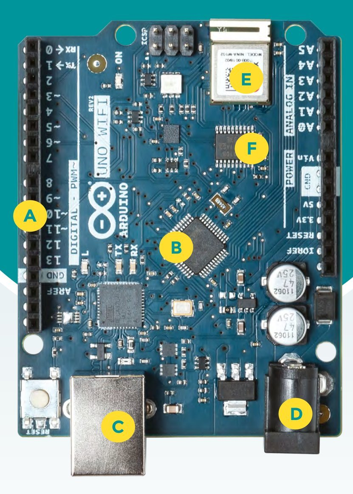

# Capitolul 25 – Turul plăcii Arduino Uno WiFi Rev2

> *Un tur fulger al plăcii Arduino Uno WiFi Rev2*

- **A – Conectorii (headers).** Un Arduino nu e nimic fără hardware suplimentar. Există ca să controleze lumini, butoane, motoare și tot felul de alte gadgeturi. Acestea se leagă prin conectori: fie sub forma unor „shield-uri”, care pun o întreagă placă de circuit deasupra lui Arduino, fie prin fire de legătură individuale, care se leagă la anumiți pini.
- **B – Procesorul.** Un procesor pe 8 biți la 16 MHz poate să nu sune a mare lucru, dar e putere din belșug pentru a controla majoritatea hardware-ului. Unii dintre noi își amintesc că jucau jocuri arcade pe sisteme mult mai puțin puternice. Are de zece ori viteza necesară pentru a controla o pereche de instalatori italieni, așa că majoritatea proiectelor nu ar trebui să ducă lipsă de putere.
- **C – USB.** Acest canal de comunicare bidirecțional îți permite să încarci cod pe placă și, în același timp, să trimiți date înainte și înapoi între un calculator și Arduino. Această comunicare serială este vitală pentru depanare și pentru trimiterea de diagnostice, precum și pentru descărcarea datelor spre prelucrare.
- **D – Alimentarea.** Electronii sunt sângele proiectului tău electronic, și îi injectezi prin acest port. Acceptă între 7 și 12 volți, ceea ce înseamnă că îți poți alimenta proiectul de la o baterie de 9 V sau de la un încărcător de 12 V. Reține că e nevoie de el doar dacă USB-ul nu e conectat.
- **E – WiFi.** Internetul e peste tot, iar conectarea proiectului tău la o rețea WiFi îi dă un potențial uriaș de interactivitate. Ai putea trimite date către un server în cloud pentru prelucrare ulterioară, l-ai putea controla cu telefonul sau i-ai putea lăsa pe alții să vadă ce se întâmplă. Internetul Lucrurilor e aici, așa că hai să ne conectăm propriile dispozitive la el.
- **F – Securitatea.** Internetul e grozav (vezi mai sus), dar deschiderea proiectelor tale spre el vine cu riscuri. Securitatea e primordială; din fericire, această placă vine cu un cip criptografic ECC608, care asigură o criptare rapidă, de cea mai bună calitate, a datelor trimise printr-o rețea nesecurizată.
