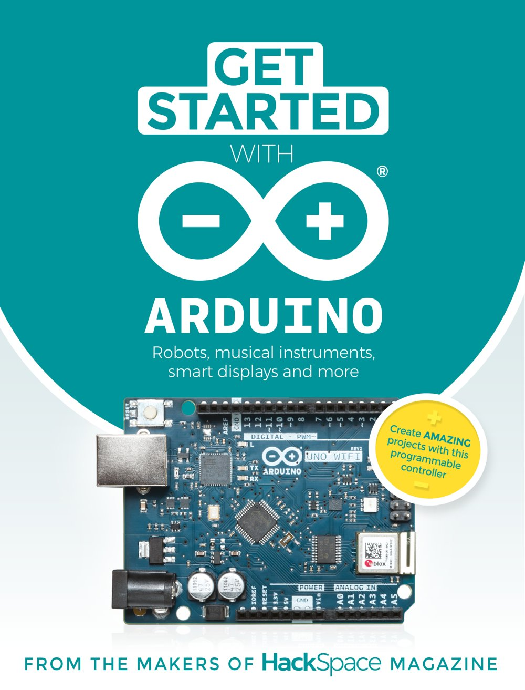

# Primii pași cu Arduino
## Autor: Echipa revistei HackSpace (Raspberry Pi Press)
### Traducere și adaptare: Dan Paraschiv

## Despre această carte

Plăcile Arduino și microcontrolerele compatibile cu Arduino sunt, în esență, calculatoare simple, pe care le putem încorpora ușor în proiectele noastre. Ele ne permit să citim intrări și să creăm ieșiri într-un număr uriaș de moduri. Butoane, suprafețe tactile, senzori de mediu și multe altele pot alimenta aceste calculatoare cu date. Lumini, sunete, mișcări și multe altele pot ieși din ele. Controlându-le cu puțină logică programabilă, putem crea dispozitive cu o gamă foarte largă de interacțiuni.

Cartea, publicată în 2019 de revista **HackSpace** (Raspberry Pi Press), este împărțită în trei părți:

- **Bazele Arduino** (capitolele 1–13): un ghid al plăcilor și al mediului de programare, urmat de o „școală de programare” în pași mici, în care înveți limbajul lui Arduino construind un afișaj cu șapte segmente, un termometru, o consolă de jocuri, un generator de sunet și un repetor infraroșu.
- **Tutoriale de proiecte** (capitolele 14–22): proiecte complete, de la un contor al drumului spre casă și o grădină hidroponică până la un ceas Tetris, un sintetizator, o rețea LoRa și un robot care merge.
- **Inspirație și teste** (capitolele 23–25): proiecte remarcabile ale comunității, recenzii ale unor plăci de dezvoltare și un tur al plăcii Arduino Uno WiFi Rev2.

Nu ai nevoie de cunoștințe anterioare de electronică sau de programare, dar cartea presupune că ești dispus să cumperi câteva componente ieftine, să le legi pe un breadboard și, pentru proiectele mai mari, să lipești cu ciocanul de lipit.

## Cuprins

### Bazele Arduino

1. [**Capitolul 1**](Capitolul01_Ghidul_complet_Arduino.md) - Ghidul complet Arduino – plăcile, accesoriile și mediul de programare
2. [**Capitolul 2**](Capitolul02_Adauga_putere_Arduino_proiectelor_tale.md) - Adaugă putere Arduino proiectelor tale – primii pași în programare
3. [**Capitolul 3**](Capitolul03_Citirea_datelor_digitale.md) - Citirea datelor digitale – butoane și intrări
4. [**Capitolul 4**](Capitolul04_Afisaje_cu_sapte_segmente_si_tablouri_multidimensionale.md) - Afișaje cu șapte segmente și tablouri multidimensionale
5. [**Capitolul 5**](Capitolul05_Multiplexare_operatori_si_patru_afisaje.md) - Multiplexare, operatori și patru afișaje cu șapte segmente
6. [**Capitolul 6**](Capitolul06_Temperatura_umiditate_si_biblioteci.md) - Temperatură, umiditate și biblioteci – senzorul DHT11
7. [**Capitolul 7**](Capitolul07_Stive_clase_si_afisaje_derulante.md) - Stive, clase și afișaje derulante – un termometru arătos
8. [**Capitolul 8**](Capitolul08_Pointeri_si_liste_inlantuite.md) - Pointeri și liste înlănțuite
9. [**Capitolul 9**](Capitolul09_Construieste_o_consola_de_jocuri_partea_1.md) - Construiește o consolă de jocuri (partea 1)
10. [**Capitolul 10**](Capitolul10_Construieste_o_consola_de_jocuri_partea_2.md) - Construiește o consolă de jocuri (partea 2)
11. [**Capitolul 11**](Capitolul11_Sunet_anvelope_si_intreruperi.md) - Sunet, anvelope și întreruperi – un generator de sunet
12. [**Capitolul 12**](Capitolul12_Copiaza_si_trimite_semnale_infrarosu.md) - Copiază și trimite semnale infraroșu – un repetor secret
13. [**Capitolul 13**](Capitolul13_Depanarea.md) - Depanarea – află unde anume merg lucrurile prost

### Tutoriale de proiecte

14. [**Capitolul 14**](Capitolul14_Way_Home_Meter.md) - Way Home Meter – spune-le celor dragi când ajungi acasă
15. [**Capitolul 15**](Capitolul15_Gradina_hidroponica_de_birou.md) - Grădina hidroponică de birou – cultivă-ți propria hrană
16. [**Capitolul 16**](Capitolul16_Un_ceas_cu_cuvinte.md) - Un ceas cu cuvinte – spune ora în cuvinte, într-o carcasă de lemn
17. [**Capitolul 17**](Capitolul17_Sintetizator_digital_polifonic_partea_1.md) - Sintetizator digital polifonic (partea 1)
18. [**Capitolul 18**](Capitolul18_Sintetizator_digital_polifonic_partea_2.md) - Sintetizator digital polifonic (partea 2)
19. [**Capitolul 19**](Capitolul19_Ceas_Tetris_cu_WiFi.md) - Ceas Tetris cu WiFi – ora desenată din piese de Tetris
20. [**Capitolul 20**](Capitolul20_Sa_invatam_LoRa.md) - Să învățăm LoRa! – transmite date către un panou de control online
21. [**Capitolul 21**](Capitolul21_Construieste_primul_tau_robot_care_merge.md) - Construiește primul tău robot care merge – un automat cu patru picioare
22. [**Capitolul 22**](Capitolul22_Construieste_un_sintetizator.md) - Construiește un sintetizator – sintetizator analogic și secvențiator

### Inspirație și teste

23. [**Capitolul 23**](Capitolul23_Inspiratie.md) - Inspirație – Freeduino, Chartreuse, ceasul cu cuvinte, lingura asistivă, Arduinoflake
24. [**Capitolul 24**](Capitolul24_Teste_de_placi.md) - Teste de plăci – Grand Central M4, NeoTrellis M4, Nano Every și 33 IoT, Teensy 4.0, Black și Blue Pill
25. [**Capitolul 25**](Capitolul25_Turul_placii_Arduino_Uno_WiFi_Rev2.md) - Turul plăcii Arduino Uno WiFi Rev2

Imaginile, fotografiile și schemele din cartea originală se găsesc în folderul [imagini](imagini/). Cartea originală, în limba engleză (*Get Started With Arduino*, 180 de pagini, circa 64 MB), nu este inclusă aici din cauza mărimii, dar poate fi descărcată gratuit, în format PDF, din magazinul Raspberry Pi Press: [hsmag.cc/store](https://hsmag.cc/store).

## Cum să folosiți această carte

> **ATENȚIE**
> Cartea originală precizează că este destinată unui public adult și că unele proiecte pot fi periculoase pentru copii. Unele unelte și tehnici prezentate (ciocanul de lipit, tăierea cu laser, sculele electrice) sunt periculoase dacă nu sunt folosite cu pricepere, experiență și echipament de protecție adecvat. Ești responsabil pentru propria siguranță și pentru respectarea legilor și a limitelor impuse de producătorii echipamentelor.

### Pentru copii și tineri

Această carte a fost scrisă pentru cineva curios, care vrea să înțeleagă cum funcționează dispozitivele electronice din jur și să le construiască singur. Nu ai nevoie de cunoștințe anterioare de programare, dar cartea nu este una „pentru începători absoluți”: explică lucrurile pe îndelete, însă merge repede și adânc. Cel mai potrivit este să o parcurgi împreună cu un adult, mai ales la capitolele în care se lipesc componente sau se folosesc scule.

**Citește partea întâi în ordine.** Capitolele 2–13 formează un curs de programare în care fiecare capitol continuă codul din cel anterior. Începe cu un Arduino Uno (sau o clonă compatibilă), un breadboard, câteva LED-uri, rezistoare și fire de legătură; asta e tot ce îți trebuie pentru primele capitole.

**Scrie codul cu mâna ta.** Tot codul din carte este reprodus în casete de cod. Tastează-l singur, nu doar copiază-l: așa înveți sintaxa, iar erorile pe care le faci sunt cele mai bune lecții. Comentariile din cod au rămas în limba engleză, așa cum sunt în original.

**Alege proiectele după posibilități.** Partea a doua conține proiecte de dificultăți foarte diferite. Way Home Meter (capitolul 14) și ceasul Tetris (capitolul 19) se fac fără lipituri complicate; robotul (capitolul 21) și sintetizatorul (capitolul 22) sunt proiecte mari, de mai multe zile.

---

### Pentru părinți

Această carte are un nivel mai ridicat decât cărțile pentru copii despre Scratch sau Python: este scrisă pentru adulți pasionați de electronică, iar unele proiecte presupun lipirea componentelor, folosirea sculelor electrice sau tăierea cu laser. Capitolele de „școală de programare” (2–13) se pot face însă în siguranță cu un Arduino Uno și componente pe breadboard, la tensiuni foarte mici (5 V, de la portul USB al calculatorului). Supravegheați montajele, insistați ca placa să fie deconectată în timpul cablării și, la proiectele cu ciocan de lipit sau cu motoare alimentate de la baterii mari, lucrați împreună.

Un kit de început pentru Arduino (placă, breadboard, LED-uri, rezistoare, butoane, senzori, fire) costă puțin, iar Arduino IDE este gratuit, pentru Windows, macOS și Linux.

---

### Pentru profesori și educatori

Partea întâi a cărții este, practic, un curs de introducere în programarea C/C++ pentru microcontrolere, cu hardware ieftin: variabile și tipuri, tablouri, funcții, biblioteci, clase, pointeri, liste înlănțuite, întreruperi și depanare, fiecare noțiune fiind introdusă exact atunci când un proiect are nevoie de ea. Capitolele pot fi folosite la orele de informatică, fizică sau tehnologie din gimnaziu (clasele mari) și liceu, sau la un club de robotică. Capitolul 1 este un ghid bun pentru alegerea plăcilor la dotarea unui laborator, iar capitolul 24 explică diferențele dintre nucleele ARM Cortex-M pe înțelesul tuturor.

## Convenții folosite în carte

### Codul

Codul apare în casete cu font de cod, marcate ca C++ (limbajul folosit de Arduino). Numele funcțiilor, variabilelor și pinilor apar în text cu font de cod, de exemplu `digitalWrite`, exact ca în original. Comentariile din cod sunt păstrate în engleză.

### Pașii

Proiectele mai lungi sunt împărțite în pași numerotați sau în secțiuni cu titluri, exact ca în cartea originală.

### Casete informative

> **NOTĂ**
> Informații importante de reținut

> **SFAT RAPID**
> Sugestii scurte și idei de adaptare

> **VEI AVEA NEVOIE DE**
> Lista componentelor necesare pentru un proiect

> **DESPRE AUTOR**
> Cine a scris capitolul respectiv, în cartea originală

> **NOTA TRADUCĂTORULUI**
> Explicații adăugate în traducere: servicii sau linkuri care nu mai funcționează, imagini omise, diferențe față de versiunile actuale de hardware sau software

### Ce s-a schimbat față de original

- **Linkuri.** Multe linkuri din carte sunt scurtate prin hsmag.cc/…; am păstrat forma lor. GitHub a retras în 2022 serviciul de scurtare git.io, așa că linkurile de forma git.io/… pot să nu mai funcționeze; codul la care trimiteau este, în mare parte, reprodus în carte.
- **Imagini omise.** Cartea este publicată sub licență Creative Commons „cu excepția locurilor unde se menționează altfel”. Câteva imagini sunt marcate în original cu drepturi de autor sau licențe ale unor terți (fotografii de James Bruton în capitolul 21, schemele de circuit ale lui Look Mum No Computer în capitolul 22, fotografia și diagrama pinilor plăcilor STM32 în capitolul 24). Aceste imagini nu sunt incluse în traducere; acolo unde lipsesc, o notă a traducătorului indică sursa originală.
- **Prețuri și disponibilitate.** Prețurile, adresele magazinelor și versiunile de plăci sunt cele din 2019 și nu au fost actualizate.

## Despre autori

Aceasta este traducerea în limba română a cărții **Get Started With Arduino**, scrisă de echipa revistei HackSpace, revista makerilor, publicată de Raspberry Pi (Trading) Ltd. în 2019 (ISBN 978-1-912047-63-5).

- **Redactor-șef:** Ben Everard
- **Redactor de articole:** Andrew Gregory
- **Redactor de producție a cărții:** Phil King
- **Redactori:** David Higgs, Nicola King
- **Design:** Critical Media – Lee Allen (șef de design), Harriet Knight, Sam Ribbits
- **Contribuitori:** Matt Bradshaw, Jo Hinchliffe, Dr Andrew Lewis, Jenny List, Brian Lough, Graham Morrison, John Wargo
- **Director de publicare:** Russell Barnes

Traducerea și adaptarea în limba română au fost realizate de Dan Paraschiv, inițiatorul proiectului TechLab Junior. Față de original, traducerea adaugă casete „Nota traducătorului”, care explică ce s-a schimbat de la apariția cărții și ce imagini au fost omise.

## Licență

Cartea originală este publicată sub licența **Creative Commons Attribution-NonCommercial-ShareAlike 3.0 Unported (CC BY-NC-SA 3.0)**, cu excepția materialelor marcate altfel, iar această traducere este publicată sub aceeași licență.

---

#### Ce înseamnă această licență

Ești liber să:

- **Partajezi** – să copiezi și să redistribui materialul în orice format
- **Adaptezi** – să remixezi, transformi și construiești pe baza materialului

Cu respectarea următoarelor condiții:

| Condiție | Simbol | Ce presupune |
|---|---|---|
| **Atribuire** | BY | Trebuie să acorzi credit autorilor originali (HackSpace / Raspberry Pi Press) și traducerii, să incluzi un link către licență și să indici dacă au fost făcute modificări. |
| **NonComercial** | NC | Nu poți folosi materialul în scopuri comerciale. |
| **Distribuire în condiții identice** | SA | Dacă remixezi, transformi sau construiești pe baza materialului, trebuie să distribui contribuțiile tale sub aceeași licență ca originalul. |

---

#### În limbaj simplu

> **Profesori și educatori** – Puteți distribui capitole elevilor, puteți folosi materialul în clasă și puteți crea fișe de lucru bazate pe această carte, cu condiția să menționați sursa.
>
> **Elevi și părinți** – Puteți copia, printa și partaja cartea cu prietenii și colegii, gratuit.
>
> **Traducători și creatori de conținut** – Puteți traduce sau adapta materialul, dar rezultatul trebuie publicat sub aceeași licență CC BY-NC-SA și trebuie să menționați lucrarea originală.
>
> **Nimeni** nu poate vinde această carte sau derivatele ei.

---

#### Textul complet al licenței

🔗 [https://creativecommons.org/licenses/by-nc-sa/3.0/legalcode](https://creativecommons.org/licenses/by-nc-sa/3.0/legalcode)

Rezumatul licenței, pe înțelesul tuturor:

🔗 [https://creativecommons.org/licenses/by-nc-sa/3.0/](https://creativecommons.org/licenses/by-nc-sa/3.0/)

---

#### Precizare

Această traducere a fost creată cu scopul de a face electronica și programarea microcontrolerelor accesibile tinerilor din România. Dacă această carte te-a ajutat, cel mai frumos mod de a mulțumi este să o recomanzi altcuiva care ar putea beneficia de ea. Arduino este un proiect open-source, hardware și software, al companiei Arduino – [arduino.cc](https://www.arduino.cc). Revista HackSpace se găsește la [hsmag.cc](https://hsmag.cc).

---

*Primii pași cu Arduino*
*Traducere și adaptare, 2026*
