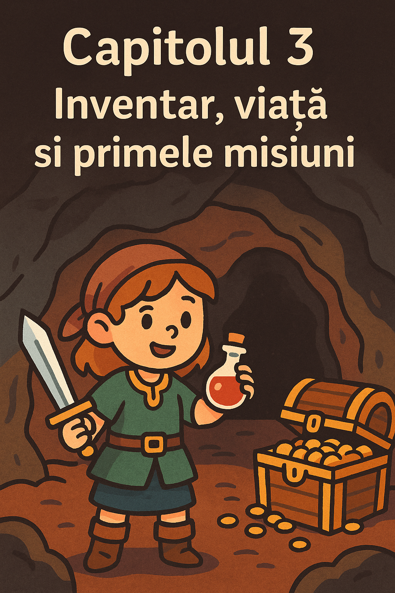

# Capitolul 3 – Inventar, viață și primele misiuni

## De ce avem nevoie de inventar și viață în jocuri?

Până acum am făcut jocuri cu decizii simple. Dar dacă vrei o aventură reală, trebuie să ții minte ce are jucătorul (arme, aur, obiecte magice) și câtă viață îi mai rămâne.

În acest capitol vei învăța să faci asta cu **variabile** (eng. variables) și **liste** (eng. lists), astfel încât să construim primele misiuni reale.

## Ce vei învăța în acest capitol

- Cum să păstrezi informații despre viața și aurul jucătorului.
- Cum să creezi un inventar de obiecte.
- Cum să verifici dacă jucătorul are un anumit obiect.
- Cum să construiești o mini-misiune cu obiective (eng. quests).

## Stocăm viața și aurul jucătorului

Viața și aurul pot fi stocate în variabile numerice:

```python
viata = 10
aur = 5
print("Ai", viata, "puncte de viață și", aur, "monede de aur.")
```

Dacă jucătorul este atacat sau cumpără ceva, modifici valorile acestor variabile:

```python
viata = viata - 2  # pierzi viață
aur = aur + 3      # câștigi aur
```

## Creăm un inventar

Un inventar este o listă (eng. list) care stochează mai multe obiecte:

```python
inventar = ["sabie", "scut"]
print("Ai în inventar:", inventar)
```

### Adăugarea unui obiect

```python
inventar.append("poțiune")
```

### Verificarea unui obiect

```python
if "scut" in inventar:
    print("Ești protejat de atacuri!")
```

## Prima misiune: găsește comoara

Hai să facem o mini-poveste:

- Jucătorul începe în sat cu o sabie și 10 viață.
- Poate merge în pădure să caute aur.
- Dacă găsește aur, poate merge la peșteră să cumpere o poțiune.
- Scopul: să adune suficient aur și să supraviețuiască.

### Cod pas cu pas

#### 1. Setăm starea inițială

```python
viata = 10
aur = 0
inventar = ["sabie"]

print("Bun venit în aventură!")
print("Ai", viata, "viață și", aur, "aur.")
print("În inventarul tău se află:", inventar)
```

#### 2. Alegerea locației

```python
loc = input("Unde mergi? (padure/pestera) ")

if loc == "padure":
    print("Ai găsit 5 monede de aur!")
    aur += 5
elif loc == "pestera":
    print("Peștera este întunecoasă… pierzi 2 viață.")
    viata -= 2
else:
    print("Stai în sat și te odihnești.")
```

#### 3. Folosirea aurului pentru o poțiune

```python
if aur >= 5:
    cumpara = input("Vrei să cumperi o poțiune pentru 5 aur? (da/nu) ")
    if cumpara == "da":
        inventar.append("poțiune")
        aur -= 5
        print("Ai cumpărat o poțiune!")
```

#### 4. Finalul misiunii

```python
print("Inventarul final:", inventar)
print("Viață:", viata, "| Aur:", aur)
```

## Exerciții pentru tine

1. Adaugă o **armură** care să reducă daunele când mergi la peșteră.
2. Creează o a doua locație (**râul**) unde poți găsi un obiect special.
3. Adaugă un **șef final** (dragon, vrăjitor) care apare dacă jucătorul are o sabie.

## Ce urmează în capitolul 4

- Cum să facem bucla principală a jocului (eng. game loop).
- Cum să creăm un joc care nu se închide după o singură alegere.
- Cum să permitem jucătorului să se deplaseze liber între locații.

## Codul complet al capitolului 3

```python
# Starea inițială
viata = 10
aur = 0
inventar = ["sabie"]

print("Bun venit în aventură!")
print("Ai", viata, "viață și", aur, "aur.")
print("În inventarul tău se află:", inventar)

# Alegerea locației
loc = input("Unde mergi? (padure/pestera) ")

if loc == "padure":
    print("Ai găsit 5 monede de aur!")
    aur += 5
elif loc == "pestera":
    print("Peștera este întunecoasă… pierzi 2 viață.")
    viata -= 2
else:
    print("Stai în sat și te odihnești.")

# Cumperi o poțiune dacă ai aur
if aur >= 5:
    cumpara = input("Vrei să cumperi o poțiune pentru 5 aur? (da/nu) ")
    if cumpara == "da":
        inventar.append("poțiune")
        aur -= 5
        print("Ai cumpărat o poțiune!")

# Finalul misiunii
print("Inventarul final:", inventar)
print("Viață:", viata, "| Aur:", aur)
```
