# Capitolul 1 – Tenis: Pong și Boing!

> *La începuturile jocurilor video, ajungeau câteva linii și un punct, iar jucătorii stăteau la coadă ca să joace*

Acest joc simplu se inspiră din ping-pong și îl reduce la strictul necesar. La începutul anilor '70, dezvoltatorii erau nevoiți să lucreze cu cea mai rudimentară tehnologie, dar nici măcar grafica și sunetul primitive nu puteau umbri jocul captivant al lui Pong. În multe privințe, jocurile ca Pong sunt culmea a ceea ce se cheamă „iei și joci”. Principiul de bază e ușor de înțeles pentru jucător și surprinde perfect esența sportului. Ca să joace, jucătorii controlează una dintre cele două palete de pe laturile ecranului și lovesc mingea dintr-o parte în alta, până când unul dintre ei o ratează. Asta cere concentrare și îndemânare și, în același timp, deschide posibilitatea jocului în doi. Pong, care a dat startul acestui tip de joc competitiv, a fost un mare succes pentru dezvoltatorul și editorul Atari, care a livrat mii de cabinete arcade în toată lumea.

## Inspirația

Pong a fost creat de Allan Alcorn ca exercițiu de antrenament, dat de Nolan Bushnell, cofondatorul Atari. Jocurile video erau la început, iar diverși oameni se jucau cu idei, experimentând mecanici simple de joc care aveau să prindă primul val de jucători. Cum jocurile se jucau pe cabinete arcade mari, în care jucătorii trebuiau să bage monede ca să continue, regulile trebuiau să fie destul de simple ca să le înțelegi dintr-o privire și destul de captivante ca să te îndemne să mai joci o dată. Atari-ul lui Nolan a avut un succes uriaș, iar el a vândut în cele din urmă compania către Warner Communications pentru 28 de milioane de dolari.

> **Pong**
>
> **Lansat:** 1972
> **Platforme:** Arcade, console dedicate, Atari 2600
>
> Succesul lui Pong a dus la crearea consolelor Pong de acasă (și a numeroase clone neoficiale), care se conectau la televizor. Au apărut versiuni și pe multe calculatoare personale.
>
> **Alte titluri notabile:** Sanrio World Smash Ball! / Gnop! / Windjammers

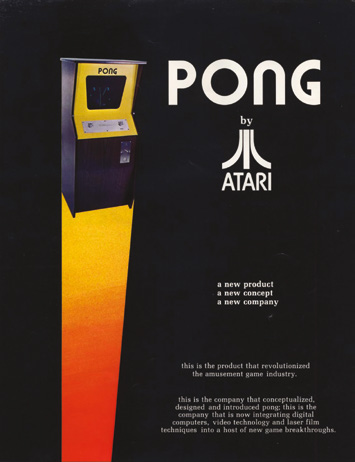

Roagă pe oricine să descrie o partidă de tenis de masă și îți va spune, invariabil, același lucru: sportul implică o masă împărțită în sferturi, un fileu care desparte cele două jumătăți, două palete și o minge frumoasă și rotundă de ping-pong, pe care o lovești de la un jucător la altul. Uită-te însă la jocul video Pong, din 1972, și vei observa câteva diferențe. Masa, de pildă, e împărțită doar în două și e văzută din lateral, paletele arată ca niște simple linii, iar mingea e pătrată. Totuși nimeni, nici măcar acum, n-ar avea mari probleme să pună semn de egalitate între cele două.

La începutul anilor '70, asta era, literalmente, tot ce se putea face. Puținele aparate arcade ale vremii, cu putere mică, nu erau capabile de o grafică realistă, așa că dezvoltatorii trebuiau să fie creativi, sperând că jucătorii cu imaginație vor umple golurile și vor accepta ceea ce încercau ei să obțină. A ajutat enorm faptul că exista, la acea vreme, un apetit uriaș pentru noua industrie a jocurilor video, aflată în formare. Nolan Bushnell era cu siguranță flămând de mai mult; și dacă ar fi strâmbat din nas la Spacewar!, un joc de luptă spațială creat de Steve Russell în 1962, Pong nici n-ar fi existat.

> *Aparatele arcade ale vremii nu erau capabile de o grafică realistă*

„Cel mai important joc pe care l-am jucat a fost Spacewar!, pe un PDP-1, când eram la facultate”, spune el despre shooter-ul spațial pentru doi jucători, popular printre informaticieni și care avea nevoie de o mașină de 120 000 de dolari ca să ruleze. Deși grafica nu era cine știe ce, jocul a fost unul dintre primele jocuri video grafice făcute vreodată. Punea față în față două nave spațiale, iar popularitatea lui s-a răspândit, în parte, pentru că autorii au hotărât că se poate distribui codul gratuit oricui îl voia. „Era un joc grozav, distractiv, provocator, dar se putea juca doar pe un calculator foarte scump, noaptea târziu și în primele ore ale dimineții”, spune Nolan. „După părerea mea, a fost un pas foarte important.”

Nolan a fost atât de cucerit de Spacewar!, încât a făcut o versiune a jocului împreună cu un coleg, Ted Dabney. Lansat în 1971, Computer Space le permitea jucătorilor să controleze o rachetă într-o bătălie cu farfurii zburătoare, scopul fiind să obții mai multe lovituri decât inamicul într-un timp dat. Ca să fie atrăgător pentru jucători, a fost pus într-o serie de cabinete arcade colorate, turnate, în stilul „erei spațiale”. Nolan și Ted au vândut 1500 de bucăți; chiar dacă au câștigat doar 500 de dolari din toată afacerea, a fost destul ca să-i îndemne să continue. Au venit cu ideea pentru Pong și au creat o companie numită Atari.

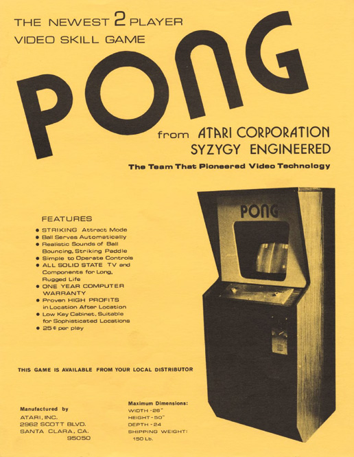

Una dintre cele mai bune mutări ale lor a fost angajarea inginerului Al Alcorn, care lucrase cu Nolan la compania americană de electronice Ampex. Al a fost rugat să creeze un joc de tenis de masă, pornind de la un titlu asemănător lansat pe consola Magnavox Odyssey, sub pretextul că jocul avea să fie lansat de General Electric. În realitate, Nolan voia doar să vadă de ce e în stare Al, dar a rămas uluit de ce a reușit angajatul lui. Captivant și recognoscibil pe loc, Pong putea fi un mare hit, și-a dat seama Atari. Familiaritatea jucătorilor cu jocul însemna că putea fi luat și jucat de aproape oricine.

Chiar și așa, Nolan a avut de furcă până să-i convingă pe ceilalți. Producătorii au refuzat compania, așa că el s-a dus la managerul unui bar numit Andy Capp's, din Sunnyvale, California, și l-a rugat să țină Pong o săptămână. Curând, managerul a trebuit să-l sune pe Nolan ca să-i spună că aparatul se stricase: se umpluse până la refuz cu monede de 25 de cenți de la jucătorii care adorau jocul. Până în 1973, producția cabinetului mergea la turație maximă și s-au vândut 8000 de bucăți. A dus la crearea unei console Pong de acasă, care s-a vândut în peste 150 000 de exemplare. Oamenii stăteau la coadă ca să pună mâna pe una, iar Atari era pe drumul spre a deveni o companie legendară de jocuri.

Pentru Nolan, a fost confirmarea perseverenței și a încrederii lui. Dintr-odată, omul care se apucase de electronică în școală, unde își petrecea timpul construind dispozitive și legând becuri de baterii, era pomenit ca un personaj-cheie al tinerei industrii a jocurilor video. Dar ce au făcut Nolan, Ted, Al și restul echipei Atari ca jocul să fie atât de special? „L-am făcut un joc bun, solid, distractiv”, spune Nolan. „Și l-am făcut simplu, ușor și rapid de înțeles. Să păstrezi lucrurile simple e mai greu decât să construiești ceva complex. Nu poți masca un gameplay prost cu o grafică bună.”

## Cum s-a făcut Pong

La prima vedere, Pong nu arăta a mare lucru. Fiecare parte avea o paletă care putea fi mișcată direct în sus și în jos cu controlerul, iar mingea era lovită dintr-o parte în cealaltă. Scorul se ținea în partea de sus a ecranului, iar ideea era să-l forțezi pe adversar să rateze. Asta însemna că programul jocului trebuia să determine cum e lovită mingea și încotro se duce din acel punct. Și tocmai aici e miezul succesului lui Pong: jocul îi încuraja pe oameni să tot joace și să tot învețe, în speranța că vor dobândi îndemânarea unui maestru.

Când au creat Pong, așadar, designerii au avut în minte câteva lucruri. Una dintre cele mai importante părți ale jocului era mișcarea paletelor. Era vorba de un simplu dreptunghi vertical, care mergea în sus și în jos. Unul dintre avantajele lui Atari atunci când a creat Pong a fost că nu controla doar software-ul, ci și hardware-ul. Construind cabinetul, putea hotărî cum trebuie mișcate paletele. „Cel mai important lucru, dacă vrei să faci gameplay-ul cum trebuie, e să folosești un buton rotativ pentru paletă”, sfătuiește Nolan. „Nimeni n-a făcut un Pong bun cu touchscreen sau cu joystick.”

> **Obiectivele**
>
> **Pe termen scurt:** Asigură-te că mișcarea mingii funcționează perfect, astfel încât mișcarea să fie fluidă și să arate ca în realitate când lovește paletele.
>
> **Pe termen mediu:** Lucrează la unghiurile paletelor. Făcând mingea să reacționeze realist când lovește diferite părți ale unei palete în mișcare, introduci îndemânarea.
>
> **Pe termen lung:** Nolan spune că ai nevoie de o creștere corectă a dificultății. Gândește-te la moduri prin care să-i faci pe cei mai buni jucători să vrea mai mult.

Uită-te de aproape la un cabinet Pong (sunt o mulțime de clipuri pe YouTube care arată jocul în acțiune pe aparatul original) și vei înțelege ce vrea să spună Nolan. Vei observa că jucătorii roteau un buton în sens invers acelor de ceasornic ca să mute paleta în jos și în sensul acelor de ceasornic ca s-o mute în sus. Departe de a fi derutant, era intuitiv.

> *Una dintre cele mai importante părți ale jocului era mișcarea paletelor*

## Mișcarea mingii

Cu paletele în mișcare, dezvoltatorii Atari au putut să se uite la mișcarea mingii. În forma cea mai simplă, dacă mingea continua să atingă paletele, se mișca încontinuu înainte și înapoi. Dacă nu atingea o paletă, își continua drumul în direcția în care pornise și ieșea din ecran. În acel moment, o minge nouă apărea în centrul ecranului, iar avantajul i se dădea jucătorului care tocmai câștigase un punct. Dacă te uiți la filmări cu Pong-ul original, vei vedea că mingea nouă era țintită spre jucătorul care tocmai lăsase mingea să treacă. Exista șansa ca el sau ea să rateze din nou.

Ca să nu piardă, jucătorii trebuiau să fie destul de iuți pe comenzi și să rămână atenți. Să privești mingea mergând înainte și înapoi cu mare viteză putea fi de-a dreptul hipnotizant, pentru că lăsa o dâră neclară pe ecranul cu tub catodic. Nu era nevoie să se irosească putere de calcul cu animarea mingii, pentru că atenția se concentra pe ce se întâmplă când se ciocnește de paletă. Trebuia să se comporte așa cum te aștepți. „Jocul nu exista fără ciocnirile dintre minge și paletă”, spune Nolan.

Al și-a dat seama că mingea trebuia să se comporte diferit în funcție de locul în care lovea paleta. Într-un meci adevărat de tenis, dacă mingea lovește centrul rachetei, se comportă altfel decât o minge care lovește marginea. În mod cert, mingea nu va merge pe un traseu simplu, drept, înainte și înapoi, pe măsură ce o lovești; e foarte probabil să plece mereu într-un unghi. Asta, însă, e partea cea mai delicată din a face Pong. „Mingea ar trebui să sară în sus dintr-o ciocnire în partea de sus a paletei, cu unghiuri tot mai obtuze pe măsură ce te apropii de marginea ei”, spune Nolan. „Asta echilibrează riscul de a rata cu faptul că un unghi obtuz e mai greu de returnat.” Despre asta e vorba în Pong: să te asiguri că lovești mingea cu paleta, dar într-un fel care îi face adversarului greu s-o returneze. „Un jucător vrea ca mingea să fie exact la limita razei de acțiune a adversarului sau să-i fie greu de anticipat.”

> **Învață de la maestru**
>
> *Nolan Bushnell ne spune ce l-a făcut pe Pong grozav.*
>
> **Simplitatea e cheia:** Nolan spune că jocurile în stil Pong trebuie să fie simplu de învățat. Jucătorii trebuie să poată prinde elementele de bază aproape fără instrucțiuni.
>
> **Introdu complexitate:** Jocul trebuie proiectat astfel încât să fie greu de stăpânit. Așa, jucătorii vor vrea să încerce să bată jocul și vor avea un motiv s-o facă.
>
> **Legea lui Bushnell:** Ambele mecanici sunt cuprinse în ceea ce a ajuns să se numească Legea lui Bushnell. Ea spune că jocurile „ar trebui să răsplătească și prima monedă, și a suta”.

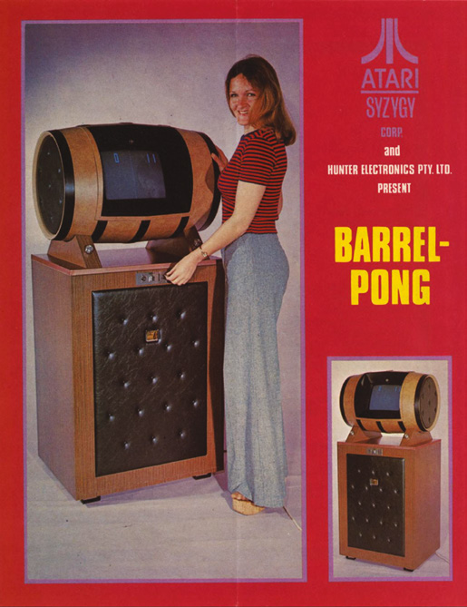

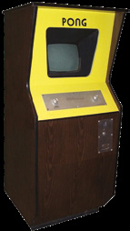

## Crearea limitelor

Ca toate astea să funcționeze cum trebuie, mai era nevoie de un element în joc: o limită în partea de sus și de jos a ecranului. Când jucătorul lovea mingea cu paleta, aceasta putea zbura în sus. Dacă nimic n-ar fi oprit-o, ar fi continuat să se miște până ieșea din ecran. Pong avea un perimetru invizibil sus și jos, care interacționa cu mingea. Trimite mingea în sus și ea lovea această limită și se întorcea în teren sub un alt unghi. Asta permitea ca acțiunea să se desfășoare doar la marginile din stânga și din dreapta ale jocului, adăugând în același timp o dimensiune suplimentară de imprevizibilitate. „Pong era despre mișcare fără cusur”, spune Nolan. Așa că toate astea trebuiau să se întâmple fără ca jucătorul să observe cu adevărat ce se petrece în culise.

O bună detecție a coliziunilor era esențială, iar dezvoltatorii au trebuit să definească înălțimea și lățimea paletelor. Când mingea lovea paleta, codul trebuia să-și dea seama ce să facă cu mingea, evaluând vitezele pe verticală și pe orizontală. Făcea asta verificând poziția mingii în raport cu paleta. Apoi trebuia să schimbe direcția mingii în consecință, ca s-o trimită înapoi peste ecran.

Nolan spune că în codul original al lui Pong trebuia să se țină cont și de altceva: „Trebuia să ia în calcul timpul de reacție de la comenzi până la răspunsul de pe ecran. Întârzierile minuscule contau.” Asta pentru că Pong era gândit să fie alert, așa că răspunsul trebuia să fie cât mai rapid, ca jucătorul să poată reacționa repede la ce se întâmplă pe ecran. O întârziere prea mare ar fi dus la o frustrare imensă. Dezvoltatorii lui Pong aveau nevoie de comenzi care să răspundă prompt. Să-i dai jocul pe tavă adversarului nu e distractiv.

> *Mingea ar trebui să sară cu unghiuri tot mai obtuze pe măsură ce te apropii de marginea paletei*

## Ținerea scorului

Cu toate astea puse la punct, dezvoltatorii au putut să se uite la sistemul de punctaj, care era relativ simplu. Ideea era că de fiecare dată când un jucător rata mingea și o lăsa să treacă în spatele paletei, adversarul primea un punct. În Pong, jocul se termina când unul dintre jucători ajungea la unsprezece puncte, iar acesta era un aspect important al jocurilor din acea perioadă. Cum aparatele cu monede pe care rula Pong cereau jucătorilor să bage bani, trebuia să existe un nivel la care jocul putea fi câștigat; altfel, cineva ar fi putut să plătească o singură dată și să se bucure de joc toată ziua.

„Aveam o limită în varianta cu monede, pentru că jocul trebuia să dureze, în medie, trei minute sau mai puțin”, explică Nolan. Era tipic pentru jocurile arcade de atunci: ideea era ca jucătorii să joace exact cât să se simtă mulțumiți. Dacă pierdeau, puteau plăti din nou sau puteau să-i dea altcuiva șansa să încerce.


## Mai departe

După ce a creat Pong, cariera lui Nolan a mers din succes în succes. Atari a lansat consola Video Computer System (VCS) în 1977, care s-a dovedit extrem de eficientă în a aduce jocurile în casele oamenilor și a cimentat locul companiei în istorie, vânzându-se în peste 30 de milioane de unități. Nolan a plecat un an mai târziu și s-a concentrat pe Chuck E. Cheese Pizza Time Theatre, pe care îl fondase în încercarea de a duce jocurile video în locuri potrivite pentru familii, în acest caz un restaurant. Nolan a produs și roboți de divertisment personal și a fondat compania de divertisment digital uWink în 2000: „Credeam că există o oportunitate uriașă de piață în zona jocurilor sociale.”

Astăzi, Atari poate că nu mai e forța de altădată (deși revine cu o consolă nouă), dar Nolan e privit ca unul dintre cei mai importanți oameni din istoria jocurilor video. Conduce o companie de software educațional numită BrainRush și a fost de mult inclus în Video Game Hall of Fame. Datorită lui Pong, moștenirea lui e cimentată pentru totdeauna.

> **Sfaturi de top**
>
> - Nolan Bushnell spune că trebuie să te asiguri că dificultatea crește pe măsură ce crește numărul de schimburi de mingi.
> - El mai spune că ar trebui să încerci mereu ca lovitura ofensivă cea mai avantajoasă să aibă și cea mai mare probabilitate de a rata.

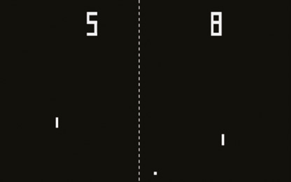

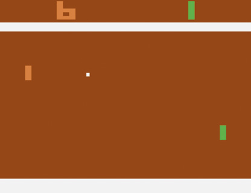

## Refacerea jocului

Când vine vorba să-ți faci propriul joc de tenis în stil Pong, poți fi creativ și poți adăuga propriile tușe. De exemplu, ai putea schimba puțin lucrurile, lăsându-i pe jucători să mute paleta mai liber pe ecran, ca să urmărească mingea în moduri mai complexe. Dar gândește-te bine la tipul de controler pe care îl folosești, fie el gamepad, joystick, buton rotativ sau tastatură.

Cât despre sistemul de punctaj, ai putea configura terenul de joc astfel încât să verifici dacă mingea trece sau nu prin zona aflată imediat în spatele locului în care paleta se mișcă în sus și în jos. Dacă se întâmplă asta, codul își dă seama care parte, stânga sau dreapta, a fost străpunsă, îi spune calculatorului să scoată un sunet și apoi adaugă un punct jucătorului care mânuiește paleta adversă.

Tot ce trebuie să ai în minte e cum obțin jucătorii o victorie. Deși nu trebuie să te îngrijorezi că trebuie să-i faci pe jucători să bage monede într-un aparat arcade, tot merită să ai un punct de final. Cu asta stabilit, poți să-ți îndrepți atenția spre crearea unui final de joc, care intră în acțiune când oricare dintre jucători a atins totalul de puncte dorit. Acesta ar putea fi însoțit de un alt sunet, poate ceva muzică, pentru a semnala că avem un câștigător. Ai putea programa și niște sunete de fiecare dată când mingea lovește paleta, ca să dai puțină atmosferă.

Pe lângă efectele sonore, poți înflori grafica cum vrei. Limitările tehnologiei de atunci au făcut ca Pong-ul original să fie monocrom, dar tu nu trebuie să rămâi la asta. („De fapt, n-aveam culori disponibile în versiunea cu monede când am început”, își amintește Nolan. „Și culorile de pe consolele Pong de acasă erau greu de activat.”) Calculatorul tău nu va avea astfel de probleme, așa că pune culoare, poate schimbă fundalul din negru în altceva și adu acest joc vechi în secolul 21 cu ceva stil.

> **Cum controlezi jocul**
>
> În loc de joystick-uri și gamepad-uri, Pong folosea un controler numit *paddle*. Acesta avea cel puțin un buton de foc și o rotiță, folosită pentru a controla mișcarea de pe ecran. Pong a fost un pionier, fiind primul care a folosit asemenea controlere. Unul dintre cele mai simple moduri de a experimenta cu un asemenea controler e să cauți pe eBay paddle-uri vechi de Atari 2600 și să cumperi un adaptor care permite conectarea lor la calculator prin USB (unul se găsește la 2600-daptor.com). Ai putea și să încerci să-ți construiești unul singur, dacă te pricepi la electronică. Desigur, poți controla jocul și cu un gamepad obișnuit sau cu tastele tastaturii. Explorează diferitele metode ca să-ți faci o idee despre cum pot influența jocul.

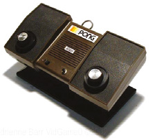

Te poți distra cu adevărat, cu mici înflorituri în anumite momente ale jocului (poate când un jucător ia un avans de cinci puncte sau când atinge scorul maxim împotriva unui adversar rămas la zero) și te poți gândi și la extra-uri. „Fă schimbări care să facă jocul mai distractiv pentru tine”, sfătuiește Nolan. „Să programezi un joc de plăcere e cel mai bun mod de a învăța.”

Pong chiar a fost folosit exact așa, când industria jocurilor era la început. Breakout, lansat de Atari în 1976, de exemplu, care are o paletă ce se mișcă de la stânga la dreapta în partea de jos a ecranului și le cere jucătorilor să distrugă cărămizi cu o minge care sare, s-a bazat pe Pong. Arkanoid, de la Taito, a adăugat mai târziu power-up-uri conceptului din Breakout și a variat nivelurile și tipurile de cărămizi folosite. „Pe măsură ce programatorii capătă încredere și trec de bazele jocului, pot folosi motorul de Pong ca să treacă de la Pong la Breakout sau la Arkanoid, o copie japoneză”, spune Nolan.

> *Frumusețea lui Pong e că te învață niște principii fundamentale de gameplay și de detecție a coliziunilor*

Frumusețea lui Pong e că te învață niște principii fundamentale de gameplay și de detecție a coliziunilor și atinge niște zone complexe de programare. E o introducere grozavă în programare, care te lasă să te joci și să extinzi conceptul odată ce l-ai înțeles.

---

# Programăm azi: Boing!

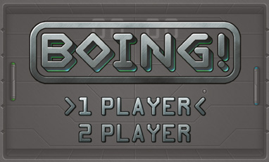

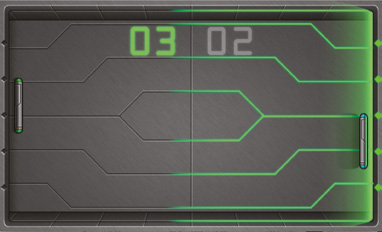

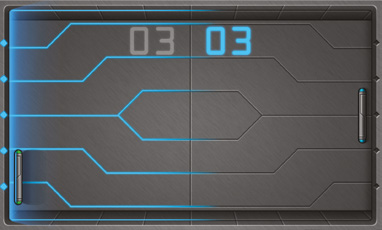

Ca să arătăm cum poate fi programat un joc ca Pong, am creat Boing! folosind Pygame Zero, o unealtă prietenoasă cu începătorii pentru a face jocuri în Python. E un bun punct de plecare pentru a învăța cum funcționează jocurile: se desfășoară pe un singur ecran, fără derulare, există doar trei obiecte în mișcare (două palete și o minge), iar inteligența artificială a jucătorului-calculator poate fi foarte simplă, sau chiar să lipsească, dacă te mulțumești ca jocul să fie doar pentru doi jucători. În cazul nostru, avem atât modul pentru un jucător, cât și modul pentru doi jucători.

> **Descarcă codul**
> Descarcă codul complet comentat al jocului Boing!, împreună cu toată grafica și sunetele, de la wfmag.cc/CTC1-boing

> **NOTA TRADUCĂTORULUI**
> Linkurile scurte wfmag.cc din carte nu mai funcționează. Codul complet comentat al jocului, împreună cu imaginile, sunetele și muzica, se găsește în această traducere în folderul [codul_sursa/boing](codul_sursa/boing/), copiat din depozitul oficial al editurii: [github.com/Wireframe-Magazine/Code-the-Classics](https://github.com/Wireframe-Magazine/Code-the-Classics). Instrucțiunile de instalare pentru Python și Pygame Zero sunt în [Capitolul 6 – Instalarea](Capitolul06_Instalarea.md).

Codul poate fi împărțit în trei părți. Mai întâi, există codul inițial de pornire. Importăm din alte module Python, ca să putem folosi codul lor din al nostru. Apoi verificăm că jucătorul are versiuni suficient de noi de Python și Pygame Zero. Setăm variabilele `WIDTH` și `HEIGHT`, folosite de Pygame Zero când creează fereastra jocului. Creăm și două funcții ajutătoare mici, folosite de codul de mai jos.

Următoarea secțiune e cea mai mare. Creăm patru clase: `Impact`, `Ball`, `Bat` și `Game`. Primele trei moștenesc din clasa `Actor` a lui Pygame Zero, care, printre altele, ține evidența poziției unui obiect în lumea jocului și se ocupă de încărcarea și afișarea sprite-urilor. `Bat` (paleta) și `Ball` (mingea) definesc comportamentul obiectelor corespunzătoare din joc, în timp ce `Impact` e folosită pentru o animație afișată scurt de fiecare dată când mingea sare din ceva. Treaba clasei `Game` e să creeze și să țină evidența obiectelor-cheie ale jocului, cum ar fi cele două palete și mingea.

Mai jos găsim funcțiile `update` și `draw`. Pygame Zero le apelează în fiecare cadru și își propune să mențină o rată de 60 de cadre pe secundă. Logica jocului, cum ar fi actualizarea poziției unui obiect sau stabilirea faptului că s-a marcat un punct, ar trebui să stea în `update`, în timp ce în `draw` îi spunem fiecărui obiect `Actor` să se deseneze singur, pe lângă afișarea fundalurilor, a textului și a altora asemenea.

> *Treaba clasei Game e să creeze și să țină evidența obiectelor-cheie ale jocului*

Funcțiile noastre `update` și `draw` folosesc două variabile globale: `state` și `game`. În orice moment, jocul se poate afla într-una din trei stări: meniul principal, jocul propriu-zis sau ecranul de final. Funcțiile `update` și `draw` citesc variabila `state` și rulează doar codul relevant pentru starea curentă. Deci dacă `state` este, de exemplu, `State.MENU`, `update` verifică dacă s-a apăsat bara de SPAȚIU sau săgețile sus/jos și actualizează meniul în consecință, iar `draw` afișează meniul pe ecran. Termenul tehnic pentru acest tip de sistem este „automat finit” (în engleză, *finite state machine*).

Variabila `game` face referire la o instanță a clasei `Game` descrisă mai sus. Metoda `__init__` (constructorul) a clasei `Game` primește, opțional, un parametru numit `controls`. Când creăm un obiect `Game` nou pentru meniul principal, nu dăm acest parametru, așa că jocul va rula în modul „de atragere” (*attract mode*); cu alte cuvinte, cât timp ești în meniul principal, vei vedea în fundal doi jucători controlați de calculator jucând unul împotriva celuilalt. Când jucătorul alege să înceapă un joc nou, înlocuim instanța `Game` existentă cu una nouă, inițializând-o cu informații despre comenzile folosite de fiecare jucător; dacă nu sunt specificate comenzile pentru al doilea jucător, înseamnă că jucătorul a ales un joc pentru o singură persoană, așa că al doilea va fi controlat de calculator.

> **Pas cu pas prin timp**
>
> 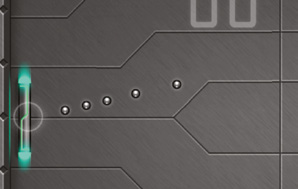
>
> Mingea pornește cu o viteză de cinci pixeli pe cadru și accelerează cu un pixel pe cadru de fiecare dată când lovește o paletă. Cel mai simplu mod de a trata viteza unui obiect e să-i actualizezi pur și simplu poziția cu distanța dorită în fiecare cadru. Totuși, pot apărea probleme, mai ales când un obiect se mișcă foarte repede. Să zicem că mingea se mișcă orizontal cu zece pixeli pe cadru și e pe cale să lovească o paletă aflată la doi pixeli distanță. Dacă actualizăm poziția mingii cu zece pixeli, ea va fi ajuns cu opt pixeli mai departe decât ar fi trebuit. În unele jocuri, acest tip de problemă poate duce la obiecte care trec unele prin altele, sau prin pereți, când se mișcă foarte repede. Există mai multe moduri de a rezolva asta; abordarea pe care am ales-o aici (și în alte jocuri din această carte) este să împărțim mișcarea mingii într-o serie de pași mici, verificând coliziunile după fiecare pas. Pentru un joc complex, cu multe obiecte în mișcare, acest tip de abordare poate fi ineficient, dar pentru un joc mai simplu, ca acesta, e ideal.

## Două tipuri de mișcare

În Boing!, clasele `Bat` și `Ball` moștenesc din clasa `Actor` a lui Pygame Zero, care oferă mai multe moduri de a specifica poziția unui obiect. În acest joc, ca și în jocurile din capitolele următoare, setăm pozițiile folosind atributele `x` și `y`, care implicit indică unde va fi centrul sprite-ului pe ecran. Desigur, nu putem doar să setăm poziția unui obiect la început și gata: dacă vrem să se miște pe măsură ce jocul avansează, trebuie să-i actualizăm poziția în fiecare cadru. În cazul unei palete (`Bat`), mișcarea e foarte simplă. În fiecare cadru verificăm dacă jucătorul respectiv (care poate fi un om sau calculatorul) vrea să se miște; dacă da, scădem sau adunăm 4 la coordonata Y a paletei, în funcție de direcția în care vrea să se miște, sus sau jos. Ne asigurăm și că paleta nu iese prin partea de sus sau de jos a ecranului. Așadar, nu doar că ne mișcăm pe o singură axă, dar coordonata noastră Y va fi mereu un întreg (adică un număr fără zecimale). Pentru multe jocuri, acest tip simplu de mișcare e suficient. Chiar și în jocurile în care un obiect se poate mișca și pe axa X, și pe axa Y, putem adesea gândi mișcarea pe fiecare axă ca fiind separată. De exemplu, în jocul din capitolul următor, Cavern, jucătorul poate apăsa săgeata dreapta și deci se mișcă pe axa X cu 4 pixeli pe cadru, în timp ce pe axa Y se mișcă cu 10 pixeli pe cadru din cauza gravitației. Mișcarea pe fiecare axă e independentă de cealaltă.

> **NOTA TRADUCĂTORULUI**
> În codul tipărit, viteza paletei este dată de constanta `PLAYER_SPEED`, care are valoarea 6, nu 4, cum scrie în textul original. Sensul explicației rămâne același.

Pentru minge (`Ball`), lucrurile se complică puțin. Nu doar că se poate mișca sub orice unghi, dar trebuie să se miște și cu aceeași viteză, indiferent de direcție. Imaginează-ți mingea mișcându-se cu un pixel pe cadru spre dreapta. Acum imaginează-ți că încerci s-o faci să se miște la un unghi de 45° față de asta, punând-o să se mute un pixel la dreapta și un pixel în sus în fiecare cadru. Asta e o distanță mai mare, deci per total s-ar mișca mai repede. Nu e bine, și nici n-am început măcar să ne gândim la mișcarea în orice direcție posibilă.

> *Capabilă să se miște sub orice unghi, mingea trebuie să se miște cu aceeași viteză indiferent de direcție*

Soluția e să folosim matematica vectorială și trigonometria. În contextul unui joc 2D, un vector e pur și simplu o pereche de numere: X și Y. Vectorii pot fi folosiți în multe feluri, dar cel mai des reprezintă poziții sau direcții.

Vei observa că clasa `Ball` are o pereche de atribute, `dx` și `dy`. Împreună, ele formează un vector care reprezintă direcția în care se îndreaptă mingea. Dacă `dx` și `dy` sunt 1 și 0.5, atunci de fiecare dată când mingea se mișcă, se va muta cu un pixel pe axa X și cu jumătate de pixel pe axa Y. Ce înseamnă să te miști jumătate de pixel? Când desenează un sprite, Pygame Zero îi rotunjește poziția la cel mai apropiat pixel. Rezultatul e că sprite-ul nostru se va muta în jos pe ecran cu un pixel la fiecare al doilea cadru și cu un pixel spre dreapta în fiecare cadru (Figura 1).

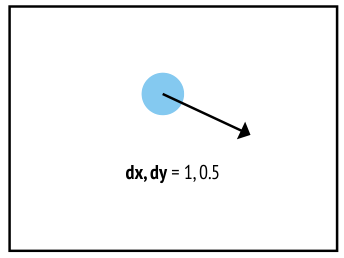

> **Figura 1**
> `dx` și `dy` reprezintă un vector de direcție. Mingea se va muta cu 1 pixel la dreapta și cu jumătate de pixel în jos de fiecare dată când se mișcă. Acest vector se poate scrie și (1, 0.5).
> `dx, dy = 1, 0.5`

Tot trebuie să ne asigurăm că obiectul nostru se mișcă cu o viteză constantă, indiferent de direcție. Ce trebuie să facem e să ne asigurăm că vectorul nostru de direcție e mereu un „vector unitate”: un vector care reprezintă o distanță de unu (aici, unu înseamnă un pixel, dar în unele jocuri va reprezenta o altă distanță, cum ar fi un metru). Aproape de începutul codului vei observa o funcție numită `normalised`. Ea primește o pereche de numere care reprezintă un vector, folosește funcția `math.hypot` din Python ca să calculeze lungimea acelui vector, apoi împarte ambele componente, X și Y, ale vectorului la acea lungime, rezultând un vector care arată în aceeași direcție, dar are lungimea unu (Figura 2).

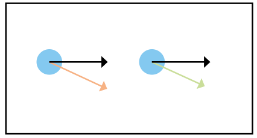

> **Figura 2**
> Totuși, vectorii de direcție ar trebui să fie mereu vectori unitate: ar trebui să aibă lungimea de 1 unitate (în cazul acestui joc, 1 unitate înseamnă 1 pixel). Vectorul negru (1, 0) are lungimea 1, dar vectorul portocaliu (1, 0.5) are aproximativ 1.12 unități. Împărțind componentele x și y ale unui vector la lungimea lui obținem un vector unitate; asta se numește normalizare, de aici și numele funcției `normalised`. Făcând asta pentru vectorul (1, 0.5) obținem aproximativ (0.89, 0.45), arătat mai sus prin vectorul verde.

Matematica vectorială e un domeniu vast și aici doar am zgâriat suprafața. Poți găsi multe tutoriale online și îți recomandăm să te uiți și la clasa `Vector2` din Pygame (biblioteca peste care e construit Pygame Zero).

> **Eu, unul, le urez bun venit noilor noștri stăpâni, inteligențele artificiale**
>
> În modul pentru un jucător, mișcarea celei de-a doua palete e determinată apelând metoda `ai` din clasa `Bat`. Există multe abordări ale inteligenței artificiale, chiar și pentru un joc atât de simplu ca Boing!. La nivelul cel mai simplu, AI-ul ar putea pur și simplu să-l facă pe jucătorul-calculator să urmărească exact mișcarea mingii (ținând cont de viteza maximă cu care paleta are voie să se miște). La nivelul cel mai avansat, s-ar putea folosi machine learning de ultimă oră, dar asta depășește cu mult scopul acestei cărți. În acest joc, AI-ul pe care l-am scris e cu un mic pas peste sistemul cel mai simplu descris mai sus. Când mingea e departe de paletă, AI-ul ține paleta în centrul ecranului pe axa Y, pregătită ca mingea să treacă fie deasupra, fie dedesubt; dar pe măsură ce mingea se apropie, AI-ul ține tot mai mult cont de poziția ei. Asta reflectă ideea că, pe măsură ce mingea se apropie, avem o idee mai bună despre unde va ajunge.

> **Provocări**
>
> - Clasa `Game` conține un atribut `ai_offset`, care primește o valoare aleatoare de fiecare dată când mingea sare dintr-o paletă. Îți dai seama la ce folosește? Încearcă să schimbi argumentele date lui `random.randint` și vezi ce se întâmplă. Ce-ar fi dacă l-ai ține fixat la zero, apoi ai începe un joc nou și n-ai atinge comenzile?
> - Există mai multe moduri în care poți face jocul mai ușor sau mai greu; la câte te poți gândi?
> - Folosim funcția `math.hypot` din Python ca să calculăm lungimea unui vector. Ce teoremă matematică celebră stă la baza ei? Încearcă să-ți dai seama singur înainte să cauți pe Google!
> - În codul descărcabil (folderul [codul_sursa/boing](codul_sursa/boing/)) am inclus un sistem AI alternativ, mai avansat. Îți dai seama cum să-l activezi?

## Codul jocului Boing!

> **Cum rulezi jocul**
> Deschide fișierul `boing.py` într-un editor Python, cum ar fi IDLE, și alege Run > Run Module. Pentru mai multe detalii, vezi [Capitolul 6 – Instalarea](Capitolul06_Instalarea.md).

> **NOTA TRADUCĂTORULUI**
> Listarea de mai jos este codul jocului așa cum apare în carte: versiunea din depozitul editurii, fără comentariile lungi. Fișierul din [codul_sursa/boing/boing.py](codul_sursa/boing/boing.py) este aceeași versiune, dar cu toate comentariile autorilor (în engleză), și merită citit în paralel. Codul folosește indentare cu 3 spații, ca în carte; Python acceptă orice număr de spații, atâta timp cât ești consecvent. Jocul are nevoie de Python 3.6 sau mai nou și de Pygame Zero 1.2 sau mai nou; îl pornești cu `python3 boing.py`, din folderul în care se află fișierul, alături de folderele `images`, `sounds` și `music`.

```python
import pgzero, pgzrun, pygame
import math, sys, random
from enum import Enum

if sys.version_info < (3,6):
    print("This game requires at least version 3.6 of Python. Please download it from www.python.org")
    sys.exit()

pgzero_version = [int(s) if s.isnumeric() else s for s in pgzero.__version__.split('.')]
if pgzero_version < [1,2]:
    print(f"This game requires at least version 1.2 of Pygame Zero. You have version {pgzero.__version__}. Please upgrade using the command 'pip3 install --upgrade pgzero'")
    sys.exit()

WIDTH = 800
HEIGHT = 480
TITLE = "Boing!"

HALF_WIDTH = WIDTH // 2
HALF_HEIGHT = HEIGHT // 2

PLAYER_SPEED = 6
MAX_AI_SPEED = 6

def normalised(x, y):
    length = math.hypot(x, y)
    return (x / length, y / length)

def sign(x):
    return -1 if x < 0 else 1

class Impact(Actor):
    def __init__(self, pos):
        super().__init__("blank", pos)
        self.time = 0

    def update(self):
        self.image = "impact" + str(self.time // 2)

        self.time += 1

class Ball(Actor):
    def __init__(self, dx):
        super().__init__("ball", (0,0))

        self.x, self.y = HALF_WIDTH, HALF_HEIGHT

        self.dx, self.dy = dx, 0

        self.speed = 5

    def update(self):
        for i in range(self.speed):
            original_x = self.x

            self.x += self.dx
            self.y += self.dy

            if abs(self.x - HALF_WIDTH) >= 344 and abs(original_x - HALF_WIDTH) < 344:
                if self.x < HALF_WIDTH:
                    new_dir_x = 1
                    bat = game.bats[0]
                else:
                    new_dir_x = -1
                    bat = game.bats[1]

                difference_y = self.y - bat.y

                if difference_y > -64 and difference_y < 64:
                    self.dx = -self.dx

                    self.dy += difference_y / 128

                    self.dy = min(max(self.dy, -1), 1)

                    self.dx, self.dy = normalised(self.dx, self.dy)

                    game.impacts.append(Impact((self.x - new_dir_x * 10, self.y)))

                    self.speed += 1

                    game.ai_offset = random.randint(-10, 10)

                    bat.timer = 10

                    game.play_sound("hit", 5)  # play every time in addition to:
                    if self.speed <= 10:
                        game.play_sound("hit_slow", 1)
                    elif self.speed <= 12:
                        game.play_sound("hit_medium", 1)
                    elif self.speed <= 16:
                        game.play_sound("hit_fast", 1)
                    else:
                        game.play_sound("hit_veryfast", 1)

            if abs(self.y - HALF_HEIGHT) > 220:
                self.dy = -self.dy
                self.y += self.dy

                game.impacts.append(Impact(self.pos))

                game.play_sound("bounce", 5)
                game.play_sound("bounce_synth", 1)

    def out(self):
        return self.x < 0 or self.x > WIDTH

class Bat(Actor):
    def __init__(self, player, move_func=None):
        x = 40 if player == 0 else 760
        y = HALF_HEIGHT
        super().__init__("blank", (x, y))

        self.player = player
        self.score = 0

        if move_func != None:
            self.move_func = move_func
        else:
            self.move_func = self.ai

        self.timer = 0

    def update(self):
        self.timer -= 1

        y_movement = self.move_func()

        self.y = min(400, max(80, self.y + y_movement))

        frame = 0
        if self.timer > 0:
            if game.ball.out():
                frame = 2
            else:
                frame = 1

        self.image = "bat" + str(self.player) + str(frame)

    def ai(self):
        x_distance = abs(game.ball.x - self.x)

        target_y_1 = HALF_HEIGHT

        target_y_2 = game.ball.y + game.ai_offset

        weight1 = min(1, x_distance / HALF_WIDTH)
        weight2 = 1 - weight1

        target_y = (weight1 * target_y_1) + (weight2 * target_y_2)

        return min(MAX_AI_SPEED, max(-MAX_AI_SPEED, target_y - self.y))

class Game:
    def __init__(self, controls=(None, None)):
        self.bats = [Bat(0, controls[0]), Bat(1, controls[1])]

        self.ball = Ball(-1)

        self.impacts = []

        self.ai_offset = 0

    def update(self):
        for obj in self.bats + [self.ball] + self.impacts:
            obj.update()

        for i in range(len(self.impacts) - 1, -1, -1):
            if self.impacts[i].time >= 10:
                del self.impacts[i]

        if self.ball.out():
            scoring_player = 1 if self.ball.x < HALF_WIDTH else 0
            losing_player = 1 - scoring_player

            if self.bats[losing_player].timer < 0:
                self.bats[scoring_player].score += 1

                game.play_sound("score_goal", 1)

                self.bats[losing_player].timer = 20

            elif self.bats[losing_player].timer == 0:
                direction = -1 if losing_player == 0 else 1
                self.ball = Ball(direction)

    def draw(self):
        screen.blit("table", (0,0))

        for p in (0,1):
            if self.bats[p].timer > 0 and game.ball.out():
                screen.blit("effect" + str(p), (0,0))

        for obj in self.bats + [self.ball] + self.impacts:
            obj.draw()

        for p in (0,1):
            score = f"{self.bats[p].score:02d}"
            for i in (0,1):
                colour = "0"
                other_p = 1 - p
                if self.bats[other_p].timer > 0 and game.ball.out():
                    colour = "2" if p == 0  else "1"
                image = "digit" + colour + str(score[i])
                screen.blit(image, (255 + (160 * p) + (i * 55), 46))

    def play_sound(self, name, count=1, menu_sound=False):
        if self.bats[0].move_func != self.bats[0].ai or menu_sound:
            try:
                getattr(sounds, name + str(random.randint(0, count - 1))).play()
            except Exception as e:
                pass

def p1_controls():
    move = 0
    if keyboard.z or keyboard.down:
        move = PLAYER_SPEED
    elif keyboard.a or keyboard.up:
        move = -PLAYER_SPEED
    return move

def p2_controls():
    move = 0
    if keyboard.m:
        move = PLAYER_SPEED
    elif keyboard.k:
        move = -PLAYER_SPEED
    return move

class State(Enum):
    MENU = 1
    PLAY = 2
    GAME_OVER = 3

num_players = 1

space_down = False

def update():
    global state, game, num_players, space_down

    space_pressed = False
    if keyboard.space and not space_down:
        space_pressed = True
    space_down = keyboard.space

    if state == State.MENU:
        if space_pressed:
            state = State.PLAY
            controls = [p1_controls]
            controls.append(p2_controls if num_players == 2 else None)
            game = Game(controls)
        else:
            if num_players == 2 and keyboard.up:
                game.play_sound("up", menu_sound=True)
                num_players = 1
            elif num_players == 1 and keyboard.down:
                game.play_sound("down", menu_sound=True)
                num_players = 2

            game.update()

    elif state == State.PLAY:
        if max(game.bats[0].score, game.bats[1].score) > 9:
            state = State.GAME_OVER
        else:
            game.update()

    elif state == State.GAME_OVER:
        if space_pressed:
            state = State.MENU
            num_players = 1

            game = Game()

def draw():
    game.draw()

    if state == State.MENU:
        menu_image = "menu" + str(num_players - 1)
        screen.blit(menu_image, (0,0))

    elif state == State.GAME_OVER:
        screen.blit("over", (0,0))

try:
    pygame.mixer.quit()
    pygame.mixer.init(44100, -16, 2, 1024)

    music.play("theme")
    music.set_volume(0.3)
except Exception:
    pass

state = State.MENU

game = Game()

pgzrun.go()
```

## Grafica jocului

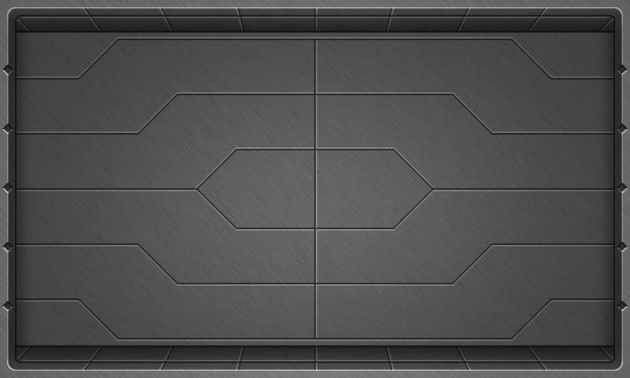

**1.** Fundalul nu trebuie să fie prea încărcat, ca mingea să rămână vizibilă.

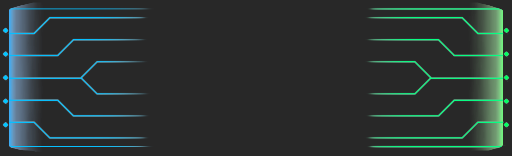

**2.** Straturi colorate diferit apar când una dintre părți câștigă un punct.


**3.** Sprite-ul mingii e simplu; mișcarea ei nu e.

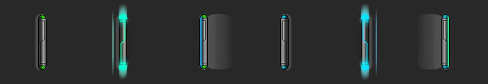

**4.** Fiecare paletă are trei versiuni: normală, cu umbră (când se pierde un punct) și lovind mingea.

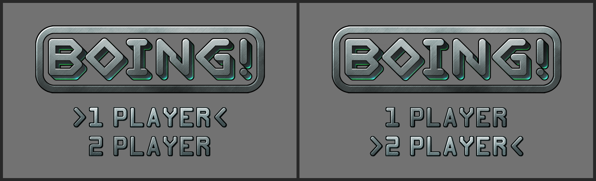

**5.** Ecranul de titlu oferă alegerea între modul cu un jucător și cel cu doi jucători.


**6.** Cifrele folosite pentru afișarea scorurilor, colorate diferit pentru fiecare jucător.


**7.** Există cinci sprite-uri de impact, numerotate de la 0 la 4.

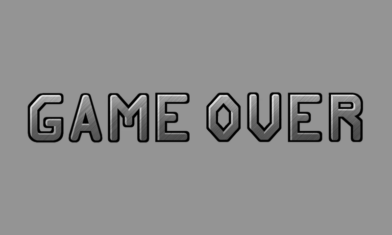

---

[← Cuvânt înainte](Cuvant_inainte.md) | [Capitolul 2 – Platformer de acțiune: Bubble Bobble și Cavern →](Capitolul02_Platformer_de_actiune_Bubble_Bobble_si_Cavern.md)
