# Capitolul 2 – Platformer de acțiune: Bubble Bobble și Cavern

> *Mereu popular, genul jocurilor de platforme e încă plin de posibilități creative*

Jocurile de platforme (în engleză, *platformers*) presupun mutarea unui personaj printr-o serie de platforme pline de obstacole, sărind, trăgând și evitând răufăcătorii întâlniți pe drum. Pot fi jucate singur sau cu un prieten: produs de Taito, Bubble Bobble a fost un joc de platforme arcade dificil (și incredibil de popular), cooperativ, pentru doi jucători, care a făcut o trecere reușită pe calculatoarele de acasă. Avea în rolurile principale doi frați, Bubby și Bobby, transformați într-o pereche de creaturi drăgălașe, cunoscute afectuos ca Bub și Bob, de către maleficul Baron Von Blubba. Cu iubitele lor răpite, îi așteptau 100 de niveluri de acțiune rapidă și dificilă, în încercarea de a le salva, luptându-se pe drum cu tot felul de lighioane. Așa cum sugerează și numele jocului, baloanele de săpun jucau un rol major: trebuia să le tragi în inamici ca să-i amețești, apoi să le spargi ca să-i elimini. Odată ce un ecran era curățat de rivali, era timpul să avansezi la nivelul următor.

## Inspirația

Bubble Bobble a fost proiectat de Fukio Mitsuji, care a creat și o continuare incredibil de populară, Rainbow Islands. A fost portat pe multe mașini, inclusiv pe Commodore 64, unde conversia a fost supervizată de Stephen Ruddy, care a lucrat la jocuri precum Target: Renegade, FIFA 99 și MotoGP 09/10. Ruddy lucrează și acum în industria jocurilor, la Yippee Entertainment. Din păcate, Mitsuji-san a murit pe 11 decembrie 2008, la 48 de ani. În anii '90, și-a folosit talentul de designer de jocuri predându-le programatorilor trucuri noi. A lucrat și ca freelancer la titluri precum Magical Puzzle Popils, pe Sega Game Gear.

> **Bubble Bobble**
>
> **Lansat:** 1986
> **Platforme:** Arcade, Commodore 64, ZX Spectrum, Amiga, Atari ST, MSX 2, Amstrad CPC, Sharp X68000, PC, Apple II, FM Towns Marty, Sega Master System, Game Boy, Game Boy Color, PlayStation, Sega Saturn, NES, SNES, Game Gear
>
> Ca multe jocuri clasice ale trecutului, Bubble Bobble s-a născut în sălile de jocuri arcade și a ajuns mai târziu pe multe alte mașini.
>
> **Alte titluri notabile:** Donkey Kong / Mario / Prince of Persia

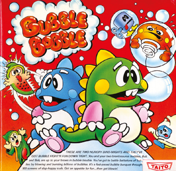

Există jocuri în care poți alege arme de o eficiență devastatoare. Tunuri gravitaționale, săbii magice, BFG-uri și grenade sunt toate alegeri bune. Fără îndoială, fiecare dintre ele are potențialul de a provoca daune dușmanilor, ceea ce le face foarte eficiente în luptă. Dar dacă n-ai avea de ales? Dacă singurul lucru pe care l-ai avea la îndemână ar fi un simplu balon de săpun, da, o peliculă subțire de apă cu săpun, umplută cu aer? Oricât de aiurea ar suna, un joc din anii '80 a folosit exact asta. Numele lui? Bubble Bobble.

Oricine a avut norocul să se distreze cu acest emblematic platformer arcade din 1986 va înțelege cât de eficiente pot fi baloanele. Erau folosite ca să prindă inamicii și, când erau sparte, îi expediau cu ușurință. Cu puțină finețe, mai multe baloane puteau scăpa de mai mulți inamici deodată, pentru puncte în plus. Iar mai târziu în joc, ele își arată adevărata valoare ca platforme plutitoare temporare (și uneori mortale), care îl duc pe jucător de la un nivel la altul.

Designerul jocului, Fukio Mitsuji, căuta ceva nou. În anii '80, platformerele erau un pilon al jocurilor, formând o felie mare (și adesea uniformă) a industriei. Dezvoltatori ca Mitsuji și-au dat seama că trebuie să creeze ceva care să le facă titlul să iasă în evidență. În cazul lui Bubble Bobble, au fost introduse două personaje *kawaii* numite Bub și Bob, iar acțiunea se desfășura pe 100 de ecrane statice. În ciuda premisei simple, jocul s-a dovedit extrem de captivant și, de asemenea, destul de complex.

Jocul era compulsiv și îi făcea pe jucători să revină pentru mai mult. Acțiunea tremurândă a baloanelor, care serveau drept arme și drept platforme temporare (diabolic de dificile) de pe care săreai, era imprevizibilă. Existau bonusuri ascunse și power-up-uri, și moduri diferite de a scăpa de inamici (se puteau produce baloane speciale care, când erau sparte, atacau dușmanii cu apă, fulgere sau foc). O etapă era terminată când toți inamicii erau distruși, dar nivelul de dificultate creștea pe măsură ce avansai. Și exista claritate pentru jucător: structura de bază a jocului rămânea aceeași de la început la sfârșit, urmând aceleași reguli definitorii pentru gen, stabilite de Space Panic la începutul deceniului.

## Sărituri pe platforme

În general, platformerele le ofereau jucătorilor ocazia de a sări printr-un mediu presărat cu platforme, cu obstacole de evitat și inamici de răpus. Unul dintre cele mai populare a fost Donkey Kong, în care juca Mario, sau Jumpman, cum era cunoscut pe atunci. În timp, platformerele au fost combinate cu alte genuri, cum ar fi beat-'em-up-urile și jocurile de aventură.

Dar chiar și în forma lor cea mai pură, s-au dovedit adesea captivante. Dezvoltatorii căutau să injecteze propriile lor mici răsuciri în joc, introducând concepte noi și originale. Jocul arcade Mario Bros., lansat de Nintendo în 1983, a introdus jocul cooperativ simultan pentru doi jucători, un concept pe care Bubble Bobble l-a preluat. „În acest joc, trebuia să joci cooperativ ca să ajungi la adevăratul final”, spunea Mitsuji.

Bubble Bobble a fost primul joc al lui Mitsuji. L-a dezvoltat pentru Taito, un producător de jocuri arcade care obținuse un succes uriaș în 1978 cu lansarea lui Space Invaders, deși făcuse și alte titluri înainte, inclusiv Speed Race, în 1974. Cu jocuri precum Qix, în 1981, și Elevator Action, în 1983, la activ, Taito își construise o reputație solidă. Era mereu în căutare de jocuri care să-i facă pe jucători să bage monedă după monedă în aparatele sale. Bubble Bobble a adus cu el amestecul potrivit de inovație și dependență.

Mitsuji punea popularitatea durabilă a jocului pe seama lui Bub și Bob, dar spunea și că abilitatea unică de a trage cu baloane era o atracție majoră pentru jucătorii care căutau ceva nou (dorința lui de a inova era atât de puternică, încât era hotărât să nu producă niciodată o continuare directă). Faptul că era un joc arcade însemna că trebuia să fie și accesibil, și ușor de învățat. De aceea, venea cu foarte puțin tam-tam, preferând să lase jocul să vorbească de la sine. Acest aspect a fost portat și în versiunile pentru calculatoarele de acasă.

> *Abilitatea unică de a trage cu baloane era o atracție majoră pentru jucătorii care căutau ceva nou*

Stephen Ruddy a fost responsabil pentru conversia pe Commodore 64, pe care a creat-o pe când lucra la Software Creations. La acea vreme, editorul și dezvoltatorul avea sediul deasupra unui magazin de calculatoare, vizavi de studiourile BBC North West de pe Oxford Road, în Manchester, iar Stephen primise slujba după ce răspunsese la un anunț din ziarul Manchester Evening News. Sarcina lui era să identifice structura jocului și să-l reprogrameze.

„Structura de bază a jocurilor e că ai un front-end și un back-end”, explică el. „Front-end-ul e format, de obicei, dintr-un fel de mod de atragere [adică ceva care să-l atragă pe jucător spre joc și să-l entuziasmeze] și din interfața cu utilizatorul, care configurează jocul. Back-end-ul e de obicei un manager de joc, care gestionează o interfață cu utilizatorul, o grămadă de obiecte de joc și un mediu în care ele operează. Fiind un joc arcade, Bubble Bobble avea foarte puțin front-end. Un ecran de titlu, o buclă de atragere și un tabel cu scoruri mari erau cam tot ce conținea.”

Concentrându-se pe back-end, Mitsuji urmărea să elimine orice preambul inutil, care altfel ar fi încetinit ritmul în care monedele jucătorilor intrau în fantă. Asta însemna că se putea concentra pe managerul jocului. „Managerul se concentra, în esență, pe viețile jucătorului, trei în cazul lui Bubble Bobble, precum și pe interfața de introducere și pe ciclul jocului”, continuă Stephen.

## Ecran fără derulare

Cum toată acțiunea din Bubble Bobble se desfășura pe o serie de ecrane individuale, fără derulare, era mult mai ușor pentru dezvoltatori ca Stephen s-o reproducă pe calculatoarele și consolele de acasă. Elimina, de exemplu, nevoia unui sistem de gestionare a scenei, pentru că, într-un mediu atât de mic, era nevoie doar de un număr limitat de obiecte.

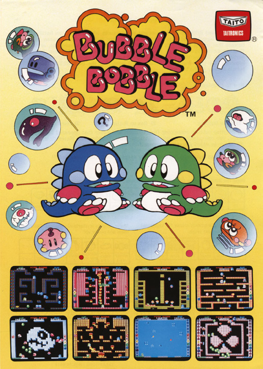

„Un sistem de gestionare a scenei e complex, dar e necesar doar dacă ai un mediu mare, cu potențial multe mii de obiecte de joc”, explică Stephen. „El identifică și actualizează doar obiectele care au nevoie să fie actualizate și randează doar obiectele care sunt pe ecran. La fel, verifică coliziunile doar pentru primitivele de coliziune relevante.

„Cu un sistem pe un singur ecran și un număr limitat de obiecte, nimic din toate astea nu e necesar. Poți pur și simplu să presupui că toate obiectele trebuie actualizate și toate obiectele trebuie randate. Obiectele își pot gestiona singure coliziunile, în loc să existe un sistem separat de fizică, coliziuni și rezolvare a coliziunilor, de un fel sau altul.”

Bubble Bobble avea multe obiecte. Erau Bub și Bob înșiși, desigur, dar exista și o varietate de arme. Pe lângă baloane, jucătorii trebuiau să evite mingi de foc, picături de apă, foc, fulgere, pietre și bombe. Trebuiau să evite și inamicii, răufăcătorii fiind roboți, fantome, balene, ursuleți, arcuri, gândaci, pitici, invadatori și un boss. În plus, existau obiecte de colecționat, cum ar fi fructe, bonusuri și power-up-uri.

„În unele jocuri, mediul poate fi uimitor de complex și poate fi el însuși alcătuit din obiecte de joc, dar în Bubble Bobble mediul era o simplă hartă 2D din dale, cu câteva efecte de mediu atașate”, spune Stephen. „În cazul lui Bubble Bobble, harta din dale era, de fapt, doar date de coliziune: un indicator care spunea dacă dala conține sau nu o platformă și o setare de direcție a „curentului de aer”, care indica în ce direcție trebuie să plutească baloanele în timp (0–3 pentru sus, jos, stânga, dreapta).”

> **Obiectivele**
>
> **Pe termen scurt:** Distrează-te. Stephen Ruddy spune că cel mai important lucru e pura plăcere creativă a întregului proces: de fiecare dată pornești de la zero. Așa că lucrează la elementele de bază.
>
> **Pe termen mediu:** Începe să construiești nivelurile. Distrează-te cu designul nivelurilor și vezi ce idei îți vin.
>
> **Pe termen lung:** Începe să te gândești ce altceva vei putea adăuga în amestec. Odată ce treci de simplele sprite-uri 2D, randarea cu shadere complexe și modele 3D cu schelet este un domeniu interesant și răsplătitor pentru designerii de jocuri.

## Suflând baloane

Dintre toate aceste obiecte, baloanele erau cele mai importante. Multă vreme și atenție au fost acordate acestei mecanici, ca să se asigure că ele se comportă așa cum se aștepta jucătorul. Când un balon era creat de jucător, primea o anumită viteză orizontală. Esențial, includea și o „durată de viață pentru coliziunea cu răufăcătorii”, care indica cât timp putea rămâne un inamic într-un balon înainte ca acesta să se spargă singur și să-l lase să scape. Exista și o setare de durată totală de viață, ca balonul să nu zăbovească prea mult.

„Când jucătorul trăgea un balon, acesta avea grijă de el însuși, călătorind orizontal conform configurării și transformându-se într-un balon cu „răufăcător capturat” dacă atingea un inamic”, explică Stephen. „Setarea de răufăcător se potrivea apoi cu răufăcătorul capturat, iar balonul verifica singur dacă intră în coliziune cu jucătorul.” Cu alte cuvinte, dacă o parte țepoasă a jucătorului (spatele, capul sau picioarele, dacă butonul de săritură nu era apăsat) atingea balonul, acesta se spărgea. Dacă intra în contact cu fața lui Bub sau Bob, balonul era pur și simplu împins mai departe. Codul aștepta până se întâmpla unul dintre aceste evenimente și apoi acționa.

Codul știa și dacă nu exista niciun contact între balon și inamici. „Dacă balonul nu atingea niciun răufăcător până la sfârșitul duratei sale de viață pentru coliziuni, atunci se transforma într-un „balon plutitor”, care pur și simplu plutea în direcția curentului de aer definit în harta de dale”, spune Stephen. Poate suna complicat, dar, în esență, programatorii stabileau doar interacțiunea dintre baloane și personajele jucătorului și ale inamicilor.

„Jucătorul se ocupa doar de acțiunile pe care le putea face jucătorul (adică mișcarea și tragerea); celelalte obiecte aveau grijă de ele însele, intrând în coliziune cu jucătorul sau unele cu altele”, continuă Stephen. „Așa că, de exemplu, un balon testa dacă e în coliziune cu jucătorul și fie se spărgea, fie era împins din drum, iar un răufăcător testa dacă e în coliziune cu jucătorul și fie îl omora pe jucător, fie se omora pe sine (dacă jucătorul era invulnerabil datorită unui power-up).”

## Descifrarea

Cum Stephen porta un joc arcade deja existent, el și echipa de la Software Creations nu aveau niciun cuvânt de spus în designul jocului. Așa că, pentru a stăpâni toate aspectele lui Bubble Bobble în timpul conversiei, dezvoltatorii au trebuit să joace jocul iar și iar, notând toate nuanțele diferite ale gameplay-ului. Apoi era treaba lor să descifreze mecanicile jocului și să le reproducă pentru piața de acasă.

Mecanicile profunde ale jocului, cum ar fi o limită de timp pentru capturarea unui inamic, erau o provocare de descâlcit. „Baloanele cu „răufăcător capturat” se spărgeau și eliberau răufăcătorul pe care îl conțineau, dar răufăcătorul eliberat era pus în starea „grăbește-te””, explică Stephen.

„Asta era vizibil diferit, pentru că folosea o colorare roșie. Viteza de mișcare era și ea dublată. În nivelurile ulterioare, asta era folosită ca un stimulent care să-l facă pe jucător să planifice când să tragă un balon și când să spargă răufăcătorii, pentru că baloanele zburau spre anumite zone ale ecranului.” Jucătorii trebuiau să fie atenți și când venea vorba de prinderea literelor bonus, care aveau și ele o durată de viață finită. Pericolele ca fulgerele, apa și focul aveau durate de viață infinite și trebuiau tratate altfel.

> *Mecanicile profunde, cum ar fi o limită de timp pentru capturarea unui inamic, erau o provocare de descâlcit*

> **Învață de la maestru**
>
> *Stephen Ruddy oferă câteva sfaturi excelente pentru oricine vrea să-și programeze propriile jocuri.*
>
> **Nu te teme:** Stephen spune că nu trebuie să-ți fie frică să înveți abilități noi sau să ceri ajutor.
>
> **Folosește-ți cunoștințele:** Cu cât stăpânești mai multe tehnici, cu atât îți va fi mai ușor când te confrunți cu ceva nou.
>
> **Știi când să te oprești:** Când e gata, e gata. Trebuie să înveți să ignori tentația de a-ți rescrie codul și să mergi mai departe.

Toate astea au fost o bună curbă de învățare pentru Stephen, care dezvoltase până atunci doar trei jocuri pe Commodore 64: Mystery of the Nile, în 1986, și, în anul următor, Kinetik și The Big KO!. Dar cum Bubble Bobble era mai complex decât și-a imaginat la început, unele mecanici au fost ratate. „Nu știam regulile după care jocul arcade decidea ce obiecte apar”, spune el, „dar pe unele le-am descifrat pur și simplu jucând.”

Bubble Bobble avea un obiect bonus și un obiect power-up care apăreau la fiecare nivel. „Obiectul bonus pur și simplu îi dădea jucătorului puncte și era ales în funcție de cât de repede terminase jucătorul nivelul anterior: cu cât mai repede, cu atât mai valoros era obiectul bonus. Obiectul power-up era ales după un set complex de reguli, care reflecta și el felul în care jucătorul terminase nivelul anterior. Astăzi, aceste nuanțe se găsesc pe internet, dar în conversiile noastre am observat unele, dar nu și altele, și am sfârșit cu un sistem implicit ponderat.”

La fel de problematic era felul în care jucătorii controlau personajele. În Bubble Bobble, Bub și Bob se puteau mișca la stânga și la dreapta și puteau și sări. În versiunea arcade, exista un joystick simplu cu două direcții și două butoane pentru asta: unul pentru săritură și unul pentru tragere. Pe majoritatea sistemelor de acasă, joystick-urile nu aveau două butoane, așa că a trebuit găsită o soluție ocolitoare, pentru a reproduce mai bine experiența pe mașini ca Commodore 64.

„Comenzile sunt întotdeauna partea cea mai delicată din dezvoltarea jocurilor”, spune Stephen. „Chiar nu există scurtături, așa că trebuie să le tot rafinezi până când „se simt” bine. Pentru versiunea de Commodore 64, principala problemă era că aveam un buton mai puțin decât aparatul arcade. Folosea un joystick cu patru direcții plus foc, spre deosebire de un joystick cu două direcții, împreună cu săritură și foc.” Soluția a fost să folosească direcția sus a joystick-ului pentru săritură, dar chiar și așa, mișcarea în Bubble Bobble era mai complicată decât părea la prima vedere.

„Jucătorul se mișca pe platforme și era blocat de orice dală solidă care se afla în calea „picioarelor” personajului”, spune Stephen. „Dar logica mișcării laterale era diferită când nu erai pe o platformă. Jucătorul se putea mișca indiferent dacă „picioarele” personajului erau deja înfipte într-o celulă solidă. La fel, când cădeau, personajele jucătorilor aterizau doar pe platforme care aveau spațiu liber deasupra lor.”

> **Sfaturi de top**
>
> - Experimentează cu baloane diferite. Jocul avea trei baloane elementale, fulger, apă și foc, care puteau distruge inamicii în moduri diferite.
> - Gândește-te la un boss în jocul tău, astfel încât, după ce toate creaturile sunt învinse, să existe o provocare monstruoasă, care să-i țină pe jucători în priză și să adauge varietate.

## Adunarea punctelor

Ca jucătorii să rămână motivați, ei puteau construi un scor mare pe măsură ce treceau prin etape. Când un inamic era omorât, de exemplu, se transforma în mâncare, care putea fi apoi colectată pentru puncte. Multe obiecte diferite aveau valori diferite de puncte, ceea ce introducea o porție sănătoasă de strategie în joc.

Un ardei verde valora 10 puncte, de exemplu, un nap 60, o banană 500, iar cartofii prăjiți 1000. Exista bere la 4000 de puncte, bijuterii roșii la 7000 și coroane de aur la 10 000. Existau și o mulțime de declanșatoare asociate, care puteau depinde de cât de repede terminaseși etapa anterioară.

„Elementul competitiv de bază al oricărui joc arcade e scorul jucătorului și un tabel cu scoruri mari: e cârligul care te face să te întorci pentru încă o încercare, ca să-ți depășești propriul record și să fii cel mai bun la joc”, spune Stephen. „Astăzi, asta s-a extins cu clasamentele, care încorporează un aspect social în care poți vedea, provoca și bate scorurile prietenilor tăi, precum și toate scorurile din lume; e încă un motor-cheie care îi face pe jucători să revină ca să se îmbunătățească.”

> *Elementul competitiv de bază al oricărui joc arcade e scorul jucătorului și un tabel cu scoruri mari*

Modul pentru doi jucători al jocului a fost și el crucial în a-i prinde pe jucători. Bubble Bobble putea fi jucat de una sau două persoane, iar modul cooperativ era cel care îl făcea o bucurie atât de durabilă. Într-adevăr, Mitsuji voia ca Bubble Bobble să fie un joc pe care cuplurile să se bucure să-l joace împreună. Vedea jocurile ca pe un hobby de care se poate bucura oricine, indiferent de gen, și voia să încurajeze în special mai multe jucătoare, pentru că ele erau rar văzute în sălile de jocuri japoneze.

Uneori, era aproape ca și cum Mitsuji ar fi avut un sac fără fund în care arunca idei. Puteai colecta litere care formau cuvântul „EXTEND” ca să primești o viață în plus, puteai lua o umbrelă și sări peste niveluri, sau puteai intra în camere secrete și accesa bonusuri ascunse. Existau chiar și finaluri multiple. Primul era un final „rău” pentru jucătorii singuri, care o salvau doar pe Betty, nu și pe Patty, și îi spunea jucătorului să „nu-și uite niciodată prietenul”. Finalul bun avea nevoie de doi jucători și le salva atât pe Betty, cât și pe Patty, deblocând în același timp un Super Mode, care încuraja rejucarea jocului (evident, ca jucătorii să bage mai multe monede). Odată terminat și acesta, părinții lui Bub și Bob erau în sfârșit dezvăluiți.

„Nu am implementat finalurile multiple din arcade, pur și simplu pentru că nu știam de ele”, recunoaște Stephen. Din fericire, asta nu a stricat atracția jocurilor portate. Practic fiecare sistem de acasă a fost binecuvântat cu prezența lui Bub și Bob, fie ca o conversie a jocului arcade original, fie într-unul dintre numeroasele spin-off-uri.

Faptul că porturile directe erau încă considerate geniale, deși nu erau întru totul fidele, arată că mecanicile de bază ale lui Bubble Bobble puteau sta foarte bine singure ca un clasic. De fapt, singurul port fidel în mare măsură a fost versiunea pentru Sega Master System, pe care Taito a programat-o ea însăși. Dar asta nu înseamnă că Taito a fost zgârcită și a ținut codul sursă pentru sine la celelalte versiuni. Dimpotrivă, l-a împărtășit cu dezvoltatorii celorlalte versiuni, dar comentariile erau în japoneză, ceea ce îl făcea greu de urmărit pentru echipele care nu vorbeau limba.

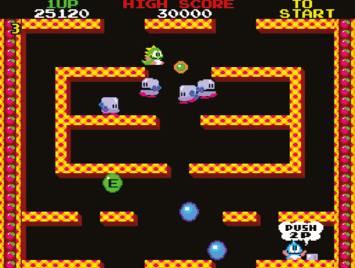

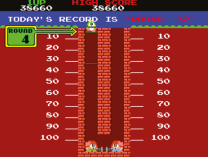

Totuși, a fost o bună curbă de învățare pentru Stephen. „Nu încetezi niciodată să înveți, așa că nu te teme de nimic”, sfătuiește el. „S-ar putea să ți se ceară să programezi ceva ce n-ai mai făcut niciodată, așa că nu trebuie să-ți fie frică să înveți abilități noi sau să ceri ajutor. Simplul adevăr e că nimeni nu cunoaște fiecare metodologie, algoritm sau tehnologie, pentru că, desigur, unele noi sunt create, extrase sau fabricate tot timpul. Din fericire, cu cât stăpânești mai multe, cu atât se reduce teama când te confrunți cu ceva nou și necunoscut.”

> **Adăugarea complexității**
>
> Deși Bubble Bobble a fost un joc destul de simplu de creat, chiar dacă dificil de dus la bun sfârșit în mod satisfăcător, există multe domenii ale programării jocurilor care devin mai complexe cu cât jocul tău se bazează mai mult pe ele. Potrivit lui Stephen Ruddy, gestionarea scenei devine mai importantă și presupune împărțirea unui mediu mare în bucăți mai mici, mai ușor de gestionat pentru actualizare sau randare. Pentru lumi 2D sau 3D mai mari, asta devine esențial. La fel, spune el: „Simularea fizicii, coliziunile și restituirea în 2D și 3D pot fi foarte complexe și se bazează pe probabil cea mai complexă matematică pe care o vei întâlni în dezvoltarea jocurilor.” Să-ți placă aceste subiecte e util, deși nu esențial, pentru a face jocuri. Și, în final, el opinează: „Sunetul e adesea neglijat, pentru că majoritatea oamenilor doar redau un eșantion când are loc un eveniment. Dar mixarea software, atenuările complexe și redarea în flux pe mai multe piste pot fi și ele necesare, dacă jocul tău are nevoie de un sunet complex.”

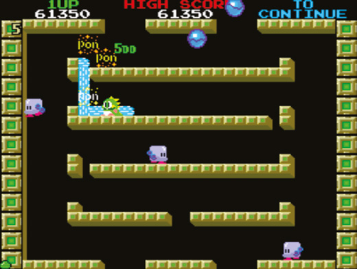

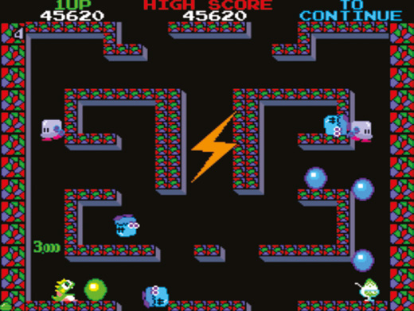

---

# Programăm azi: Cavern

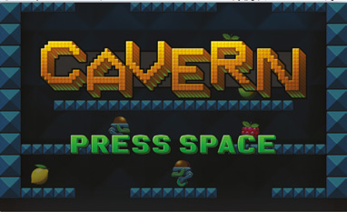

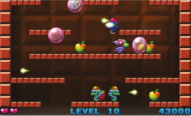

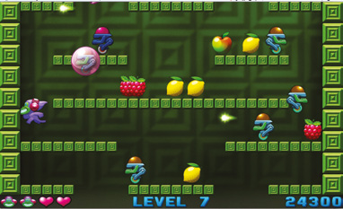

Ca și Bubble Bobble, jocul nostru Cavern se desfășoară pe un singur ecran. Inamicii roboți sunt creați chiar deasupra marginii de sus a ecranului și cad în nivel. Jucătorul poate trage cu globuri (în cod, `Orb`): dacă un robot atinge un glob, rămâne prins înăuntru. Globurile se sparg fie după patru secunde, fie când ajung în partea de sus a ecranului. Roboții pot trage cu fulgere (`Bolt`), care pot sparge globurile sau răni jucătorul. Există două tipuri de roboți: unul standard și unul mai agresiv, care are abilitatea de a trage intenționat în globuri.

> **Descarcă codul**
> Descarcă codul complet comentat al jocului Cavern, împreună cu toată grafica și sunetele, de la wfmag.cc/CTC1-cavern

> **NOTA TRADUCĂTORULUI**
> Linkul scurt de mai sus nu mai funcționează. Codul complet comentat, cu imaginile, sunetele și muzica, se găsește în folderul [codul_sursa/cavern](codul_sursa/cavern/). Instrucțiunile de instalare sunt în [Capitolul 6 – Instalarea](Capitolul06_Instalarea.md) și, pe scurt, în [codul_sursa/README.md](codul_sursa/README.md).

Clasa `Fruit` reprezintă obiectele pe care jucătorul le poate colecta. În mod normal, aceste obiecte sunt, așa cum sugerează numele, fructe, care cresc scorul jucătorului. Totuși, există și obiecte care cresc sănătatea jucătorului sau dau o viață în plus. Fructele sunt lăsate în urmă când un glob care conține un robot ajunge în partea de sus a ecranului și sunt create și în poziții aleatoare, la fiecare 100 de cadre. Power-up-urile de sănătate în plus și de viață în plus au o șansă de a fi create când e spart un glob care conține tipul mai agresiv de robot.

Fiecare dintre clasele menționate mai sus moștenește fie din `CollideActor`, fie din `GravityActor`. `CollideActor`, care moștenește din clasa `Actor` a lui Pygame Zero, oferă o metodă `move`, care mută obiectul în direcția specificată, dar nu-l lasă să treacă prin pereți. `GravityActor` moștenește din `CollideActor` și permite obiectelor să fie afectate de gravitație.

Clasa `Game` păstrează o referință la obiectul jucător, precum și liste de fructe, fulgere, inamici, globuri și „pop”-uri (obiecte care afișează animația de spargere a unui glob, similare cu obiectele `Impact` din Boing!). La începutul fiecărui nivel, obiectul `game` configurează grila de blocuri care va forma nivelul, decide câți inamici de fiecare tip vor fi în acest nivel și creează o listă amestecată aleator de tipuri de inamici, care determină ordinea în care vor apărea diferitele tipuri de inamici.

> **Cum sunt construite nivelurile**
>
> 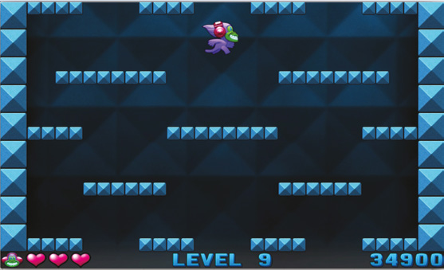
>
> Nivelurile din Cavern sunt formate din blocuri, fiecare bloc având 25×25 de pixeli. La începutul codului vei vedea o listă numită `LEVELS`, care conține alte trei liste, corespunzătoare celor trei configurații de nivel din joc. Fiecare listă de nivel conține 17 șiruri de caractere, fiecare șir reprezentând un rând. În cadrul fiecărui rând, un caracter spațiu înseamnă că nu există bloc în acea poziție; orice alt caracter (noi am folosit `X`) reprezintă un bloc. Un șir gol indică un rând fără blocuri. Ai putea observa că variabila `NUM_ROWS` este 18, ceea ce nu pare să se potrivească cu numărul de rânduri din listele de nivel. În metoda `Game.next_level`, adăugăm o copie a primului rând la sfârșitul datelor nivelului, astfel încât primul și ultimul rând să fie identice.

Ca și în Boing!, partea finală a codului folosește un sistem simplu de automat finit pentru a actualiza și desena obiectele jocului. Există și funcții pentru desenarea textului și a scorului, sănătății și numărului de vieți ale jucătorului.

> **De neînțeles?**
>
> 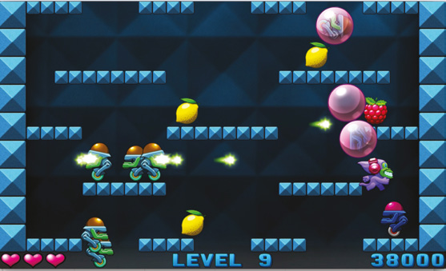
>
> Vei vedea uneori cod de forma `[x*2 for x in range(10)]`. Acesta folosește o funcționalitate foarte utilă a lui Python, cunoscută drept *list comprehension* (construirea unei liste dintr-o descriere). În acest caz, codul generează numerele de la 0 la 9, înmulțește fiecare cu doi și pune numerele rezultate într-o listă. În Cavern, folosim această funcționalitate pentru a elimina obiecte din liste. De exemplu, ia linia `self.enemies = [e for e in self.enemies if e.alive]`. Aceasta creează o listă nouă, formată din elementele listei `self.enemies` existente, excluzându-le pe cele care nu mai sunt în viață. Noua listă înlocuiește apoi lista de inamici existentă. Ține cont că, dacă ar exista alte variabile în afară de `self.enemies` care să se refere la aceeași listă, această tehnică nu le-ar afecta, iar ele ar continua să se refere la versiunea veche a listei. În Cavern, asta nu e o problemă, iar list comprehension-urile ne permit să facem într-o singură linie ceea ce altfel ar lua cel puțin trei linii.

> **Provocări**
>
> - În Bubble Bobble, baloanele nu se sparg automat când ajung în partea de sus a ecranului; în schimb, plutesc de colo-colo și, dacă sunt lăsate destul de mult, inamicii din baloane pot scăpa (și se întorc mai furioși, mișcându-se cu viteză mărită). Jucătorul poate sparge baloanele mergând, căzând sau sărind în ele. Spargerea baloanelor putea provoca și o reacție în lanț, spărgând alte baloane din apropiere. Cum ai schimba jocul ca să se potrivească cu asta?
> - În prezent, ținerea apăsată a barei de SPAȚIU îl face pe jucător să sufle un glob mai departe peste nivel. Ce-ar fi dacă, în loc de asta, ținerea apăsată a barei de SPAȚIU l-ar face pe jucător să creeze o serie de globuri în succesiune rapidă? Ca jocul să rămână echilibrat, ar trebui să schimbi și alte lucruri, cum ar fi numărul total de inamici, numărul maxim de pe ecran și rata lor de creare.

## Codul jocului Cavern

> **Cum rulezi jocul**
> Deschide fișierul `cavern.py` într-un editor Python, cum ar fi IDLE, și alege Run > Run Module. Pentru mai multe detalii, vezi [Capitolul 6 – Instalarea](Capitolul06_Instalarea.md).

> **NOTA TRADUCĂTORULUI**
> Ca și la Boing!, listarea de mai jos este versiunea din depozitul editurii, fără comentarii. Fișierul [codul_sursa/cavern/cavern.py](codul_sursa/cavern/cavern.py) conține aceeași versiune, cu toate comentariile autorilor. Comenzile jocului: săgețile stânga/dreapta pentru mers, săgeata sus pentru săritură, SPAȚIU pentru a sufla un glob (ținut apăsat, globul zboară mai departe).

```python
from random import choice, randint, random, shuffle
from enum import Enum
import pygame, pgzero, pgzrun, sys

if sys.version_info < (3,5):
    print("This game requires at least version 3.5 of Python. Please download it from www.python.org")
    sys.exit()

pgzero_version = [int(s) if s.isnumeric() else s for s in pgzero.__version__.split('.')]
if pgzero_version < [1,2]:
    print("This game requires at least version 1.2 of Pygame Zero. You have version {0}. Please upgrade using the command 'pip3 install --upgrade pgzero'".format(pgzero.__version__))
    sys.exit()

WIDTH = 800
HEIGHT = 480
TITLE = "Cavern"

NUM_ROWS = 18
NUM_COLUMNS = 28

LEVEL_X_OFFSET = 50
GRID_BLOCK_SIZE = 25

ANCHOR_CENTRE = ("center", "center")
ANCHOR_CENTRE_BOTTOM = ("center", "bottom")

LEVELS = [ ["XXXXX     XXXXXXXX     XXXXX",
            "","","","",
            "   XXXXXXX        XXXXXXX   ",
            "","","",
            "   XXXXXXXXXXXXXXXXXXXXXX   ",
            "","","",
            "XXXXXXXXX          XXXXXXXXX",
            "","",""],

           ["XXXX    XXXXXXXXXXXX    XXXX",
            "","","","",
            "    XXXXXXXXXXXXXXXXXXXX    ",
            "","","",
            "XXXXXX                XXXXXX",
            "      X              X      ",
            "       X            X       ",
            "        X          X        ",
            "         X        X         ",
            "","",""],

           ["XXXX    XXXX    XXXX    XXXX",
            "","","","",
            "  XXXXXXXX        XXXXXXXX  ",
            "","","",
            "XXXX      XXXXXXXX      XXXX",
            "","","",
            "    XXXXXX        XXXXXX    ",
            "","",""]]

def block(x,y):
    grid_x = (x - LEVEL_X_OFFSET) // GRID_BLOCK_SIZE
    grid_y = y // GRID_BLOCK_SIZE
    if grid_y > 0 and grid_y < NUM_ROWS:
        row = game.grid[grid_y]
        return grid_x >= 0 and grid_x < NUM_COLUMNS and len(row) > 0 and row[grid_x] != " "
    else:
        return False

def sign(x):
    return -1 if x < 0 else 1

class CollideActor(Actor):
    def __init__(self, pos, anchor=ANCHOR_CENTRE):
        super().__init__("blank", pos, anchor)

    def move(self, dx, dy, speed):
        new_x, new_y = int(self.x), int(self.y)

        for i in range(speed):
            new_x, new_y = new_x + dx, new_y + dy

            if new_x < 70 or new_x > 730:
                return True

            if ((dy > 0 and new_y % GRID_BLOCK_SIZE == 0 or
                 dx > 0 and new_x % GRID_BLOCK_SIZE == 0 or
                 dx < 0 and new_x % GRID_BLOCK_SIZE == GRID_BLOCK_SIZE-1)
                and block(new_x, new_y)):
                    return True

            self.pos = new_x, new_y

        return False

class Orb(CollideActor):
    MAX_TIMER = 250

    def __init__(self, pos, dir_x):
        super().__init__(pos)

        self.direction_x = dir_x
        self.floating = False
        self.trapped_enemy_type = None      # Number representing which type of enemy is trapped in this bubble
        self.timer = -1
        self.blown_frames = 6  # Number of frames during which we will be pushed horizontally

    def hit_test(self, bolt):
        collided = self.collidepoint(bolt.pos)
        if collided:
            self.timer = Orb.MAX_TIMER - 1
        return collided

    def update(self):
        self.timer += 1

        if self.floating:
            self.move(0, -1, randint(1, 2))
        else:
            if self.move(self.direction_x, 0, 4):
                self.floating = True

        if self.timer == self.blown_frames:
            self.floating = True
        elif self.timer >= Orb.MAX_TIMER or self.y <= -40:
            game.pops.append(Pop(self.pos, 1))
            if self.trapped_enemy_type != None:
                game.fruits.append(Fruit(self.pos, self.trapped_enemy_type))
            game.play_sound("pop", 4)

        if self.timer < 9:
            self.image = "orb" + str(self.timer // 3)
        else:
            if self.trapped_enemy_type != None:
                self.image = "trap" + str(self.trapped_enemy_type) + str((self.timer // 4) % 8)
            else:
                self.image = "orb" + str(3 + (((self.timer - 9) // 8) % 4))

class Bolt(CollideActor):
    SPEED = 7

    def __init__(self, pos, dir_x):
        super().__init__(pos)

        self.direction_x = dir_x
        self.active = True

    def update(self):
        if self.move(self.direction_x, 0, Bolt.SPEED):
            self.active = False
        else:
            for obj in game.orbs + [game.player]:
                if obj and obj.hit_test(self):
                    self.active = False
                    break

        direction_idx = "1" if self.direction_x > 0 else "0"
        anim_frame = str((game.timer // 4) % 2)
        self.image = "bolt" + direction_idx + anim_frame

class Pop(Actor):
    def __init__(self, pos, type):
        super().__init__("blank", pos)

        self.type = type
        self.timer = -1

    def update(self):
        self.timer += 1
        self.image = "pop" + str(self.type) + str(self.timer // 2)

class GravityActor(CollideActor):
    MAX_FALL_SPEED = 10

    def __init__(self, pos):
        super().__init__(pos, ANCHOR_CENTRE_BOTTOM)

        self.vel_y = 0
        self.landed = False

    def update(self, detect=True):
        self.vel_y = min(self.vel_y + 1, GravityActor.MAX_FALL_SPEED)

        if detect:
            if self.move(0, sign(self.vel_y), abs(self.vel_y)):
                self.vel_y = 0
                self.landed = True

            if self.top >= HEIGHT:
                self.y = 1
        else:
            self.y += self.vel_y

class Fruit(GravityActor):
    APPLE = 0
    RASPBERRY = 1
    LEMON = 2
    EXTRA_HEALTH = 3
    EXTRA_LIFE = 4

    def __init__(self, pos, trapped_enemy_type=0):
        super().__init__(pos)

        if trapped_enemy_type == Robot.TYPE_NORMAL:
            self.type = choice([Fruit.APPLE, Fruit.RASPBERRY, Fruit.LEMON])
        else:
            types = 10 * [Fruit.APPLE, Fruit.RASPBERRY, Fruit.LEMON]    # Each of these appear in the list 10 times
            types += 9 * [Fruit.EXTRA_HEALTH]                           # This appears 9 times
            types += [Fruit.EXTRA_LIFE]                                 # This only appears once
            self.type = choice(types)                                   # Randomly choose one from the list

        self.time_to_live = 500 # Counts down to zero

    def update(self):
        super().update()

        if game.player and game.player.collidepoint(self.center):
            if self.type == Fruit.EXTRA_HEALTH:
                game.player.health = min(3, game.player.health + 1)
                game.play_sound("bonus")
            elif self.type == Fruit.EXTRA_LIFE:
                game.player.lives += 1
                game.play_sound("bonus")
            else:
                game.player.score += (self.type + 1) * 100
                game.play_sound("score")

            self.time_to_live = 0   # Disappear
        else:
            self.time_to_live -= 1

        if self.time_to_live <= 0:
            game.pops.append(Pop((self.x, self.y - 27), 0))

        anim_frame = str([0, 1, 2, 1][(game.timer // 6) % 4])
        self.image = "fruit" + str(self.type) + anim_frame

class Player(GravityActor):
    def __init__(self):
        super().__init__((0, 0))

        self.lives = 2
        self.score = 0

    def reset(self):
        self.pos = (WIDTH / 2, 100)
        self.vel_y = 0
        self.direction_x = 1            # -1 = left, 1 = right
        self.fire_timer = 0
        self.hurt_timer = 100   # Invulnerable for this many frames
        self.health = 3
        self.blowing_orb = None

    def hit_test(self, other):
        if self.collidepoint(other.pos) and self.hurt_timer < 0:
            self.hurt_timer = 200
            self.health -= 1
            self.vel_y = -12
            self.landed = False
            self.direction_x = other.direction_x
            if self.health > 0:
                game.play_sound("ouch", 4)
            else:
                game.play_sound("die")
            return True
        else:
            return False

    def update(self):
        super().update(self.health > 0)

        self.fire_timer -= 1
        self.hurt_timer -= 1

        if self.landed:
            self.hurt_timer = min(self.hurt_timer, 100)

        if self.hurt_timer > 100:
            if self.health > 0:
                self.move(self.direction_x, 0, 4)
            else:
                if self.top >= HEIGHT*1.5:
                    self.lives -= 1
                    self.reset()
        else:
            dx = 0
            if keyboard.left:
                dx = -1
            elif keyboard.right:
                dx = 1

            if dx != 0:
                self.direction_x = dx

                if self.fire_timer < 10:
                    self.move(dx, 0, 4)

            if space_pressed() and self.fire_timer <= 0 and len(game.orbs) < 5:
                x = min(730, max(70, self.x + self.direction_x * 38))
                y = self.y - 35
                self.blowing_orb = Orb((x,y), self.direction_x)
                game.orbs.append(self.blowing_orb)
                game.play_sound("blow", 4)
                self.fire_timer = 20

            if keyboard.up and self.vel_y == 0 and self.landed:
                self.vel_y = -16
                self.landed = False
                game.play_sound("jump")

        if keyboard.space:
            if self.blowing_orb:
                self.blowing_orb.blown_frames += 4
                if self.blowing_orb.blown_frames >= 120:
                    self.blowing_orb = None
        else:
            self.blowing_orb = None

        self.image = "blank"
        if self.hurt_timer <= 0 or self.hurt_timer % 2 == 1:
            dir_index = "1" if self.direction_x > 0 else "0"
            if self.hurt_timer > 100:
                if self.health > 0:
                    self.image = "recoil" + dir_index
                else:
                    self.image = "fall" + str((game.timer // 4) % 2)
            elif self.fire_timer > 0:
                self.image = "blow" + dir_index
            elif dx == 0:
                self.image = "still"
            else:
                self.image = "run" + dir_index + str((game.timer // 8) % 4)

class Robot(GravityActor):
    TYPE_NORMAL = 0
    TYPE_AGGRESSIVE = 1

    def __init__(self, pos, type):
        super().__init__(pos)

        self.type = type

        self.speed = randint(1, 3)
        self.direction_x = 1
        self.alive = True

        self.change_dir_timer = 0
        self.fire_timer = 100

    def update(self):
        super().update()

        self.change_dir_timer -= 1
        self.fire_timer += 1

        if self.move(self.direction_x, 0, self.speed):
            self.change_dir_timer = 0

        if self.change_dir_timer <= 0:
            directions = [-1, 1]
            if game.player:
                directions.append(sign(game.player.x - self.x))
            self.direction_x = choice(directions)
            self.change_dir_timer = randint(100, 250)

        if self.type == Robot.TYPE_AGGRESSIVE and self.fire_timer >= 24:
            for orb in game.orbs:
                if orb.y >= self.top and orb.y < self.bottom and abs(orb.x - self.x) < 200:
                    self.direction_x = sign(orb.x - self.x)
                    self.fire_timer = 0
                    break

        if self.fire_timer >= 12:
            fire_probability = game.fire_probability()
            if game.player and self.top < game.player.bottom and self.bottom > game.player.top:
                fire_probability *= 10
            if random() < fire_probability:
                self.fire_timer = 0
                game.play_sound("laser", 4)

        elif self.fire_timer == 8:
            game.bolts.append(Bolt((self.x + self.direction_x * 20, self.y - 38), self.direction_x))

        for orb in game.orbs:
            if orb.trapped_enemy_type == None and self.collidepoint(orb.center):
                self.alive = False
                orb.floating = True
                orb.trapped_enemy_type = self.type
                game.play_sound("trap", 4)
                break

        direction_idx = "1" if self.direction_x > 0 else "0"
        image = "robot" + str(self.type) + direction_idx
        if self.fire_timer < 12:
            image += str(5 + (self.fire_timer // 4))
        else:
            image += str(1 + ((game.timer // 4) % 4))
        self.image = image

class Game:
    def __init__(self, player=None):
        self.player = player
        self.level_colour = -1
        self.level = -1

        self.next_level()

    def fire_probability(self):
        return 0.001 + (0.0001 * min(100, self.level))

    def max_enemies(self):
        return min((self.level + 6) // 2, 8)

    def next_level(self):
        self.level_colour = (self.level_colour + 1) % 4
        self.level += 1

        self.grid = LEVELS[self.level % len(LEVELS)]

        self.grid = self.grid + [self.grid[0]]

        self.timer = -1

        if self.player:
            self.player.reset()

        self.fruits = []
        self.bolts = []
        self.enemies = []
        self.pops = []
        self.orbs = []

        num_enemies = 10 + self.level
        num_strong_enemies = 1 + int(self.level / 1.5)
        num_weak_enemies = num_enemies - num_strong_enemies

        self.pending_enemies = num_strong_enemies * [Robot.TYPE_AGGRESSIVE] + num_weak_enemies * [Robot.TYPE_NORMAL]

        shuffle(self.pending_enemies)

        self.play_sound("level", 1)

    def get_robot_spawn_x(self):
        r = randint(0, NUM_COLUMNS-1)

        for i in range(NUM_COLUMNS):
            grid_x = (r+i) % NUM_COLUMNS
            if self.grid[0][grid_x] == ' ':
                return GRID_BLOCK_SIZE * grid_x + LEVEL_X_OFFSET + 12

        return WIDTH/2

    def update(self):
        self.timer += 1

        for obj in self.fruits + self.bolts + self.enemies + self.pops + [self.player] + self.orbs:
            if obj:
                obj.update()

        self.fruits = [f for f in self.fruits if f.time_to_live > 0]
        self.bolts = [b for b in self.bolts if b.active]
        self.enemies = [e for e in self.enemies if e.alive]
        self.pops = [p for p in self.pops if p.timer < 12]
        self.orbs = [o for o in self.orbs if o.timer < 250 and o.y > -40]

        if self.timer % 100 == 0 and len(self.pending_enemies + self.enemies) > 0:
            self.fruits.append(Fruit((randint(70, 730), randint(75, 400))))

        if self.timer % 81 == 0 and len(self.pending_enemies) > 0 and len(self.enemies) < self.max_enemies():
            robot_type = self.pending_enemies.pop()
            pos = (self.get_robot_spawn_x(), -30)
            self.enemies.append(Robot(pos, robot_type))

        if len(self.pending_enemies + self.fruits + self.enemies + self.pops) == 0:
            if len([orb for orb in self.orbs if orb.trapped_enemy_type != None]) == 0:
                self.next_level()

    def draw(self):
        screen.blit("bg%d" % self.level_colour, (0, 0))

        block_sprite = "block" + str(self.level % 4)

        for row_y in range(NUM_ROWS):
            row = self.grid[row_y]
            if len(row) > 0:
                x = LEVEL_X_OFFSET
                for block in row:
                    if block != ' ':
                        screen.blit(block_sprite, (x, row_y * GRID_BLOCK_SIZE))
                    x += GRID_BLOCK_SIZE

        all_objs = self.fruits + self.bolts + self.enemies + self.pops + self.orbs
        all_objs.append(self.player)
        for obj in all_objs:
            if obj:
                obj.draw()

    def play_sound(self, name, count=1):
        if self.player:
            try:
                sound = getattr(sounds, name + str(randint(0, count - 1)))
                sound.play()
            except Exception as e:
                print(e)

CHAR_WIDTH = [27, 26, 25, 26, 25, 25, 26, 25, 12, 26, 26, 25, 33, 25, 26,
              25, 27, 26, 26, 25, 26, 26, 38, 25, 25, 25]

def char_width(char):
    index = max(0, ord(char) - 65)
    return CHAR_WIDTH[index]

def draw_text(text, y, x=None):
    if x == None:
        x = (WIDTH - sum([char_width(c) for c in text])) // 2

    for char in text:
        screen.blit("font0"+str(ord(char)), (x, y))
        x += char_width(char)

IMAGE_WIDTH = {"life":44, "plus":40, "health":40}

def draw_status():
    number_width = CHAR_WIDTH[0]
    s = str(game.player.score)
    draw_text(s, 451, WIDTH - 2 - (number_width * len(s)))

    draw_text("LEVEL " + str(game.level + 1), 451)

    lives_health = ["life"] * min(2, game.player.lives)
    if game.player.lives > 2:
        lives_health.append("plus")
    if game.player.lives >= 0:
        lives_health += ["health"] * game.player.health

    x = 0
    for image in lives_health:
        screen.blit(image, (x, 450))
        x += IMAGE_WIDTH[image]

space_down = False

def space_pressed():
    global space_down
    if keyboard.space:
        if space_down:
            return False
        else:
            space_down = True
            return True
    else:
        space_down = False
        return False

class State(Enum):
    MENU = 1
    PLAY = 2
    GAME_OVER = 3

def update():
    global state, game

    if state == State.MENU:
        if space_pressed():
            state = State.PLAY
            game = Game(Player())
        else:
            game.update()

    elif state == State.PLAY:
        if game.player.lives < 0:
            game.play_sound("over")
            state = State.GAME_OVER
        else:
            game.update()

    elif state == State.GAME_OVER:
        if space_pressed():
            state = State.MENU
            game = Game()

def draw():
    game.draw()

    if state == State.MENU:
        screen.blit("title", (0, 0))

        anim_frame = min(((game.timer + 40) % 160) // 4, 9)
        screen.blit("space" + str(anim_frame), (130, 280))

    elif state == State.PLAY:
        draw_status()

    elif state == State.GAME_OVER:
        draw_status()
        screen.blit("over", (0, 0))

try:
    pygame.mixer.quit()
    pygame.mixer.init(44100, -16, 2, 1024)

    music.play("theme")
    music.set_volume(0.3)
except:
    pass

state = State.MENU

game = Game()

pgzrun.go()
```

## Grafica jocului

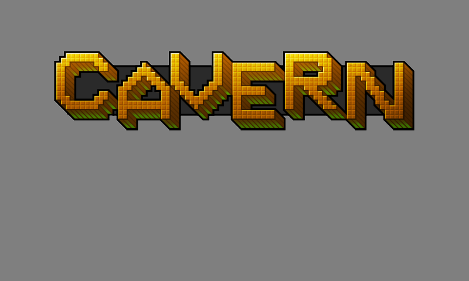

**1.** Titlul Cavern pentru ecranul de atragere.

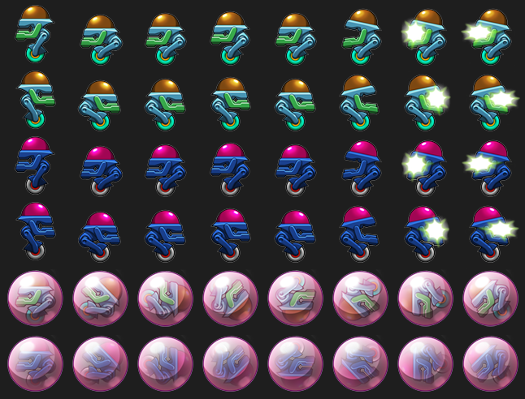

**2.** O varietate de cadre de sprite pentru inamici, inclusiv pentru când sunt prinși în globuri (cele două tipuri de roboți, în ambele direcții, și versiunile lor capturate).

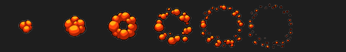

**3.** Animația de „pop” pentru când un fruct e colectat sau expiră.

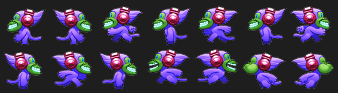

**4.** Sprite-ul jucătorului are mai multe cadre de animație, inclusiv pentru alergat, sărit și suflat.

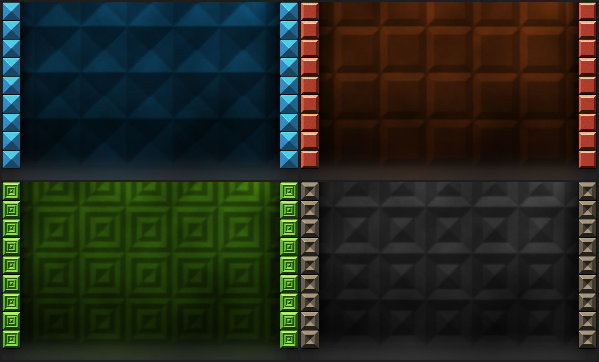

**5.** Patru fundaluri sunt folosite pentru diferitele niveluri.


**6.** Animația de spargere a globului.

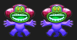

**7.** Animația de cădere e afișată la pierderea unei vieți.

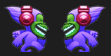

**8.** Lovit de focul inamic, jucătorul face animația de recul.


**9.** Nu uita să iei un power-up de viață în plus dacă vezi unul; al doilea îți reface sănătatea.

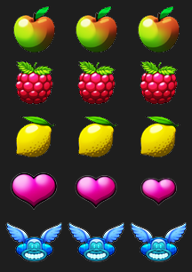

**10.** Colectează fructele lăsate în urmă de inamicii învinși, pentru puncte în plus.


Globurile suflate de jucător cresc în primele cadre de animație.

---

[← Capitolul 1 – Tenis: Pong și Boing!](Capitolul01_Tenis_Pong_si_Boing.md) | [Capitolul 3 – Platformer văzut de sus: Frogger și Infinite Bunner →](Capitolul03_Platformer_vazut_de_sus_Frogger_si_Infinite_Bunner.md)
