# Capitolul 3 – Platformer văzut de sus: Frogger și Infinite Bunner

> *Joacă-te cu avantajele pe care o perspectivă diferită le poate aduce unui joc*

Frogger a întors jocurile de platforme tradiționale cu susul în jos, adoptând o perspectivă de sus. E privit cu drag și după mai bine de trei decenii și continuă să inspire programatorii care construiesc jocuri precum hitul modern de pe mobil Crossy Road. Premisa era simplă: jucătorii ghidau broaște peste un drum aglomerat și un râu plin de obstacole plutitoare, până ajungeau în siguranța casei lor. Neobișnuit, jucătorul vedea jocul ca și cum ar fi plutit deasupra acțiunii. Jocul seamănă cu un labirint în formă liberă, în care jucătorii trebuie să găsească drumul corect de la A la B ca să supraviețuiască. Având în vedere că există foarte, foarte multe feluri de a muri în acest joc, e mai ușor de spus decât de făcut.

## Inspirația

Frogger a fost portat de pe arcade pe calculatoarele Atari de John D. Harris, care lucra pentru On-Line Systems. El a ajuns să aibă o lungă asociere cu mașinile Atari, pentru care a produs și Jawbreaker și Mouskattack, tot pe când lucra la On-Line Systems. A fost un pionier al unor practici noi încă de la începutul carierei, nu doar creând un sistem de protecție la copiere pentru Atari, ci fiind și primul care a avut o coloană sonoră continuă în timpul unui joc. Pe lângă munca la un sistem 3D pentru Atari Jaguar, a produs jocuri pentru PlayStation și a căutat constant să împingă limitele designului. Partener la Pulsar Interactive Corp și acum la Platoteam Inc, e considerat una dintre figurile legendare ale jocurilor.

> **Frogger**
>
> **Lansat:** 1981
> **Platforme:** Arcade, Atari 8-bit, Intellivision, Atari 2600, Atari 5200, ColecoVision, Commodore VIC-20, Commodore 64, Amstrad CPC, ZX Spectrum, TRS-80/Dragon 32, Timex Sinclair 1000, Timex Sinclair 2068
>
> Jocul a fost portat inițial pe aproape orice mașină posibilă la acea vreme, dar în 1998 a apărut, târziu, și pe Sega Mega Drive, SNES, Game Boy și Game Boy Color.
>
> **Alte titluri notabile:** Ultima / Legend of Zelda / Pokémon

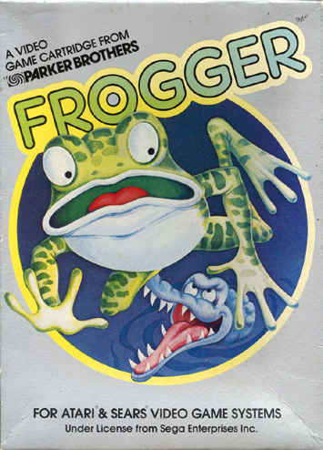

De ce a traversat broasca drumul? Ca să ajungă pe partea cealaltă, desigur. Dar cum a traversat drumul? Ei bine, asta e cu totul altă întrebare, una pe care mulți jucători ai clasicului joc arcade Frogger și-au pus-o adesea, mai ales când amfibianul verde antropomorf pe care îl controlau era strivit sub roțile încă unui camion.

Și broasca chiar a traversat acel drum, de milioane de ori. Aspectul cu strivitul din acest joc emblematic de traversat autostrada și râul poate suna macabru, dar a fost cu siguranță o provocare răsplătitoare, asigurând că, în 1981, Frogger era un hit sigur pentru producătorul Konami. Combinația dintre jucabilitatea pură și premisa simplă l-a făcut perfect pentru un aparat cu monede.

La sfârșitul anilor '70 și începutul anilor '80, sălile de jocuri înfloreau, ducând la o competiție intensă între dezvoltatorii de jocuri. Trucul era să-i încurajezi pe jucători să bage cât mai mulți bani (ai părinților), câștigați cu trudă, iar înțelepciunea vremii spunea că jocurile trebuie să fie ușor de explicat și de înțeles, ca acele prime monede să înceapă să curgă.

În cazul lui Frogger, tot ce trebuia să facă un jucător era să ducă broasca din partea de jos a ecranului în partea de sus, ferindu-se de vehicule și traversând un râu periculos, ca să ajungă la adăpost. Ca jucătorii să tot revină, dezvoltatorii l-au făcut destul de greu ca eșecul să fie, la un moment dat, inevitabil. Frustrarea de a nu reuși să duci toate cele cinci broaște la casele lor de pe malul râului era tot ce trebuia ca banii să curgă în cabinetul arcade.

John D. Harris, programator la început de drum, era la începutul carierei când a fost lansat Frogger. Începuse să lucreze ca dezvoltator independent în martie 1981 și își făcuse mâna dezvoltând versiuni de Starhawk, Head-on și un titlu în stil Berzerk, trei jocuri care, din păcate, n-au văzut niciodată lumina zilei. Marea lui șansă a venit cu Jawbreaker, lansat în același an de On-Line Systems pentru calculatoarele Atari 400 și 800. A fost primit cu entuziasm de recenzenți și de jucători.

Chiar și așa, a atras ceva controverse. Jawbreaker a făcut obiectul unei cereri de interdicție, respinse, din partea Atari, din cauza asemănărilor cu un alt hit arcade, Pac-Man. Dar a arătat talentul lui John la programare, iar lui i s-a dat apoi sarcina de a converti oficial Frogger de pe arcade pe calculatoarele Atari pe 8 biți. Exista o cerere uriașă din partea jucătorilor de a se bucura acasă de hiturile din sălile de jocuri, iar acesta a devenit jocul care i-a definit și i-a lansat cu adevărat cariera.

## Iazul de origine

John a crescut în Statele Unite și fusese interesat de jocuri și de programare de mic. „Primul meu contact cu programarea jocurilor s-a întâmplat în gimnaziu”, spune el. Își amintește că școala lui avea un terminal Teletype vechi: mașini ca niște mașini de scris electromecanice, care permiteau trimiterea mesajelor tastate dintr-un punct în altul. „Îl foloseam ca să jucăm jocuri de pe mainframe, ca Star Trek sau Colossal Cave Adventure”, continuă el, vorbind despre două jocuri text lansate în 1971 și, respectiv, 1976. „Pe atunci, abia dacă știam că un calculator poate face și altceva.”

Star Trek l-a impresionat enorm. Privind pe cineva jucând, a observat că jocul se comporta altfel decât era obișnuit să vadă. „L-am întrebat ce se întâmplă, iar el mi-a spus că a „schimbat programul”. Privirea mea goală i-a dat de înțeles că n-aveam nici cea mai vagă idee despre ce vorbea, așa că mi-a explicat cu amabilitate despre limbajul de programare BASIC și mi-a arătat cum să „întrerup” execuția jocului și să listez instrucțiunile programului. A fost momentul definitiv de „aha”, care mi-a deschis o lume cu totul nouă.”

La sfârșitul anilor '70, pe piață apăreau tot mai multe calculatoare personale. Olivetti P6060 a fost lansat în aprilie 1975 și se lăuda cu doar 8 kB de RAM în versiunea cea mai ieftină (care, în treacăt fie spus, costa amețitoarea sumă de 7950 de dolari). Între timp, Apple II, pe 8 biți, a fost lansat cu 1298 de dolari, în iunie 1977. Câteva luni mai târziu, Commodore a lansat PET, un calculator personal cu aspect futurist, construit în jurul procesorului MOS Technology 6502, cu până la 96 kB de RAM. Această mașină l-a impresionat mult pe John.

PET-ul putea afișa grafică monocromă, iar software-ul se putea stoca pe casetă, pe dischetă de 5,25 inchi, pe dischetă de 8 inchi sau pe hard disk. „Îmi plăcea mult Commodore PET și știam câțiva oameni care aveau unul”, spune John. „Mă lăsau să mă joc cu ele din când în când și strângeam bani pentru unul. Dar apoi un prieten și-a luat un Apple II și a fost un contrast interesant. Deși îi lipseau funcții fundamentale, cum ar fi editarea pe tot ecranul, ceea ce făcea lucrul cu mașina mult mai greoi, puteam vedea potențialul grafic suplimentar al Apple-ului.” Totuși, John a decis că va cumpăra PET-ul și s-a dus la magazin cu banii strânși, entuziasmat de noua achiziție.

„Dar soarta a intervenit și mi-a oferit o alternativă”, își amintește el. „În ziua în care am intrat în magazin ca să cumpăr mașina, tocmai primiseră un Atari 800. N-a durat mult să descopăr că avea toate funcțiile de ușurință în utilizare ale PET-ului, și încă ceva pe deasupra, plus capabilitățile grafice color ale Apple-ului. Nu se întrezărea încă cât de mult superior era cu adevărat, dar această combinație de funcții a rezolvat o îngrijorare sâcâitoare din mine, că mă mulțumeam cu capabilități mai mici la PET ca să am o mașină cu care era mai plăcut să lucrez. Acum le puteam avea pe amândouă.”

Chiar și așa, John a avut problemele care vin odată cu adoptarea timpurie. „Nu existau programe pentru Atari în afară de cartușele BASIC și Educational System, și nu existau casete. Totuși, am cumpărat Atari 800 și n-aș fi putut fi mai fericit cu el.” Acea decizie a avut o influență majoră asupra vieții lui John, ducând la portarea lui Frogger pe acea mașină. „E nebunesc să te gândești cât de diferită ar fi fost viața mea dacă aș fi intrat în magazin cu o zi mai devreme și aș fi fost proprietar de PET”, adaugă el.

## Crearea lui Frogger

Ca să înceapă portarea lui Frogger pe Atari 400 și 800, John a strâns ceva hardware suplimentar. Pe lângă Atari 800 cu 48 kB, avea un RAMDISK Axlon, care aducea 128 kB de memorie în plus, o interfață de dischetă de mare viteză făcută de LE Systems și o placă Austin-Franklin 80-Column Board, care afișa pe monitor un ecran de 80 de coloane și 25 de caractere. Cu acestea în mână, a început să deconstruiască jocul original și să-și facă notițe despre diversele aspecte ale gameplay-ului.

Ecranul de joc era format din secțiuni simple, distincte. Ca broaștele să ajungă din partea de jos a ecranului în partea de sus, trebuiau să traverseze cinci benzi de autostradă (de aceea jocul era cât pe ce să se numească Highway Crossing Frog). De acolo, trebuiau să ajungă pe trotuarul de pe partea cealaltă și apoi să treacă un râu. În fiecare dintre aceste două secțiuni, broaștele trebuiau să evite traficul aglomerat și apoi să evite căderea în apă, sărind pe bușteni și ferindu-se de gurile aligatorilor și de alte pericole plutitoare.

Ca să fie fidel originalului, aceste aspecte trebuiau păstrate. John a lucrat la recrearea aspectului vizual al fundalului, producând grafica ce separă ecranul în diversele secțiuni, având grijă să includă trotuarul de start, de unde broaștele își începeau călătoria periculoasă, și cele cinci case din partea de sus a ecranului, care le permiteau să se odihnească în siguranță. John a creat și broasca însăși și a lucrat la mișcarea ei.

Din fericire, asta a fost o sarcină simplă, pentru că designerii originali hotărâseră să meargă pe comenzi în patru direcții. „Mișcarea în opt direcții ar fi oferit mai mult control, dar e și mai probabil să te miști pe diagonală când nu intenționai, sau invers”, explică el. „Adesea, asta venea cu consecințe fatale.” Într-adevăr, păstrarea mișcărilor simple a funcționat bine, pentru că nu doar că a eliminat potențiala marjă de eroare, dar le-a permis jucătorilor să se concentreze pe sincronizarea mișcărilor.

„Există întotdeauna un echilibru între a avea destulă profunzime a controlului ca să-l ții pe jucător interesat și provocat, dar nu atât de multă încât comenzile să devină o piedică”, adaugă John. Așa că broaștele puteau să se miște la stânga, la dreapta, în sus și în jos, ultima opțiune fiind folosită, de regulă, doar când jucătorii făceau o greșeală și trebuiau să facă un pas înapoi ca să nu piardă o viață. La fiecare pas al jocului, jucătorii trebuiau să aibă în minte acele obstacole.

Primul set de obstacole erau vehiculele. Versiunea arcade avea cinci rânduri de trafic, fiecare mișcându-se în direcție opusă față de cele vecine. Asta însemna că rândul de jos se mișca de la dreapta la stânga, următorul de la stânga la dreapta și așa mai departe, creând un mediu de joc provocator. Dacă toate vehiculele ar fi mers în aceeași direcție, un jucător ar fi putut, poate, să treacă rapid dintr-un colț al traficului în altul.

> *Versiunea arcade avea cinci rânduri de trafic, fiecare mișcându-se în direcție opusă față de cele vecine*

Așa cum era, jocul forța creierul să lucreze cu tipare de mișcare mai complexe. În jocuri, să-l ții pe jucător în priză și să-i sporești sentimentul de pericol e întotdeauna un lucru bun. Jocul arcade condimenta lucrurile și folosind vehicule diferite, unele mai lungi sau cu comportamente diferite de ale celorlalte.

„Există mai multe obiective simultane în crearea unei lumi de joc”, explică John. „Trebuie să fie distractivă, dar ar trebui să aibă și elemente vizuale și sunete interesante, pentru o experiență mai completă. Majoritatea tipurilor de vehicule sunt acolo doar pentru varietate vizuală, varietatea de joc fiind asigurată de diferitele regiuni ale ecranului. Acestea fiind spuse, câteva tipuri oferă diferențe de gameplay, cum ar fi mișcare mai rapidă sau lungime mai mare.”

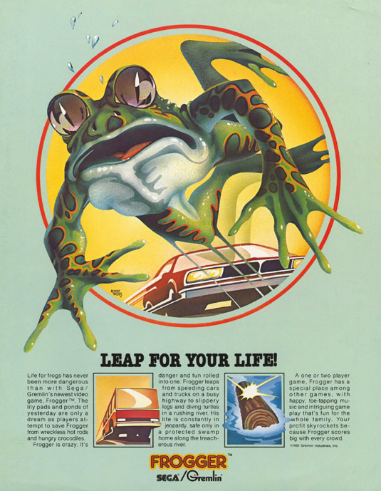

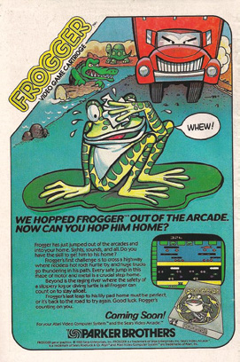

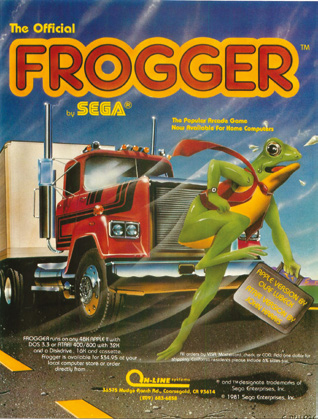

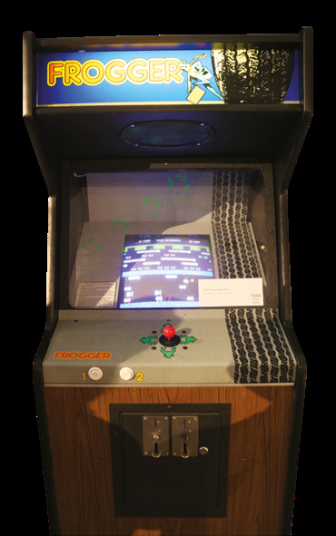

Secțiunea cu râul funcționa cam la fel, doar că, în loc să se strecoare prin golurile din trafic, jucătorii trebuiau să folosească buștenii și spinările țestoaselor și ale aligatorilor ca să treacă. Cum golul aici e apa, care provoacă pierderea instantanee a unei vieți, secțiunea a doua căpăta o altă turnură, devenind aproape un nivel de sine stătător.

„Cele două părți sunt foarte asemănătoare, dar sunt un mod de a obține varietate de joc, atât vizuală, cât și subtilă”, spune John. „În esență, ambele secțiuni sunt tot despre navigarea prin segmente derulante sigure sau periculoase, apa fiind opusul șoselei. Așa că sari prin golurile din drum, dar eviți golurile și sari pe obiectele solide din apă. Apa, însă, oferă opțiuni suplimentare, cum ar fi țestoasele care se scufundă din când în când, adăugând o dimensiune în plus navigării și planificării jucătorului. Așa că, pe măsură ce avansezi pe ecran de jos în sus, jocul poate adăuga o provocare suplimentară, pe măsură ce te apropii de casele-țintă.”

Aceste case-țintă erau cele cinci locuri sigure în care broaștele jucătorilor se puteau adăposti. O singură broască putea sta pe un nufăr, așa că asta adăuga presiune și le cerea jucătorilor tactici inteligente. Era de două ori vital, pentru că nu exista un mal sigur după ce broasca sărea de pe ultimul buștean: broasca trebuia să sară direct pe un nufăr liber. Sincronizarea și planificarea poziției deveneau, în acest punct, esențiale.

> *Jucătorii trebuiau să folosească buștenii și spinările țestoaselor și ale aligatorilor ca să treacă râul*

## Detecția coliziunilor

Fără o detecție solidă a coliziunilor, obstacolele nu înseamnă mare lucru. „Când un jucător face o mișcare, codul trebuie să-și dea seama unde sunt toate celelalte obiecte de pe ecran, în funcție de direcțiile și vitezele lor în raport cu personajul. Verifică coliziunile în funcție de unde ești: lovit de un vehicul pe stradă, aterizat în apă deschisă și așa mai departe.” Dacă exista o coliziune, codul trebuia să acționeze și să omoare broasca, rezultând o animație amuzantă care arăta că personajul a murit (în original apărea un craniu cu oase încrucișate). Existau multe feluri de a pierde o viață.

O broască putea fi lovită de un vehicul sau putea ajunge în apă. Se putea ciocni de un șarpe, de o vidră sau de fălcile unui aligator. Putea încerca să folosească o țestoasă care era pe cale să se scufunde, luând broasca cu ea. Putea și să stea prea mult pe un buștean și să iasă de pe marginea ecranului. Când venea vorba de găsirea unei case, orice broască care sărea din greșeală în tufiș, încerca să ocupe o casă deja ocupată sau găsea un aligator în casă pierea și ea. Toate astea serveau la sporirea sentimentului de pericol al jucătorului, sperăm fără să-l facă să-și trântească controlerul de exasperare.

„Atâta timp cât toate mecanismele prin care poți pieri sunt rezonabile și consecvente, doar creștem varietatea, fără să adăugăm frustrare”, spune John. „E drept, poți argumenta că aterizarea în apă n-ar trebui să fie fatală pentru o broască, dar asta e regula definită de lumea jocului, iar ideea principală e că e mereu la fel și face parte din gameplay-ul de bază. Frustrarea apare dacă regulile nu sunt consecvente sau dacă jucătorii mor din cauza unor amenințări care nu sunt evidente prin natura lor.”

Mai exista un fel în care o broască putea muri. Jucătorii puteau rămâne fără timp, pentru că fiecare nivel trebuia terminat într-o limită de timp. În Frogger, asta era foarte important, pentru că accelera un joc care altfel ar fi putut fi jucat destul de lent. Uită tot ce ai învățat despre traversarea unui drum adevărat când joci acest joc: să treci repede, dar întreg, era totul.

„Fără presiunea timpului, ar fi fost prea ușor să aștepți relaxat ocaziile perfecte”, confirmă John. „Te puteai retrage în zone mai sigure până când apăreau cele mai bune goluri și alinieri. Cronometrul e, de fapt, singurul element care îl forțează pe jucător să tot înainteze. E ceea ce transformă o plimbare pe ecran într-o provocare în care jucătorul trebuie să găsească drumuri în timp real, sub presiune.”

Dar cât timp ar trebui să aibă un jucător? „Stabilirea detaliilor despre cât timp să dai e, de obicei, o chestiune de testare”, spune John. „Dacă pierzi vieți prea des pentru că rămâi fără timp, atunci cronometrul trebuie mărit. Dacă ai mereu mult timp rămas și nu te simți presat să termini nivelul într-un timp rezonabil, atunci cronometrul trebuie scurtat. Asemenea teste trebuie făcute de alți oameni decât dezvoltatorii principali, pentru că ei sunt de obicei prea familiarizați cu jocul și ar da timpi înclinați spre partea mai rapidă.”

> *Poți argumenta că aterizarea în apă n-ar trebui să fie fatală pentru o broască, dar asta e regula*

Cu atâtea ocazii de a pierde o viață, trebuia luat în calcul și câte vieți are un jucător. „Viețile din jocuri erau alese, în general, ca să regleze cât timp poate cineva să continue să joace cu o singură monedă, pe vremea când sălile de jocuri erau publicul principal și vizat al jocului”, explică John. „Dar, în final, e un design bun să-i lași pe jucători să supraviețuiască câtorva greșeli, altfel ar fi prea frustrant. Dacă numărul e prea mare, atunci nu e destulă urgență pusă pe supraviețuire. Așa că trei vieți tind să fie un echilibru bun.”

## Tabelul cu scoruri mari

Frogger îi stimula pe oameni și cu un sistem de punctaj, cu puncte acordate pentru fiecare pas de progres. Un tabel cu scoruri mari era creat pentru dreptul de a te lăuda, dar existau și bonusuri de colectat pe drum. Asta încuraja rejucarea în versiunea arcade: „Bonusurile sunt, în general, moduri de a le da jucătorilor altceva spre care să tindă, odată ce au stăpânit mecanicile de bază”, spune John, iar bonusurile le permiteau și să câștige mai multe puncte pentru acel avantaj atât de important în tabelul cu scoruri. „Odată ce poți juca cu succes, provocarea e dacă poți și să obții cele mai multe puncte.”

Să-ți dai seama cum un joc atât de structurat putea continua să fie distractiv și să-i țină pe oameni jucând era esențial. Când dezvoltatorii originali creau Frogger pentru sălile de jocuri, sentimentul de progres însemna că jucătorii continuau să bage bani în aparate, dar chiar și în versiunile de acasă e nevoie să le dai jucătorilor sentimentul că primesc valoare pentru banii lor.

„Vrei întotdeauna ca nivelurile de început să fie destul de ușor de terminat, ca jucătorii să primească niște răsplăți și progres imediat”, sfătuiește John. „Apoi, pe măsură ce învață mecanicile și devin mai pricepuți la a le naviga, jocul trebuie să crească provocarea, altfel jucătorii se vor plictisi.”

El spune că Frogger a reușit asta în două feluri: „Face drumurile mai dificile și mai periculoase și îi dă jucătorului mai puțin timp să ia deciziile despre cum să treacă de ele. Așa că mărește și provocarea, și sentimentul de urgență. Mai concret, reduce mărimea golurilor dintre vehicule, accelerează unele vehicule și reduce numărul și mărimea țestoaselor din râu.

„În final, înlocuiește unele țestoase cu aligatori, care funcțional sunt doar țestoase mai mici, nu e nicio diferență între a ateriza pe capul unui aligator și a ateriza în apă, dar chiar oferă o amenințare mai viscerală. Faptul că cea mai mare amenințare percepută e chiar la sfârșit, lângă casele-țintă, îi dă un impact emoțional maxim, și o ușurare și satisfacție maxime la reușită.”

> **Obiectivele**
>
> **Pe termen scurt:** Începe cu elementele de fundal; așa poți obține cel mai mare progres vizual devreme.
>
> **Pe termen mediu:** Adaugă mișcarea broaștei, comenzile jucătorului și detecția coliziunilor: destul pentru un joc de bază, jucabil.
>
> **Pe termen lung:** Adaugă elementele rămase, cum ar fi șerpii, aligatorii, obiectele bonus și un cronometru. Tot aici jocul ar trebui testat pentru echilibru, entuziasm și frustrare.

## De la capăt

Inițial, dezvoltarea lui Frogger a mers destul de lin, iar cu cât John stăpânea mai bine Atari 800, cu atât se îndrăgostea mai tare de el. S-a dedicat jocurilor, bucurându-se de Star Raider, Robotron 2084, Shamus și Mouskattack, și a devenit aproape nedespărțit de calculatorul lui, luându-l cu el în călătorii ca să poată continua să lucreze.

„În anii care au urmat, Atari-ul avea să se stabilească pentru totdeauna în mintea mea ca unul dintre cele mai bune calculatoare făcute vreodată”, spune el. „Oamenii încă descopereau trucuri și tehnici grafice noi la zece ani după ce mașina a fost lansată. Dacă compari cele mai recente programe scrise pentru Atari cu cele mai vechi, diferența uriașă dintre ele e o mărturie a magiei pe care au reușit-o prin designul lui.”

Dar apoi a lovit dezastrul. Codul original salvat al lui Frogger a fost furat, împreună cu toate copiile de siguranță. „Tot ce-mi rămăsese era o copie mai veche, de pe la începutul etapei 3”, spune el. „Aveam gameplay-ul de bază, dar toate elementele suplimentare și toată echilibrarea dispăruseră.” Asta a însemnat că John a ajuns să scrie Frogger nu o dată, ci de două ori, și spune că a doua oară nu s-a simțit la fel de bine ca prima.

„Tot încercam să-mi amintesc și să recreez ce făcusem deja, amestecat cu emoțiile pierderii”, continuă John. „Dacă m-aș fi putut detașa de toate astea și doar aș fi rezolvat din nou problemele, în loc să reconstruiesc soluțiile de dinainte, probabil mi-aș fi economisit mult timp și multă suferință.” Din fericire, însă, versiunea pe care a creat-o strălucea și transmitea însăși esența a ceea ce l-a făcut pe Frogger un mare hit. Vânzările au fost ajutate de popularitatea de durată a jocului în sălile de jocuri. Într-adevăr, jocul, alături de Joust, Millipede, Super Pac-Man și Donkey Kong Jr, a fost folosit la primul campionat mondial de jocuri video, ținut în ianuarie 1983. Cel mai mare scor obținut vreodată la jocul arcade este de 970 440 de puncte, atins în 2012, ceea ce arată popularitatea durabilă a jocului.

Frogger n-a fost însă capătul drumului pentru eroul verde. A avut o serie de continuări, printre care Frogger II: ThreeeDeep!, care a introdus trei ecrane consecutive, în timp ce Ribbit! le permitea broaștelor să înghită viespi, muște și crabi. Frogger 2, pe Game Boy Color, le permitea jucătorilor să o controleze pe Lily, iubita lui Frogger. „E singurul gen la care mă pot gândi în care ai atât de multe opțiuni și atât de mult control”, spune John. „Limitele creative sunt nesfârșite și e un amestec excelent între energii creative și provocări tehnice. Îți urez tot binele dacă alegi să urmezi acest drum.”

Dar cum vede John primele zile ale industriei, când Frogger era încă pe punctul de a sări în fața maselor? „Cel mai interesant detaliu despre scena timpurie a calculatoarelor, și unul dintre lucrurile care îmi lipsesc cel mai mult, e că toată lumea era foarte deschisă în legătură cu eforturile sale, iar fiecare descoperire nouă era împărtășită cu entuziasm”, spune John. „Era o eră a experimentării, iar primul lucru pe care îl făceam după ce găseam ceva nou era să le spunem tuturor celorlalți. Asta se datora doar în parte dorinței de a „părea cool” pentru că ne-am dat seama. Exista și o dorință sinceră ca ceilalți să beneficieze de asta, pentru că, cu cât mai mulți oameni foloseau cele mai bune tehnici, cu atât mai bune erau programele pe care le obțineam, la orice nivel.”

> **Învață de la maestru**
>
> *John D. Harris a căutat mereu să-și îmbunătățească abilitățile de design, învățând tehnici noi pe măsură ce a trecut de la o platformă la alta.*
>
> **Nivelul de dificultate:** Vrei întotdeauna ca nivelurile de început să fie destul de ușor de terminat, ca jucătorii să primească niște răsplăți și progres imediat.
>
> **Comenzi ușoare:** Cu cât schema de comenzi e mai simplă, cu atât jocul tău va fi mai intuitiv de jucat și cu atât mai mic va fi potențialul de greșeli sau confuzii la comenzi.

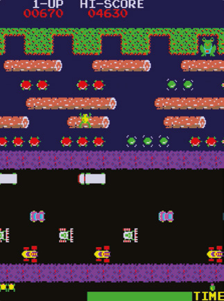

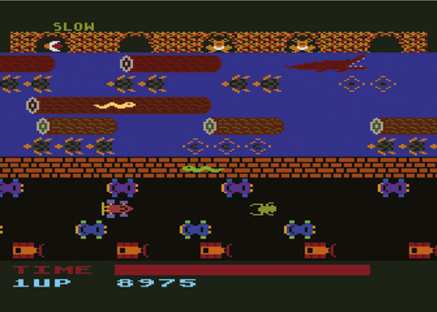

---

# Programăm azi: Infinite Bunner

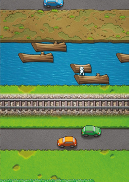

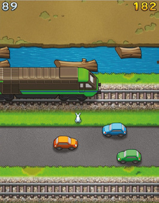

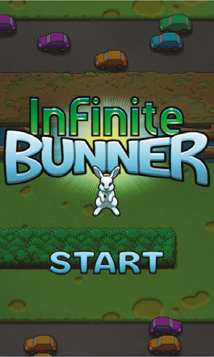

Infinite Bunner e versiunea noastră a gameplay-ului clasic din Frogger. Jocul original se desfășoară pe un singur ecran, cu un drum aglomerat jos și un râu sus. În jocul nostru, nivelul e generat procedural și derulează continuu. Jucătorul trebuie să avanseze destul de repede ca să nu cadă de pe marginea de jos a ecranului; dacă se întâmplă asta, un vultur (`Eagle`) zboară în jos pe ecran și îl prinde pe jucător, rezultând Game Over.

> **Descarcă codul**
> Descarcă codul complet comentat al jocului Infinite Bunner, împreună cu toată grafica și sunetele, de la wfmag.cc/CTC1-bunner

> **NOTA TRADUCĂTORULUI**
> Linkul scurt de mai sus nu mai funcționează. Codul complet comentat, cu imaginile, sunetele și muzica, se găsește în folderul [codul_sursa/bunner](codul_sursa/bunner/). Instrucțiunile de instalare sunt în [Capitolul 6 – Instalarea](Capitolul06_Instalarea.md) și, pe scurt, în [codul_sursa/README.md](codul_sursa/README.md). Numele jocului e un joc de cuvinte: *bunny* (iepuraș) plus *runner*, iar *infinite* pentru că nivelul nu se termină niciodată.

Nivelul e împărțit într-o serie de secțiuni, fiecare de un anumit tip: iarbă (`Grass`), pământ (`Dirt`), drum (`Road`), trotuar (`Pavement`), cale ferată (`Rail`) sau apă (`Water`). Fiecare secțiune e formată dintr-o serie de rânduri, fiecare rând corespunzând unui sprite din folderul `images`. Rândurile au 40 de pixeli înălțime, deși ai putea observa că unele sprite-uri au 60 de pixeli; e doar un efect vizual: sprite-ul se suprapune peste rândul de deasupra, dar rândul e considerat tot de 40 de pixeli în scopul jocului.

Secțiunile de drum, apă și cale ferată au toate obiecte în mișcare: mașini (`Car`), bușteni (`Log`) și trenuri (acestea din urmă n-au o clasă proprie). Secțiunile de iarbă pot conține garduri vii (`Hedge`), pe care jucătorul trebuie să le ocolească. Pentru că aceste obiecte rămân mereu în rândurile lor, le clasificăm drept obiecte-copil ale rândurilor. Obiectele-copil sunt desenate relativ la rândurile-părinte; de exemplu, dacă un rând de drum are coordonata Y 200, iar o mașină de pe drum are coordonata Y 10, mașina va fi desenată la coordonata Y 210. Pentru a oferi această funcționalitate, toate obiectele din joc moștenesc dintr-o clasă numită `MyActor`, care la rândul ei moștenește din clasa `Actor` încorporată în Pygame Zero. `MyActor` funcționează exact ca `Actor`, doar că suprascrie metodele `update` și `draw`, pentru a actualiza și desena lista de obiecte-copil. Se asigură și că obiectele sunt desenate în poziția corectă pe ecran, ținând cont de derularea nivelului.

> **NOTA TRADUCĂTORULUI**
> În codul publicat, trenurile au totuși o clasă proprie, `Train`, foarte scurtă, care moștenește din `Mover`, la fel ca `Car` și `Log`. Textul cărții a fost scris, probabil, pentru o versiune mai veche a codului.

Toate rândurile moștenesc din clasa `Row`. Aceasta îndeplinește câteva sarcini importante, cum ar fi detecția coliziunilor. Unele metode oferă rezultate implicite, care pot fi suprascrise în clasele derivate. De exemplu, metoda `push`, apelată de jucător pentru a determina mișcarea pe axa x, returnează zero, adică nicio mișcare. În clasa `Water`, însă, această metodă e suprascrisă și îl face pe jucător să se miște pe axa x dacă stă în acel moment pe un buștean.

Clasa `ActiveRow` moștenește din `Row` și e clasa de bază pentru `Water` și `Road`. Ce au în comun aceste două clase e că ambele au obiecte în mișcare (bușteni și mașini), care pornesc chiar din afara ecranului și se mișcă orizontal. `ActiveRow` se ocupă de crearea și distrugerea acestor obiecte-copil. Cele două subclase suprascriu o serie de metode, un exemplu-cheie fiind `check_collision`. Metoda `Bunner.update` o apelează ca să afle dacă jucătorul s-a ciocnit de ceva și, dacă da, ce e de făcut. În cazul lui `Road`, ciocnirea cu o mașină omoară jucătorul și înlocuiește sprite-ul jucătorului cu imaginea „splat”. Pentru `Water`, însă, ciocnirea cu un buștean e un lucru bun, în timp ce lipsa ciocnirii cu un buștean încheie jocul și înlocuiește sprite-ul jucătorului cu animația „splash”.

> *Ciocnirea cu o mașină omoară jucătorul și înlocuiește sprite-ul jucătorului cu imaginea „splat”*

Clasa `Game` păstrează o referință la obiectul jucător și e responsabilă și de crearea, actualizarea și ștergerea rândurilor. Partea finală a codului folosește un sistem simplu de automat finit pentru a actualiza și desena obiectele jocului.

> **Provocări**
>
> - `ActiveRow.update` asigură o distanță minimă de 240 de pixeli între începutul unui obiect-copil și începutul următorului, sau jumătate din atât pentru rândurile în care obiectele-copil au viteza 2. Un factor aleator variază distanța dintre obiectele-copil. Aceste reguli se aplică atât rândurilor `Road`, cât și `Water`; dar cum ai face ca fiecare dintre aceste tipuri de rânduri să poată avea propriile valori sau reguli personalizate pentru spațierea obiectelor-copil?
> - Încearcă să adaugi un nou tip de rând în joc: poate lavă, gheață sau spațiu? Grafica ar putea fi, inițial, o copie recolorată a unui tip de rând existent. Mai important, va trebui să te gândești dacă noul rând va fi o variație a unuia existent sau va avea o mecanică de joc complet nouă.

> **Rânduri după rânduri după rânduri**
>
> 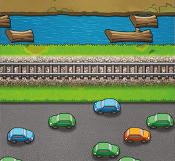
>
> Metoda `__init__` (constructorul) a clasei `Game` creează o listă care va conține rândurile. La început, aceasta conține un singur rând `Grass`. Acesta va fi primul rând și va apărea în partea de jos a ecranului; dar cum decide jocul ce tipuri de rânduri să creeze după aceea? Fiecare clasă de rând (`Grass`, `Road`, `Dirt`, `Rail`, `Pavement` și `Water`) are o metodă `next`, care decide care va fi rândul următor. Fiecare metodă ia o decizie pe baza indexului rândului curent, cu alte cuvinte, numărul sprite-ului rândului.
>
> Există 16 sprite-uri de iarbă și 16 de pământ, patru de cale ferată, șase de drum, trei de trotuar și opt de apă. Aceste sprite-uri se îmbină corect doar în anumite combinații; de exemplu, Grass 6 trebuie urmat de Grass 7. Așa că unele dintre regulile din metodele `next` asigură că asemenea rânduri apar în ordinea corectă. Alte reguli fac alegeri aleatoare despre ce rând urmează. De exemplu, o secvență de rânduri `Grass` sau `Dirt` e urmată fie de `Road`, fie de `Water`.
>
> Probabilitățile aleatoare ale rândurilor pot fi folosite și pentru a determina câte rânduri de anumite tipuri apar în secvență. În cazul rândurilor `Water`, sunt întotdeauna cel puțin două la rând, dar după al doilea există mereu o șansă de 50-50 pentru încă unul, până la maximum șapte. Folosirea aleatorului asigură că nivelul e diferit de fiecare dată când joci.

> **Dezlegarea măștii de gard viu**
>
> 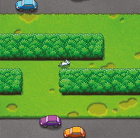
>
> Rândurile de iarbă conțin uneori garduri vii. Acestea blochează anumite părți ale rândului, cerându-i jucătorului să facă un ocol. Funcția `generate_hedge_mask` decide dispunerea segmentelor de gard viu într-un rând. O mască e o serie de valori booleene, care permit sau împiedică afișarea unor părți dintr-o imagine de dedesubt. Această funcție creează o mască ce reprezintă prezența sau absența gardurilor vii într-un rând `Grass`. `False` înseamnă că există gard viu; `True` reprezintă un gol.
>
> Inițial, creăm o listă de douăsprezece elemente. Pentru fiecare element există o șansă mică de gol, dar adesea toate elementele vor fi `False`, reprezentând un gard viu fără goluri. Apoi setăm aleator un element la `True`, ca să ne asigurăm că există mereu cel puțin un gol prin care jucătorul poate trece. Golurile de o singură dală nu sunt destul de largi ca jucătorul să încapă, așa că pasul următor e să lărgim orice gol la minimum trei dale. Odată ce masca a fost generată, funcția `classify_hedge_segment` e folosită pentru a determina ce sprite să se folosească pentru fiecare segment de gard viu.

## Codul jocului Infinite Bunner

> **Cum rulezi jocul**
> Deschide fișierul `bunner.py` într-un editor Python, cum ar fi IDLE, și alege Run > Run Module. Pentru mai multe detalii, vezi [Capitolul 6 – Instalarea](Capitolul06_Instalarea.md).

> **NOTA TRADUCĂTORULUI**
> Listarea de mai jos este versiunea din depozitul editurii, fără comentarii; fișierul [codul_sursa/bunner/bunner.py](codul_sursa/bunner/bunner.py) conține aceeași versiune, cu toate comentariile autorilor. Comenzile: săgețile pentru sărit în cele patru direcții, SPAȚIU pentru a începe. Fereastra jocului este verticală (480 pe 800 de pixeli), ca ecranul aparatului arcade original. Jocul salvează recordul într-un fișier `high.txt`, creat în folderul din care ai pornit jocul.

```python
import pgzero, pgzrun, pygame, sys
from random import *
from enum import Enum

if sys.version_info < (3,5):
    print("This game requires at least version 3.5 of Python. Please download it from www.python.org")
    sys.exit()

pgzero_version = [int(s) if s.isnumeric() else s for s in pgzero.__version__.split('.')]
if pgzero_version < [1,2]:
    print("This game requires at least version 1.2 of Pygame Zero. You have version {0}. Please upgrade using the command 'pip3 install --upgrade pgzero'".format(pgzero.__version__))
    sys.exit()

WIDTH = 480
HEIGHT = 800
TITLE = "Infinite Bunner"

ROW_HEIGHT = 40

DEBUG_SHOW_ROW_BOUNDARIES = False

class MyActor(Actor):
    def __init__(self, image, pos, anchor=("center", "bottom")):
        super().__init__(image, pos, anchor)

        self.children = []

    def draw(self, offset_x, offset_y):
        self.x += offset_x
        self.y += offset_y

        super().draw()
        for child_obj in self.children:
            child_obj.draw(self.x, self.y)

        self.x -= offset_x
        self.y -= offset_y

    def update(self):
        for child_obj in self.children:
            child_obj.update()

class Eagle(MyActor):
    def __init__(self, pos):
        super().__init__("eagles", pos)

        self.children.append(MyActor("eagle", (0, -32)))

    def update(self):
        self.y += 12

class PlayerState(Enum):
    ALIVE = 0
    SPLAT = 1
    SPLASH = 2
    EAGLE = 3

DIRECTION_UP = 0
DIRECTION_RIGHT = 1
DIRECTION_DOWN = 2
DIRECTION_LEFT = 3

direction_keys = [keys.UP, keys.RIGHT, keys.DOWN, keys.LEFT]

DX = [0,4,0,-4]
DY = [-4,0,4,0]

class Bunner(MyActor):
    MOVE_DISTANCE = 10

    def __init__(self, pos):
        super().__init__("blank", pos)

        self.state = PlayerState.ALIVE

        self.direction = 2
        self.timer = 0

        self.input_queue = []

        self.min_y = self.y

    def handle_input(self, dir):
        for row in game.rows:
            if row.y == self.y + Bunner.MOVE_DISTANCE * DY[dir]:
                if row.allow_movement(self.x + Bunner.MOVE_DISTANCE * DX[dir]):
                    self.direction = dir
                    self.timer = Bunner.MOVE_DISTANCE
                    game.play_sound("jump", 1)

                return

    def update(self):
        for direction in range(4):
            if key_just_pressed(direction_keys[direction]):
                self.input_queue.append(direction)

        if self.state == PlayerState.ALIVE:
            if self.timer == 0 and len(self.input_queue) > 0:
                self.handle_input(self.input_queue.pop(0))

            land = False
            if self.timer > 0:
                self.x += DX[self.direction]
                self.y += DY[self.direction]
                self.timer -= 1
                land = self.timer == 0      # If timer reaches zero, we've just landed

            current_row = None
            for row in game.rows:
                if row.y == self.y:
                    current_row = row
                    break

            if current_row:
                self.state, dead_obj_y_offset = current_row.check_collision(self.x)
                if self.state == PlayerState.ALIVE:
                    self.x += current_row.push()

                    if land:
                        current_row.play_sound()
                else:
                    if self.state == PlayerState.SPLAT:
                        current_row.children.insert(0, MyActor("splat" + str(self.direction), (self.x, dead_obj_y_offset)))
                    self.timer = 100
            else:
                if self.y > game.scroll_pos + HEIGHT + 80:
                    game.eagle = Eagle((self.x, game.scroll_pos))
                    self.state = PlayerState.EAGLE
                    self.timer = 150
                    game.play_sound("eagle")

            self.x = max(16, min(WIDTH - 16, self.x))
        else:
            self.timer -= 1

        self.min_y = min(self.min_y, self.y)

        self.image = "blank"
        if self.state == PlayerState.ALIVE:
            if self.timer > 0:
                self.image = "jump" + str(self.direction)
            else:
                self.image = "sit" + str(self.direction)
        elif self.state == PlayerState.SPLASH and self.timer > 84:
            self.image = "splash" + str(int((100 - self.timer) / 2))

class Mover(MyActor):
    def __init__(self, dx, image, pos):
        super().__init__(image, pos)

        self.dx = dx

    def update(self):
        self.x += self.dx

class Car(Mover):
    SOUND_ZOOM = 0
    SOUND_HONK = 1

    def __init__(self, dx, pos):
        image = "car" + str(randint(0, 3)) + ("0" if dx < 0 else "1")
        super().__init__(dx, image, pos)

        self.played = [False, False]
        self.sounds = [("zoom", 6), ("honk", 4)]

    def play_sound(self, num):
        if not self.played[num]:
            game.play_sound(*self.sounds[num])
            self.played[num] = True

class Log(Mover):
    def __init__(self, dx, pos):
        image = "log" + str(randint(0, 1))
        super().__init__(dx, image, pos)

class Train(Mover):
    def __init__(self, dx, pos):
        image = "train"  +str(randint(0, 2)) + ("0" if dx < 0 else "1")
        super().__init__(dx, image, pos)

class Row(MyActor):
    def __init__(self, base_image, index, y):
        super().__init__(base_image + str(index), (0, y), ("left", "bottom"))

        self.index = index

        self.dx = 0

    def next(self):
        return

    def collide(self, x, margin=0):
        for child_obj in self.children:
            if x >= child_obj.x - (child_obj.width / 2) - margin and x < child_obj.x + (child_obj.width / 2) + margin:
                return child_obj

        return None

    def push(self):
        return 0

    def check_collision(self, x):
        return PlayerState.ALIVE, 0

    def allow_movement(self, x):
        return x >= 16 and x <= WIDTH-16

class ActiveRow(Row):
    def __init__(self, child_type, dxs, base_image, index, y):
        super().__init__(base_image, index, y)

        self.child_type = child_type    # Class to be used for child objects (e.g. Car)
        self.timer = 0
        self.dx = choice(dxs)   # Randomly choose a direction for cars/logs to move

        x = -WIDTH / 2 - 70
        while x < WIDTH / 2 + 70:
            x += randint(240, 480)
            pos = (WIDTH / 2 + (x if self.dx > 0 else -x), 0)
            self.children.append(self.child_type(self.dx, pos))

    def update(self):
        super().update()

        self.children = [c for c in self.children if c.x > -70 and c.x < WIDTH + 70]

        self.timer -= 1

        if self.timer < 0:
            pos = (WIDTH + 70 if self.dx < 0 else -70, 0)
            self.children.append(self.child_type(self.dx, pos))
            self.timer = (1 + random()) * (240 / abs(self.dx))

class Hedge(MyActor):
    def __init__(self, x, y, pos):
        super().__init__("bush"+str(x)+str(y), pos)

def generate_hedge_mask():
    mask = [random() < 0.01 for i in range(12)]
    mask[randint(0, 11)] = True # force there to be one gap

    mask = [sum(mask[max(0, i-1):min(12, i+2)]) > 0 for i in range(12)]

    return [mask[0]] + mask + 2 * [mask[-1]]

def classify_hedge_segment(mask, previous_mid_segment):
    if mask[1]:
        sprite_x = None
    else:
        sprite_x = 3 - 2 * mask[0] - mask[2]

    if sprite_x == 3:
        if previous_mid_segment == 4 and mask[3]:
            return 5, None
        else:
            if previous_mid_segment == None or previous_mid_segment == 4:
                sprite_x = 3
            elif previous_mid_segment == 3:
                sprite_x = 4
            return sprite_x, sprite_x
    else:
        return sprite_x, None

class Grass(Row):
    def __init__(self, predecessor, index, y):
        super().__init__("grass", index, y)

        self.hedge_row_index = None     # 0 or 1, or None if no hedges on this row
        self.hedge_mask = None

        if not isinstance(predecessor, Grass) or predecessor.hedge_row_index == None:
            if random() < 0.5 and index > 7 and index < 14:
                self.hedge_mask = generate_hedge_mask()
                self.hedge_row_index = 0
        elif predecessor.hedge_row_index == 0:
            self.hedge_mask = predecessor.hedge_mask
            self.hedge_row_index = 1

        if self.hedge_row_index != None:
            previous_mid_segment = None
            for i in range(1, 13):
                sprite_x, previous_mid_segment = classify_hedge_segment(self.hedge_mask[i - 1:i + 3], previous_mid_segment)
                if sprite_x != None:
                    self.children.append(Hedge(sprite_x, self.hedge_row_index, (i * 40 - 20, 0)))

    def allow_movement(self, x):
        return super().allow_movement(x) and not self.collide(x, 8)

    def play_sound(self):
        game.play_sound("grass", 1)

    def next(self):
        if self.index <= 5:
            row_class, index = Grass, self.index + 8
        elif self.index == 6:
            row_class, index = Grass, 7
        elif self.index == 7:
            row_class, index = Grass, 15
        elif self.index >= 8 and self.index <= 14:
            row_class, index = Grass, self.index + 1
        else:
            row_class, index = choice((Road, Water)), 0

        return row_class(self, index, self.y - ROW_HEIGHT)

class Dirt(Row):
    def __init__(self, predecessor, index, y):
        super().__init__("dirt", index, y)

    def play_sound(self):
        game.play_sound("dirt", 1)

    def next(self):
        if self.index <= 5:
            row_class, index = Dirt, self.index + 8
        elif self.index == 6:
            row_class, index = Dirt, 7
        elif self.index == 7:
            row_class, index = Dirt, 15
        elif self.index >= 8 and self.index <= 14:
            row_class, index = Dirt, self.index + 1
        else:
            row_class, index = choice((Road, Water)), 0

        return row_class(self, index, self.y - ROW_HEIGHT)

class Water(ActiveRow):
    def __init__(self, predecessor, index, y):
        dxs = [-2,-1]*(predecessor.dx >= 0) + [1,2]*(predecessor.dx <= 0)
        super().__init__(Log, dxs, "water", index, y)

    def update(self):
        super().update()

        for log in self.children:
            if game.bunner and self.y == game.bunner.y and log == self.collide(game.bunner.x, -4):
                log.y = 2
            else:
                log.y = 0

    def push(self):
        return self.dx

    def check_collision(self, x):
        if self.collide(x, -4):
            return PlayerState.ALIVE, 0
        else:
            game.play_sound("splash")
            return PlayerState.SPLASH, 0

    def play_sound(self):
        game.play_sound("log", 1)

    def next(self):
        if self.index == 7 or (self.index >= 1 and random() < 0.5):
            row_class, index = Dirt, randint(4,6)
        else:
            row_class, index = Water, self.index + 1

        return row_class(self, index, self.y - ROW_HEIGHT)

class Road(ActiveRow):
    def __init__(self, predecessor, index, y):
        dxs = list(set(range(-5, 6)) - set([0, predecessor.dx]))
        super().__init__(Car, dxs, "road", index, y)

    def update(self):
        super().update()

        for y_offset, car_sound_num in [(-ROW_HEIGHT, Car.SOUND_ZOOM), (0, Car.SOUND_HONK), (ROW_HEIGHT, Car.SOUND_ZOOM)]:
            if game.bunner and game.bunner.y == self.y + y_offset:
                for child_obj in self.children:
                    if isinstance(child_obj, Car):
                        dx = child_obj.x - game.bunner.x
                        if abs(dx) < 100 and ((child_obj.dx < 0) != (dx < 0)) and (y_offset == 0 or abs(child_obj.dx) > 1):
                            child_obj.play_sound(car_sound_num)

    def check_collision(self, x):
        if self.collide(x):
            game.play_sound("splat", 1)
            return PlayerState.SPLAT, 0
        else:
            return PlayerState.ALIVE, 0

    def play_sound(self):
        game.play_sound("road", 1)

    def next(self):
        if self.index == 0:
            row_class, index = Road, 1
        elif self.index < 5:
            r = random()
            if r < 0.8:
                row_class, index = Road, self.index + 1
            elif r < 0.88:
                row_class, index = Grass, randint(0,6)
            elif r < 0.94:
                row_class, index = Rail, 0
            else:
                row_class, index = Pavement, 0
        else:
            r = random()
            if r < 0.6:
                row_class, index = Grass, randint(0,6)
            elif r < 0.9:
                row_class, index = Rail, 0
            else:
                row_class, index = Pavement, 0

        return row_class(self, index, self.y - ROW_HEIGHT)

class Pavement(Row):
    def __init__(self, predecessor, index, y):
        super().__init__("side", index, y)

    def play_sound(self):
        game.play_sound("sidewalk", 1)

    def next(self):
        if self.index < 2:
            row_class, index = Pavement, self.index + 1
        else:
            row_class, index = Road, 0

        return row_class(self, index, self.y - ROW_HEIGHT)

class Rail(Row):
    def __init__(self, predecessor, index, y):
        super().__init__("rail", index, y)

        self.predecessor = predecessor

    def update(self):
        super().update()

        if self.index == 1:
            self.children = [c for c in self.children if c.x > -1000 and c.x < WIDTH + 1000]

            if self.y < game.scroll_pos+HEIGHT and len(self.children) == 0 and random() < 0.01:
                dx = choice([-20, 20])
                self.children.append(Train(dx, (WIDTH + 1000 if dx < 0 else -1000, -13)))
                game.play_sound("bell")
                game.play_sound("train", 2)

    def check_collision(self, x):
        if self.index == 2 and self.predecessor.collide(x):
            game.play_sound("splat", 1)
            return PlayerState.SPLAT, 8     # For the meaning of the second return value, see comments in Bunner.update
        else:
            return PlayerState.ALIVE, 0

    def play_sound(self):
        game.play_sound("grass", 1)

    def next(self):
        if self.index < 3:
            row_class, index = Rail, self.index + 1
        else:
            item = choice( ((Road, 0), (Water, 0)) )
            row_class, index = item[0], item[1]

        return row_class(self, index, self.y - ROW_HEIGHT)

class Game:
    def __init__(self, bunner=None):
        self.bunner = bunner
        self.looped_sounds = {}

        try:
            if bunner:
                music.set_volume(0.4)
            else:
                music.play("theme")
                music.set_volume(1)
        except:
            pass

        self.eagle = None
        self.frame = 0

        self.rows = [Grass(None, 0, 0)]

        self.scroll_pos = -HEIGHT

    def update(self):
        if self.bunner:
            self.scroll_pos -= max(1, min(3, float(self.scroll_pos + HEIGHT - self.bunner.y) / (HEIGHT // 4)))
        else:
            self.scroll_pos -= 1

        self.rows = [row for row in self.rows if row.y < int(self.scroll_pos) + HEIGHT + ROW_HEIGHT * 2]

        while self.rows[-1].y > int(self.scroll_pos)+ROW_HEIGHT:
            new_row = self.rows[-1].next()
            self.rows.append(new_row)

        for obj in self.rows + [self.bunner, self.eagle]:
            if obj:
                obj.update()

        if self.bunner:
            for name, count, row_class in [("river", 2, Water), ("traffic", 3, Road)]:
                volume = sum([16.0 / max(16.0, abs(r.y - self.bunner.y)) for r in self.rows if isinstance(r, row_class)]) - 0.2
                volume = min(0.4, volume)
                self.loop_sound(name, count, volume)

        return self

    def draw(self):
        all_objs = list(self.rows)

        if self.bunner:
            all_objs.append(self.bunner)

        def sort_key(obj):
            return (obj.y + 39) // ROW_HEIGHT

        all_objs.sort(key=sort_key)

        all_objs.append(self.eagle)

        for obj in all_objs:
            if obj:
                obj.draw(0, -int(self.scroll_pos))

        if DEBUG_SHOW_ROW_BOUNDARIES:
            for obj in all_objs:
                if obj and isinstance(obj, Row):
                    pygame.draw.rect(screen.surface, (255, 255, 255), pygame.Rect(obj.x, obj.y - int(self.scroll_pos), screen.surface.get_width(), ROW_HEIGHT), 1)
                    screen.draw.text(str(obj.index), (obj.x, obj.y - int(self.scroll_pos) - ROW_HEIGHT))

    def score(self):
        return int(-320 - game.bunner.min_y) // 40

    def play_sound(self, name, count=1):
        try:
            if self.bunner:
                sound = getattr(sounds, name + str(randint(0, count - 1)))
                sound.play()
        except:
            pass

    def loop_sound(self, name, count, volume):
        try:
            if volume > 0 and not name in self.looped_sounds:
                full_name = name + str(randint(0, count - 1))
                sound = getattr(sounds, full_name)      # see play_sound method above for explanation
                sound.play(-1)  # -1 means sound will loop indefinitely
                self.looped_sounds[name] = sound

            if name in self.looped_sounds:
                sound = self.looped_sounds[name]
                if volume > 0:
                    sound.set_volume(volume)
                else:
                    sound.stop()
                    del self.looped_sounds[name]
        except:
            pass

    def stop_looped_sounds(self):
        try:
            for sound in self.looped_sounds.values():
                sound.stop()
            self.looped_sounds.clear()
        except:
            pass

key_status = {}

def key_just_pressed(key):
    result = False

    prev_status = key_status.get(key, False)

    if not prev_status and keyboard[key]:
        result = True

    key_status[key] = keyboard[key]

    return result

def display_number(n, colour, x, align):
    n = str(n)  # Convert number to string
    for i in range(len(n)):
        screen.blit("digit" + str(colour) + n[i], (x + (i - len(n) * align) * 25, 0))

class State(Enum):
    MENU = 1
    PLAY = 2
    GAME_OVER = 3

def update():
    global state, game, high_score

    if state == State.MENU:
        if key_just_pressed(keys.SPACE):
            state = State.PLAY
            game = Game(Bunner((240, -320)))
        else:
            game.update()

    elif state == State.PLAY:
        if game.bunner.state != PlayerState.ALIVE and game.bunner.timer < 0:
            high_score = max(high_score, game.score())

            try:
                with open("high.txt", "w") as file:
                    file.write(str(high_score))
            except:
                pass

            state = State.GAME_OVER
        else:
            game.update()

    elif state == State.GAME_OVER:
        if key_just_pressed(keys.SPACE):
            game.stop_looped_sounds()
            state = State.MENU
            game = Game()

def draw():
    game.draw()

    if state == State.MENU:
        screen.blit("title", (0, 0))
        screen.blit("start" + str([0, 1, 2, 1][game.scroll_pos // 6 % 4]), ((WIDTH - 270) // 2, HEIGHT - 240))

    elif state == State.PLAY:
        display_number(game.score(), 0, 0, 0)
        display_number(high_score, 1, WIDTH - 10, 1)

    elif state == State.GAME_OVER:
        screen.blit("gameover", (0, 0))

try:
    pygame.mixer.quit()
    pygame.mixer.init(44100, -16, 2, 512)
    pygame.mixer.set_num_channels(16)
except:
    pass

try:
    with open("high.txt", "r") as f:
        high_score = int(f.read())
except:
    high_score = 0

state = State.MENU

game = Game()

pgzrun.go()
```

## Grafica jocului


Cele trei cadre ale butonului „START” de pe ecranul de titlu, care pulsează.

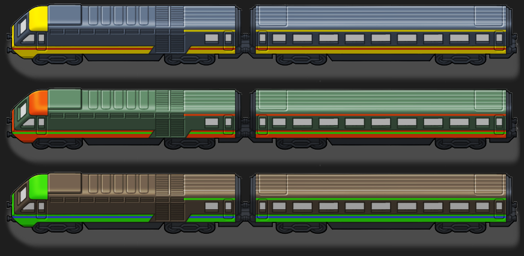

**1.** Trenurile gonesc pe șinele de cale ferată.

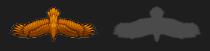

**2.** Dacă ești derulat în afara marginii de jos a ecranului, un vultur se va năpusti ca să te prindă.

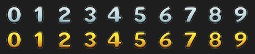

**3.** Cifrele folosite pentru afișarea scorului curent și a recordului.

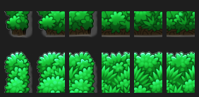

**4.** Gardul viu trebuie construit astfel încât să existe un gol prin care să treci.

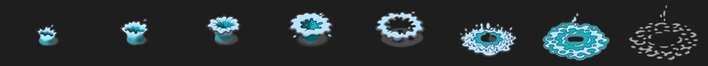

**5.** Cadrele animației pentru căderea în apă.

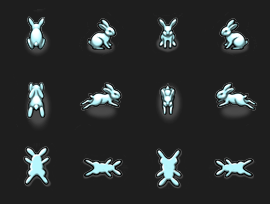

**6.** Cadrele de mișcare și animația „splat” pentru iepurașul nostru, în cele patru direcții.

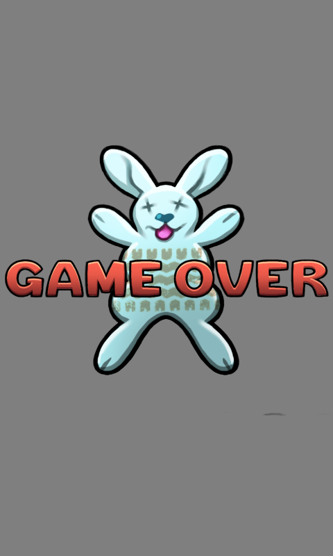

**7.** Ecranul de final are un iepuraș turtit.

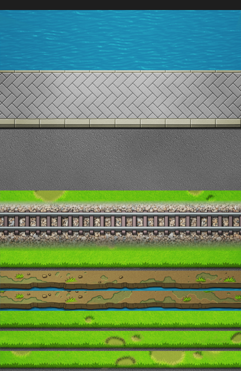

**8.** Fundalul derulant e construit din rânduri orizontale, cum ar fi pământ, iarbă, șine, drum, trotuar și apă.

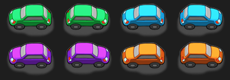

**9.** Mașini de diverse culori se mișcă la dreapta și la stânga pe drumuri.

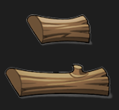

**10.** Buștenii îi permit iepurașului să traverseze râurile în siguranță.

---

[← Capitolul 2 – Platformer de acțiune: Bubble Bobble și Cavern](Capitolul02_Platformer_de_actiune_Bubble_Bobble_si_Cavern.md) | [Capitolul 4 – Shooter pe un singur ecran: Centipede și Myriapod →](Capitolul04_Shooter_pe_un_ecran_Centipede_si_Myriapod.md)
