# Capitolul 4 – Shooter pe un singur ecran: Centipede și Myriapod

> *Unele shootere limitează jocul la un singur ecran, restrângând în același timp mișcarea jucătorului. Restricțiile pot construi provocare și dificultate, dând naștere unor jocuri cu adevărat captivante*

Un shooter fix (în engleză, *fixed shooter*) este un stil de joc de tip shoot-'em-up care restricționează personajul jucătorului la o anumită axă sau la o mică porțiune a unui singur ecran. Multe titluri timpurii au folosit această mecanică, de la Space Invaders la Galaxian, iar unul dintre cele mai populare a fost Centipede, publicat de Atari în 1980. Unul dintre primele jocuri de reflexe, versiunea arcade originală folosea drept controler un mini-trackball, cerând reacții fulgerătoare pentru a împiedica un miriapod lung să ajungă în partea de jos a ecranului. Pe lângă împușcarea miriapodului însuși, jucătorii trebuiau să distrugă ciupercile din calea lui ca să-l încetinească: ronțăirea unei ciuperci făcea miriapodul să coboare pe rândul următor. Lovirea accidentală a miriapodului la mijloc îl făcea să se rupă în două bucăți, dublând pericolul. Inamicii-insecte adăugați creșteau tensiunea și ritmul.

## Inspirația

Centipede a fost dezvoltat pentru Atari de Dona Bailey și de supervizorul ei, Ed Logg. Dona și-a început cariera lucrând pentru General Motors, programând afișaje și sisteme de control al vitezei de croazieră, dar a devenit interesată de jocuri după ce a jucat titluri ca Space Invaders și a decis să se alăture diviziei de jocuri arcade a Atari. După ce a primit rolul de inginer software și a creat Centipede, în 1982 s-a mutat la Videa, fondată de mai mulți foști angajați Atari, și a continuat să scrie jocuri. Între timp, Ed, care produsese și Asteroids, a continuat cu Millipede, Xybots, Gauntlet și multe alte clasice timpurii ale jocurilor, de-a lungul anilor '80.

> **Centipede**
>
> **Lansat:** 1980
> **Platforme:** Arcade, Atari 2600, Atari 5200, Atari 7800
>
> Alte versiuni ale lui Centipede au fost create de Atarisoft pentru calculatoarele de acasă, inclusiv Apple II și Commodore 64, și a apărut, printre altele, și pe Sega Mega Drive, Game Gear și Master System.
>
> **Alte titluri notabile:** Space Invaders / Galaxian / Galaxy Wars

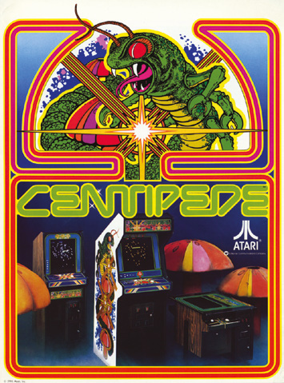

De unde începi dacă n-ai mai scris niciodată un joc pe calculator? Contează lipsa de experiență? Întoarce-te în anii '80 și vei găsi zeci de programatori exact în aceeași situație. Cu siguranță nu i-a împiedicat să vină cu idei uimitoare, care aveau să definească jocurile pentru anii și deceniile următoare: adesea, să te arunci cu capul înainte în ceva e cel mai bun mod de a începe.

Pentru mulți ingineri software, Dona Bailey e o sursă de inspirație. Înainte de 1980, nici măcar nu jucase un joc video. În acel an a jucat primul ei joc, Space Invaders, și și-a dat seama imediat că a găsit ceva special. A inspirat-o atât de mult, încât a decis să-și lase slujba de programatoare în limbaj de asamblare 6502 la General Motors, în California, unde programa senzori pentru primul Cadillac cu microprocesor la bord.

Dona a văzut că Atari construia cabinete arcade de jocuri video în Sunnyvale, California, și a aplicat pentru un post. Dezvoltatorul de jocuri a angajat-o în iunie 1980, unde a început un proces abrupt de învățare, descoperind diferitele abordări de programare necesare pentru a crea un joc și ajungând să înțeleagă ce e distractiv și de ce.

„A trebuit să învăț ceea ce părea a fi mii de detalii ca să pot începe să lucrez la un joc”, spune Dona. „La General Motors lucrasem cu echipe de programatori care scriau cod după specificații bine definite, iar fiecare persoană crea segmente limitate din programul total. La Atari era complet diferit: de la fiecare programator se aștepta să scrie un joc întreg.”

> *A trebuit să învăț ceea ce părea a fi mii de detalii ca să pot începe să lucrez la un joc*

## Născocirea ideilor

Atari își încuraja programatorii să vină cu idei de jocuri. Ținea sesiuni gigantice de brainstorming, care îi îndemnau pe programatori să-și deschidă mintea, să exploreze ce funcționa și ce nu, și să discute subtilitățile designului. O idee pentru jocul care avea să devină Centipede fusese deja notată într-un caiet când a sosit Dona. „Era o singură propoziție: „O insectă cu mai multe segmente se târăște pe ecran și e împușcată de jucător””, își amintește ea. L-a ales ca jocul pe care voia să-l dezvolte.

Procesul de învățare a început în forță. „Înainte să pot începe, trebuia să fiu învățată cum să creez grafica pentru hardware-ul jocului, cum să folosesc întreruperile majore și minore ale microprocesorului 6502, cum să configurez structurile de date pentru obiectele în mișcare din joc, cum să folosesc controlerele de joc personalizate ale Atari și cipul de sunet personalizat, și tot așa”, spune ea. „A fost o curbă de învățare cu adevărat intensă, cel puțin șase luni, când am început la Atari.”

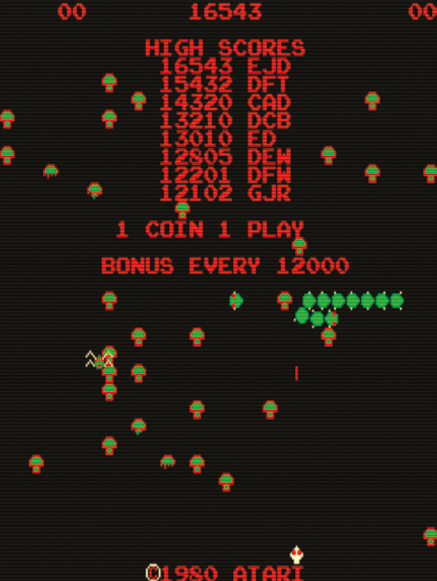

Dona spune că a început la Atari fără să știe cu adevărat ce voia să facă acolo. Dar asta a fost un lucru foarte pozitiv. Deși o structură solidă pentru jocul tău îți va economisi mult timp, îți va permite să vezi imaginea de ansamblu a jocului și să înțelegi cum anumite părți le vor afecta pe altele, mulți programatori, ca Dona, au sărit direct în cod și au dezvoltat jocul din mers.

Așa cum vom vedea mai târziu, asta poate funcționa foarte bine. Atâta timp cât înțelegi constrângerile sistemului (Centipede urma să fie produs ca joc arcade cu monede, așa că Donei i-a fost repartizată o placă grafică raster extrem de stabilă, care afișa 16 obiecte în mișcare pe ecran simultan), o abordare liberă îi permite programatorului să-și vizualizeze jocul cum crede de cuviință.

## Aspect și mișcare

Prima sarcină a Donei a fost să lucreze la aspectul miriapodului însuși. „Pe baza scurtei descrieri a jocului din caiet, pur și simplu avea sens să folosesc cât mai multe obiecte în mișcare pentru segmentele miriapodului”, dezvăluie ea. „Am vizualizat miriapodul ca pe un șirag de mărgele care se îmbină una în alta și îmi amintesc că abia așteptam mișcarea alunecoasă pe care aveam s-o creez când miriapodul se întorcea la întâlnirea cu marginile ecranului. Mă gândeam mult mai mult la cum arată decât la planificarea gameplay-ului sau a ritmului, mai ales în primele zile de programare a jocului.”

Odată ce a avut aspectul grafic potrivit, a venit timpul să lucreze la jocul în sine, începând cu mișcarea personajului principal. „În joc, miriapodul cu mai multe segmente se târăște pe ecran în partea de sus, călătorește până în partea cealaltă a ecranului, coboară pe ecran, se întoarce și se târăște înapoi până în partea cealaltă, repetând acest proces până jos.” Așa că mișcarea era ceva de avut în vedere: Dona a decis ca miriapodul să se miște automat de la stânga la dreapta, să coboare un rând, să se întoarcă și apoi să meargă în sens invers. Repetând acest tipar, miriapodul își făcea drum din stânga-sus a ecranului până în dreapta-jos.

Acum Dona trebuia să creeze un anumit nivel de interacțiune. Jucătorul e postat în partea de jos a ecranului și poate trage cu lasere în miriapod pe măsură ce acesta coboară. În versiunea arcade originală, jucătorul putea fi mutat de la stânga la dreapta cu mini-trackball-ul, precum și în sus și în jos, într-un interval limitat („jucătorul nu se putea muta mai sus de câteva rânduri de la partea de jos a ecranului”, explică Dona). În același timp, putea trage un singur foc odată.

> **Învață de la maestru**
>
> *Centipede a împrumutat câteva construcții naturale, care au făcut ca unele părți ale procesului de joc să fie rezolvate aproape din întâmplare.*
>
> **Fără limită de timp:** Centipede nu avea nevoie de o limită de timp evidentă, pentru că faptul că creatura cobora rapid pe ecran însemna că jucătorii nu-și puteau permite să o ia încet.
>
> **Fără platforme:** Cum personajul inamic cobora singur pe ecran, nu era nevoie de platforme fixe: ciupercile poziționate aleator își făceau treaba perfect.

„Dacă focul e în mișcare pe ecran, jucătorul trebuie să aștepte până când grafica focului se întoarce la iconița jucătorului înainte să poată trage din nou”, spune Dona. „Jucătorul poate folosi o opțiune de foc rapid ținând apăsat butonul de tragere. Focul se întoarce la iconița jucătorului, ca să fie folosit din nou, fie când lovește ceva pe ecran, inclusiv o porțiune din miriapod, fie când ajunge în partea de sus a ecranului.”

## Fiecare foc contează

Pentru jucători, această mecanică asigură că fiecare foc e sacru. Miriapodul va coborî cu viteză (exact ce viteză vrei pentru shooter-ul tău fix e ceva ce trebuie să stabilești tu, în codul tău), așa că jucătorii vor vrea ca fiecare foc să aibă un impact. Ratarea irosește timp prețios.

Când un foc lovește miriapodul, segmentul cu care intră în contact dispare. Segmentul din spatele lui devine apoi capul miriapodului, creând doi miriapozi. Miriapodul din urmă coboară un rând și pornește în direcția opusă, în timp ce cealaltă parte își continuă drumul. „Un jucător poate trage și poate face miriapodul să se rupă în mai mulți miriapozi, care călătoresc în direcții diferite, pe rânduri diferite ale ecranului”, spune Dona. Jucătorii trebuie să tot tragă până când întregul miriapod e eliminat de pe ecran.

Ca toate astea să se întâmple, programatorul trebuie să analizeze cu grijă ce se întâmplă cu miriapodul când e împușcat. Pentru început, fiecare segment trebuie tratat ca o entitate separată. Nu e cu adevărat un miriapod lung pe ecran, ci un set de componente individuale care acționează ca una singură. Trebuie să iei în calcul că seturile trebuie să se miște independent unul de altul după ce sunt împușcate. Și când sunt împușcate și o bucată dispare, trebuie să-i dai jucătorului un alt laser de tras. Ține cont și că jucătorul va aborda jocul în feluri diferite.

„Unora le plăcea să exerseze strategii în care împușcau doar capul miriapodului, țintind cu grijă capul de fiecare dată când apărea unul nou”, notează Dona. „Altora le plăcea să tragă la întâmplare, lovind orice se putea.” Un joc care poate fi jucat tactic funcționează bine pentru jucători, oferind profunzime și dându-i jucătorului sentimentul că e un joc de îndemânare, care poate fi bătut, plin de secrete de descoperit.

> *Un joc care poate fi jucat tactic funcționează bine pentru jucători, oferind profunzime*

## Verificări în cod

Dar cum programezi toate astea? Dona spune că, pentru Centipede, creatura principală, jucătorul și focul trebuiau afișate pe ecran tot timpul, la fiecare nivel al jocului. Fiecare rundă e apoi configurată să afișeze grafica, iconița jucătorului, focul și diversele culori în care pot apărea capul și segmentele corpului miriapodului (schimbând culoarea de la un nivel la altul, poți adăuga foarte repede varietate). „Starea trackball-ului e verificată în mod repetat pentru orice mișcare a jucătorului, ca să reacționeze la mișcările intenționate de jucător”, spune Dona. „Starea butonului de tragere e verificată în mod repetat, ca să reacționeze la intențiile jucătorului de a folosi focul de pe ecran.”

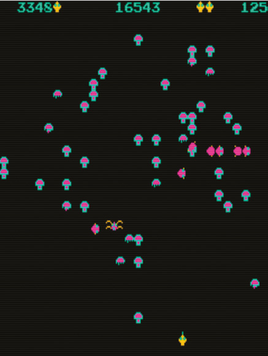

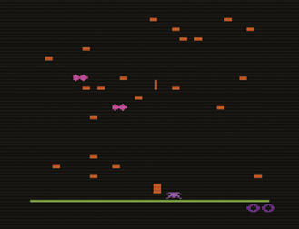

Urmează detectarea coliziunilor. „Segmentele miriapodului se mișcă incremental, cu o rată constantă, într-o direcție consecventă, iar programul verifică la fiecare mișcare incrementală marginile ecranului sau ciupercile”, explică Dona. Ceea ce ne duce direct la partea care permite gameplay-ului din Centipede să urce o treaptă, adăugând o răsucire foarte captivantă: obstacolele cu care interacționează miriapodul.

## Producerea obstacolelor

Ciupercile sunt cruciale pentru gameplay, făcând comportamentul miriapodului mai imprevizibil. Jocul presăra ecranul cu aceste obstacole, iar ideea era că miriapodul lovea una și era forțat să coboare un rând mult mai devreme decât ar fi făcut-o dacă întreaga linie ar fi fost liberă. Dar Dona spune că ciupercile din Centipede au apărut dintr-un accident norocos.

„Învățam pe măsură ce lucram. Am făcut multe greșeli în codul pe care l-am scris și am făcut și multe estimări proaste, pentru că tot ce încercam era prima mea încercare”, spune ea. „Când am scris partea de detecție a coliziunilor din cod pentru focul în mișcare, m-am gândit logic că pot folosi pur și simplu aritmetica și să consider o lovitură dacă focul atingea efectiv un cap sau un segment de corp al miriapodului pe ecran. N-aveam nicio experiență cu felul în care arată o coliziune, comparativ cu aritmetica unei coliziuni reale, în numere.

„Prima dată când am jucat acest cod ca să-l testez, am văzut că părea, în ochii mei, că un foc trece direct printr-un segment de miriapod. Se pare că zona care trebuie să conteze drept coliziune, ca să pară corectă vizual, e mult mai mare decât zona aritmetică reală a unei coliziuni. Am tot ajustat și, după ceva timp și experimente, am crezut că am o rutină de coliziune care părea validă vizual.”

> *Prima dată când am jucat acest cod ca să-l testez, am văzut că părea, în ochii mei, că un foc trece direct printr-un segment de miriapod*

Lupta ei cu coliziunile îi zdruncinase încrederea, dar într-o dimineață, la scurt timp după ce a făcut detecția coliziunilor să funcționeze, spune că s-a trezit cu câteva ore libere, când nimeni n-o presa să înceapă funcții noi. „Am decis să fac o pauză, pentru că voiam să mă asigur și mai bine că gestionez corect ruperea și întoarcerea segmentelor de miriapod după ce un segment fusese împușcat. Voiam să-mi iau timp să pun un marcaj vizual pe ecran acolo unde un segment era împușcat, și voiam să joc jocul și să fiu sigură că partea rămasă din miriapod se întoarce în locul unde era pus marcajul vizual.”

A făcut o grafică simplă, o cutie neagră, într-un tipar de ștampilă bitmap de 8×8, și a scris codul care să plaseze pătratul negru acolo unde un segment de miriapod era împușcat. „Am compilat codul, am creat un PROM de test și am fugit înapoi la cabinetul de dezvoltare ca să-l verific”, povestește Dona.

„Am jucat jocul și am fost atât de ușurată să văd că detecția coliziunilor și mișcarea ulterioară a miriapodului funcționau corect. Am continuat să joc, pentru că mă bucura să văd tiparele interesante care se formau pe ecran pe măsură ce împușcam tot mai multe segmente de miriapod, iar tot mai multe cutii pătrate formau un tipar de labirint mereu schimbător, care spărgea frumos ecranul. În doar câteva minute, am înțeles că aceste cutii de test aveau mult potențial ca funcție permanentă.”

## Perspective noi

Să faci un pas înapoi de la un proiect și să-l privești din punctul de vedere al jucătorului te poate face să vezi jocul dintr-o altă perspectivă și să-ți amintești că nu trebuie să te ții mereu de un drum fix. Cea mai bună programare de jocuri e creativă și flexibilă, crescând organic pe măsură ce te familiarizezi cu construcțiile de bază. Experimentând și testând, Dona a decis să înlocuiască pătratele de 8×8 pixeli cu o grafică mai arătoasă.

S-a decis la început pentru pietre sau bolovani, în maro, dar i-a respins repede. „E aproape imposibil să faci o piatră arătoasă în 8×8 pixeli, iar combinat cu culoarea maro părea că ecranul e plin de caca.” Spune că le-a înlocuit cu ciuperci simple, cu pălărie și picior, cu un contur în jur, ca să poată folosi două culori pentru contrast.

„Asta s-a dovedit frumos, în viziunea mea, și am jucat jocul, împrăștiind un câmp de ciuperci strălucitoare”, își amintește Dona. „Foarte obosită după toată graba și efortul dimineții, am plecat la prânz. Când m-am întors, alți băieți din departamentul de jocuri arcade de la Atari jucau Centipede și aprobau adăugarea ciupercilor. Noua funcție prinsese și stârnise un mic val de atenție, și s-a decis că ciupercile pot rămâne în joc.”

Dar ăsta n-a fost sfârșitul ajustărilor. „Ne-am distrat mult cu noua funcție în restul dezvoltării jocului”, continuă Dona. „Am folosit generatorul de numere aleatoare ca să variem plasarea ciupercilor la configurarea fiecărei runde noi. După ce am lucrat mult timp cu ciupercile ca fiind permanente și indestructibile, am avut ideea revoluționară, în timpul unei evaluări a jocului, să putem împușca ciupercile pentru puncte, ca să curățăm ecranul sau ca să creăm tipare noi.”

> **Obiectivele**
>
> **Pe termen scurt:** Începe prin a mișca personajele care sunt pe ecran tot timpul sau în cea mai mare parte a timpului. Aici intră, probabil, iconița jucătorului. De exemplu, în Centipede primul obiectiv a fost să mișc miriapodul, apoi iconița jucătorului și apoi iconița focului.
>
> **Pe termen mediu:** Adaugă alte personaje, care apar mai rar; începe să adaugi puncte pentru scor; începe să adaugi efecte sonore.
>
> **Pe termen lung:** Adaugă complexitate gameplay-ului, cum ar fi niveluri superioare mai dificile, pe baza unor scoruri mai mari sau a unor timpi de joc mai lungi. Rafinează ritmul și factorul de distracție al jocului. Rafinează punctajul, sunetele și grafica. Testează erorile din gameplay cât mai mult, și cu cât mai mulți jucători, posibil.

## Mișcarea inamicilor

Împușcând ciupercile, se putea împiedica miriapodul să coboare prea repede pe ecran. Dar înainte chiar să se apuce de ciuperci, Dona căutase să crească numărul lucrurilor cu care jucătorul trebuia să se descurce. A introdus un păianjen, care se mișcă în partea de jos a ecranului în direcții diagonale, în unghiuri și la intervale de timp care variază aleator.

„Cipul de sunet personalizat al Atari conținea un generator de numere aleatoare, pe care l-am folosit ca să adaug varietate mișcării și sincronizării păianjenului, astfel încât fiecare apariție a lui să fie imprevizibilă, menținând gameplay-ul proaspăt”, dezvăluie ea. „Am fost învățată și ghidată să implementez mare parte din gameplay-ul lui Centipede de programatori mai experimentați de la Atari, și am beneficiat enorm de sfaturile și ajutorul altora, dar folosirea generatorului de numere aleatoare în Centipede a fost ideea mea. Cred că introducerea imprevizibilității face jocul mai distractiv.”

Pentru că sistemul putea suporta doar 16 obiecte în mișcare pe ecran simultan, cel puțin un segment de miriapod trebuia împușcat înainte de a scoate păianjenul. „Până când e împușcat cel puțin un segment de miriapod, toate obiectele în mișcare sunt în uz pe ecran. Când o secțiune de miriapod e împușcată și eliminată de pe ecran, obiectul ei în mișcare, rămas nefolosit, poate fi utilizat pentru păianjen.” Dar chiar și cu păianjenul la locul lui, echipa de management din departamentul de jocuri arcade voia mai mult.

„Conducerii în general i-a plăcut jocul, dar exista un consens că Centipede avea nevoie de „mai mult””, spune Dona. „Mai mult ce?, ne-am întrebat. M-am agățat de ce nu avea la acel moment, adică ceva care să se miște drept în jos pe ecran și ceva care să se miște drept de-a latul ecranului, și așa s-au născut furnica (credeam că am desenat o furnică, dar a fost cunoscută imediat drept purice), cu mișcarea ei verticală, și scorpionul, cu mișcarea lui orizontală. Aceștia doi au adăugat provocare și dificultate în nivelurile mai avansate ale jocului.”

Mai multe creaturi au însemnat mai multă complexitate, inclusiv opțiunea de a manipula ciupercile ca să funcționeze cu aceste creaturi suplimentare. „După decizia de a împușca ciupercile, am putut adăuga funcții legate de ciuperci furnicii, care lasă în urmă o coloană de ciuperci noi, și scorpionului, care otrăvește un rând de ciuperci, iar fiecare ciupercă otrăvită face miriapodul să intre în cădere liberă pe ecran după ce atinge una.”

## Acordarea punctelor

În acord cu majoritatea jocurilor de atunci, jucătorilor li se acordau și puncte. Câștigau un număr fix ori de câte ori un segment al miriapodului era împușcat sau dacă o altă creatură era doborâtă. Erau mai multe puncte pentru ciupercile eliminate. Un scor maxim rămânea pe ecran alături de scorul jucătorului curent, iar asta îi stimula pe jucători să încerce să bată cel mai mare punctaj.

„Cred că a câștiga puncte și a ține scorul sunt elementare pentru orice tip de joc definit, și cred că majorității jucătorilor le place aspectul punctajului și al câștigării punctelor”, spune Dona. „Cred că e distractiv să oferi niște puncte de valoare mică, ușor de câștigat, dar și niște puncte riscante, de valoare mare. Creatorii de jocuri ar trebui să-și amintească să ofere acele puncte ușoare, dar să construiască și niște puncte dificile, ca să se lege de o maximă atribuită lui Nolan Bushnell, fondatorul Atari, care spune că jocurile ar trebui să fie ușor de învățat, dar greu de stăpânit.”

> *Cred că majorității jucătorilor le place aspectul punctajului și al câștigării punctelor*

Centipede a întruchipat acea maximă: un titlu de tip „iei și joci”, care s-a tradus bine pe console și pe comenzi cu joystick, oferind în același timp doza potrivită de provocare și frustrare ca să se asigure că jucătorii continuă (sau, în cazul sălilor de jocuri, bagă mai mulți bani în aparate). A fost un triumf major pentru Dona Bailey și co-creatorul Ed Logg și a adus o gândire proaspătă în genul shoot-'em-up. Există principii și concepte de joc încorporate în Centipede care se pot traduce în multe alte jocuri.

„Când faci un joc, e greu pentru programator să se detașeze de gameplay-ul familiar și să cântărească punctele forte și slăbiciunile jocului, ca să revizuiască și să echilibreze funcțiile de ansamblu”, conchide Dona. „În 1980, când am lucrat la Centipede, jucasem foarte puține jocuri video, doar pentru perioade scurte, iar domeniul studiilor despre jocuri nici nu exista în acel moment. Programatorii de jocuri de azi pot juca o mare varietate de jocuri, pot aplica gândirea critică fiecărui joc, ca să-i analizeze cu grijă funcțiile, și pot studia atât programarea jocurilor, cât și studiile despre jocuri.”

Dona te sfătuiește să-ți recrutezi prietenii, familia și jucătorii critici ca ajutoare. „Pe lângă studiile formale, e util să-i rogi pe alții să-ți joace jocul, și e util și dacă le ceri altor jucători să completeze un chestionar sau să scrie răspunsuri despre funcțiile pe care le testezi”, spune ea. „Programatorii de jocuri învață să ajusteze și să echilibreze funcțiile jocului jucând alte jocuri, consultându-se cu alți jucători și practicând intens arta dezvoltării de jocuri. Amintește-ți că orice abilitate care merită cultivată se îmbunătățește prin practică intensă, iar asta e cu siguranță adevărat pentru dezvoltarea de jocuri.”

> *E greu pentru programator să cântărească punctele forte și slăbiciunile jocului*

> **Femeile în industria jocurilor**
>
> La începuturile programării jocurilor, prea puține femei erau angajate ca programatoare. Se crede că Carol Shaw a deschis drumul în 1978, când s-a alăturat Atari ca inginer software pentru microprocesoare, înainte să lucreze la Tandem Computers și Activision, dar Dona Bailey era încă singura femeie din divizia de jocuri arcade când s-a angajat. Astăzi, situația se îmbunătățește, din fericire. Amy Hennig, care a fost implicată intens în apreciata serie Uncharted, e printre multele femei foarte influente din industria jocurilor. Robin Hunicke a produs unele dintre cele mai inspirate și creative titluri, inclusiv premiatul joc de aventură cooperativ multiplayer Journey.

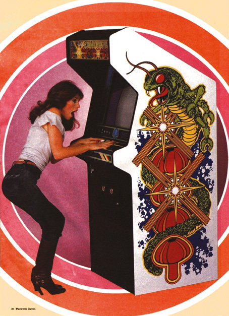

---

# Programăm azi: Myriapod

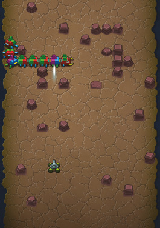

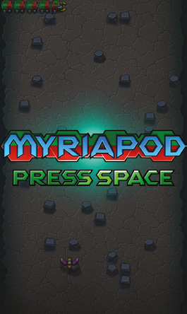

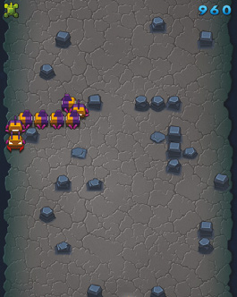

Myriapod e omagiul nostru adus lui Centipede. În această versiune a jocului, ciupercile au devenit pietre, iar păianjenul e o insectă zburătoare. Miriapodul e numit *myriapod*, un cuvânt care denumește categoria de animale din care fac parte centipedele și milipedele. Am creat clase pentru fiecare dintre acestea, numite `Rock` și `FlyingEnemy`. Clasele moștenesc din clasa `Actor` a lui Pygame Zero, care ține evidența poziției unui obiect în lumea jocului și se ocupă de încărcarea și afișarea sprite-urilor. Există și o clasă `Explosion`, folosită când un glonț e distrus.

> **Descarcă codul**
> Descarcă codul complet comentat al jocului Myriapod, împreună cu toată grafica și sunetele, de la wfmag.cc/CTC1-myriapod

> **NOTA TRADUCĂTORULUI**
> Linkul scurt de mai sus nu mai funcționează. Codul complet comentat, cu imaginile, sunetele și muzica, se găsește în folderul [codul_sursa/myriapod](codul_sursa/myriapod/). Instrucțiunile de instalare sunt în [Capitolul 6 – Instalarea](Capitolul06_Instalarea.md) și, pe scurt, în [codul_sursa/README.md](codul_sursa/README.md).

Miriapodul însuși, în loc să fie o singură entitate, e format din mai multe instanțe ale clasei `Segment`, fiecare mișcându-se independent de celelalte, chiar dacă la început nu pare așa, când intră pe ecran într-un rând frumos ordonat. Clasa `Player` se ocupă de mișcarea și animația jucătorului, precum și de ce se întâmplă când jucătorul e distrus și apoi reapare. Se ocupă și de crearea gloanțelor (`Bullet`).

Clasa `Game` e responsabilă de crearea inamicului zburător, a segmentelor miriapodului și a majorității pietrelor. Păstrează și o referință la obiectul jucător și creează o listă bidimensională care reprezintă grila, în care fiecare element e fie o referință la un obiect `Rock`, fie valoarea `None`, care indică faptul că nu există piatră în acea poziție a grilei. Clasa `Game` conține multe metode-cheie, apelate din alte părți ale jocului, cum ar fi `allow_movement`, care asigură că jucătorul nu poate trece prin pietre.

Funcțiile `update` și `draw` citesc variabila `state` și rulează doar codul relevant pentru starea curentă. Variabila `game` face referire la o instanță a clasei `Game`, descrisă mai sus. Metoda `__init__` (constructorul) a clasei `Game` primește, opțional, un parametru numit `player`. Când creăm un obiect `Game` nou pentru meniul principal, nu dăm acest parametru, iar jocul va rula, prin urmare, în modul de atragere. Când creăm un obiect `Game` nou pentru jocul propriu-zis, îi dăm un obiect `Player` nou.

## Mișcarea segmentelor

Cel mai complex cod din acest joc se referă la felul în care se mișcă segmentele miriapodului și la cum decid ele unde să meargă în continuare. Fiecare segment se mișcă în raport cu celula curentă din grilă. Un segment intră într-o celulă printr-o anumită margine (stocată în `in_edge`, în clasa `Segment`). După cinci cadre, decide prin ce margine va ieși (stocată în `out_edge`). De exemplu, ar putea merge drept înainte și ieși prin marginea opusă celei prin care a intrat. Sau s-ar putea întoarce cu 90 de grade și ieși printr-o margine din stânga sau din dreapta lui. În al doilea caz, se întoarce inițial cu 45 de grade și continuă pe acel drum timp de opt cadre. Apoi se întoarce cu încă 45 de grade, moment în care se îndreaptă direct spre următoarea celulă din grilă. Un segment petrece în total 16 cadre în fiecare celulă. În metoda `update`, variabila `phase` se referă la locul în care se află în acel ciclu: 0 înseamnă că tocmai a intrat într-o celulă, iar 15 că e pe cale s-o părăsească.

Să ne imaginăm mai întâi cazul în care un segment intră prin marginea de sus a unei celule și continuă în linie dreaptă, ieșind în cele din urmă prin marginea de jos (Figura 1). Celulele grilei au 32×32 de pixeli, iar segmentele au nevoie de 16 sau 8 cadre ca să traverseze o celulă (fiecare al patrulea val de miriapozi e rapid). Pentru segmentele cu viteză normală, asta înseamnă că trebuie doar să se mute cu doi pixeli în direcția respectivă, în fiecare cadru.

> **Animația sprite-ului jucătorului**
>
> 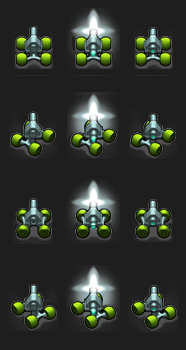
>
> Când jucătorul apasă o tastă ca să pornească într-o direcție nouă, nu vrem ca sprite-ul să se schimbe instantaneu, ca să fie orientat în noua direcție. Ar arăta greșit, pentru că în lumea reală vehiculele nu-și pot schimba brusc direcția cât ai clipi. În schimb, vrem ca vehiculul să se întoarcă spre noua direcție pe parcursul mai multor cadre. De exemplu, dacă vehiculul e orientat în jos, iar jucătorul apasă săgeata stânga, vehiculul ar trebui să se întoarcă mai întâi diagonal, în jos și spre stânga, și apoi să se întoarcă spre stânga.

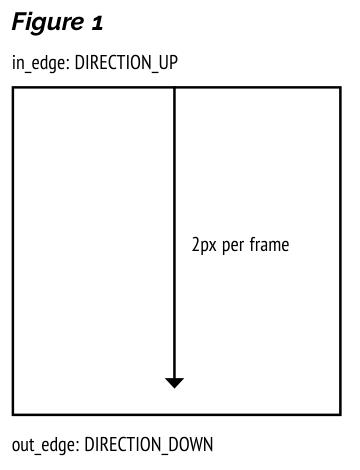

> **Figura 1**
> Segmentul intră prin marginea de sus (`in_edge: DIRECTION_UP`), se mișcă drept, cu 2 pixeli pe cadru, și iese prin marginea de jos (`out_edge: DIRECTION_DOWN`).

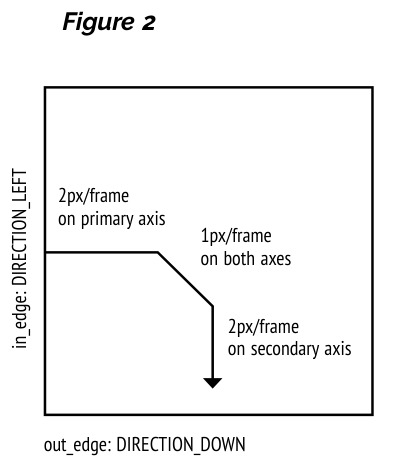

> **Figura 2**
> Segmentul intră prin marginea din stânga (`in_edge: DIRECTION_LEFT`), cu 2 pixeli pe cadru pe axa primară, continuă cu 1 pixel pe cadru pe ambele axe (porțiunea diagonală), apoi cu 2 pixeli pe cadru pe axa secundară, și iese prin marginea de jos (`out_edge: DIRECTION_DOWN`).

Să ne imaginăm acum cazul în care un segment intră prin marginea din stânga a unei celule și apoi se întoarce ca să iasă prin marginea de jos (Figura 2). Segmentul se va mișca inițial pe axa orizontală (X) și va sfârși mișcându-se pe axa verticală (Y). În acest caz, vom numi axa X axa primară, iar axa Y axa secundară. Pornește mișcându-se cu doi pixeli pe cadru pe axa primară, dar apoi începe să se miște pe axa secundară pe baza valorilor din lista `SECONDARY_AXIS_POSITIONS`, care stochează mișcarea totală pe axa secundară care va fi avut loc la fiecare fază a mișcării segmentului prin celula curentă. În acest caz, nu vrem să continue să se miște pe axa primară: ar trebui mai întâi să încetinească la un pixel pe cadru (partea diagonală a mișcării segmentului), apoi să se oprească complet din mișcarea pe acea axă. De fapt, axa secundară fură mișcare de la axa primară, de aici și variabila `stolen_y_movement`.

Codul pornește de la presupunerea că un segment începe din partea de sus a celulei. Axele primară și secundară ar fi, prin urmare, Y și X. Mai târziu, se aplică un calcul pentru a roti aceste deplasări X și Y, în funcție de direcția reală din care vine segmentul.

Acestea sunt elementele esențiale ale mișcării segmentelor; poți găsi mai multe detalii în codul complet comentat din folderul [codul_sursa/myriapod](codul_sursa/myriapod/). Dar cum alege un segment în ce celulă se va muta în continuare?

Deși miriapodul pare inițial că se mișcă ca o singură unitate, segmentele individuale sunt de fapt independente unele de altele. Asta devine clar când împuști un segment din mijloc. Segmentele distruse se transformă în pietre, ceea ce face ca segmentele din spate să-și schimbe direcția și să se despartă de segmentele din față.

Așa cum am descris mai sus, fiecare segment are o variabilă `phase`, care indică unde se află în mișcarea prin celula curentă. În metoda `update`, când `phase` ajunge la 4, trebuie luată o decizie despre în ce celulă va încerca să se mute în continuare și, prin urmare, prin ce margine a celulei curente va ieși, ceea ce se stochează în `out_edge`.

Metoda `rank` e cheia înțelegerii procesului de decizie. Scopul ei e să ordoneze direcțiile posibile în care s-ar putea mișca un segment, în ordinea preferinței. Conține o funcție interioară (imbricată), numită `inner`, pe care o returnează ca rezultat. Funcția returnată e transmisă funcției `min` din Python, în metoda `update`, ca parametrul opțional `key`. `min` apelează apoi această funcție de patru ori, cu numerele de la 0 la 3, reprezentând cele patru direcții posibile (vezi `DIRECTION_UP` etc., mai sus în cod). Vom explica în scurt timp de ce și cum folosim `min`.

Funcția `inner` primește un parametru numit `proposed_out_edge`, reprezentând o direcție. Funcția returnează un tuplu format dintr-o serie de factori care determină în ce celulă a grilei ar trebui segmentul să încerce să se mute în continuare. Acestea nu sunt reguli absolute; mai degrabă, sunt folosite pentru a ordona cele patru direcții după preferință, adică pentru a stabili care direcție e cea mai bună (sau măcar cea mai puțin rea). Factorii sunt valori booleene (`True` sau `False`). O valoare `False` e preferabilă unei valori `True`. Ordinea factorilor în tuplul returnat determină importanța lor în decizia încotro să meargă, cel mai important factor venind primul. Câteva exemple de asemenea factori: un segment n-ar trebui să încerce să meargă într-o direcție care îl scoate din grilă, n-ar trebui să încerce să treacă printr-o piatră decât dacă e absolut necesar (caz în care piatra va fi distrusă) și ar trebui, de obicei, să prefere să se miște orizontal.

> **Valuri**
>
> 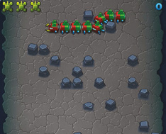
>
> La începutul jocului, sau de fiecare dată când jucătorul a distrus toate segmentele miriapodului, începe un val nou. Asta se întâmplă în metoda `Game.update`. Primul lucru care se întâmplă e că pietrele sunt create aleator în tot nivelul. Deși le-am putea crea pe toate deodată, e mai plăcut estetic să creăm câte una pe cadru, până avem numărul dorit. Odată ce avem destule pietre (un număr care crește cu fiecare val), trecem la crearea miriapodului însuși. Inițial creăm opt segmente per miriapod, dar la fiecare patru valuri acest număr crește cu două. Segmentele sunt create chiar deasupra colțului din stânga-sus al ecranului. În primul val, creăm un miriapod de bază, în care fiecare segment moare dintr-o lovitură. În al doilea val, fiecare al doilea segment are nevoie de două lovituri. În al treilea, toate segmentele au nevoie de două lovituri. În al patrulea, segmentele mor dintr-o singură lovitură, dar se mișcă de două ori mai repede. Această secvență se repetă apoi, dar cu un miriapod mai lung.

Înapoi în metoda `update`, `range(4)` generează toate numerele de la 0 la 3 (corespunzând lui `DIRECTION_UP` etc.). Funcția încorporată `min` din Python alege, de obicei, cel mai mic număr pe care îl primește, așa că ar returna de regulă 0 ca rezultat. Dar dacă se specifică argumentul opțional `key`, asta schimbă felul în care funcția determină rezultatul. Funcția `inner`, returnată de funcția `rank`, e apelată de `min` ca să decidă cum ar trebui ordonate elementele. Funcția `inner` returnează un tuplu de valori booleene, de exemplu `(True,False,False,True)`. Când Python compară două asemenea tupluri, consideră valorile `False` mai mici decât valorile `True`, iar valorile care vin mai devreme în secvență sunt mai semnificative decât cele de mai târziu. Așa că `(False,True)` ar fi considerat mai mic decât `(True,False)`. Cum apelăm `min`, nu `max`, rezultatul final al tuturor acestora e că `out_edge` va fi setat la direcția care corespunde tuplului cu cea mai mică valoare.

Elementele tuplului sunt următoarele:

- Direcția propusă ne duce într-o celulă din afara grilei?
- Ne întoarce înapoi pe propriile urme, o întoarcere de 180 de grade?
- Ne duce într-o direcție interzisă? (Nu putem coborî dacă suntem pe ultimul rând al grilei, nu putem urca dacă suntem pe rândul 18)
- Există o piatră în noua celulă?
- Noua celulă e deja ocupată de alt segment, sau alt segment încearcă să intre în celula mea din direcția opusă?
- Un factor care ne face să preferăm mișcarea orizontală, dacă nu e o piatră în cale. Dacă sunt pietre atât orizontal, cât și vertical, preferăm să ne mișcăm vertical.
- Un factor care ne face să schimbăm direcția de la stânga la dreapta și invers de fiecare dată când urcăm sau coborâm.

> **Provocări**
>
> - În Centipede-ul original, poate exista un singur glonț la un moment dat, iar jucătorul poate trage din nou imediat ce glonțul curent e distrus. Dacă jucătorul ține apăsat butonul de foc, cadența va fi foarte rapidă când împușcă repetat ținte apropiate de jucător și mai lentă când împușcă ținte mai îndepărtate. Cum ai obține acest comportament în Myriapod?
> - Cum ai schimba codul astfel încât un val să poată fi format din mai mulți miriapozi, creați fie simultan, fie la intervale?
> - În prezent, împușcarea unei pietre „Totem” dă un bonus de scor, dar ce-ar fi dacă ar lăsa și un power-up care să poată fi colectat, dându-i jucătorului temporar, de exemplu, trei gloanțe deodată?
> - Acordă o viață în plus când jucătorul obține 1000 de puncte, apoi încă una după alte 1200 de puncte, apoi 1400 și așa mai departe. Redă un efect sonor când se câștigă o viață în plus.
> - Ține evidența recordului și salvează recordurile noi într-un fișier, similar cu Bunner. Pe ecranul de final, afișează scorul jucătorului și fie recordul curent, dacă n-a fost bătut, fie „NEW HIGH SCORE!”.

## Codul jocului Myriapod

> **Cum rulezi jocul**
> Deschide fișierul `myriapod.py` într-un editor Python, cum ar fi IDLE, și alege Run > Run Module. Pentru mai multe detalii, vezi [Capitolul 6 – Instalarea](Capitolul06_Instalarea.md).

> **NOTA TRADUCĂTORULUI**
> Listarea de mai jos este versiunea din depozitul editurii, fără comentarii; fișierul [codul_sursa/myriapod/myriapod.py](codul_sursa/myriapod/myriapod.py) conține aceeași versiune, cu toate comentariile autorilor, mult mai bogate la acest joc. Comenzile: săgețile pentru mișcare, SPAȚIU pentru a trage și pentru a începe jocul. Fereastra e verticală (480 pe 800 de pixeli), ca la aparatul arcade original.

```python
import pgzero, pgzrun, pygame, sys
from random import choice, randint, random
from enum import Enum

if sys.version_info < (3,5):
    print("This game requires at least version 3.5 of Python. Please download it from www.python.org")
    sys.exit()

pgzero_version = [int(s) if s.isnumeric() else s for s in pgzero.__version__.split('.')]
if pgzero_version < [1,2]:
    print("This game requires at least version 1.2 of Pygame Zero. You have version {0}. Please upgrade using the command 'pip3 install --upgrade pgzero'".format(pgzero.__version__))
    sys.exit()

WIDTH = 480
HEIGHT = 800
TITLE = "Myriapod"

DEBUG_TEST_RANDOM_POSITIONS = False

CENTRE_ANCHOR = ("center", "center")

num_grid_rows = 25
num_grid_cols = 14

def pos2cell(x, y):
    return ((int(x)-16)//32, int(y)//32)

def cell2pos(cell_x, cell_y, x_offset=0, y_offset=0):
    return ((cell_x * 32) + 32 + x_offset, (cell_y * 32) + 16 + y_offset)

class Explosion(Actor):
    def __init__(self, pos, type):
        super().__init__("blank", pos)

        self.type = type
        self.timer = 0

    def update(self):
        self.timer += 1

        self.image = "exp" + str(self.type) + str(self.timer // 4)

class Player(Actor):
    INVULNERABILITY_TIME = 100
    RESPAWN_TIME = 100
    RELOAD_TIME = 10

    def __init__(self, pos):
        super().__init__("blank", pos)

        self.direction = 0
        self.frame = 0

        self.lives = 3
        self.alive = True

        self.timer = 0

        self.fire_timer = 0

    def move(self, dx, dy, speed):
        for i in range(speed):
            if game.allow_movement(self.x + dx, self.y + dy):
                self.x += dx
                self.y += dy

    def update(self):
        self.timer += 1

        if self.alive:
            dx = 0
            if keyboard.left:
                dx = -1
            elif keyboard.right:
                dx = 1

            dy = 0
            if keyboard.up:
                dy = -1
            elif keyboard.down:
                dy = 1

            self.move(dx, 0, 3 - abs(dy))
            self.move(0, dy, 3 - abs(dx))

            directions = [7,0,1,6,-1,2,5,4,3]

            dir = directions[dx+3*dy+4]

            if self.timer % 2 == 0 and dir >= 0:
                difference = (dir - self.direction)

                rotation_table = [0, 1, 1, -1]

                rotation = rotation_table[difference % 4]
                self.direction = (self.direction + rotation) % 4

            self.fire_timer -= 1

            if self.fire_timer < 0 and (self.frame > 0 or keyboard.space):
                if self.frame == 0:
                    game.play_sound("laser")
                    game.bullets.append(Bullet((self.x, self.y - 8)))
                self.frame = (self.frame + 1) % 3
                self.fire_timer = Player.RELOAD_TIME

            all_enemies = game.segments + [game.flying_enemy]
            for enemy in all_enemies:
                if enemy and enemy.collidepoint(self.pos):
                    if self.timer > Player.INVULNERABILITY_TIME:
                        game.play_sound("player_explode")
                        game.explosions.append(Explosion(self.pos, 1))
                        self.alive = False
                        self.timer = 0
                        self.lives -= 1
        else:
            if self.timer > Player.RESPAWN_TIME:
                self.alive = True
                self.timer = 0
                self.pos = (240, 768)
                game.clear_rocks_for_respawn(*self.pos)     # Ensure there are no rocks at the player's respawn position

        invulnerable = self.timer > Player.INVULNERABILITY_TIME
        if self.alive and (invulnerable or self.timer % 2 == 0):
            self.image = "player" + str(self.direction) + str(self.frame)
        else:
            self.image = "blank"

class FlyingEnemy(Actor):
    def __init__(self, player_x):
        side = 1 if player_x < 160 else 0 if player_x > 320 else randint(0, 1)

        super().__init__("blank", (550*side-35, 688))

        self.moving_x = 1       # 0 if we're currently moving only vertically, 1 if moving along x axis (as well as y axis)
        self.dx = 1 - 2 * side  # Move left or right depending on which side of the screen we're on
        self.dy = choice([-1, 1])   # Start moving either up or down
        self.type = randint(0, 2)   # 3 different colours

        self.health = 1

        self.timer = 0

    def update(self):
        self.timer += 1

        self.x += self.dx * self.moving_x * (3 - abs(self.dy))
        self.y += self.dy * (3 - abs(self.dx * self.moving_x))

        if self.y < 592 or self.y > 784:
            self.moving_x = randint(0, 1)
            self.dy = -self.dy

        anim_frame = str([0, 2, 1, 2][(self.timer // 4) % 4])
        self.image = "meanie" + str(self.type) + anim_frame

class Rock(Actor):
    def __init__(self, x, y, totem=False):
        anchor = (24, 60) if totem else CENTRE_ANCHOR
        super().__init__("blank", cell2pos(x, y), anchor=anchor)

        self.type = randint(0, 3)

        if totem:
            game.play_sound("totem_create")
            self.health = 5
            self.show_health = 5
        else:
            self.health = randint(3, 4)
            self.show_health = 1

        self.timer = 1

    def damage(self, amount, damaged_by_bullet=False):
        if damaged_by_bullet and self.health == 5:
            game.play_sound("totem_destroy")
            game.score += 100
        else:
            if amount > self.health - 1:
                game.play_sound("rock_destroy")
            else:
                game.play_sound("hit", 4)

        game.explosions.append(Explosion(self.pos, 2 * (self.health == 5)))
        self.health -= amount
        self.show_health = self.health

        self.anchor, self.pos = CENTRE_ANCHOR, self.pos

        return self.health < 1

    def update(self):
        self.timer += 1

        if self.timer % 2 == 1 and self.show_health < self.health:
            self.show_health += 1

        if self.health == 5 and self.timer > 200:
            self.damage(1)

        colour = str(max(game.wave, 0) % 3)
        health = str(max(self.show_health - 1, 0))
        self.image = "rock" + colour + str(self.type) + health

class Bullet(Actor):
    def __init__(self, pos):
        super().__init__("bullet", pos)

        self.done = False

    def update(self):
        self.y -= 24

        grid_cell = pos2cell(*self.pos)
        if game.damage(*grid_cell, 1, True):
            self.done = True
        else:
            for obj in game.segments + [game.flying_enemy]:
                if obj and obj.collidepoint(self.pos):
                    game.explosions.append(Explosion(obj.pos, 2))

                    obj.health -= 1

                    if isinstance(obj, Segment):
                        if obj.health == 0 and not game.grid[obj.cell_y][obj.cell_x] and game.allow_movement(game.player.x, game.player.y, obj.cell_x, obj.cell_y):
                            game.grid[obj.cell_y][obj.cell_x] = Rock(obj.cell_x, obj.cell_y, random() < .2)

                        game.play_sound("segment_explode")
                        game.score += 10
                    else:
                        game.play_sound("meanie_explode")
                        game.score += 20

                    self.done = True    # Destroy self

                    return

SECONDARY_AXIS_SPEED = [0]*4 + [1]*8 + [2]*4

SECONDARY_AXIS_POSITIONS = [sum(SECONDARY_AXIS_SPEED[:i]) for i in range(16)]

DIRECTION_UP = 0
DIRECTION_RIGHT = 1
DIRECTION_DOWN = 2
DIRECTION_LEFT = 3

DX = [0,1,0,-1]
DY = [-1,0,1,0]

def inverse_direction(dir):
    if dir == DIRECTION_UP:
        return DIRECTION_DOWN
    elif dir == DIRECTION_RIGHT:
        return DIRECTION_LEFT
    elif dir == DIRECTION_DOWN:
        return DIRECTION_UP
    elif dir == DIRECTION_LEFT:
        return DIRECTION_RIGHT

def is_horizontal(dir):
    return dir == DIRECTION_LEFT or dir == DIRECTION_RIGHT

class Segment(Actor):
    def __init__(self, cx, cy, health, fast, head):
        super().__init__("blank")

        self.cell_x = cx
        self.cell_y = cy

        self.health = health

        self.fast = fast

        self.head = head        # Should this segment use the head sprite?

        self.in_edge = DIRECTION_LEFT
        self.out_edge = DIRECTION_RIGHT

        self.disallow_direction = DIRECTION_UP      # Prevents segment from moving in a particular direction
        self.previous_x_direction = 1               # Used to create winding/snaking motion

    def rank(self):
        def inner(proposed_out_edge):
            new_cell_x = self.cell_x + DX[proposed_out_edge]
            new_cell_y = self.cell_y + DY[proposed_out_edge]

            out = new_cell_x < 0  or new_cell_x > num_grid_cols - 1 or new_cell_y < 0 or new_cell_y > num_grid_rows - 1

            turning_back_on_self = proposed_out_edge == self.in_edge

            direction_disallowed = proposed_out_edge == self.disallow_direction

            if out or (new_cell_y == 0 and new_cell_x < 0):
                rock = None
            else:
                rock = game.grid[new_cell_y][new_cell_x]

            rock_present = rock != None

            occupied_by_segment = (new_cell_x, new_cell_y) in game.occupied or (self.cell_x, self.cell_y, proposed_out_edge) in game.occupied

            if rock_present:
                horizontal_blocked = is_horizontal(proposed_out_edge)
            else:
                horizontal_blocked = not is_horizontal(proposed_out_edge)

            same_as_previous_x_direction = proposed_out_edge == self.previous_x_direction

            return (out, turning_back_on_self, direction_disallowed, occupied_by_segment, rock_present, horizontal_blocked, same_as_previous_x_direction)

        return inner

    def update(self):
        phase = game.time % 16

        if phase == 0:
            self.cell_x += DX[self.out_edge]
            self.cell_y += DY[self.out_edge]

            self.in_edge = inverse_direction(self.out_edge)

            if self.cell_y == (18 if game.player else 0):
                self.disallow_direction = DIRECTION_UP
            if self.cell_y == num_grid_rows-1:
                self.disallow_direction = DIRECTION_DOWN

        elif phase == 4:
            self.out_edge = min(range(4), key = self.rank())

            if is_horizontal(self.out_edge):
                self.previous_x_direction = self.out_edge

            new_cell_x = self.cell_x + DX[self.out_edge]
            new_cell_y = self.cell_y + DY[self.out_edge]

            if new_cell_x >= 0 and new_cell_x < num_grid_cols:
                game.damage(new_cell_x, new_cell_y, 5)

            game.occupied.add((new_cell_x, new_cell_y))
            game.occupied.add((new_cell_x, new_cell_y, inverse_direction(self.out_edge)))

        turn_idx = (self.out_edge - self.in_edge) % 4

        offset_x = SECONDARY_AXIS_POSITIONS[phase] * (2 - turn_idx)
        stolen_y_movement = (turn_idx % 2) * SECONDARY_AXIS_POSITIONS[phase]
        offset_y = -16 + (phase * 2) - stolen_y_movement

        rotation_matrix = [[1,0,0,1],[0,-1,1,0],[-1,0,0,-1],[0,1,-1,0]][self.in_edge]
        offset_x, offset_y = offset_x * rotation_matrix[0] + offset_y * rotation_matrix[1], offset_x * rotation_matrix[2] + offset_y * rotation_matrix[3]

        self.pos = cell2pos(self.cell_x, self.cell_y, offset_x, offset_y)

        direction = ((SECONDARY_AXIS_SPEED[phase] * (turn_idx - 2)) + (self.in_edge * 2) + 4) % 8

        leg_frame = phase // 4  # 16 phase cycle, 4 frames of animation

        self.image = "seg" + str(int(self.fast)) + str(int(self.health == 2)) + str(int(self.head)) + str(direction) + str(leg_frame)

class Game:
    def __init__(self, player=None):
        self.wave = -1
        self.time = 0

        self.player = player

        self.grid = [[None] * num_grid_cols for y in range(num_grid_rows)]

        self.bullets = []
        self.explosions = []
        self.segments = []

        self.flying_enemy = None

        self.score = 0

    def damage(self, cell_x, cell_y, amount, from_bullet=False):
        rock = self.grid[cell_y][cell_x]

        if rock != None:
            if rock.damage(amount, from_bullet):
                self.grid[cell_y][cell_x] = None

        return rock != None

    def allow_movement(self, x, y, ax=-1, ay=-1):
        if x < 40 or x > 440 or y < 592 or y > 784:
            return False

        x0, y0 = pos2cell(x-18, y-10)
        x1, y1 = pos2cell(x+18, y+10)

        for yi in range(y0, y1+1):
            for xi in range(x0, x1+1):
                if self.grid[yi][xi] or xi == ax and yi == ay:
                    return False

        return True

    def clear_rocks_for_respawn(self, x, y):
        x0, y0 = pos2cell(x-18, y-10)
        x1, y1 = pos2cell(x+18, y+10)

        for yi in range(y0, y1+1):
            for xi in range(x0, x1+1):
                self.damage(xi, yi, 5)

    def update(self):
        self.time += (2 if self.wave % 4 == 3 else 1)

        self.occupied = set()

        all_objects = sum(self.grid, self.bullets + self.segments + self.explosions + [self.player] + [self.flying_enemy])
        for obj in all_objects:
            if obj:
                obj.update()

        self.bullets = [b for b in self.bullets if b.y > 0 and not b.done]

        self.explosions = [e for e in self.explosions if not e.timer == 31]

        self.segments = [s for s in self.segments if s.health > 0]

        if self.flying_enemy:
            if self.flying_enemy.health <= 0 or self.flying_enemy.x < -35 or self.flying_enemy.x > 515:
                self.flying_enemy = None
        elif random() < .01:    # If there is no flying enemy, small chance of creating one each frame
            self.flying_enemy = FlyingEnemy(self.player.x if self.player else 240)

        if self.segments == []:
            num_rocks = 0
            for row in self.grid:
                for element in row:
                    if element != None:
                        num_rocks += 1
            if num_rocks < 31+self.wave:
                while True:
                    x, y = randint(0, num_grid_cols-1), randint(1, num_grid_rows-3)     # Leave last 2 rows rock-free
                    if self.grid[y][x] == None:
                        self.grid[y][x] = Rock(x, y)
                        break
            else:
                game.play_sound("wave")
                self.wave += 1
                self.time = 0
                self.segments = []
                num_segments = 8 + self.wave // 4 * 2   # On the first four waves there are 8 segments - then 10, and so on
                for i in range(num_segments):
                    if DEBUG_TEST_RANDOM_POSITIONS:
                        cell_x, cell_y = randint(1, 7), randint(1, 7)
                    else:
                        cell_x, cell_y = -1-i, 0
                    health = [[1,1],[1,2],[2,2],[1,1]][self.wave % 4][i % 2]
                    fast = self.wave % 4 == 3   # Every fourth myriapod moves faster than usual
                    head = i == 0           # The first segment of each myriapod is the head
                    self.segments.append(Segment(cell_x, cell_y, health, fast, head))

        return self

    def draw(self):
        screen.blit("bg" + str(max(self.wave, 0) % 3), (0, 0))

        all_objs = sum(self.grid, self.bullets + self.segments + self.explosions + [self.player])

        def sort_key(obj):
            return (isinstance(obj, Explosion), obj.y if obj else 0)

        all_objs.sort(key=sort_key)

        all_objs.append(self.flying_enemy)

        for obj in all_objs:
            if obj:
                obj.draw()

    def play_sound(self, name, count=1):
        if self.player:
            try:
                sound = getattr(sounds, name + str(randint(0, count - 1)))
                sound.play()
            except Exception as e:
                print(e)

space_down = False

def space_pressed():
    global space_down
    if keyboard.space:
        if space_down:
            return False
        else:
            space_down = True
            return True
    else:
        space_down = False
        return False

class State(Enum):
    MENU = 1
    PLAY = 2
    GAME_OVER = 3

def update():
    global state, game

    if state == State.MENU:
        if space_pressed():
            state = State.PLAY
            game = Game(Player((240, 768)))  # Create new Game object, with a Player object

        game.update()

    elif state == State.PLAY:
        if game.player.lives == 0 and game.player.timer == 100:
            sounds.gameover.play()
            state = State.GAME_OVER
        else:
            game.update()

    elif state == State.GAME_OVER:
        if space_pressed():
            state = State.MENU
            game = Game()

def draw():
    game.draw()

    if state == State.MENU:
        screen.blit("title", (0, 0))

        screen.blit("space" + str((game.time // 4) % 14), (0, 420))

    elif state == State.PLAY:
        for i in range(game.player.lives):
            screen.blit("life", (i*40+8, 4))

        score = str(game.score)
        for i in range(1, len(score)+1):
            digit = score[-i]
            screen.blit("digit"+digit, (468-i*24, 5))

    elif state == State.GAME_OVER:
        screen.blit("over", (0, 0))

try:
    pygame.mixer.quit()
    pygame.mixer.init(44100, -16, 2, 1024)

    music.play("theme")
    music.set_volume(0.4)
except:
    pass

state = State.MENU

game = Game()

pgzrun.go()
```

## Grafica jocului

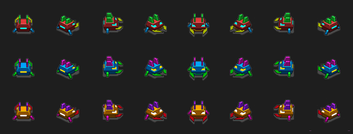

**1.** Variantele capului miriapodului sunt desenate din toate unghiurile posibile: pe rânduri, capul normal, capul care rezistă la două lovituri și capul valurilor rapide.

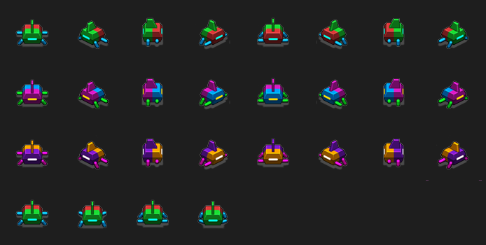

**2.** Segmentele corpului au diverse unghiuri pentru mișcarea de întoarcere; ultimul rând arată cele patru cadre ale animației picioarelor.

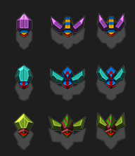

**3.** Insectele inamice bat din aripi în timp ce zboară.

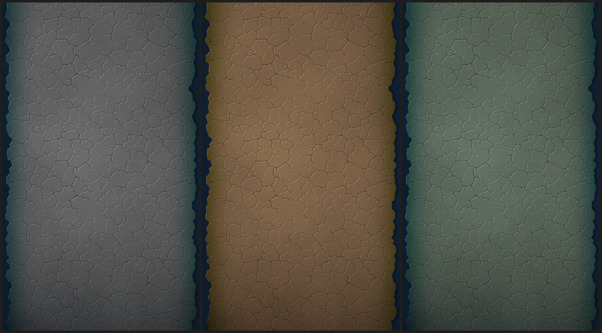

**4.** Cele trei nuanțe ale fundalului cu pământ crăpat, câte una pentru fiecare val.

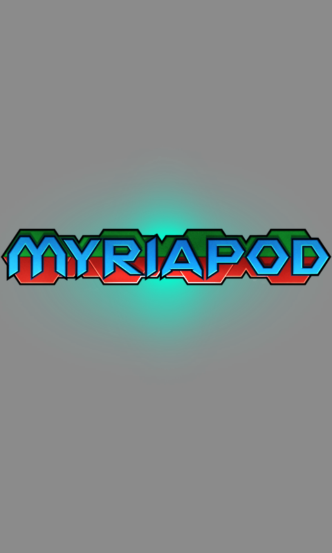

**5.** Grafica de titlu e afișată pe ecranul de start.

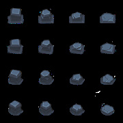 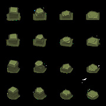 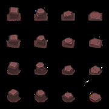

**6.** În loc de ciuperci, pietre aleatoare pot fi împușcate ca să fie curățate; fiecare piatră are patru forme și cinci stări de deteriorare, în trei culori.


**7.** Sprite-ul jucătorului, cu roți, are variante rotite și de tragere.

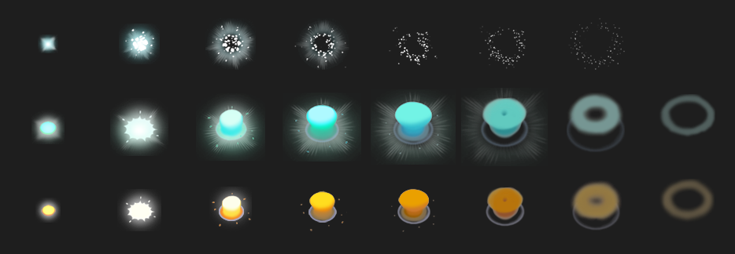

Cele trei tipuri de explozie, cu câte opt cadre.

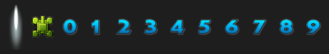

Glonțul, simbolul pentru vieți și cifrele scorului.

---

[← Capitolul 3 – Platformer văzut de sus: Frogger și Infinite Bunner](Capitolul03_Platformer_vazut_de_sus_Frogger_si_Infinite_Bunner.md) | [Capitolul 5 – Joc de fotbal: Sensible Soccer și Substitute Soccer →](Capitolul05_Joc_de_fotbal_Sensible_Soccer_si_Substitute_Soccer.md)
