# Capitolul 5 – Joc de fotbal: Sensible Soccer și Substitute Soccer

> *Jocurile de fotbal văzute de sus, în stil pinball, și-au construit un cult uriaș de fani și au dat startul unui gen sportiv care merge și azi din plin*

Sensible Soccer era un joc de fotbal alert, văzut de sus, cu acțiune arcade. Deși arăta foarte departe de redările realiste ale fotbalului din jocuri ca FIFA de azi, a câștigat rapid o legiune de fani. Vederea de sus le permitea jucătorilor să vadă mai mult din teren pe măsură ce pasau mingea de la un capăt la altul, atacând și apărând. I-a permis și lui Sensible Software să fie creativă: marca distinctivă a jocului era, fără îndoială, sprite-urile minuscule, care nu doar că alergau ca turbate, dar erau bine animate și răspundeau elegant la alunecări și la celelalte aspecte fizice majore ale jocului frumos. Cu o atmosferă captivantă, susținută de zgomote autentice de galerie, Sensible Soccer a câștigat o popularitate uriașă.

## Inspirația

Sensible Soccer a fost creat de Jon Hare și Chris Yates, care s-au cunoscut în anii de școală. După ce au cântat împreună într-o trupă, cei doi au început să programeze jocuri, începând cu niciodată lansatul Escape From Sainsbury's și cu primul lor joc comercial, Twister: Mother of Charlotte. Și-au format propria companie de dezvoltare în 1986, numită Sensible Software, și au continuat să producă jocuri comerciale, printre care Parallax, Wizball și SEUCK. Prima încercare a celor doi la un joc de fotbal a venit cu Microprose Soccer, în 1988. Cu alte titluri de bază ale anilor '80 și '90, ca Mega Lo Mania, Wizkid și Cannon Fodder, în palmares, Hare și Yates sunt printre eroii jocurilor din Marea Britanie.

> **Sensible Soccer**
>
> **Lansat:** 1993
> **Platforme:** Amiga, Atari ST, Amiga CD32, Acorn Archimedes, Xbox Live Arcade, Windows
>
> Sensible Soccer a fost urmat doi ani mai târziu de Sensible World of Soccer, care includea toate ligile și competițiile profesioniste și avea și un element puternic de management.
>
> **Alte titluri notabile:** Microprose Soccer / Kick Off / Tehkan World Cup

> **NOTA TRADUCĂTORULUI**
> Fișa jocului din cartea originală dă anul 1993, dar textul capitolului precizează că jocul a apărut pe Amiga și Atari ST în iunie 1992; 1993 este anul ediției îmbunătățite, International Edition.

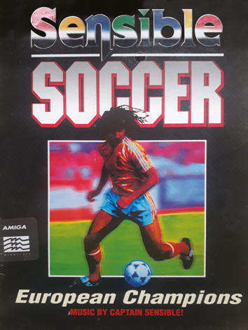

Cum te uiți la meci? Ești sus, în tribunele stadionului Wembley, absorbind atmosfera mulțimii într-o zi de vară, sau te înfofolești pe margine, în ploaia torențială, strigând „amabilități” în parc, în timp ce echipa locală din liga de duminică își ia bătaia obișnuită? Poate te uiți în direct la televizor, din confortul fotoliului, sau asculți comentariul supraexcitat la radioul din mașină. Sau poate joci un joc video, caz în care te întrebăm din nou: cum îl vezi?

Asta pentru că, de-a lungul anilor, mulți dezvoltatori diferiți au avut propria lor viziune asupra adaptării fotbalului ca joc video. Au existat vederi din lateral, de sus și izometrice, precum și jocuri reduse la esență și jocuri împodobite cu grafică suprapusă spectaculoasă și teancuri de meniuri. Primul mare titlu de fotbal, Pele's Championship Soccer, pe Atari 2600, în 1981, era un joc de trei la trei, în care jucătorii se mișcau bloc cu bloc. Real Sports Soccer a introdus în sfârșit sprite-uri care semănau cu oamenii, un an mai târziu. Dar chiar dacă erau spartane, aceste jocuri erau, fără îndoială, fotbal.

Jocuri ca titlul clasic pe 8 biți Match Day săreau peste elementele din viața reală: schimbările și numele echipelor lipseau, împreună cu concepte ca formațiile și arbitrii, dar erau totuși jocuri de fotbal foarte recognoscibile. Pe vremuri, scopul dezvoltatorilor de jocuri era adesea, pur și simplu, să-i facă pe jucători să bage mingea în plasă. Atâta timp cât jucătorii puteau acumula scoruri, toată lumea, se pare, era fericită.

Compară Sensible Soccer cu cele mai bune jocuri de fotbal de azi (adică titluri ca FIFA și Pro Evolution Soccer) și vei vedea exact ce vrem să spunem. Titlurile-blockbuster contemporane preferă să vadă fotbalul ca pe un meci televizat, cu comentariu, grafică pe ecran, prim-planuri cu bucuria de la goluri și fizică realistă înglobată în jucători care arată cât mai aproape posibil de omologii lor din viața reală. Sensible Soccer, între timp, avea jucători minusculi, care alergau de colo-colo pe un teren văzut de sus. Semăna aproape la fel de mult cu pinballul pe cât semăna cu fotbalul, cu acțiunea „ping, ping” a mingii pasate pe teren cu o viteză amețitoare.

Mecanica a funcționat spectaculos de bine. Sensible Soccer își ocupă locul, chiar și azi, printre cele mai mari jocuri de fotbal produse vreodată în formă de pixeli. Mai mult, co-creatorul Jon Hare nu-și cere scuze pentru prezentarea și mecanicile jocului: totul, spune el, a fost deliberat, și e mulțumit că totul a ieșit atât de bine. „Am folosit sprite-uri mici pentru că ăsta era stilul nostru pe atunci”, spune el. „Aveam personaje minuscule și o vedere semi-aeriană mai mare a mediului când făceam Mega Lo Mania și, când ne-am dat seama că funcționează, le-am folosit în Cannon Fodder și Sensible Golf.” De fapt, primele personaje din Sensible Soccer erau sprite-uri din Mega Lo Mania cu echipament de fotbal pe ele.

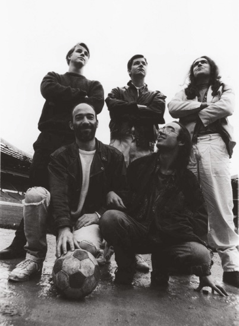

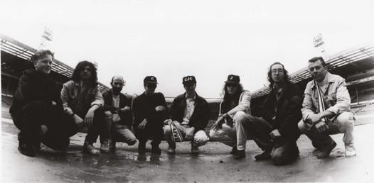

## Lovitura de începere

Jon a fost cofondatorul Sensible Software, o companie pe care a format-o cu prietenul lui, Chris Yates. Cei doi fuseseră prezentați de un prieten comun, când Jon se întorcea de la un concert Rush din Londra, și au devenit apropiați. Aveau o dragoste comună pentru muzică, și scriau și cântau melodii împreună, în timp ce visau să devină staruri rock. Chris studia informatica la colegiu. Cumpăra calculatoare dintr-un catalog și petrecea o lună programându-le frenetic. Apoi le trimitea înapoi, primea banii și comanda un înlocuitor. Când banii au devenit și mai puțini, Chris s-a angajat la LT Software și a lucrat la un joc numit Sodov The Sorcerer, pentru ZX Spectrum. L-a rugat pe Jon să facă grafica pentru el. Asta a dus la angajarea lui Jon.

Cei doi au lucrat la mai multe jocuri, printre care Twister: Mother of Charlotte, dar au decis că ar face mai mulți bani dacă ar pleca de la LT Software și și-ar înființa propria companie. Au făcut-o în martie 1986, creând jocurile Parallax, Wizball și Shoot-'Em-Up Construction Kit (SEUCK). Primul lor joc de fotbal a fost Microprose Soccer, pe care l-au făcut cu un nou membru al echipei, Martin Galway, și care i-a uimit pe jucători prin introducerea vitezei, a unui efect de ploaie și a efectului dat mingii după lovitură. Inspirați de jocul arcade Tehkan World Cup, jucătorii puteau curba mingea după ce o loveau, puteau vedea mult din ce era în jurul lor pe teren și puteau revedea golurile. Vederea de sus a funcționat de minune, la fel și comenzile simple.

Asta i se potrivea lui Jon. Fanul înfocat al lui Norwich City petrecuse multe ore mutând jucători de plastic pe un teren de Subbuteo din pâslă, lung de un metru, așa că era obișnuit cu perspectiva de sus asupra fotbalului. Un alt joc, Kick Off, folosea deja același unghi de vedere, dar Jon și Chris Chapman, care se alăturase Sensible Software ca să lucreze la Mega Lo Mania, simțeau că pot face mai bine. Echipa a lucrat nouă luni fără oprire, ca să se asigure că Sensible Soccer e lansat la timp pentru Campionatul European de Fotbal UEFA din 1992.

„Ne-am concentrat pe gameplay-ul propriu-zis când am creat Sensible Soccer”, spune Jon. „N-am mers pe drumul prezentării spectaculoase și al accentului pe stil în detrimentul substanței, pe care l-am văzut în cele din urmă când a fost lansat FIFA International Soccer, în 1993. Voiam un joc în care jucătorul trebuia să alerge după minge și să folosească îndemânarea ca s-o păstreze. Cu siguranță nu voiam să reproducem un meci televizat. Preferam să-i facem pe jucători să se simtă ca și cum ar fi pe teren, nu ca un membru neimplicat al unui public de televiziune.”

> *Ne-am concentrat pe gameplay-ul propriu-zis când am creat Sensible Soccer*

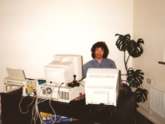

Sensible Soccer a apărut inițial pe Amiga și Atari ST, în iunie 1992, înainte de a fi convertit mai târziu pe PC, Mega Drive și alte platforme. S-a concentrat mai ales pe fotbalul european de club, adăugând câteva echipe naționale. Unele versiuni aveau nume inventate de jucători și includeau câteva echipe de fotbal fictive, personalizate. Jocul avea un ritm grozav și cerea un nivel ridicat de îndemânare. Frumusețea lui Sensible Soccer venea dinăuntru.

## Crearea jocului frumos

Primul lucru pe care l-au făcut Jon și echipa lui când au creat jocul a fost să se uite la perfecționarea comenzilor. S-au gândit la cum vor juca oamenii jocul și la tipul de controler pe care îl vor folosi, înainte să înceapă să se gândească la cel mai bun mod în care să evolueze acțiunea. La momentul dezvoltării, majoritatea platformelor de acasă foloseau joystick-uri cu opt direcții (stânga, dreapta, sus, jos și diagonalele) cu un singur buton de foc.

„Orice joc, de fotbal sau nu, ar trebui proiectat în jurul hardware-ului însuși, așa că asta am făcut bine cu Sensible Soccer”, explică Jon. „Am proiectat comenzile în jurul limitărilor hardware-ului Commodore Amiga, adică acel joystick cu opt direcții și un singur buton. Toate jocurile bune sunt proiectate așa și asta a ajutat la a face lucrurile cum trebuie.”

Cu comenzile la locul lor, dezvoltatorul a putut apoi să deconstruiască jocul de fotbal din viața reală, ca să poată fi recreat în formă pixelată. Bazarea jocului pe un sport existent a ajutat enorm, pentru că oferea un set de reguli gata făcute, permițându-i lui Sensible Software să ia câteva scurtături de design. Lucrând în acord cu obiectele specifice sportului și cu regulile lui consacrate, dezvoltatorul se putea concentra pe abilitățile de care au nevoie jucătorii și pe cele mai bune moduri de a le oferi o doză de adrenalină.

De aceea unele jocuri au scăpat cu reducerea la esență. Nu ai nevoie neapărat de ligi, cupe și turnee, de exemplu, deși ele pot oferi o experiență mai captivantă. Nu ai nevoie cu adevărat de zgomotul galeriei, darămite de comentariu. Cartonașele roșii și galbene pot fi eliminate, la fel și bucuriile exagerate de la goluri. Atâta timp cât mingea se mișcă așa cum te aștepți, iar jucătorii pot ajunge destul de repede de la un capăt la altul, fotbalul poate fi recreat convingător pe ecran. Cheia e să faci cum trebuie elementele din culise. „Există o mulțime de lucruri într-un joc ca Sensible Soccer în afară de ce e direct acolo, pe terenul de fotbal”, sfătuiește Jon. „Trebuie să existe și tot cadrul, cuprinzând grafica și sunetul, precum și abilitățile cu mingea și gravitația.”

> **Învață de la maestru**
>
> *Jon Hare oferă câteva sfaturi de expert pentru ca jocul tău de fotbal să fie un câștigător.*
>
> **Mentalitatea potrivită:** Când faci sport, îți folosești tot corpul. Într-un joc video de fotbal, ai tendința să folosești doar creierul și mâinile. Jon te sfătuiește să intri în mentalitatea jucătorului.
>
> **Păstrează simplitatea:** Psihologic, gândești în sus și în jos pe teren când joci fotbal: poarta din spatele tău și cea din fața ta.
>
> **Șuturile contează:** Fă întotdeauna porțile destul de mari ca șuturile să aibă o șansă să intre, altfel jucătorii frustrați își vor pierde dorința de a continua să joace.

## Mișcarea jucătorului

Joystick-ul era folosit pentru a mișca jucătorii pe teren și pentru a indica încotro să meargă mingea când era lovită. „Butonul de foc era apăsat scurt ca să pasezi mingea pe jos și ținut apăsat ca să faci ceva prin aer”, spune Jon. Aceste comenzi simple îi permiteau jucătorului să execute un număr mare de mișcări, în funcție de dacă era sau nu în posesia mingii. Cu mingea în posesie, jucătorul putea trage joystick-ul înapoi sau îl putea comuta rapid dintr-o direcție în alta, ca să obțină lobări, voleuri, lovituri înalte și lovituri cu capul. Existau și lovituri-trucuri și un șut „banană”.

Dacă jucătorii împingeau înainte, sprite-ul aflat în posesie dribla mingea. Dacă împingeau într-o anumită direcție și apăsau scurt butonul de foc, mingea era pasată pe jos. Apăsând mai mult, era lovită mai tare. Exista un scurt interval de timp după o lovitură în care jucătorul putea ridica și curba mingea, mișcând rapid joystick-ul. În funcție de cum era făcut, asta putea duce la lovituri drepte sau curbate: tragerea în jos (adică în direcția opusă) imediat după o lovitură trimitea mingea sus în aer.

Când un jucător avea mingea, aceasta îi rămânea lipită de picioare, dacă nu se întorcea prea brusc. A fost o decizie conștientă; cealaltă variantă e să faci sprite-ul să se lovească repetat de minge ca s-o împingă pe ecran. „Dacă faci mingea să sară departe de jucător, dezavantajul e că animația înseamnă că jucătorul trebuie să recupereze mingea când se întoarce”, explică Jon. „Problema săriturii la un metru și ceva în fața lui e că, atunci când se întoarce brusc la stânga, mingea se va târî după el. Cu cât stă mai aproape de picioarele lui, în stil Messi, cu atât va arăta mai natural când se întoarce fizic la stânga sau la dreapta. Asta e contrabalansată permițându-i jucătorului să piardă mingea dacă se întoarce prea brusc, în funcție de abilitatea lui de control al mingii.”

## Mecanici fără minge

Dacă jucătorul nu avea mingea (adică se apăra) în Sensible Soccer, apăsarea butonului de foc executa o alunecare în direcția în care era orientat; dacă mingea era deasupra, apăsarea lui încerca o lovitură cu capul. Sensible Software a făcut jocul mai ușor pentru jucător, ținând portarii sub controlul calculatorului. Așa, atenția putea rămâne pe jocul de câmp.

Jon spune că sistemul de control fără minge e la fel de important ca atunci când jucătorul e în posesie. „Un sistem bun de control fără minge e vital, pentru că 50 la sută din timp ești la minge și 50 la sută din timp nu ești. Așa că vrei comenzi care să-i permită jucătorului să ajungă la minge cât mai repede posibil și un sistem de pase care să selecteze inteligent unde intenționează jucătorul să joace mingea.”

Tacklingul e și el vital când un jucător nu are mingea, iar asta necesită o rutină. Ca tacklingul să funcționeze bine, când jucătorii care aleargă spre minge se află în limita unui anumit număr de grade față de alinierea cu ea, sunt țintiți automat direct spre minge. „Cincisprezece grade e numărul pe care l-am folosit”, dezvăluie Jon. „Asta înseamnă că o alunecare va fi mai precisă, pentru că animația va fi concentrată în direcția mingii. Jucătorul care alunecă ar trebui să alunece spre o poziție proiectată a mingii, poate cu două sau trei cadre înainte de unde e acum, nu direct acum. Deci va proiecta că peste două sau trei cadre mingea va fi în această poziție, așa că jucătorul alunecă spre acea poziție. Apoi sunt alte calcule. Dacă intri din față, e un tackling bun și curat, iar jucătorul câștigă mingea. Dacă e din spate, jucătorul comite fault, poate primește chiar un cartonaș galben sau roșu. Iar din lateral, depinde de abilitățile relative de tackling și control al mingii ale jucătorilor implicați.”

> **Sfaturi de top**
>
> - Gândește-te la prezentarea de ansamblu. Jon Hare spune că comenzile și jocul propriu-zis sunt doar o parte dintr-un pachet profesionist.
> - Ia în calcul rolurile diferite ale jucătorilor: vrei să le dai atacanților atribute diferite față de fundași?

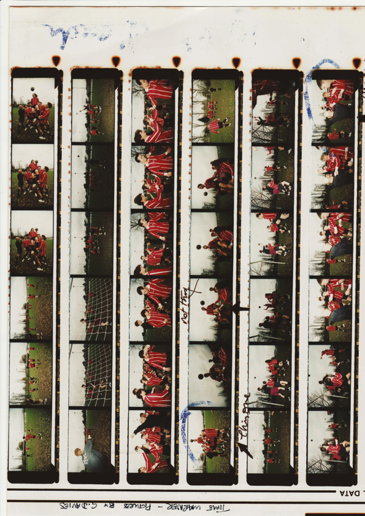

## Mingea în joc

Echipa de dezvoltare a lui Sensible Soccer a trebuit să-și dea seama ce se întâmplă când mingea e în joc și să construiască fizica și grafica în consecință. „Când mingea părăsește piciorul unui jucător, programatorul trebuie să se gândească la desenarea unei umbre sub minge”, spune Jon. „El sau ea trebuie să țină cont și de felul în care funcționează animația jucătorului, iar asta operează, în esență, pe trei niveluri: înălțimea solului, adică driblingul, loviturile, alunecările și așa mai departe; înălțimea taliei, adică voleurile și loviturile cu capul din plonjon; și înălțimea capului, adică în principal loviturile cu capul. Așa că, atunci când mingea părăsește piciorul unui jucător, ții cont de arcul mingii. Bănuiesc că e mai greu să ții mingea jos când pornește deja de deasupra solului, dar asta e integrată în sistemele de fizică și gravitație, așa că principalul lucru sunt animațiile.”

Toate astea au ajutat ca Sensible Soccer să fie cât mai realist posibil. Deși sprite-urile din joc erau minuscule, alergau fluid, iar jucătorii puteau vedea tacklingurile executate într-un mod evident, cu redări decente ale jucătorilor de pe teren. Multe dintre echipe aveau nume inventate, pentru că licențele oficiale s-ar fi dovedit prea scumpe (încearcă să obții azi licențe pentru Manchester United, Barcelona sau Bayern München și cu siguranță ai plăti cu vârf și îndesat), dar dezvoltatorii lui Sensible Soccer au trebuit să ia în calcul culorile echipamentului purtat de jucători.

„Principalul lucru la care a trebuit să ne gândim era că jucătorii sunt pe un teren verde, așa că era vorba de a evita culorile care mergeau prost”, spune Jon. „Cam cea mai proastă culoare e verdele, de înțeles, dar nici anumite nuanțe de galben și poate de portocaliu nu mergeau prea bine. Asta a făcut mai greu să recreezi, să zicem, naționala Olandei sau Blackpool FC, dar majoritatea celorlalte au mers bine.”

> **Obiectivele**
>
> **Pe termen scurt:** Lucrează la comenzi, astfel încât fiecare jucător să se poată mișca pe teren, să lovească și să intre în tackling, și să marcheze.
>
> **Pe termen mediu:** Adaugă sistemul de marcare a golurilor, durata pe care o vrei pentru fiecare repriză și regulile suplimentare ale jocului.
>
> **Pe termen lung:** Ca să-i absorbi pe jucători în joc, trebuie să existe ceva care să-i tragă înapoi. Adăugarea cupelor și ligilor ar rezolva asta.

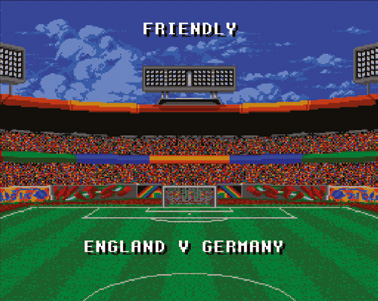

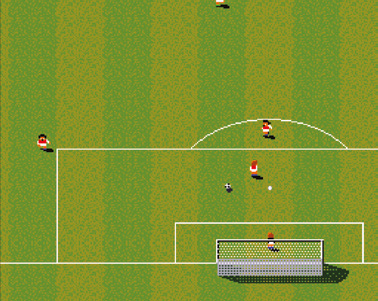

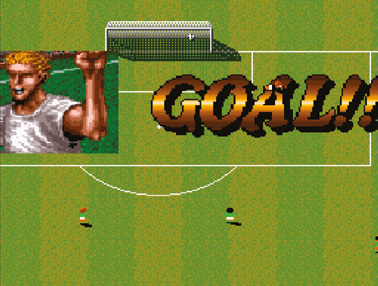

O rată bună a cadrelor a ținut acțiunea în mișcare, iar absența prea multor elemente pe ecran le-a dat jucătorilor cea mai bună vedere posibilă asupra terenului și a pozițiilor jucătorilor. Sensible Software a decis să nu se deranjeze să afișeze constant scorul pe ecran: apărea doar când se marca un gol sau când mingea ieșea din teren. „Sistemul de scor pentru fotbal era însă extrem de simplu”, spune Jon. „Cine a marcat cele mai multe goluri a câștigat, și ăsta e singurul sistem de scor de care aveam nevoie. Se poate complica dacă ai cifre care evaluează jucătorii, adică un sistem bazat pe câte tacklinguri, pase și șuturi sunt executate corect, dar scorul e pur și simplu 1-0, 2-0 și așa mai departe, și e ușor de implementat.”

A fost ușor să adaugi înflorituri ca cartonașele și schimbările. „Adăugarea cartonașelor roșii și galbene a fost simplă”, spune el. „Au fost create ca parte a sistemului de tackling.” Echipa a scris cod care stabilea natura tacklingului și mișcarea și poziția jucătorului advers, ca să detecteze dacă a fost fault. „În Sensible Soccer, primeai cartonaș roșu sau galben doar dacă intrai din spate”, adaugă Jon.

> *În Sensible Soccer, primeai cartonaș roșu sau galben doar dacă intrai din spate*

Schimbările se activau folosind fie joystick-ul, fie tastatura (Sensible Software nu se temea să folosească tastatura pentru un control mai mare asupra elementelor de non-acțiune ale jocului). Apăsarea săgeții sus sau jos chema banca de rezerve, în funcție de echipă, iar jucătorul putea apoi să selecteze rezerva, indicând cine intră și cine iese. „Jucătorii o puteau chema oricând mingea era afară din joc”, spune Jon. „Asta a fost destul de simplu de făcut.” Jucătorii puteau și să-și salveze jocurile în orice moment, ceea ce evita nevoia de a termina un turneu sau o ligă dintr-o singură ședință.

Lucrurile au devenit mai complexe din punctul de vedere al dezvoltării când Sensible Software a creat o versiune ușor îmbunătățită, în 1993, numită Sensible Soccer International Edition. A lansat și o continuare substanțial mai complexă, Sensible World of Soccer, în 1994, adăugând mult mai multe meniuri, 1400 de echipe și 23 000 de jucători din toată lumea, împreună cu o secțiune de management, profitând de popularitatea din anii '90 a jocurilor de management fotbalistic, ca Championship Manager. „Un joc de fotbal are o mulțime de meniuri, sisteme de ligă, selecții de echipe și așa mai departe, care sunt vital de importante pentru titlurile mai avansate”, spune Jon, a cărui echipă de dezvoltare se distra de minune. Pe lângă asamblarea unei recreări serioase a fotbalului mondial, ei credeau că un joc distractiv ar trebui să aibă elemente neconvenționale, și au menținut distracția făcând posibilă competiția în Turkey Tournament sau Booby League și confruntarea dintre European Cities și Great Wars. Au inclus chiar și Germania de Vest, deși echipa încetase să existe în 1990, după reunificarea Germaniei.

> **De sus sau din lateral?**
>
> Sensible Soccer era văzut de sus, dar asta nu pentru ca dezvoltatorilor să le fie mai ușor să-l programeze. Potrivit lui Jon Hare, nici vederea de sus, nici cea din lateral nu e mai greu de programat decât cealaltă. Echipa Sensible Software s-a decis pentru vederea de sus pentru că Jon crede că face jocul mai realist când e jucat. „O vedere de sus îți dă mai mult din perspectiva unui fotbalist, iar vederea din lateral îți dă mai mult din perspectiva unui spectator de pe stadion sau de la televizor. De aceea Sensible Soccer se simte ca un joc de fotbal al fotbalistului: pentru că simți că îl joci.”

Jon n-a încetat să dezvolte jocuri de fotbal, iar acest tip de filozofie se transferă în cel mai nou joc al lui, Sociable Soccer. Păstrează toată jucabilitatea rapidă și fluidă a jocurilor clasice de fotbal ale lui Jon, dar de data asta folosind tehnologie de ultimă oră, cu joc online și offline, 1000 de echipe din toată lumea, 31 de cartonașe de jucători de colecționat și îmbunătățit, și suport pentru toate sistemele actuale de realitate virtuală.

În 2006, Sensible World of Soccer a fost onorat de Universitatea Stanford din California ca unul dintre cele mai influente zece jocuri pe calculator din toate timpurile, alături de mari titluri ca Spacewar!, Super Mario Bros. 3 și Tetris. Sociable Soccer pare pregătit să repornească un clasic al anilor '90 în era modernă.

---

# Programăm azi: Substitute Soccer

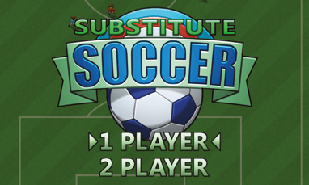

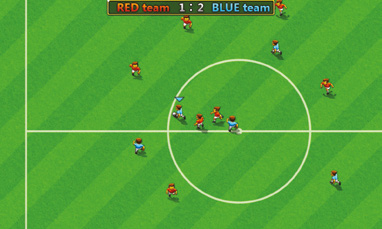

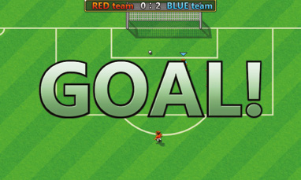

Ultimul nostru joc, Substitute Soccer, e inspirat de clasicele fotbalului văzut de sus, ca Kick Off 2 și Sensible Soccer. Are atât mod pentru un jucător, cât și pentru doi, precum și trei niveluri de dificultate. Fiecare echipă are șapte jucători, iar cum terenul e mai mare decât fereastra jocului, fereastra de vizualizare derulează atât pe axa X, cât și pe axa Y.

> **Descarcă codul**
> Descarcă codul complet comentat al jocului Substitute Soccer, împreună cu toată grafica și sunetele, de la wfmag.cc/CTC1-soccer

> **NOTA TRADUCĂTORULUI**
> Linkul scurt de mai sus nu mai funcționează. Codul complet comentat, cu imaginile, sunetele și muzica, se găsește în folderul [codul_sursa/soccer](codul_sursa/soccer/). Instrucțiunile de instalare sunt în [Capitolul 6 – Instalarea](Capitolul06_Instalarea.md) și, pe scurt, în [codul_sursa/README.md](codul_sursa/README.md). Numele jocului e un joc de cuvinte: *substitute* înseamnă „rezervă” (jucătorul de pe bancă), dar și „înlocuitor”, adică un înlocuitor al lui Sensible Soccer.

Ca și înainte, vom începe uitându-ne la clasele care conțin cea mai mare parte a codului jocului. `Game`, `Ball`, `Player` și `Goal` sunt toate destul de explicite, deși trebuie să notăm că clasa `Player` e folosită de fiecare dintre cei 14 fotbaliști de pe teren, dintre care doar unul sau doi (în funcție de modul de joc) sunt controlați de un om la un moment dat. În timp ce în Myriapod, de exemplu, o instanță a clasei `Player` e manifestarea jucătorului uman în joc, în acest joc are mai mult sens să gândim în termenii unei anumite echipe care corespunde unui jucător uman, nu ai unui anumit jucător de pe teren. `Difficulty` e folosită pentru a stoca și a face referire la o serie de parametri aleși în funcție de nivelul de dificultate. `Controls` se ocupă de intrările de control (săgețile și SPAȚIU pentru jucătorul 1, WSAD și SHIFT stânga pentru jucătorul 2). `Team` stochează o instanță a clasei `Controls`, care determină comenzile pentru jucătorul respectiv; echipele controlate de calculator folosesc aici valoarea `None`. Clasa `Team` ține evidența și a lui `active_control_player`, jucătorul de pe teren controlat în acel moment de un om, indicat printr-o săgeată deasupra capului. Când nu au mingea, un jucător uman poate schimba `active_control_player` folosind aceeași tastă cu care lovește mingea.

Poate îți amintești că Bunner avea o clasă numită `MyActor`, care moștenea din clasa `Actor` a lui Pygame Zero și era clasa de bază a tuturor obiectelor din joc. Printre altele, `MyActor` se asigura că obiectele sunt afișate în poziția corectă pe ecran, în funcție de derularea nivelului. Și acest joc are o clasă `MyActor` și, deși o parte din treaba ei e să se ocupe de derulare, are și un alt scop important. În Boing!, am introdus conceptul de vectori. Clasa `Ball` a acelui joc definea o pereche de atribute, `dx` și `dy`, care împreună formau un vector unitate, indicând direcția curentă de deplasare a mingii. În Soccer, am folosit clasa `Vector2` din Pygame. Instanțele acestei clase stochează componentele X și Y ale unui vector, iar clasa definește o serie de metode utile, ca `length` și `normalize`, și ne permite să scădem un vector din altul, ceea ce e necesar când vrem să aflăm poziția unui obiect în raport cu altul sau distanța dintre două obiecte. Clasa `MyActor` definește atributul `vpos`, care stochează poziția unui obiect folosind un `Vector2`. După ce am luat decizia de a stoca pozițiile în acest fel, e vital să ne amintim să accesăm sau să schimbăm poziția unui obiect întotdeauna prin `vpos`, nu prin metodele obișnuite ale lui Pygame Zero de accesare a pozițiilor unui `Actor`, cum ar fi `pos` sau `x` și `y`. Singura dată când le setăm pe acelea e când vine momentul să desenăm efectiv obiectul pe ecran. Trebuie să fim atenți și când vrem să copiem conținutul unui `Vector2` în altul. Ca la orice clasă din Python, instanțele `Vector2` sunt tipuri referință. Prin urmare, copierea ar trebui făcută așa: `v2 = Vector2(v1)`, nu așa: `v2 = v1`. A doua variantă înseamnă că variabila `v2` se va referi la același obiect ca `v1`, deci schimbarea uneia o va schimba pe cealaltă.

> **În căutarea vizualizării**
>
> 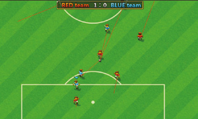
>
> Cu atât de mulți jucători controlați de calculator alergând în același timp, poate fi greu să verifici că codul de AI face ce trebuie, mai ales că jucătorii își pot schimba rolurile de mai multe ori în câteva secunde. Într-un moment, un jucător poate acționa ca portar, apoi poate fi unul dintre jucătorii „de vârf” care încearcă să intre în tackling la posesorul mingii, apoi poate marca un jucător din echipa adversă. Un mod de a confirma că totul funcționează cum trebuie e să folosești vizualizări de depanare. Aproape de începutul codului vei vedea o serie de constante, cum ar fi `DEBUG_SHOW_TARGETS`. Când e setată la `True`, `Game.draw` afișează o linie de la fiecare jucător, arătând poziția spre care aleargă în acel moment. Vizualizările de depanare pot fi utile și pentru a învăța cum funcționează un joc. Încearcă să le activezi pe fiecare, de preferat una câte una.

Clasa `Game` creează și întreține obiectele pentru echipe, jucători, porți și minge. Metoda ei `reset` e apelată la începutul jocului și după fiecare gol: recreează jucătorii, mingea și porțile și decide pozițiile inițiale ale jucătorilor pe teren. Printre altele, `Game.update` detectează golurile marcate și le atribuie jucătorilor sarcina de a se marca reciproc (inclusiv atribuirea unui portar la dificultatea „hard”). Dacă o echipă are mingea, alege și unul sau doi (în funcție de nivelul de dificultate) jucători „de vârf” din cealaltă echipă, care vor încerca să intercepteze mingea.

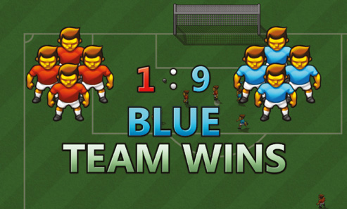

Ca și la jocurile anterioare, partea finală a codului folosește un sistem simplu de automat finit pentru a procesa interacțiunile cu meniul principal și a declanșa actualizarea și desenarea instanței `Game` curente. Există și o serie de funcții ajutătoare legate de fizica mingii, țintire și unghiuri. În acest joc, numerele de la 0 la 7 sunt folosite pentru unghiuri, 0 reprezentând sus, 1 sus și dreapta, 2 dreapta și așa mai departe. De aceea avem propriile funcții sinus și cosinus, care lucrează cu aceste unghiuri, nu cu grade și radiani.

> **Calculul costului**
>
> 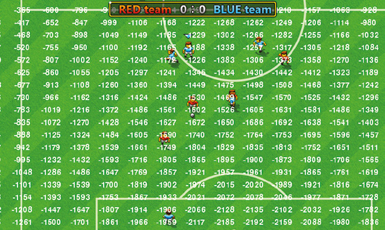
>
> Când un jucător-calculator are mingea, sunt două decizii pe care trebuie să le ia în fiecare cadru: în ce direcție să alerge și dacă să lovească mingea. Aceste decizii sunt luate cu ajutorul funcției `cost`. Dată fiind o poziție pe teren și un număr de echipă, ea calculează numărul care reprezintă cât de bine sau de rău ar fi ca mingea să se mute în acea poziție; cu cât mai mic, cu atât mai bine. Valoarea costului e calculată pe baza distanței până la propria poartă (mai departe e mai bine), a apropierii poziției de jucătorii echipei adverse, a unei ecuații de gradul doi (nu te panica prea tare!), care îl face pe jucător să prefere centrul terenului și poarta adversarilor, și a unei valori de „handicap”.
>
> Funcția `cost` e apelată în două locuri. Mai întâi, când un jucător cu mingea decide unde să alerge, `cost` e apelată de cinci ori, de fiecare dată primind o poziție care indică unde ar fi jucătorul dacă s-ar mișca puțin înainte într-o anumită direcție; cele cinci direcții sunt drept înainte, stânga sau dreapta la 45° și stânga sau dreapta la 90°. Al treilea parametru opțional al lui `cost`, `handicap`, e folosit pentru a-l descuraja ușor pe jucător să facă viraje; asta asigură că jucătorul nu are un comportament nerealist, cum ar fi să vireze repetat la stânga și la dreapta într-o fracțiune de secundă. `cost` e apelată și când un jucător decide dacă să paseze mingea unui coechipier. O bucată de cod din `Ball.update` încearcă să găsească un jucător potrivit căruia să-i paseze, dar pasa se face doar dacă valoarea costului pentru poziția jucătorului-țintă e mai mică decât valoarea costului pentru poziția jucătorului curent.

> **Sunt foarte inteligent**
>
> 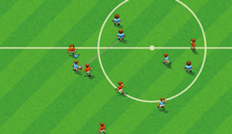
>
> AI-ul din jocurile anterioare a fost, în mare parte, foarte simplu. Paleta din Boing! se mișcă pe o singură axă, respectând doar două reguli: stai aproape de centru când mingea e departe; pe măsură ce mingea se apropie, încearcă tot mai mult să-i urmezi mișcarea. În Cavern, roboții merg înainte, schimbă aleator direcția și decid aleator să tragă, cu o probabilitate mai mare dacă jucătorul e la aceeași înălțime cu robotul. Bunner nu prea are AI, iar în Myriapod segmentele își aleg următoarea celulă pe baza unei serii de reguli, regulile cu prioritate mai mare având întâietate față de celelalte. Deși jocurile sunt foarte diferite, AI-ul din Soccer e cel mai apropiat de cel din Myriapod. În fiecare cadru, un jucător controlat de calculator își decide următoarea acțiune pe baza unei serii de condiții. Prima e dacă cineva are mingea în acel moment. Dacă da, ea trebuie să fie deținută fie de acel jucător, fie de cineva din echipa lui, fie de cineva din echipa adversă. Fiecare scenariu are propriul comportament corespunzător. Alternativ, se poate să n-o aibă nimeni. Asta poate fi pentru că urmează lovitura de începere, caz în care niciun jucător n-are voie să se miște, în afară de cel care urmează să dea lovitura de începere. Altfel, toți jucătorii considerați în acel moment „activi” (adică se află la mai puțin de 400 de pixeli de minge pe axa Y) vor încerca să intercepteze mingea, uitându-se la traiectoria ei și calculând unde să alerge ca să aibă cele mai mari șanse s-o obțină.

> **Provocări**
>
> - Afișează un mesaj diferit de obișnuitul „GOAL!” dacă se marchează un autogol.
> - Încearcă să mărești fereastra jocului, ca să vezi mai mult din teren deodată. Observă cum anumite aspecte ale interfeței cu utilizatorul nu se mai afișează corect după această schimbare. Cum ai rezolva asta?
> - Jocul include cod care le permite jucătorilor să marcheze jucători din echipa adversă; totuși, asta e activată în prezent doar pentru echipele controlate de calculator. Încearcă să activezi acest comportament de marcaj și pentru echipele umane. Gândește-te cum afectează asta gameplay-ul și dacă simți că jocul e mai bun sau mai rău după această schimbare.
> - Dă-i fiecărui jucător un nume. Afișează-l deasupra capului, folosind metoda `screen.draw.text` din Pygame Zero. Ai putea genera și statistici pentru fiecare jucător, modificându-i viteza în diferite circumstanțe, de exemplu când aleargă cu sau fără minge.
> - Simulează un meci de durată completă, inclusiv schimbarea terenurilor la pauză. Afișează pe ecran un cronometru care indică numărul de minute scurse din meci. Cronometrul ar putea avansa, de exemplu, cu un minut de timp de joc la fiecare cinci secunde de timp real. Asigură-te că cronometrul e oprit în faza loviturii de începere, altfel un jucător ar putea trage de timp refuzând să dea lovitura de începere!

## Codul jocului Substitute Soccer

> **Cum rulezi jocul**
> Deschide fișierul `soccer.py` într-un editor Python, cum ar fi IDLE, și alege Run > Run Module. Pentru mai multe detalii, vezi [Capitolul 6 – Instalarea](Capitolul06_Instalarea.md).

> **NOTA TRADUCĂTORULUI**
> Listarea de mai jos este versiunea din depozitul editurii, fără comentarii; fișierul [codul_sursa/soccer/soccer.py](codul_sursa/soccer/soccer.py) conține aceeași versiune, cu toate comentariile autorilor. Este cel mai lung program din carte. Comenzile: jucătorul 1 folosește săgețile și SPAȚIU (pentru a lovi mingea sau a schimba jucătorul controlat), jucătorul 2 folosește W, S, A, D și SHIFT stânga. În meniu, SPAȚIU confirmă, iar săgețile sus/jos aleg numărul de jucători și dificultatea.

```python
import pgzero, pgzrun, pygame
import math, sys, random
from enum import Enum
from pygame.math import Vector2

if sys.version_info < (3,5):
    print("This game requires at least version 3.5 of Python. Please download it from www.python.org")
    sys.exit()

pgzero_version = [int(s) if s.isnumeric() else s for s in pgzero.__version__.split('.')]
if pgzero_version < [1,2]:
    print("This game requires at least version 1.2 of Pygame Zero. You have version {0}. Please upgrade using the command 'pip3 install --upgrade pgzero'".format(pgzero.__version__))
    sys.exit()

WIDTH = 800
HEIGHT = 480
TITLE = "Substitute Soccer"

HALF_WINDOW_W = WIDTH / 2

LEVEL_W = 1000
LEVEL_H = 1400
HALF_LEVEL_W = LEVEL_W // 2
HALF_LEVEL_H = LEVEL_H // 2

HALF_PITCH_W = 442
HALF_PITCH_H = 622

GOAL_WIDTH = 186
GOAL_DEPTH = 20
HALF_GOAL_W = GOAL_WIDTH // 2

PITCH_BOUNDS_X = (HALF_LEVEL_W - HALF_PITCH_W, HALF_LEVEL_W + HALF_PITCH_W)
PITCH_BOUNDS_Y = (HALF_LEVEL_H - HALF_PITCH_H, HALF_LEVEL_H + HALF_PITCH_H)

GOAL_BOUNDS_X = (HALF_LEVEL_W - HALF_GOAL_W, HALF_LEVEL_W + HALF_GOAL_W)
GOAL_BOUNDS_Y = (HALF_LEVEL_H - HALF_PITCH_H - GOAL_DEPTH,
                 HALF_LEVEL_H + HALF_PITCH_H + GOAL_DEPTH)

PITCH_RECT = pygame.rect.Rect(PITCH_BOUNDS_X[0], PITCH_BOUNDS_Y[0], HALF_PITCH_W * 2, HALF_PITCH_H * 2)
GOAL_0_RECT = pygame.rect.Rect(GOAL_BOUNDS_X[0], GOAL_BOUNDS_Y[0], GOAL_WIDTH, GOAL_DEPTH)
GOAL_1_RECT = pygame.rect.Rect(GOAL_BOUNDS_X[0], GOAL_BOUNDS_Y[1] - GOAL_DEPTH, GOAL_WIDTH, GOAL_DEPTH)

AI_MIN_X = 78
AI_MAX_X = LEVEL_W - 78
AI_MIN_Y = 98
AI_MAX_Y = LEVEL_H - 98

PLAYER_START_POS = [(350, 550), (650, 450), (200, 850), (500, 750), (800, 950), (350, 1250), (650, 1150)]

LEAD_DISTANCE_1 = 10
LEAD_DISTANCE_2 = 50

DRIBBLE_DIST_X, DRIBBLE_DIST_Y = 18, 16

PLAYER_DEFAULT_SPEED = 2
CPU_PLAYER_WITH_BALL_BASE_SPEED = 2.6
PLAYER_INTERCEPT_BALL_SPEED = 2.75
LEAD_PLAYER_BASE_SPEED = 2.9
HUMAN_PLAYER_WITH_BALL_SPEED = 3
HUMAN_PLAYER_WITHOUT_BALL_SPEED = 3.3

DEBUG_SHOW_LEADS = False
DEBUG_SHOW_TARGETS = False
DEBUG_SHOW_PEERS = False
DEBUG_SHOW_SHOOT_TARGET = False
DEBUG_SHOW_COSTS = False

class Difficulty:
    def __init__(self, goalie_enabled, second_lead_enabled, speed_boost, holdoff_timer):
        self.goalie_enabled = goalie_enabled

        self.second_lead_enabled = second_lead_enabled

        self.speed_boost = speed_boost

        self.holdoff_timer = holdoff_timer

DIFFICULTY = [Difficulty(False, False, 0, 120), Difficulty(False, True, 0.1, 90), Difficulty(True, True, 0.2, 60)]

def sin(x):
    return math.sin(x*math.pi/4)

def cos(x):
    return sin(x+2)

def vec_to_angle(vec):
    return int(4 * math.atan2(vec.x, -vec.y) / math.pi + 8.5) % 8

def angle_to_vec(angle):
    return Vector2(sin(angle), -cos(angle))

def dist_key(pos):
    return lambda p: (p.vpos - pos).length()

def safe_normalise(vec):
    length = vec.length()
    if length == 0:
        return Vector2(0,0), 0
    else:
        return vec.normalize(), length

class MyActor(Actor):
    def __init__(self, img, x=0, y=0, anchor=None):
        super().__init__(img, (0, 0), anchor=anchor)
        self.vpos = Vector2(x, y)

    def draw(self, offset_x, offset_y):
        self.pos = (self.vpos.x - offset_x, self.vpos.y - offset_y)
        super().draw()

KICK_STRENGTH = 11.5
DRAG = 0.98

def ball_physics(pos, vel, bounds):
    pos += vel

    if pos < bounds[0] or pos > bounds[1]:
        pos, vel = pos - vel, -vel

    return pos, vel * DRAG

def steps(distance):
    steps, vel = 0, KICK_STRENGTH

    while distance > 0 and vel > 0.25:
        distance, steps, vel = distance - vel, steps + 1, vel * DRAG

    return steps

class Goal(MyActor):
    def __init__(self, team):
        x = HALF_LEVEL_W
        y = 0 if team == 0 else LEVEL_H
        super().__init__("goal" + str(team), x, y)

        self.team = team

    def active(self):
        return abs(game.ball.vpos.y - self.vpos.y) < 500

def targetable(target, source):
    v0, d0 = safe_normalise(target.vpos - source.vpos)

    if not game.teams[source.team].human():
        for p in game.players:
            v1, d1 = safe_normalise(p.vpos - source.vpos)

            if p.team != target.team and d1 > 0 and d1 < d0 and v0*v1 > 0.8:
                return False

    return target.team == source.team and d0 > 0 and d0 < 300 and v0 * angle_to_vec(source.dir) > 0.8

def avg(a, b):
    return b if abs(b-a) < 1 else (a+b)/2

def on_pitch(x, y):
    return PITCH_RECT.collidepoint(x,y) \
           or GOAL_0_RECT.collidepoint(x,y) \
           or GOAL_1_RECT.collidepoint(x,y)

class Ball(MyActor):
    def __init__(self):
        super().__init__("ball", HALF_LEVEL_W, HALF_LEVEL_H)

        self.vel = Vector2(0, 0)

        self.owner = None
        self.timer = 0

        self.shadow = MyActor("balls")

    def collide(self, p):
        return p.timer < 0 and (p.vpos - self.vpos).length() <= DRIBBLE_DIST_X

    def update(self):
        self.timer -= 1

        if self.owner:
            new_x = avg(self.vpos.x, self.owner.vpos.x + DRIBBLE_DIST_X * sin(self.owner.dir))
            new_y = avg(self.vpos.y, self.owner.vpos.y - DRIBBLE_DIST_Y * cos(self.owner.dir))

            if on_pitch(new_x, new_y):
                self.vpos = Vector2(new_x, new_y)
            else:
                self.owner.timer = 60

                self.vel = angle_to_vec(self.owner.dir) * 3

                self.owner = None
        else:
            if abs(self.vpos.y - HALF_LEVEL_H) > HALF_PITCH_H:
                bounds_x = GOAL_BOUNDS_X
            else:
                bounds_x = PITCH_BOUNDS_X

            if abs(self.vpos.x - HALF_LEVEL_W) < HALF_GOAL_W:
                bounds_y = GOAL_BOUNDS_Y
            else:
                bounds_y = PITCH_BOUNDS_Y

            self.vpos.x, self.vel.x = ball_physics(self.vpos.x, self.vel.x, bounds_x)
            self.vpos.y, self.vel.y = ball_physics(self.vpos.y, self.vel.y, bounds_y)

        self.shadow.vpos = Vector2(self.vpos)

        for target in game.players:
            if (not self.owner or self.owner.team != target.team) and self.collide(target):
                if self.owner:
                    self.owner.timer = 60

                self.timer = game.difficulty.holdoff_timer

                game.teams[target.team].active_control_player = self.owner = target

        if self.owner:
            team = game.teams[self.owner.team]

            targetable_players = [p for p in game.players + game.goals if p.team == self.owner.team and targetable(p, self.owner)]

            if len(targetable_players) > 0:
                target = min(targetable_players, key=dist_key(self.owner.vpos))
                game.debug_shoot_target = target.vpos
            else:
                target = None

            if team.human():
                do_shoot = team.controls.shoot()
            else:
                do_shoot = self.timer <= 0 and target and cost(target.vpos, self.owner.team) < cost(self.owner.vpos, self.owner.team)

            if do_shoot:
                game.play_sound("kick", 4)

                if target:
                    r = 0

                    iterations = 8 if team.human() and isinstance(target, Player) else 1

                    for i in range(iterations):
                        t = target.vpos + angle_to_vec(self.owner.dir) * r

                        vec, length = safe_normalise(t - self.vpos)

                        r = HUMAN_PLAYER_WITHOUT_BALL_SPEED * steps(length)
                else:
                    vec = angle_to_vec(self.owner.dir)

                    target = min([p for p in game.players if p.team == self.owner.team],
                                 key=dist_key(self.vpos + (vec * 250)))

                if isinstance(target, Player):
                    game.teams[self.owner.team].active_control_player = target

                self.owner.timer = 10  # Owner can't regain the ball for at least 10 frames

                self.vel = vec * KICK_STRENGTH

                self.owner = None

def allow_movement(x, y):
    if abs(x - HALF_LEVEL_W) > HALF_LEVEL_W:
        return False

    elif abs(x - HALF_LEVEL_W) < HALF_GOAL_W + 20:
        return abs(y - HALF_LEVEL_H) < HALF_PITCH_H

    else:
        return abs(y - HALF_LEVEL_H) < HALF_LEVEL_H

def cost(pos, team, handicap=0):
    own_goal_pos = Vector2(HALF_LEVEL_W, 78 if team == 1 else LEVEL_H - 78)
    inverse_own_goal_distance = 3500 / (pos - own_goal_pos).length()

    result = inverse_own_goal_distance \
            + sum([4000 / max(24, (p.vpos - pos).length()) for p in game.players if p.team != team]) \
            + ((pos.x - HALF_LEVEL_W)**2 / 200 \
            - pos.y * (4 * team - 2)) \
            + handicap

    return result, pos

class Player(MyActor):
    ANCHOR = (25,37)

    def __init__(self, x, y, team):
        kickoff_y = (y / 2) + 550 - (team * 400)

        super().__init__("blank", x, kickoff_y, Player.ANCHOR)

        self.home = Vector2(x, y)

        self.team = team

        self.dir = 0

        self.anim_frame = -1

        self.timer = 0

        self.shadow = MyActor("blank", 0, 0, Player.ANCHOR)

        self.debug_target = Vector2(0, 0)

    def active(self):
        return abs(game.ball.vpos.y - self.home.y) < 400

    def update(self):
        self.timer -= 1

        target = Vector2(self.home)       # Take a copy of home position
        speed = PLAYER_DEFAULT_SPEED

        my_team = game.teams[self.team]
        pre_kickoff = game.kickoff_player != None
        i_am_kickoff_player = self == game.kickoff_player
        ball = game.ball

        if self == game.teams[self.team].active_control_player and my_team.human() and (not pre_kickoff or i_am_kickoff_player):
            if ball.owner == self:
                speed = HUMAN_PLAYER_WITH_BALL_SPEED
            else:
                speed = HUMAN_PLAYER_WITHOUT_BALL_SPEED

            target = self.vpos + my_team.controls.move(speed)

        elif ball.owner != None:
            if ball.owner == self:
                costs = [cost(self.vpos + angle_to_vec(self.dir + d) * 3, self.team, abs(d)) for d in range(-2, 3)]

                _, target = min(costs, key=lambda element: element[0])

                speed = CPU_PLAYER_WITH_BALL_BASE_SPEED + game.difficulty.speed_boost

            elif ball.owner.team == self.team:
                if self.active():
                    direction = -1 if self.team == 0 else 1
                    target.x = (ball.vpos.x + target.x) / 2
                    target.y = (ball.vpos.y + 400 * direction + target.y) / 2
            else:
                if self.lead is not None:
                    target = ball.owner.vpos + angle_to_vec(ball.owner.dir) * self.lead

                    target.x = max(AI_MIN_X, min(AI_MAX_X, target.x))
                    target.y = max(AI_MIN_Y, min(AI_MAX_Y, target.y))

                    other_team = 1 if self.team == 0 else 0
                    speed = LEAD_PLAYER_BASE_SPEED
                    if game.teams[other_team].human():
                        speed += game.difficulty.speed_boost

                elif self.mark.active():
                    if my_team.human():
                        target = Vector2(ball.vpos)
                    else:
                        vec, length = safe_normalise(ball.vpos - self.mark.vpos)

                        if isinstance(self.mark, Goal):
                            length = min(150, length)
                        else:
                            length /= 2

                        target = self.mark.vpos + vec * length
        else:
            if (pre_kickoff and i_am_kickoff_player) or (not pre_kickoff and self.active()):
                target = Vector2(ball.vpos)     # current simulated location of ball
                vel = Vector2(ball.vel)         # ball velocity - slows down each frame due to friction
                frame = 0

                while (target - self.vpos).length() > PLAYER_INTERCEPT_BALL_SPEED * frame + DRIBBLE_DIST_X and vel.length() > 0.5:
                    target += vel
                    vel *= DRAG
                    frame += 1

                speed = PLAYER_INTERCEPT_BALL_SPEED

            elif pre_kickoff:
                target.y = self.vpos.y

        vec, distance = safe_normalise(target - self.vpos)

        self.debug_target = Vector2(target)

        if distance > 0:
            distance = min(distance, speed)

            target_dir = vec_to_angle(vec)

            if allow_movement(self.vpos.x + vec.x * distance, self.vpos.y):
                self.vpos.x += vec.x * distance
            if allow_movement(self.vpos.x, self.vpos.y + vec.y * distance):
                self.vpos.y += vec.y * distance

            self.anim_frame = (self.anim_frame + max(distance, 1.5)) % 72
        else:
            target_dir = vec_to_angle(ball.vpos - self.vpos)
            self.anim_frame = -1

        dir_diff = (target_dir - self.dir)
        self.dir = (self.dir + [0, 1, 1, 1, 1, 7, 7, 7][dir_diff % 8]) % 8

        suffix = str(self.dir) + str((int(self.anim_frame) // 18) + 1) # todo

        self.image = "player" + str(self.team) + suffix
        self.shadow.image = "players" + suffix

        self.shadow.vpos = Vector2(self.vpos)

class Team:
    def __init__(self, controls):
        self.controls = controls
        self.active_control_player = None
        self.score = 0

    def human(self):
        return self.controls != None

class Game:
    def __init__(self, p1_controls=None, p2_controls=None, difficulty=2):
        self.teams = [Team(p1_controls), Team(p2_controls)]
        self.difficulty = DIFFICULTY[difficulty]

        try:
            if self.teams[0].human():
                music.fadeout(1)
                sounds.crowd.play(-1)
                sounds.start.play()
            else:
                music.play("theme")
                sounds.crowd.stop()
        except Exception:
            pass

        self.score_timer = 0
        self.scoring_team = 1   # Which team has just scored - also governs who kicks off next

        self.reset()

    def reset(self):
        self.players = []
        random_offset = lambda x: x + random.randint(-32, 32)
        for pos in PLAYER_START_POS:
            self.players.append(Player(random_offset(pos[0]), random_offset(pos[1]), 0))
            self.players.append(Player(random_offset(LEVEL_W - pos[0]), random_offset(LEVEL_H - pos[1]), 1))

        for a, b in zip(self.players, self.players[::-1]):
            a.peer = b

        self.goals = [Goal(i) for i in range(2)]

        self.teams[0].active_control_player = self.players[0]
        self.teams[1].active_control_player = self.players[1]

        other_team = 1 if self.scoring_team == 0 else 0

        self.kickoff_player = self.players[other_team]

        self.kickoff_player.vpos = Vector2(HALF_LEVEL_W - 30 + other_team * 60, HALF_LEVEL_H)

        self.ball = Ball()

        self.camera_focus = Vector2(self.ball.vpos)

        self.debug_shoot_target = None

    def update(self):
        self.score_timer -= 1

        if self.score_timer == 0:
            self.reset()

        elif self.score_timer < 0 and abs(self.ball.vpos.y - HALF_LEVEL_H) > HALF_PITCH_H:
            game.play_sound("goal", 2)

            self.scoring_team = 0 if self.ball.vpos.y < HALF_LEVEL_H else 1
            self.teams[self.scoring_team].score += 1
            self.score_timer = 60      # Game goes into "scored a goal" state for 60 frames

        for b in self.players:
            b.mark = b.peer
            b.lead = None
            b.debug_target = None

        self.debug_shoot_target = None

        if self.ball.owner:
            o = self.ball.owner
            pos, team = o.vpos, o.team
            owners_target_goal = game.goals[team]
            other_team = 1 if team == 0 else 0

            if self.difficulty.goalie_enabled:
                nearest = min([p for p in self.players if p.team != team], key = dist_key(owners_target_goal.vpos))

                o.peer.mark = nearest.mark
                nearest.mark = owners_target_goal

            l = sorted([p for p in self.players
                        if p.team != team
                        and p.timer <= 0
                        and (not self.teams[other_team].human() or p != self.teams[other_team].active_control_player)
                        and not isinstance(p.mark, Goal)],
                       key = dist_key(pos))

            a = [p for p in l if (p.vpos.y > pos.y if team == 0 else p.vpos.y < pos.y)]
            b = [p for p in l if p not in a]

            NONE2 = [None] * 2
            zipped = [s for t in zip(a+NONE2, b+NONE2) for s in t if s]

            zipped[0].lead = LEAD_DISTANCE_1
            if self.difficulty.second_lead_enabled:
                zipped[1].lead = LEAD_DISTANCE_2

            self.kickoff_player = None

        for obj in self.players + [self.ball]:
            obj.update()

        owner = self.ball.owner

        for team_num in range(2):
            team_obj = self.teams[team_num]

            if team_obj.human() and team_obj.controls.shoot():
                def dist_key_weighted(p):
                    dist_to_ball = (p.vpos - self.ball.vpos).length()
                    goal_dir = (2 * team_num - 1)
                    if owner and (p.vpos.y - self.ball.vpos.y) * goal_dir < 0:
                        return dist_to_ball / 2
                    else:
                        return dist_to_ball

                self.teams[team_num].active_control_player = min([p for p in game.players if p.team == team_num],
                                                                 key = dist_key_weighted)

        camera_ball_vec, distance = safe_normalise(self.camera_focus - self.ball.vpos)
        if distance > 0:
            self.camera_focus -= camera_ball_vec * min(distance, 8)

    def draw(self):
        offset_x = max(0, min(LEVEL_W - WIDTH, self.camera_focus.x - WIDTH / 2))
        offset_y = max(0, min(LEVEL_H - HEIGHT, self.camera_focus.y - HEIGHT / 2))
        offset = Vector2(offset_x, offset_y)

        screen.blit("pitch", (-offset_x, -offset_y))

        objects = sorted([self.ball] + self.players, key = lambda obj: obj.y)
        objects = objects + [obj.shadow for obj in objects]
        objects = [self.goals[0]] + objects + [self.goals[1]]

        for obj in objects:
            obj.draw(offset_x, offset_y)

        for t in range(2):
            if self.teams[t].human():
                arrow_pos = self.teams[t].active_control_player.vpos - offset - Vector2(11, 45)
                screen.blit("arrow" + str(t), arrow_pos)

        if DEBUG_SHOW_LEADS:
            for p in self.players:
                if game.ball.owner and p.lead:
                    line_start = game.ball.owner.vpos - offset
                    line_end = p.vpos - offset
                    pygame.draw.line(screen.surface, (0,0,0), line_start, line_end)

        if DEBUG_SHOW_TARGETS:
            for p in self.players:
                line_start = p.debug_target - offset
                line_end = p.vpos - offset
                pygame.draw.line(screen.surface, (255,0,0), line_start, line_end)

        if DEBUG_SHOW_PEERS:
            for p in self.players:
                line_start = p.peer.vpos - offset
                line_end = p.vpos - offset
                pygame.draw.line(screen.surface, (0,0,255), line_start, line_end)

        if DEBUG_SHOW_SHOOT_TARGET:
            if self.debug_shoot_target and self.ball.owner:
                line_start = self.ball.owner.vpos - offset
                line_end = self.debug_shoot_target - offset
                pygame.draw.line(screen.surface, (255,0,255), line_start, line_end)

        if DEBUG_SHOW_COSTS and self.ball.owner:
            for x in range(0,LEVEL_W,60):
                for y in range(0, LEVEL_H, 26):
                    c = cost(Vector2(x,y), self.ball.owner.team)[0]
                    screen_pos = Vector2(x,y)-offset
                    screen_pos = (screen_pos.x,screen_pos.y)    # draw.text can't reliably take a Vector2
                    screen.draw.text("{0:.0f}".format(c), center=screen_pos)

    def play_sound(self, name, c):
        if state != State.MENU:
            try:
                getattr(sounds, name+str(random.randint(0, c-1))).play()
            except:
                pass

key_status = {}

def key_just_pressed(key):
    result = False

    prev_status = key_status.get(key, False)

    if not prev_status and keyboard[key]:
        result = True

    key_status[key] = keyboard[key]

    return result

class Controls:
    def __init__(self, player_num):
        if player_num == 0:
            self.key_up = keys.UP
            self.key_down = keys.DOWN
            self.key_left = keys.LEFT
            self.key_right = keys.RIGHT
            self.key_shoot = keys.SPACE
        else:
            self.key_up = keys.W
            self.key_down = keys.S
            self.key_left = keys.A
            self.key_right = keys.D
            self.key_shoot = keys.LSHIFT

    def move(self, speed):
        dx, dy = 0, 0
        if keyboard[self.key_left]:
            dx = -1
        elif keyboard[self.key_right]:
            dx = 1
        if keyboard[self.key_up]:
            dy = -1
        elif keyboard[self.key_down]:
            dy = 1
        return Vector2(dx, dy) * speed

    def shoot(self):
        return key_just_pressed(self.key_shoot)

class State(Enum):
    MENU = 0
    PLAY = 1
    GAME_OVER = 2

class MenuState(Enum):
    NUM_PLAYERS = 0
    DIFFICULTY = 1

def update():
    global state, game, menu_state, menu_num_players, menu_difficulty

    if state == State.MENU:
        if key_just_pressed(keys.SPACE):
            if menu_state == MenuState.NUM_PLAYERS:
                if menu_num_players == 1:
                    menu_state = MenuState.DIFFICULTY
                else:
                    state = State.PLAY
                    menu_state = None
                    game = Game(Controls(0), Controls(1))
            else:
                state = State.PLAY
                menu_state = None
                game = Game(Controls(0), None, menu_difficulty)
        else:
            selection_change = 0
            if key_just_pressed(keys.DOWN):
                selection_change = 1
            elif key_just_pressed(keys.UP):
                selection_change = -1
            if selection_change != 0:
                try:
                    sounds.move.play()
                except Exception:
                    pass
                if menu_state == MenuState.NUM_PLAYERS:
                    menu_num_players = 2 if menu_num_players == 1 else 1
                else:
                    menu_difficulty = (menu_difficulty + selection_change) % 3

        game.update()

    elif state == State.PLAY:
        if max([team.score for team in game.teams]) == 9 and game.score_timer == 1:
            state = State.GAME_OVER
        else:
            game.update()

    elif state == State.GAME_OVER:
        if key_just_pressed(keys.SPACE):
            state = State.MENU
            menu_state = MenuState.NUM_PLAYERS
            game = Game()

def draw():
    game.draw()

    if state == State.MENU:
        if menu_state == MenuState.NUM_PLAYERS:
            image = "menu0" + str(menu_num_players)
        else:
            image = "menu1" + str(menu_difficulty)
        screen.blit(image, (0, 0))

    elif state == State.PLAY:
        screen.blit("bar", (HALF_WINDOW_W - 176, 0))

        for i in range(2):
            screen.blit("s" + str(game.teams[i].score), (HALF_WINDOW_W + 7 - 39 * i, 6))

        if game.score_timer > 0:
            screen.blit("goal", (HALF_WINDOW_W - 300, HEIGHT / 2 - 88))

    elif state == State.GAME_OVER:
        img = "over" + str(int(game.teams[1].score > game.teams[0].score))
        screen.blit(img, (0, 0))

        for i in range(2):
            img = "l" + str(i) + str(game.teams[i].score)
            screen.blit(img, (HALF_WINDOW_W + 25 - 125 * i, 144))

try:
    pygame.mixer.quit()
    pygame.mixer.init(44100, -16, 2, 1024)
except Exception:
    pass

state = State.MENU

menu_state = MenuState.NUM_PLAYERS
menu_num_players = 1
menu_difficulty = 0

game = Game()

pgzrun.go()
```

## Grafica jocului


**1.** Această grafică e afișată doar când se marchează un gol.


**2.** Bannerul folosit pentru scoruri, în partea de sus a ecranului.


**3.** Această grafică simplă a mingii e folosită peste tot, împreună cu umbra ei.

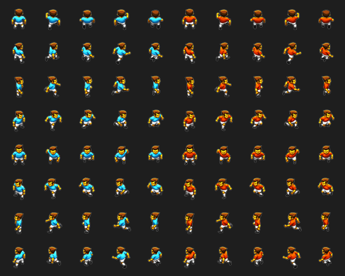

**4.** Sprite-urile jucătorilor pentru ambele echipe, pentru fiecare cadru de animație și direcție: pe fiecare rând, cele cinci cadre ale echipei albastre, apoi cele cinci ale echipei roșii, pentru una dintre cele opt direcții.

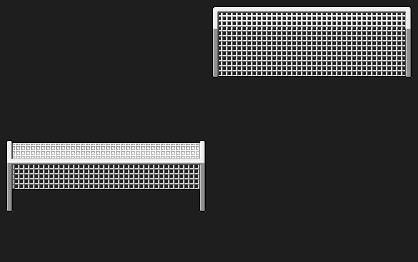

**5.** Plasele pentru partea de jos și de sus a terenului.

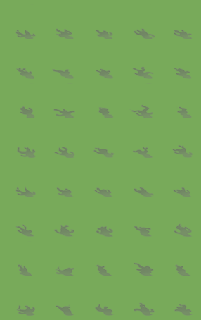

**6.** Umbrele sunt adăugate jucătorilor pentru un plus de realism.

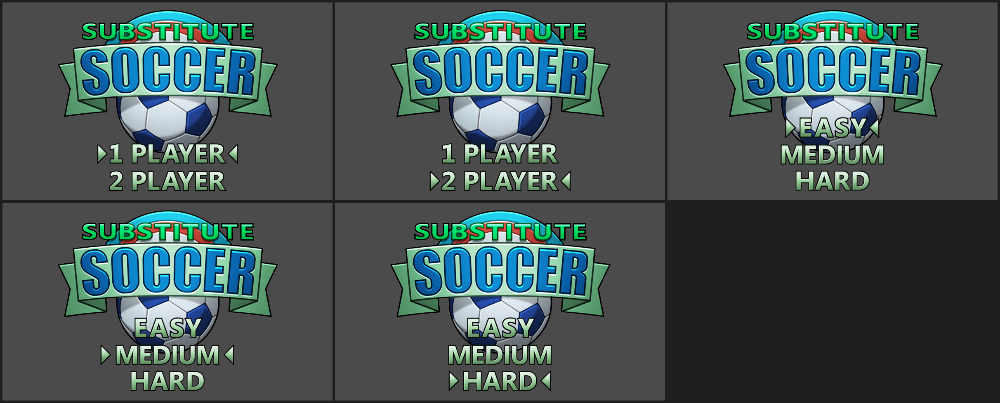

**7.** Ecranul de meniu permite alegerea numărului de jucători și a nivelului de dificultate pentru un jucător.

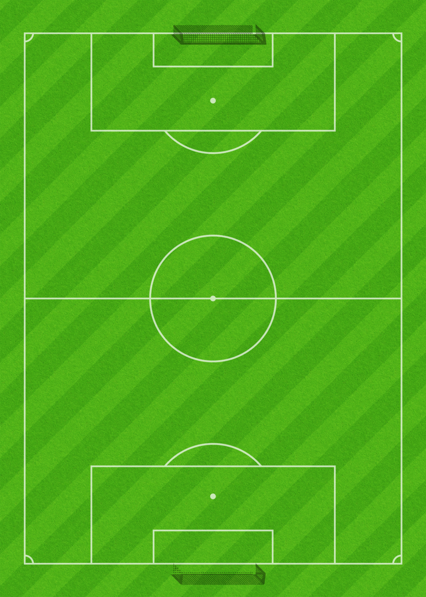

**8.** Terenul; doar o parte din el e afișată pe ecran la un moment dat.


**9.** Cifrele folosite pentru scorurile echipelor.


**10.** O săgeată e folosită pentru a indica jucătorul controlat în acel moment, câte una pentru fiecare echipă.

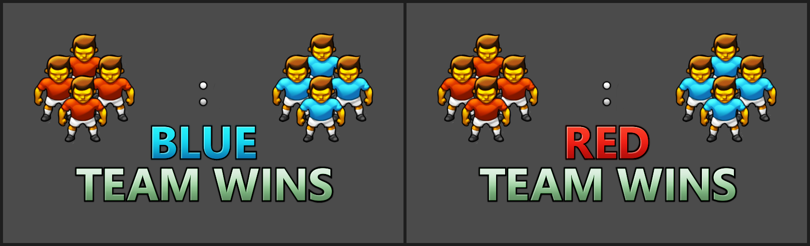

**11.** Ecranul de final arată echipa câștigătoare și scorul, cu cifrele mari de mai jos.

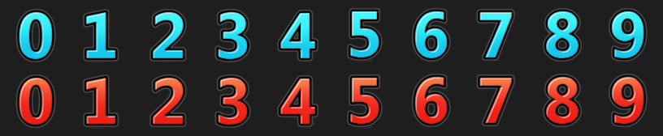

---

[← Capitolul 4 – Shooter pe un singur ecran: Centipede și Myriapod](Capitolul04_Shooter_pe_un_ecran_Centipede_si_Myriapod.md) | [Capitolul 6 – Instalarea →](Capitolul06_Instalarea.md)
