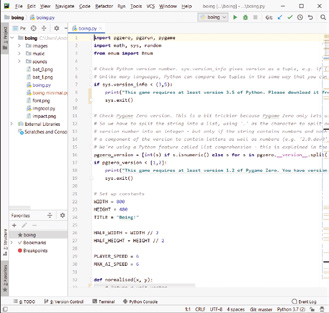
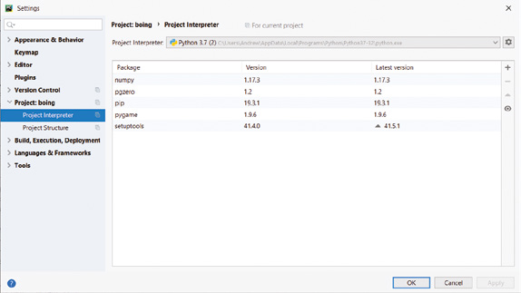
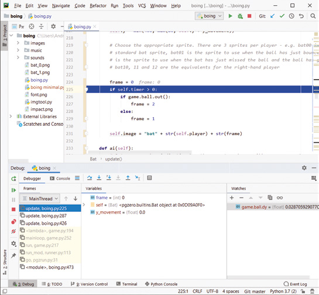

# Capitolul 6 – Instalarea

> *Învață cum să rulezi și să modifici jocurile din această carte, instalând Python, Pygame Zero și un mediu de dezvoltare*

Ca să rulezi și să modifici jocurile din această carte, ai nevoie de trei lucruri:

**1. Interpretorul Python.** Acesta e programul care îți permite să rulezi programe scrise în Python.

**2. Pygame Zero.** Un pachet suplimentar pentru Python, care se ocupă de multe dintre elementele esențiale ale dezvoltării de jocuri, cum ar fi afișarea graficii și redarea sunetului.

**3. Un mediu de dezvoltare integrat (IDE).** Un program care include un editor de cod și posibilitatea de a rula un program direct din acel editor. Te poți descurca și fără un IDE, dar e mult mai comod să folosești unul.

Trebuie să ai cel puțin versiunea 3.5 a interpretorului Python. Ține cont că, atunci când apare o versiune nouă de Python, poate dura ceva timp până când Pygame Zero devine compatibil cu ea. La momentul scrierii, cea mai recentă versiune de Python care poate fi folosită cu Pygame Zero este 3.7.5.

> **NOTA TRADUCĂTORULUI**
> Cartea a apărut la sfârșitul lui 2019, iar versiunile menționate în acest capitol (Python 3.7.5, Raspbian „Buster”) sunt cele de atunci. Între timp, Pygame Zero a fost actualizat și funcționează cu versiunile curente de Python 3, așa că poți instala pur și simplu versiunea curentă de pe [python.org](https://www.python.org). Dacă totuși comanda `pip3 install pgzero` dă erori la o versiune de Python foarte nouă, instalează versiunea de Python imediat anterioară; site-ul python.org le păstrează pe toate. Restul instrucțiunilor din capitol rămân valabile; unde s-au schimbat numele unor meniuri sau butoane, am adăugat o notă.

Există multe IDE-uri disponibile; aici ne vom uita la trei dintre ele: IDLE, Thonny și PyCharm. IDLE este un IDE foarte simplu, care vine împreună cu Python pentru Windows și Mac și este instalat implicit pe unele versiuni ale sistemului de operare Raspbian de pe Raspberry Pi. Thonny are câteva funcții în plus, deși e în continuare orientat spre începători. PyCharm este un IDE avansat, folosit de dezvoltatorii profesioniști. Recomandăm Thonny sau IDLE pentru începători și PyCharm pentru utilizatorii mai experimentați sau mai siguri pe ei.

Din când în când, pot apărea erori în încercarea de a instala și rula totul, mai ales pe calculatoarele mai vechi. Avem de-a face cu trei programe separate (plus jocurile în sine), care se schimbă frecvent, dar trebuie să funcționeze împreună. Dacă întâmpini erori când încerci să folosești un anumit IDE sau o anumită versiune de Python, încearcă alt IDE sau altă versiune de Python.

> **NOTA TRADUCĂTORULUI**
> O a patra opțiune, foarte răspândită astăzi, este editorul gratuit Visual Studio Code, cu extensia Python, folosit și în celelalte cărți din această colecție. Instalezi Python și Pygame Zero ca mai jos, deschizi folderul jocului în VS Code, deschizi fișierul `.py` și apeși pe butonul de rulare din colțul din dreapta-sus.

## Windows

### Instalarea Python

Windows nu vine cu Python preinstalat. Dacă ai impresia că ai instalat Python mai demult, poți verifica asta căutând „Python” în meniul Start sau la „Apps and Features” (Aplicații și caracteristici), în Settings (Setări).

Dacă intenționezi să folosești Thonny ca IDE, poți sări direct la secțiunea „Thonny”, pentru că Python se instalează automat împreună cu el, iar Pygame Zero poate fi instalat din Thonny.

Mergi la python.org, ține mouse-ul deasupra opțiunii Downloads și apasă pe Windows. Nu alege opțiunea de a descărca direct cea mai recentă versiune.

La „Stable Releases”, caută Python 3.7.5, apoi alege să descarci „Windows x86 executable installer”. (Poți alege și installerul x86-64, pe 64 de biți; ambele versiuni funcționează bine cu jocurile noastre.)

Odată ce descărcarea e gata, rulează programul fie din browserul web, fie din folderul Downloads. Bifează căsuța de lângă „Add Python 3.7 to PATH”. Apoi apasă „Install now”, ca să instalezi cu opțiunile implicite.

> *Odată ce descărcarea e gata, rulează programul din browserul web sau din folderul Downloads*

Este posibil să instalezi Python și din Microsoft Store, dar la momentul scrierii este disponibil doar Python 3.8, care nu e compatibil deocamdată cu Pygame Zero. Dacă ai orice dificultăți, instrucțiuni complete de instalare se găsesc la wfmag.cc/python-windows.

> **NOTA TRADUCĂTORULUI**
> Astăzi poți descărca liniștit versiunea curentă de Python de pe python.org (butonul galben „Download Python 3.x”), iar căsuța „Add Python to PATH” se numește în installerele recente „Add python.exe to PATH”. Bifeaz-o neapărat: fără ea, comenzile `python` și `pip3` nu vor fi recunoscute în fereastra de comandă. Versiunea din Microsoft Store funcționează și ea. Linkul wfmag.cc nu mai este activ.

### Instalarea Pygame Zero

Dacă intenționezi să folosești PyCharm ca IDE, poți sări direct la „Instalarea PyCharm”, pentru că Pygame Zero poate fi instalat din acel program.

Altfel, deschide o fereastră Command Prompt sau Windows PowerShell. Introdu comanda `python --version`, ca să confirmi că Python s-a instalat corect. Apoi tastează `pip3 install pgzero`. Aceasta va descărca pachetul Pygame Zero și celelalte pachete de care are nevoie.

```bash
python --version
pip3 install pgzero
```

## Mac

### Instalarea Python

Deși majoritatea versiunilor de macOS vin cu un interpretor Python, este versiunea 2.7, care nu e compatibilă cu Pygame Zero. Prin urmare, trebuie să instalezi o versiune mai nouă, alături de cea existentă.

Mergi la python.org, ține mouse-ul deasupra opțiunii Downloads și apasă pe Mac OS X. Nu alege opțiunea de a descărca direct cea mai recentă versiune.

La „Stable Releases”, caută Python 3.7.5, apoi alege să descarci „macOS 64-bit installer”.

Odată ce descărcarea e gata, rulează programul fie din browserul web, fie din folderul Downloads. Instalează cu opțiunile implicite.

> **NOTA TRADUCĂTORULUI**
> Versiunile recente de macOS nu mai vin deloc cu Python preinstalat, așa că instalarea de pe python.org este oricum necesară. Alege versiunea curentă și installerul „macOS 64-bit universal2 installer”, care merge atât pe Mac-urile cu procesor Intel, cât și pe cele cu procesor Apple.

### Instalarea Pygame Zero

Dacă intenționezi să folosești PyCharm ca IDE, poți sări direct la „Instalarea PyCharm”, pentru că Pygame Zero poate fi instalat din acel program.

Altfel, deschide o fereastră Terminal. Introdu comanda `python3 --version`, ca să confirmi că Python s-a instalat corect. Apoi introdu `pip3 install pgzero`. Aceasta va descărca pachetul Pygame Zero și celelalte pachete de care are nevoie.

```bash
python3 --version
pip3 install pgzero
```

## Raspberry Pi

Sistemul de operare Raspbian al lui Raspberry Pi vine cu Python și Pygame Zero deja instalate. Recomandăm să folosești cel puțin versiunea „Buster” a lui Raspbian (lansată în iunie 2019). Versiunile mai vechi pot avea performanțe mai slabe sau pot să nu aibă versiunea potrivită de Python sau de Pygame Zero.

Versiunile recente de Raspbian vin cu Thonny, dar nu includ IDLE. PyCharm poate fi folosit pe Raspberry Pi; vezi instrucțiunile de instalare pentru versiunea de Linux: wfmag.cc/pycharm-help.

> **NOTA TRADUCĂTORULUI**
> Raspbian se numește astăzi Raspberry Pi OS. În funcție de versiune și de imaginea aleasă, Pygame Zero poate să nu fie preinstalat; verifică într-un terminal cu `python3 -c "import pgzero"` și, dacă lipsește, instalează-l cu `sudo apt install python3-pgzero`. Thonny este în continuare inclus. Linkul wfmag.cc nu mai este activ; instrucțiunile pentru PyCharm pe Linux se găsesc pe site-ul JetBrains.

> **Obținerea jocurilor**
>
> Deși ai putea încerca să tastezi codul celor cinci jocuri prezentate în această carte, ar fi multă muncă și ai putea face ușor greșeli. Mai important, un joc nu poate rula fără setul lui de fișiere de imagini și sunete. Fiecare capitol din această carte include un link de unde poți descărca toate fișierele necesare pentru a pune un joc în funcțiune.
>
> Fiecare joc poate fi descărcat de pe GitHub, un site care găzduiește proiecte stocate cu sistemul de control al versiunilor git. Git și controlul versiunilor sunt subiecte mari, care depășesc scopul acestei cărți, dar merită din plin să înveți despre ele. Fiecare joc are propria pagină pe GitHub. Există două opțiuni pentru a descărca un joc. Prima este să apeși pe „Clone or download” și să alegi „Download ZIP”; asta împachetează toate fișierele jocului într-un fișier zip, care poate fi apoi descărcat și dezarhivat într-un folder. Alternativa este să-l descarci direct cu sistemul de control al versiunilor git, pe care îl poți descărca de la git-scm.com. Instalează-l cu setările implicite. Pe pagina de GitHub a jocului, copiază adresa web care apare când apeși pe „Clone or download”, apoi fie folosești git din fereastra de comandă/terminal ca să descarci proiectul (introdu `git clone` urmat de adresa găsită apăsând pe „Clone or download” pe pagina de GitHub a jocului), fie îl descarci prin opțiunea „Check out from Version Control” din PyCharm, dacă intenționezi să folosești acel IDE.
>
> Odată ce ai descărcat un joc, există mai multe moduri în care îl poți rula. Pe Windows sau Mac, poți pur și simplu să dai dublu-clic pe fișierul Python al jocului în File Explorer sau Finder. Pe orice sistem, poți naviga în folderul jocului dintr-o fereastră de comandă/terminal și tasta `pgzrun game.py` (înlocuiește `game.py` cu numele fișierului Python). Sau poți rula jocul dintr-un IDE.
>
> Două dintre jocuri, Bunner și Myriapod, folosesc ferestre de joc deosebit de înalte. Acestea pot avea probleme să încapă pe ecran dacă ai un calculator cu o rezoluție mică a ecranului sau, uneori, dacă folosești scalarea afișajului. În Windows 10, poți verifica dacă scalarea afișajului e activată mergând la setările de afișaj; setarea relevantă este „Change the size of text, apps and other items” (Modificați dimensiunea textului, a aplicațiilor și a altor elemente). Dacă este peste 100% și ai dificultăți cu un joc care nu încape pe ecran, încearcă să o reduci la 100%.

> **NOTA TRADUCĂTORULUI**
> În această traducere nu ai nevoie să descarci nimic: toate cele cinci jocuri, cu imaginile, sunetele și muzica lor, sunt în folderul [codul_sursa](codul_sursa/), copiate din depozitul editurii, [github.com/Wireframe-Magazine/Code-the-Classics](https://github.com/Wireframe-Magazine/Code-the-Classics). Dacă vrei totuși să le iei de pe GitHub, butonul „Clone or download” se numește acum „Code”, iar opțiunea din PyCharm se numește „Get from VCS”. Linkurile scurte wfmag.cc din capitole nu mai funcționează. Cum jocurile se termină cu linia `pgzrun.go()`, le poți porni și cu `python3 boing.py`, nu doar cu `pgzrun boing.py`.

## IDE-uri

### IDLE

IDLE este un IDE simplu, care se instalează automat împreună cu Python. Îl găsești în folderul Python din meniul Start pe Windows, sau căutând „IDLE”. Asigură-te că folosești versiunea corectă de IDLE; în cazul nostru, cea pentru Python 3.7.

Odată ce pornește IDLE, primul lucru pe care îl vezi este o fereastră intitulată „Python 3.7.5 Shell”. În această fereastră poți tasta o linie de cod Python și o poți vedea rulând pe loc. De exemplu, încearcă să introduci:

```python
x = 5
y = 3
x + y
```

Poți folosi meniul File ca să deschizi un fișier Python, de exemplu `boing.py`. Apoi poți rula jocul mergând la meniul Run și alegând Run Module, sau apăsând F5. Dacă apare o eroare, textul ei va fi afișat în fereastra shell-ului Python.

### Thonny

Thonny vine instalat cu versiunile recente ale sistemului de operare Raspbian de pe Raspberry Pi. Pentru calculatoarele cu Windows și Mac, îl poți descărca și instala de la thonny.org. Implicit, Thonny folosește o versiune de Python care vine împachetată cu el. Dacă ai descărcat deja Python separat și ai instalat Pygame Zero, poți alege să folosești versiunea ta mergând la meniul Run, apăsând „Select interpreter”, schimbând opțiunea selectată în „Alternative Python 3 interpreter or virtual environment” și alegând apoi interpretorul dorit din a doua listă derulantă.

Poți instala Pygame Zero din Thonny, mergând la meniul Tools și alegând „Manage packages”. În caseta de text, tastează „pgzero” (fără ghilimele), apoi apasă butonul din dreapta. Apoi apasă „Install”.

Poți folosi meniul File ca să deschizi un fișier Python, de exemplu `boing.py`. Apoi poți rula jocul apăsând butonul „Run current script” sau tasta F5. Dacă apare o eroare, detaliile vor fi afișate în zona Shell din partea de jos a ecranului.

Nu activa „Pygame Zero mode” din meniul Run; acesta e necesar doar dacă linia `pgzrun.go()` nu există la sfârșitul codului.

Thonny include un depanator, care îți permite să parcurgi codul linie cu linie și să vezi cum se schimbă variabilele. Totuși, noi am avut dificultăți să-l facem să funcționeze corect și cu o rată decentă a cadrelor când rulăm jocurile noastre, în timp ce depanatorul din PyCharm funcționează mult mai fiabil.

### PyCharm

PyCharm este un IDE puternic, cu zeci de funcții. Una dintre cele mai utile este completarea codului, prin care IDE-ul încearcă să prezică ce vei tasta, pe baza numelor de variabile și funcții sau a membrilor claselor. Când PyCharm îți arată o listă de sugestii, poți apăsa TAB ca să accepți elementul selectat. O altă funcție importantă este depanatorul, foarte util când încerci să-ți dai seama de ce o bucată de cod nu funcționează așa cum te aștepți.



Poți descărca PyCharm de la jetbrains.com/pycharm. Asigură-te că iei versiunea Community. Odată instalat, rulează-l și alege opțiunile implicite. Ar trebui să ajungi pe un ecran care îți dă opțiunea de a crea un proiect nou, de a deschide un proiect existent sau de a-l prelua dintr-un sistem de control al versiunilor. Dacă nu ai descărcat deja jocurile, cea mai comodă opțiune este să alegi „Check out from Version Control”; adresa de introdus în caseta URL este cea care se găsește apăsând pe „Clone or download” pe pagina de GitHub a jocului (vezi „Obținerea jocurilor”). Dacă ai descărcat deja un joc, poți alege „Open” și folderul în care ai dezarhivat fișierul zip. Asigură-te că alegi folderul care conține direct fișierele jocului, nu un folder care conține un alt subfolder cu același nume, așa cum se poate întâmpla în funcție de cum ai dezarhivat fișierele.

> **NOTA TRADUCĂTORULUI**
> Cu această traducere, alege „Open” și folderul jocului din `codul_sursa`, de exemplu `codul_sursa/boing`. În versiunile recente de PyCharm, opțiunea de preluare din git se numește „Get from VCS”, iar setările proiectului se găsesc la File > Settings (pe Mac, PyCharm > Settings), la „Project: boing” > „Python Interpreter”.

Instrucțiunile următoare presupun că încerci să rulezi jocul Boing!.

Odată ce proiectul s-a încărcat, caută zona „Project”, aproape de colțul din stânga-sus al ferestrei. Sub cuvântul Project ar trebui să vezi numele folderului, de exemplu `boing`, cu o săgeată în stânga. Apasă pe săgeată ca să extinzi folderul. Ar trebui să vezi apoi o listă de fișiere și foldere, unul dintre ele fiind fișierul Python al jocului, de exemplu `boing.py`. Dă dublu-clic pe el ca să-l încarci.

Dacă nu ai instalat încă Pygame Zero, sau nu ești sigur că ai cea mai recentă versiune, mergi la meniul File și alege Settings. Extinde „Project: boing” și alege „Project interpreter”. Aici poți alege ce interpretor Python va folosi proiectul tău și ce pachete externe sunt disponibile. Dacă Pygame Zero este instalat, vei vedea „pgzero” în lista de pachete, iar numărul versiunii ar trebui să fie afișat alături. Dacă e acolo, dar numărul versiunii e mai mic decât 1.2, selectează pgzero și apasă săgeata în sus din partea dreaptă a ferestrei. Dacă pgzero nu există, apasă pe pictograma plus din colțul din dreapta-sus al ferestrei. Tastează „pgzero” în caseta de căutare și apasă „Install Package”. Așteaptă să se instaleze, apoi închide fereastra și apasă OK ca să închizi fereastra de setări.

> *Poți alege ce interpretor Python va folosi proiectul tău și ce pachete sunt disponibile*



Ca să rulezi jocul, dă clic dreapta pe fundalul zonei de cod (partea principală a ferestrei) și alege „Run 'boing'”. Dacă opțiunea este inactivă (gri), cel mai probabil PyCharm rulează în fundal niște procese care trebuie să se termine; așteaptă să se încheie (vezi notificarea din partea de jos a ecranului) și încearcă din nou.

Poți rula jocul în modul de depanare alegând „Debug 'boing'”. Rularea sub depanator poate duce la o rată mai slabă a cadrelor, dar oferă o serie de avantaje. Dacă apare o excepție netratată (un tip de eroare care face programul să se oprească), în mod normal tot ce primești este un text care arată detaliile excepției (la sfârșitul textului) și stiva de apeluri, care indică funcția și numărul liniei unde a apărut eroarea, precum și funcțiile care au apelat acea funcție. În modul de depanare, o excepție netratată face programul să se oprească în loc; poți folosi apoi depanatorul ca să vezi unde a apărut eroarea și să vizualizezi conținutul curent al variabilelor și al stivei de apeluri. Poți intra manual în depanator și adăugând un punct de întrerupere (breakpoint): dă clic în zona gri din dreapta unui număr de linie. Ar trebui să apară un cerc roșu. Când rulezi în modul de depanare, PyCharm va intra în depanator chiar înainte ca acea linie de cod să fie executată. Acum poți vedea variabilele și stiva de apeluri ca înainte, dar poți și să faci codul să ruleze linie cu linie, folosind comenzi ca Step Over și Step Into (din meniul Run sau din butoanele ferestrei Debug).



---

[← Capitolul 5 – Joc de fotbal: Sensible Soccer și Substitute Soccer](Capitolul05_Joc_de_fotbal_Sensible_Soccer_si_Substitute_Soccer.md) | [Capitolul 7 – Interviu: Dan Malone →](Capitolul07_Interviu_Dan_Malone_despre_grafica.md)
