# Capitolul 7 – Interviu: Dan Malone, despre grafică

> *Astăzi explorăm lumi de joc vaste și frumoase, fără restricții. Dar cum reușeau graficienii din primele zile ale jocurilor să redea medii și personaje cu o tehnologie limitată?*

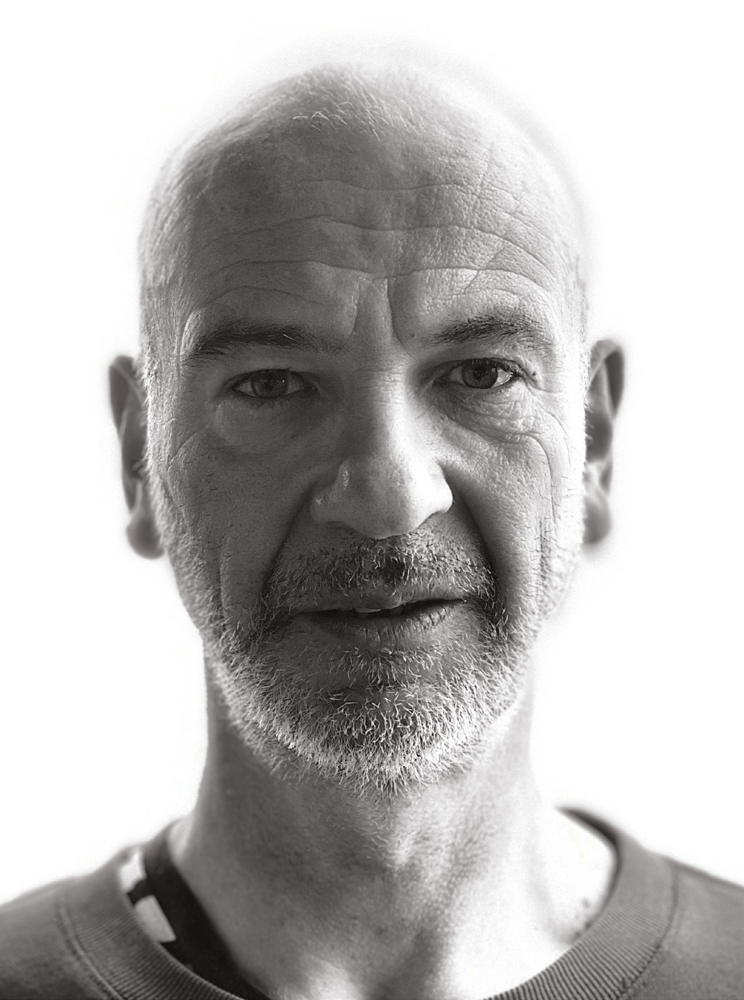

La începuturile jocurilor, grafica era totul. Jucătorii se entuziasmau de grafica de ultimă oră a numeroaselor aparate cu monede care se întreceau pentru atenția lor în sălile de jocuri din toată țara. Anumite jocuri împingeau limitele vizuale ale calculatoarelor și consolelor de acasă, iar capturile de ecran de pe spatele cutiilor erau extrem de importante pentru jucătorii care căutau ceva cu care să se laude în fața prietenilor.

Inovațiile grafice formau liniile de front dintre mașini, pe măsură ce discuțiile din curtea școlii se transformau în război despre care calculator e mai bun. Au dat naștere unor termeni ca „colour clash” (conflict de culori), mai ales pe ZX Spectrum. Îi făceau pe jucători și să turuie numere: 27 de culori posibile pe un Amstrad CPC față de 4096 pe un Commodore Amiga… Între timp, recenzenții din reviste dădeau note doar pentru aspectul unui joc, iar dezbaterile făceau furori pe tema dacă grafica e mai importantă decât gameplay-ul.

În ciuda importanței acestor elemente vizuale, mulți programatori de jocuri din primele zile încercau să fie buni la toate: scriau cod și, în același timp, creau grafica și produceau sunetul. Atâta timp cât grafica era reprezentativă, dezvoltatorii considerau treaba făcută. Situația s-a schimbat însă la începutul anilor '80, când graficieni dedicați s-au alăturat echipelor mici de dezvoltare și au investit multe ore în producerea unor jocuri impresionante vizual. În special NES-ul de la Nintendo a văzut grafica evoluând spectaculos, iar era pe 16 biți a adus cu ea detalii complicate.

> *Graficienii s-au alăturat echipelor mici de dezvoltare și au investit multe ore în producerea unor jocuri impresionante vizual*

De-a lungul anilor au fost introduse și multe tehnici, printre care Mode 7 pe SNES, care permitea scalarea și rotirea fundalurilor; derularea în paralaxă pentru fundaluri; geometria 3D randată pe bază de triunghiuri; și Full Motion Video. Destul de curând, realismul a devenit un obiectiv, mai ales în era PlayStation de la mijlocul anilor '90, în timp ce la început fusese lăsat pe seama imaginației jucătorilor (și, în multe cazuri, a descrierilor din manualele care însoțeau jocurile).

O persoană care a fost martoră la multe dintre aceste schimbări este Dan Malone, un desenator de benzi desenate care s-a trezit, fără să vrea, lucrând în industria jocurilor, inițial pentru Palace Software. A ajuns să lucreze pe o mulțime de calculatoare și console, de la mașinile pe 8 biți până la platformele de azi. Făcând asta, a primit acces la hardware tot mai complex, pe care să-și exerseze talentul artistic, și a ajuns să lucreze la unele dintre cele mai bune jocuri făcute vreodată, de la Speedball 2: Brutal Deluxe la The Chaos Engine. Dan a creat toată grafica jocurilor din această carte.

**Ți-ai început cariera în jocuri în 1985, dar erai artist și înainte?**

Da, desenez benzi desenate de când am putut ține un creion în mână și am o dragoste uriașă pentru Marvel de când eram copil. Crescând în anii '60 și la începutul anilor '70, tata îmi cumpăra multe benzi desenate. Când părinții mei s-au despărțit și mama s-a mutat la Bruxelles, îmi trimitea un flux constant de benzi desenate americane, de la o librărie internațională care vindea orice, de oriunde din lume. Am fost cu adevărat inspirat de talentul artistic al unor oameni ca John Severin și Jack Kirby, și chiar au avut o influență uriașă asupra mea.

**Dar cum ai trecut de la benzi desenate la grafică pentru jocuri?**

Ei bine, a fost un accident. La câteva luni după ce terminasem colegiul de artă, un fost profesor de tipografie mi-a trimis un decupaj dintr-o revistă de specialitate numită Campaign. Era un anunț al unei companii numite Palace Software, care căuta artiști în stilul 2000AD, și, pentru că eram înnebunit după 2000AD, care cred că e cea mai bună revistă britanică de benzi desenate făcută vreodată, am știut că trebuie să răspund. Am obținut un interviu, dar nici măcar atunci nu mi-am dat seama că are vreo legătură cu jocurile. A fost o surpriză totală pentru mine.

> *Am obținut un interviu, dar nici măcar atunci nu mi-am dat seama că are vreo legătură cu jocurile*

**Aveai vreo experiență cu jocurile înainte de asta?**

Nu, nu prea eram jucător. Știam că există jocuri și auzisem de Spectrum, Commodore și Amstrad CPC, dar nu jucasem multe jocuri pe calculator. Pasiunea mea fuseseră jocurile de masă Dungeons & Dragons; îmi scriam propriile campanii de D&D și le ilustram. Asta însemna însă că aveam cunoștințe despre jocuri și despre joc în general.

**Cum a fost să lucrezi pentru Palace Software?**

Eram în Londra pe cont propriu pentru prima dată, ca tânăr adult, și a fost cu atât mai grozav cu cât lucram la legendarul cinematograf independent Scala, din King's Cross. Am lucrat cu Pat Mills de la 2000AD, ceea ce era foarte incitant, pentru că îmi permitea să combin jocurile cu benzile desenate. Era o lume nouă și strălucitoare pentru mine în Londra, după ce fusesem la colegiu în Ipswich.

**Cum a fost să abordezi grafica pe calculatoarele pe 8 biți, venind de la stilou?**

A fost o reducere serioasă de scară. Pe lângă limitări, numărul de cadre și varietatea fundalurilor, lucram cu pixeli, ceea ce mi s-a părut mereu ca lucrul cu niște cărămizi Lego mari. Dar Palace Software avea editoare de sprite-uri proprii, iar un alt artist, Steve Brown, sosit chiar înaintea mea, pusese cam totul la punct până am ajuns eu acolo, ceea ce mi-a ușurat acomodarea. Palace era și foarte condusă de artiști: compania era despre ce putea livra artistul și cum putea mașina să realizeze asta.

**Te simțeai constrâns de tehnologie?**

Ei bine, era prima mea slujbă, așa că abordarea mea a fost să mă apuc de treabă și să fac tot ce pot, dar tot a fost un șoc mare și mă uitam constant la benzi desenate și mă gândeam: „Măi, chiar vreau să mă întorc la asta.” Dar iubesc animația și a fost plăcut să folosesc acele abilități, chiar dacă operam cu o buclă simplă de patru cadre. Am profitat și de ocazia de a crea o mică bandă desenată pentru Sacred Armour of Antiriad.

**Cât de strâns lucrai cu programatorii?**

Una dintre sarcinile mele era să-i împing de la spate pe programatorii de la Palace și, după ce am dezvoltat Cauldron II, am lucrat îndeaproape cu un tip pe nume Stanley Schembri la Sacred Armour of Antiriad. Stăteam unul lângă altul; eu mă târguiam pentru mai multă grafică de făcut, în timp ce ei îmi arătau lucrurile care nu mergeau, ceea ce însemna că trebuia să reduc cadrele sau să fac altceva. Dar a fost foarte distractiv și au fost niște bătălii amicale plăcute. De exemplu, personajul principal din Sacred Armour of Antiriad era format din două sprite-uri de patru pe patru, lipite, și s-a dovedit o mică provocare să-l facem să încapă.

**Era frustrant să ți se spună că nu poți face anumite lucruri?**

Trebuie doar să te readaptezi și să-ți dai seama că lucrezi în cadrul unei limitări și că e treaba ta să faci lucrurile să meargă. În sensul ăsta, orice frustrare s-a transformat într-o provocare, cu atât mai mult cu cât n-aveam niciun punct de referință artistic, pentru că nu prea eram pasionat de jocuri. Faptul că am venit la slujbă atât de „proaspăt” a ajutat, și de aceea am împins cât am putut ce făceam. Am petrecut în total cam șase luni la Sacred Armour of Antiriad și a fost destul de intens.

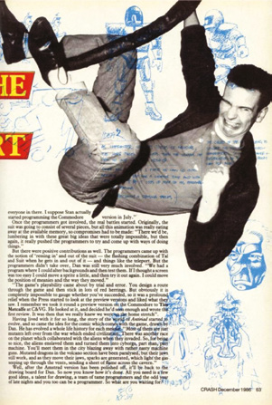

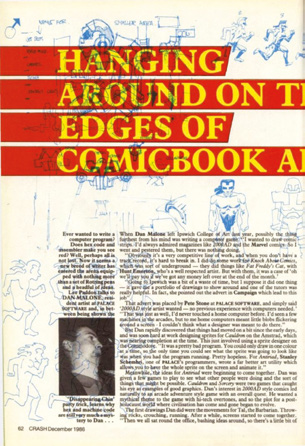

> **Crearea unor lumi noi**
>
> *O privire asupra numeroaselor elemente artistice care alcătuiesc The Chaos Engine*
>
> 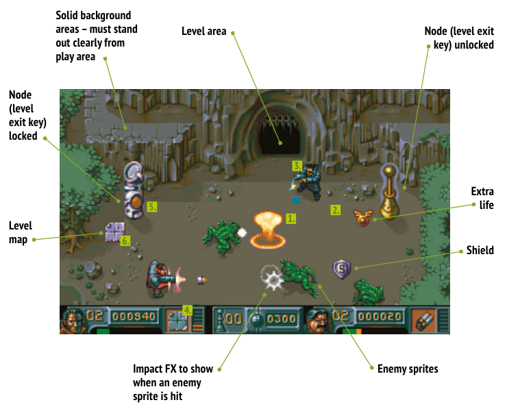
>
> Etichetele din imagine, de la stânga la dreapta și de sus în jos: zone de fundal solide, care trebuie să se distingă clar de zona de joc; efecte de impact, care arată când un sprite inamic e lovit; zona nivelului; nod (cheia de ieșire din nivel) blocat; nod (cheia de ieșire din nivel) deblocat; viață în plus; scut; sprite-uri inamice; harta nivelului.
>
> **1. Explozia inamicului.** Când un inamic e lovit, trebuie să reacționeze cumva. O explozie e un element vizual perfect, pentru că nu doar că e strălucitoare, întărind astfel ce tocmai s-a întâmplat, dar e și extrem de satisfăcătoare.
>
> **2. Zona principală de joc.** Dan Malone spune că a păstrat suprafața de fundal a jocului în mare parte goală, ca sprite-urile să iasă mai clar în evidență, ceva care e întotdeauna de ajutor pentru jucător.
>
> **3. Sprite-urile jucătorilor.** Jucătorii vor petrece mult timp uitându-se la sprite-urile personajelor principale, așa că ele trebuie să fie atrăgătoare și imediat distinctibile de celelalte obiecte. Dan Malone le-a dat personajelor umbre, ca să pară ancorate și solide pe fundal. Ele aveau și caracteristici diferite, definite prin îndemânare, rezistență, viteză și înțelepciune.
>
> **4. Zona de stare.** Fie că ai un buton care aduce statisticile curente pe o pagină separată, fie că e parte a ecranului principal de joc, o zonă de stare e vitală pentru afișarea scorului curent, a vieții și a obiectelor colectate, într-un joc ca acesta.
>
> **5. Multe puzzle-uri.** E întotdeauna o idee bună să-i provoci pe jucători, așa că, pe lângă mulțimea de inamici, The Chaos Engine te lăsa să aduni bunătăți, cum ar fi chei, mâncare și comori. Indicatoarele le spuneau jucătorilor când o ieșire era deschisă sau blocată.
>
> **6. Hărți.** Jocurile mari au nevoie de hărți, dar The Chaos Engine a păstrat lucrurile simple, arătând o vedere a zonei pătrate de trei ecrane din jurul personajului, nu întregul nivel.

**Căutai mereu să dezvolți mici trucuri în grafica ta?**

Nu prea, pe calculatoarele pe 8 biți, pentru că pixelii erau uriași și aveai, de fapt, doar patru culori și una transparentă cu care să te joci. Dar pe cele pe 16 biți era ceva mai mult loc de împins ici și colo, cu mici tehnici ca anti-aliasingul, care asigurau că grafica arată neted, nu prea pixelat.

**Ai lucrat și la designul jocurilor?**

Da, mandatul meu era să vin cu concepte de joc pentru Sacred Armour of Antiriad și Superthief și să dezvolt idei care să le facă jucabile. Pentru asta, începeam prin a schița totul pe hârtie și erau perioade în care pur și simplu desenam întruna, până când cineva spunea: „Gata, începem dezvoltarea propriu-zisă.” În acel moment, pregăteam niște grafică cu care programatorul să lucreze, cu toate ideile care îmi fremătau în cap.

**De ce proiectai mai întâi pe hârtie, în loc să te apuci direct?**

Gândesc întotdeauna mai bine când desenez de mână. De fapt, de cele mai multe ori, n-am nicio idee în minte când mă apuc de desenat, așa că asta le ajută să apară. Singura excepție e când chiar am o idee puternică și ard de nerăbdare s-o pun pe hârtie, dar sunt încă foarte „old-school” în folosirea stiloului și a hârtiei, deși știu că mulți oameni desenează pe tablete și că poate ar trebui să mă apuc și eu.

**De unde îți veneau ideile?**

Ei bine, începusem să joc câteva jocuri până în acel moment, așa că îmi făceam o idee despre ce ar merge și ce nu. Sacred Armour of Antiriad, de exemplu, avea personaje preistorice și tehnologie extraterestră și, deși s-a dovedit asemănător cu un alt joc, numit Turrican (chiar dacă eu îl proiectam independent, la kilometri distanță), a arătat că eram pe drumul cel bun.

Cred că a ajutat că știam atât de multe despre jocuri ca Dungeons & Dragons și că înțelegeam ce face un joc să fie joc. Îmi place și sportul și vedeam jocurile ca pe o competiție care funcționează în cadrul unui set de reguli. Deci asta a fost influența mea principală, cu benzile desenate mereu în fundal. Citisem undeva că a scrie o carte bună e la fel de simplu ca a-i face pe cititori să întoarcă pagina, așa că simțeam că ar trebui să-i încurajăm mereu pe jucători să treacă la nivelul următor. Făceam asta incluzând mici momeli.

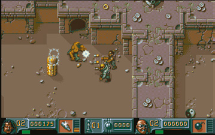

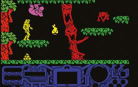

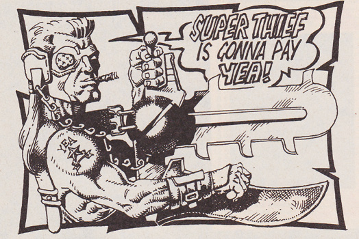

> *Există o mulțime de cursuri universitare peste tot, pentru design de jocuri, modelare 3D și storyboarding, așa că acum există un drum mai clar spre angajare. Dar e unul greu. Trebuie să fii dedicat și să sacrifici lucruri pe parcurs.*
>
> **Dan Malone**

**Ai simțit lucrul pe calculatoarele pe 16 biți ca pe o eliberare?**

Cu siguranță a adus multe lucruri: rezoluție mai mare, mai multă memorie și mai multe culori, pentru început, iar asta era mare lucru, pentru că puteai face anti-aliasing mai bine. Îmi amintesc că mă uitam mereu la aparatele arcade cu gândul să aduc acea atmosferă pe calculatorul de acasă. Cu 16 biți, dintr-odată a devenit posibil, și a fost o asemenea descoperire. Abia așteptam să mă implic.

**Era o diferență mare între tipurile de grafică pe care trebuia să le produci pentru un calculator pe 16 biți și pentru o consolă pe 16 biți?**

Pe atunci, începeam întotdeauna prin a produce jocurile pe calculatoarele de acasă, așa că le cream mai întâi pe Amiga și Atari ST și apoi portam grafica înainte și înapoi pe alte formate. Odată, când produceam Speedball 2, am creat două palete separate, una pentru Atari ST și cealaltă pentru Amiga, dar i-am ținut pe toți în loc făcând asta. Cu consolele, pe de altă parte, portam pur și simplu jocurile direct, înainte să le retușăm. Trebuia să le facem să arate bine, ceea ce nu era mereu ușor, pentru că culorile de pe console erau foarte țipătoare și saturate. Era și mai greu să obții un anti-aliasing frumos și neted, dar vestea bună e că aveam ceva mai multă memorie pe unele dintre ele, comparativ cu Amiga.

> *Mă uitam mereu la aparatele arcade cu gândul să aduc acea atmosferă pe calculatorul de acasă*

**Te-ai mutat de la Palace la Bitmap Brothers. A fost o companie specială?**

A fost un moment de vârf pentru mine, categoric. Pe atunci, Palace era pe punctul de a se închide, dar eu văzusem deja Speedball de la Bitmaps și mă îndrăgostisem de el. Mi se păreau uluitoare muzica, grafica și gameplay-ul, așa că am fost foarte încântat să intru direct pe Speedball 2 când m-am alăturat Bitmap Brothers. Era foarte incitant, mai ales pentru că firma fusese mereu văzută ca fiind foarte cool. Nu că Palace Software n-ar fi fost la fel, a fost și ea o companie grozavă pentru care să lucrezi, dar a fost păcat că s-a terminat, pentru că ar fi putut fi ceva cu adevărat special.

**Ți s-a dat multă libertate la Bitmap Brothers?**

Da, și e un lucru minunat. Am spus mereu că designul prin comitet nu e cel mai bun mod de a crea un produs remarcabil și am fost foarte mulțumit de asta. Speedball 2, și The Chaos Engine, dacă e s-o spun, mi-au dat multă libertate să-mi fac treaba. Cred că acele jocuri au devenit cea mai bună lucrare a mea tocmai din cauza asta.

**Dintre toate jocurile, care ți-a plăcut cel mai mult din punct de vedere artistic?**

The Chaos Engine a fost un mare favorit al meu. Atmosfera victoriană și vibe-ul steampunk au fost foarte distractive și mi s-a dat multă libertate cu personajele, ceea ce a făcut ca jocul să-mi fie foarte drag. Aș merge până la a spune că jocul a fost copilul meu, chiar dacă era un joc Bitmap și Eric Matthews era responsabil de el. Să fii lăsat pur și simplu să-ți vezi de treabă e întotdeauna bine.

**Când ai abordat The Chaos Engine și dezvoltai stilul steampunk, ce te-a influențat?**

Era o poveste în 2000AD care avea un fel de vibe steampunk victorian, dar Steve Wilcox a fost cel care a conceptualizat, în mare, The Chaos Engine. Stăteam lângă el și desenam, în timp ce el spunea: „Încearcă asta, încearcă aia.” Chiar și așa, a fost în mare parte un caz în care mi-am urmat instinctul, pentru că nu prea aveai pe ce să construiești jocul, în afară de o bandă desenată. A trebuit și să mă adaptez, pentru că știam că nu voi putea băga într-un joc, la acea vreme, genul de detalii pe care le găsești în benzile desenate. Dar de aceea personajele din joc au fost mereu marele meu favorit și de aceea iubesc acele fundaluri. Sunt deosebit de mândru de setul de dale pentru The Chaos Engine.

**Pe măsură ce jocurile au devenit mai avansate și echipele de dezvoltare au crescut, asta a afectat felul în care ai abordat jocurile ulterioare?**

Am început să devin, cu timpul, mai degrabă un director creativ, iar asta însemna să pornesc de la o foaie albă și să inspir echipa, să-i fac să știe la ce lucrează și de ce lucrează la asta. Desenam în continuare mult, mai ales personajele și fundalurile, dar eram acolo, în principal, ca să creez o poveste cu jocurile mele. Era din nou chestia cu Dungeons & Dragons: cream lumi bogate, populate cu personaje, și trebuia să pregătesc lucrurile pentru un termen-limită. Totul era despre a-i face pe artiști și pe modelatori să împărtășească aceeași viziune.

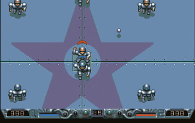

> **Crearea unui personaj**
>
> 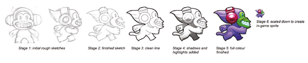
>
> Dan Malone parcurge șase etape principale când creează grafica pentru jocurile lui. Cu acest personaj, de exemplu, începe prin a crea schițe brute inițiale, care arată figura în diverse poziții: de exemplu, stânga, dreapta, spate, față, alergând și stând pe loc. Odată mulțumit, trece la procesul de curățare, trasând liniile care vor fi vizibile în personajul final. Cu imaginea scanată în calculator, se adaugă umbrele și luminile și e timpul pentru puțină culoare. În final, sprite-ul poate fi micșorat pentru a fi folosit în joc.

**Când s-au schimbat lucrurile cu adevărat?**

Odată cu PlayStation. Echipele de dezvoltare pentru consolă erau încă minuscule după standardele de azi, dar foarte mari pentru acea vreme, cu cam 15 oameni în fiecare. Pentru mine a fost un moment de cotitură și, când m-am alăturat în cele din urmă chiar companiei Sony și am primit un kit de dezvoltare PlayStation albastru, am rămas fără cuvinte. Jucam Wipeout și Tekken cu gura căscată. Îmi amintesc în special că intro-ul de la Tekken m-a dat pe spate, pentru că era atât de cinematografic.

**Ți-a deschis ochii spre abordări noi?**

Într-un mediu ca cel în care lucram la Sony, e inevitabil. Eram alături de mulți alți oameni, iar munca a devenit mult mai mult despre comunicarea eficientă a ideilor. Dar verificam și munca altora și delegam, ceea ce nu mai făcusem niciodată.

> *Echipele de dezvoltare pentru consolă erau încă minuscule după standardele de azi, dar foarte mari pentru acea vreme*

**Era multă presiune să prezinți PlayStation în cea mai bună lumină?**

Era în continuare vorba de a da fiecărui proiect tot ce ai mai bun, dar era mult mai serios, pentru că mai mulți oameni erau implicați în procesul de decizie și dura mult mai mult să obții aprobări. Am lucrat la un joc sub licență, numit Porsche Challenge, și asta a adus presiune suplimentară, pentru că trebuia să mă lupt și cu faptul că Porsche avea propria idee despre cum ar trebui să arate jocul. Asta a adus conflicte, pentru că eu voiam chestii ca vopsele nebunești pe mașini, iar Porsche nu, și, în esență, de asta am plecat. M-a durut și să văd că un alt joc la care lucram, un joc original, a fost anulat în favoarea unei licențe: NBA 97. Știam că acele jocuri aduceau banii, dar în mintea mea asta era Sony și simțeam că ar trebui să deschidă drumul.

**Ce joc era?**

Era un hibrid skate-surf, un fel de precursor al lui Tony Hawk, care a apărut câțiva ani mai târziu și a aruncat scena în aer. Am crezut că am ratat o ocazie și încă mai cred că e păcat că n-am apucat să-l dezvoltăm.

**Deci te-ai simțit constrâns că trebuia să lucrezi cu modele reale la Porsche Challenge?**

Aveam un modelator de mașini bun, care lucra îndeaproape cu specificațiile Porsche, iar pentru mine era mai degrabă vorba să construiesc o poveste în jurul lor. Dar Porsche avea multă influență asupra licenței sale și, pentru mine, în final n-a funcționat. Jocul a fost OK, dar ar fi putut fi mai jucabil și un omagiu adus culturii de stradă. Porsche a fost conservatoare în ce voia.

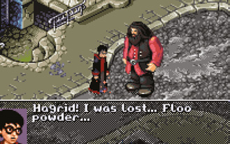

**Ai creat și Harry Potter and the Chamber of Secrets pentru Game Boy Advance. Cum a fost să lucrezi din nou în 2D?**

A fost ca o întoarcere la 16 biți, de fapt, deși cu o paletă mai mare și o rezoluție similară cu ecranul Amiga. Dar a fost și o revenire la ce făcusem cu câțiva ani în urmă și a fost, de asemenea, simplu. Lucrul cu Game Boy Advance era pur și simplu o chestiune de a reduce grafica ca să încapă pe un ecran mic. Se aplicau aceleași reguli ale creării de artă.

**Exista însă o altă așteptare de la grafică în anii 2000?**

Da, a intrat în joc mult mai mult realism. Aveam un număr mai mare de poligoane, hărți de texturi și efecte speciale, și exista o înclinație mai mare spre realismul cinematografic, cu siguranță în jocurile mari. De fapt, totul era despre jocuri mari, echipe mari și presiuni mari.

**A fost reconfortant să revizuiești clasice ca Broken Sword, cu grafica lui 2D?**

Da, a fost plăcut să lucrez cu Charles Cecil și cu Dave Gibbons, care e un mare desenator britanic de benzi desenate. Am ajuns să lucrez peste materialele lui și, practic, să procesez sprite-uri și portrete din ilustrațiile lui.

**Deci ce ar trebui să facă azi cineva care vrea o carieră în grafica de jocuri, ca să pună piciorul pe prima treaptă?**

Există o mulțime de cursuri universitare peste tot, pentru design de jocuri, modelare 3D și storyboarding, așa că acum există un drum mai clar spre angajare. Dar e unul greu. Trebuie să fii dedicat și să sacrifici lucruri pe parcurs. Trebuie să fii conștient și că nu primești mereu partea distractivă de la început; s-ar putea să ajungi într-o echipă mare, desenând pietre în fiecare zi. Dar e o meserie grozavă, iar lucrul în industria jocurilor e răsplătitor. Oricine are talent se va descurca foarte bine.

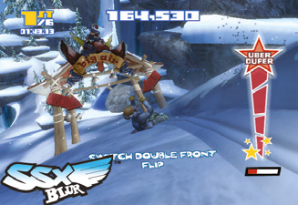

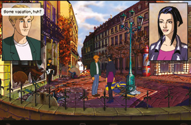

---

[← Capitolul 6 – Instalarea](Capitolul06_Instalarea.md) | [Capitolul 8 – Interviu: Allister Brimble →](Capitolul08_Interviu_Allister_Brimble_despre_sunet.md)
