# Capitolul 8 – Interviu: Allister Brimble, despre muzică și sunet

> *Muzica și efectele sonore pot face o diferență uriașă în experiența unui joc. Stăm de vorbă cu muzicianul care a creat sunetul jocurilor din anii '80 până azi*

Jocurile video nu funcționează dacă nu poți afișa ceva pe un ecran. Pot fi însă jucate fără niciun sunet. Acest dezechilibru e unul dintre cele mai frustrante aspecte ale meseriei de muzician de jocuri, dar și unul dintre cele mai provocatoare. Scopul suprem e să creezi un sunet care să-i facă pe jucători să vrea să dea volumul mai tare, nu să apese pe butonul de mute.

La început, în jocuri, sunetul era pe locul doi, după grafică și gameplay. Muzica era folosită cu zgârcenie, poate pentru un intro sau pentru a introduce un nivel, iar apoi intrau în acțiune efecte de bază, deși existau și excepții. Space Invaders, de exemplu, avea un sunet de fundal pulsatil, însoțit de zgomote de împușcături ori de câte ori apăsai butonul de foc, dar nimic ce ai putea numi muzică. Melodiile erau rare.

O parte din problemă era tehnologia rudimentară de la îndemână, combinată cu lipsa memoriei, care îi forța pe dezvoltatori să facă compromisuri. A durat, prin urmare, câțiva ani până să apară muzicieni dedicați, dar când au apărut, au putut măcar să lucreze cu cipuri de sunet tot mai avansate: cipul generator de sunet programabil al lui Commodore 64, cunoscut ca SID, a fost chiar asemuit cu un instrument muzical.

Cu timpul, sunetul a devenit tot mai bun. Compozitori ca Rob Hubbard, David Whittaker, Martin Galway și Ben Daglish au devenit cunoscuți în cercurile jucătorilor. Nintendo a văzut și ea avantajul sunetului când a proiectat NES-ul cu cinci canale, și au existat experimente cu sunet eșantionat. Termenul „chiptunes” a fost inventat pentru a descrie muzica electronică sintetizată, creată pe mașinile pe 8 biți. Sunetul a primit un impuls suplimentar pe platformele pe 16 biți.

> *Termenul „chiptunes” a fost inventat pentru a descrie muzica electronică sintetizată, creată pe mașinile pe 8 biți*

Formatul de fișier MOD a luat naștere când Ultimate Soundtracker a fost lansat pentru Commodore Amiga, în 1987. Muzica se putea baza pe eșantioane digitizate și permitea crearea de piese cu voce. Consolele pe 16 biți aveau și ele un număr mai mare de canale de sunet și de efecte. Când formatul CD a fost introdus odată cu mașinile pe 32 de biți, calitatea a sărit din nou, iar unele jocuri le permiteau jucătorilor să-și asculte propriile CD-uri.

Sunetul rămâne crucial pentru jocuri și azi, iar muzicienii buni sunt foarte prețuiți în echipele de dezvoltare. Jocurile au nevoie ca muzica, efectele sonore și dialogul vorbit să funcționeze fără cusur și să creeze un mediu captivant pentru jucător, în tandem cu acțiunea și narațiunea de pe ecran.

Compozitorul britanic de jocuri video Allister Brimble are o carieră care urmărește fiecare generație de jocuri. Și-a început cariera la mijlocul anilor '80 și continuă să lucreze și în ziua de azi. Ai jucat vreodată Superfrog, Fantasy World Dizzy, Alien Breed, Sensible Golf, Driver, Colin McRae Rally, Micro Machines V4 sau chiar Goat Simulator? Atunci ai auzit o parte din producția lui uimitoare.

Allister a scris toate sunetele și muzica jocurilor pe care le programezi în această carte.

**Creezi muzică pentru jocuri de multă vreme. Care era pregătirea ta muzicală înainte să intri în industrie?**

Mă interesa muzica de mic și am fost influențat de părinții mei, care lucrau în teatru. De la șapte ani am luat lecții de pian și, deși nu eram deosebit de bun la ele, îmi plăcea să cânt, cum îmi place și azi. Am dat examenul O-level la muzică la școală, care pe vremea aceea era foarte greu la partea de teorie, și l-am picat. Dar muzica din primele jocuri pe calculator m-a inspirat să vreau să-mi creez propria muzică.

**Ce pași ai făcut la început?**

Obișnuiam să înregistrez muzica din jocuri pe casetă și s-o încetinesc, ca să aud cum erau făcute lucrurile. Dar în 1985, Melbourne House a lansat Wham! The Music Box, care mi-a permis să încep să experimentez cu muzica. Chiar și așa, abia când a fost lansat Commodore Amiga am putut cu adevărat să-mi eliberez creativitatea, cu programe ca Aegis Sonix și Sound Tracker. Pe atunci văzusem într-o revistă un articol în care o companie numită 17 Bit Software cerea muzică pe care s-o lanseze gratuit, în domeniul public. Am trimis niște muzică și am primit o scrisoare în care spuneau că le-a plăcut; 17 Bit s-a transformat mai târziu într-o companie de jocuri numită Team 17, iar eu am ajuns să produc muzica pentru unele dintre cele mai mari titluri ale ei.

**Ce se aștepta de la un muzician de jocuri în acele zile de început? Casele de software tratau muzica și sunetul ca părți importante ale unui joc?**

La primele jocuri pe 8 și 16 biți trebuia să fii în stare să lucrezi în cadrul unor limitări. Pentru mașinile pe 8 biți, muzica trebuia uneori să încapă în doar 2 kB de memorie, iar asta însemna să tastezi tipare de note, una câte una, într-un editor de text și apoi să secvențiezi aceste tipare ca să creezi o piesă mai lungă. Trebuia să fii nu doar muzician, ci să știi și de programare și de limitările hardware-ului. Jocurile erau mult mai simple decât azi, așa că în general aveam nevoie doar de o singură piesă muzicală și de câteva efecte sonore. Totuși, cu o singură melodie pe care să te bazezi, trebuia să ne asigurăm că e cu adevărat bună. Compozitorii de jocuri au venit cu niște melodii inspirate în acele zile. Jucătorii apreciau limitările tehnice și erau adesea uimiți de ce era posibil, așa că eu cred că muzica și sunetul erau tratate ca o parte importantă a jocului, adesea chiar promovate pe cutiile jocurilor.

**Care mașină pe 8 biți ți-a permis cel mai mult să-ți dezlănțui talentul muzical?**

Spectrum 128K putea reda trei melodii în același timp, cu control complet al înălțimii și al volumului, iar asta a fost un salt uriaș față de difuzorul cu un singur canal al lui ZX Spectrum 48K. Unul dintre cei mai prolifici compozitori de atunci, David Whittaker, ne-a arătat tuturor cum se face, în jocuri ca Glider Rider, și m-a inspirat să vreau să-mi creez propria muzică de jocuri. Recent, muzica din Glider Rider a apărut pe propriul meu album de remake-uri, The Spectrum Works (wfmag.cc/brimble).

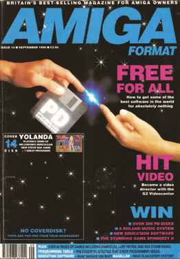

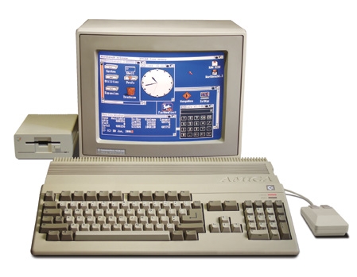

**Ai lucrat la Codemasters în primele zile, dar cum te apucai să creezi muzică pentru jocurile pe calculator acolo?**

Primele mele titluri pentru Codemasters au fost pe Commodore Amiga. Jocurile aveau de obicei o temă foarte puternică, cum ar fi fotbalul sau condusul, și mi se arătau, când era posibil, versiuni timpurii ale jocului. Trebuia să știu dacă muzica era pentru ecranul de titlu, pentru joc sau pentru amândouă, ca s-o potrivesc corect cu gameplay-ul. Muzica pentru Amiga se făcea într-un editor muzical numit Sound Tracker. Mai întâi creeam un set de instrumente din sunete scurte, eșantionate, care să încapă în alocarea de memorie necesară, de vreo 40 kB. Apoi mă apucam să compun muzica și să creez efectele sonore.

**Produceai muzică doar pentru calculatoarele de acasă?**

Codemasters a început curând să producă jocuri pentru Nintendo NES. Am fost invitat la birourile lor din Leamington Spa, așezat în fața unui editor de text și rugat să compun ceva muzică. Era foarte departe de muzica de Amiga pe care o făcusem înainte și a trebuit să cer ajutor. Mi s-a arătat cum să creez diversele tipare și secvențe ca text și apoi să le testez pe o consolă NES special modificată. Specificațiile pentru aceste jocuri erau mult diferite, cerând adesea opt sau zece melodii.

**Ai lucrat la niște jocuri emblematice, cum ar fi seria Dizzy. Cum era folosit sunetul ca să îmbunătățească aceste titluri și cu ce limitări lucrai?**

De regulă, jocurile mai diverse grafic, ca titlurile Dizzy, aveau mult mai puțină memorie rămasă pentru sunet. Muzica pentru Treasure Island Dizzy, de exemplu, a fost făcută în cam 5 kB de memorie, ceea ce echivalează cu cinci pagini de text; compară asta cu 20 sau 30 de megabytes pentru sunet, azi! A trebuit, prin urmare, să creez instrumente scurte, sintetizate în timp real, care ocupau doar 32 de bytes de memorie fiecare, pentru Amiga.

> *Muzica pentru Treasure Island Dizzy a fost făcută în cam 5 kB de memorie*

**Trecerea la Atari ST și Amiga ți-a dus abordarea muzicii la un alt nivel?**

Atari ST avea cam același cip de sunet ca Spectrum 128, iar muzica lui suna aproape identic. Marele salt înainte a fost însă Amiga, care nu era limitat la bipuri simple, ci avea sunet eșantionat pe patru canale, disponibil până atunci doar pe sintetizatoare foarte scumpe ale vremii, ca Fairlight CMI. Programe ca Sound Tracker permiteau manipularea completă a eșantioanelor, ceea ce a inspirat o întreagă generație nouă de muzicieni.

**Mare parte din munca ta a fost pe consolele portabile din seria Game Boy. Dat fiind că aceste aparate erau la fel de probabil folosite fără căști ca și cu, ai luat în calcul că alții aveau șanse mai mari să audă un joc portabil și că, potențial, publicul tău putea fi un grup de ne-jucători din transportul public?**

Ei bine, trebuie să-mi cer scuze tuturor pentru acele melodii enervante din transportul public. Recunosc că e vina mea [râde]. Deși asta nu mi-a schimbat abordarea în crearea muzicii, a trebuit să țin cont că sunetul se auzea probabil din difuzoarele minuscule încorporate. Acestea n-aveau aproape deloc răspuns în bas, așa că unele sunete, instrumentele de bas sau exploziile grave, puteau pur și simplu să dispară, dacă nu le tratai corect, aproape trebuind să le transformi într-un sunet subțire, de radio, ca să se audă deloc. Asta însemna însă că utilizatorii de căști nu aveau parte de cea mai bună experiență.

> *Amiga nu era limitat la bipuri simple, ci avea sunet eșantionat pe patru canale*

**Cum au schimbat consolele abordarea muzicii din jocuri?**

Amiga CD32, urmată de PlayStation, au fost schimbările cu adevărat mari, odată cu apariția CD-playerului încorporat. Asta însemna că muzica nu mai avea limitări și devenea, ei bine, pur și simplu muzică redată de pe un CD.

**Melodii ale muzicienilor pop și rock au început să fie folosite în coloanele sonore ale jocurilor. Ce efect a avut asta asupra ta?**

Muzica pop funcționează în unele tipuri de jocuri. E bună pentru jocurile de curse, de exemplu, unde ai un radio în mașină și are sens să ai piese populare. Dar muzica de joc, în general, trebuie compusă ca să se potrivească unui joc și, în zilele noastre, să fie adaptivă; nu cred că multe piese sub licență au reușit asta. Dar recent cred că ne-am întors spre compozitorii dedicați de jocuri, care înțeleg lucruri ca muzica adaptivă. Desigur, vor mai fi și compozitori de rock și pop populari care fac o treabă bună la asta.

**Implicarea lor a schimbat felul în care era percepută muzica din jocuri?**

Pentru mulți, muzica și-a pierdut o vreme farmecul în jocuri. Fără limitări, nu mai puteai fi impresionat de ce ieșea din difuzoare. Dar curând s-a înțeles că sunetul de pe CD avea propriile limitări, în sensul că era mereu liniar, de la început la sfârșit, și nu se putea adapta la gameplay.

> **Creează melodii clasice ca un profesionist**
>
> *Allister Brimble ne dă cele mai bune sfaturi muzicale ale lui, ca să te ajute să creezi niște hituri*
>
> **Sfatul 1.** Majoritatea calculatoarelor și consolelor pe 8 biți aveau doar trei canale de sunet, adică puteai reda trei note în același timp, așa că e important să nu uiți să-ți limitezi compozițiile la doar câteva părți la un moment dat, ca să obții senzația limitată de 8 biți.
>
> **Sfatul 2.** Folosește arpegii rapide, cunoscute și ca „acorduri pe un singur canal”: alternând rapid între mai multe note ale unui acord, putem crea impresia de acorduri pe un singur canal, iar asta a devenit sunetul emblematic al erei pe 8 biți. Unele dintre cele mai bune exemple se aud în Glider Rider, de David Whittaker, pentru ZX Spectrum 128.
>
> **Sfatul 3.** Păstrează sunetele scurte, rapide și energice. Sunetele scurte funcționează mult mai bine pentru melodiile pe 8 biți, pentru că poți încadra mai multe în același spațiu. Excepția ar putea fi un instrument solist lung și curgător.
>
> **Sfatul 4.** Folosește multe efecte. Foloseam efecte de ecou pe sunetele mai înalte, ca să dăm o senzație de spațiu. Foloseam și vibrato de înălțime, mai ales pe sunetele melodice, adesea întârziind vibrato-ul cu o jumătate de secundă înainte să intre. Asta făcea sunetele simple mult mai bogate și mai netede. În general, evitam efectele pe bas, care suna mai bine păstrat simplu și era, astfel, o fundație mai solidă pentru piesă.
>
> **Sfatul 5.** O tehnică clasică era să folosești un singur canal atât pentru bas, cât și pentru percuție, punând adesea o tobă mică în golurile din linia de bas. Un pic de zgomot alb era adăugat și la începutul sunetului de bas, ca să creeze impresia unei percuții de hi-hat, și avea efectul secundar de a da un atac suplimentar basului.
>
> *Poți asculta exemple de felul în care Allister Brimble a recreat piese pe 8 biți la standardele de azi pe albumul lui, The Spectrum Works, disponibil la allisterbrimble.bandcamp.com și pe majoritatea platformelor de streaming actuale. Adesea suprapune părți noi, care urmăresc înregistrările originale pe 8 biți, pentru un sunet mult mai bogat.*

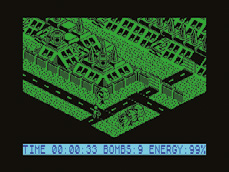

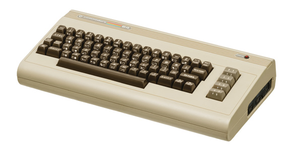

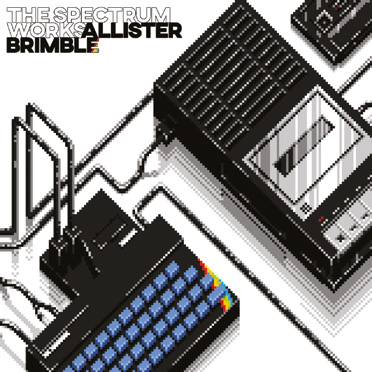

> *Am crezut întotdeauna că muzica nu trebuie să fie mai mare decât jocul. Trebuie să ascultăm muzica de joc vreme îndelungată și, s-o recunoaștem, va fi oprită de îndată ce devine enervantă!*
>
> **Allister Brimble**

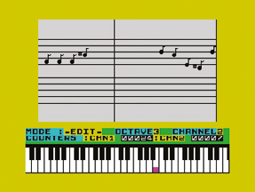

**Deci când a devenit muzica adaptivă parte integrantă a experienței de joc și ce i-a forțat pe muzicieni să ia în calcul?**

Muzica adaptivă a fost posibilă încă din zilele Xbox-ului și PlayStation 2, dar i-a luat ceva timp să prindă și nici azi nu e folosită pe deplin, în multe cazuri. Există însă câteva moduri de a o face, iar muzicianul trebuie să ia în calcul cum poate beneficia fiecare joc de fiecare metodă.

Majoritatea jocurilor au pur și simplu mai multe părți ale unei piese: o parte principală, care se repetă în buclă, o parte de tranziție, care poate ascunde legătura cu o altă parte, și așa mai departe. Se poate face tranziția la fiecare parte în funcție de ce se întâmplă în joc. Asta funcționează pentru multe jocuri. Putem și să împărțim fiecare parte în straturi, să zicem percuție, melodie și acompaniament, și să avem versiuni diferite ale fiecărui strat, între care să comutăm pentru niveluri diferite de acțiune. Într-un titlu recent la care am lucrat, Scrat's Nutty Adventure, există un joc de parașutism în care poți cădea cu viteze diferite. Am inclus muzică ce evolua pe baza unei cronologii de la 0 la 100. Diverse părți în buclă apăreau și dispăreau gradual, iar la sfârșit era introdus un sunet de bombă care cade. Oricât de repede cădeai, muzica părea totuși să se redea de la început la sfârșit.

**Ce înseamnă, atunci, muzică și sunet bune în jocuri, și cum a evoluat asta?**

Încă din primele mele zile la Team 17, am crezut întotdeauna că muzica nu trebuie să fie mai mare decât jocul. Trebuie să ascultăm muzica de joc vreme îndelungată și, s-o recunoaștem, va fi oprită de îndată ce devine enervantă! Sunetul bun de joc pune pe primul loc efectele sonore și ambianța, iar muzica în fundal, și e scris în așa fel încât să nu devină enervant pe termen lung. Pe vremuri, aveam o melodie mare, pentru că era singura noastră șansă de a impresiona, dar azi încercăm să ne retragem de la melodie și să lăsăm muzica să-și facă treaba de a îmbunătăți gameplay-ul. La efectele sonore, încercăm să introducem cât mai multă variație aleatoare posibil. De exemplu, un sunet de pas poate fi format din 50 sau mai multe eșantioane individuale, care variază la fiecare redare.

> *Sunetul bun de joc pune pe primul loc efectele sonore și ambianța, iar muzica în fundal*

**O vreme, în cariera ta, ai produs piese audio distribuite pe dischetele care veneau cu unele reviste de Amiga. Poți să-mi spui mai multe despre cum au apărut?**

Martyn Brown, managerul de proiect de la Team 17 Software, avea niște legături cu revista Amiga Format și m-a rugat să creez o piesă muzicală pentru una dintre dischetele lor de pe copertă. Numărul din septembrie 1990 includea piesa mea, compusă în programul Game Music Creator. Era o variațiune pe Preludiul în Do de Bach și Ave Maria de Charles Gounod. Apoi am făcut propria mea versiune nouă, bazată pe amândouă, cu chitară și ritmuri rock! Am avut oameni care mi-au cerut să fie cântată la înmormântarea lor; nu sunt sigur dacă e de bine sau nu!

> **Cele mai bune ale lui Brimble**
>
> 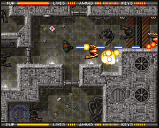
>
> **1. Alien Breed** (pentru Team 17, pe Commodore Amiga). Această muzică era un hibrid de sintetizator pe 8 biți și sunete eșantionate de Amiga, ceva rar auzit pe Amiga. Am creat câteva forme de undă în buclă minuscule, dar complexe, de 64 de bytes, inclusiv sunete corale, și am aplicat tehnici de 8 biți, ca ADSR, vibrato, tremolo și ecouri. Asta a creat o atmosferă unică, în stilul filmului Alien, și a însemnat și că 20 de minute de muzică au încăput în 39 kB de memorie, ceea ce era o performanță la acea vreme.
>
> 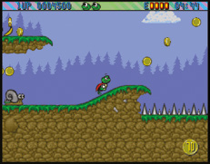
>
> **2. Superfrog** (pentru Team 17, pe Commodore Amiga). Am fost inspirat de clasicele de C64 ale lui Rob Hubbard și mi s-a cerut să creez niște teme drăguțe și amuzante pentru acest joc. Tema de deschidere era ca tema din Superman, dar cu un orăcăit de broască adăugat după fanfara de intro, de amuzament. Amiga avea patru canale de sunet, așa că muzica trebuia compusă cu grijă, astfel încât canalul patru să poată fi suprascris de efectele sonore fără ca ascultătorul să observe că lipsește ceva.
>
> 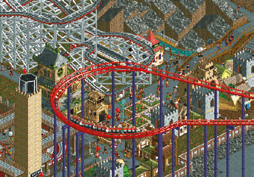
>
> **3. RollerCoaster Tycoon** (pentru Chris Sawyer, pe PC). A fost foarte distractiv să compun pentru faimosul joc al lui Chris Sawyer. Fiecare atracție din parcul de distracții avea propria piesă muzicală tematică, care însoțea efectele sonore. Asta însemna că, pe măsură ce te plimbai pe hartă, diferite melodii apăreau și dispăreau gradual, în funcție de apropierea de diversele atracții. Muzica nu devenea, astfel, niciodată plictisitoare, iar ambianța creată chiar ajuta la aducerea jocului la viață.
>
> 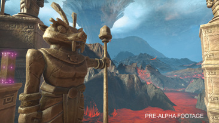
>
> **4. Ice Age: Scrat's Nutty Adventure** (pentru Just Add Water și Outright Games, pe PS4, Xbox One și Nintendo Switch). Acesta e cel mai recent titlu al meu, și în acest joc am folosit tehnici învățate de-a lungul întregii cariere, cu un program numit FMOD Studio, o interfață audio care stă între compozitor și joc. Mi-a permis să creez muzică adaptivă. Muzica pentru partea de parașutism a jocului evoluează în funcție de cât de repede cade jucătorul, iar în scena din templu muzica e generată aleator, sunând diferit de fiecare dată. Am folosit și straturi suplimentare pentru acțiune, astfel încât, când te lupți cu inamicii, muzica devine mai intensă.

**Dintre toate jocurile pe care le-ai făcut, care se remarcă muzical pentru tine și de ce?**

Probabil sunt cel mai mulțumit de muzica din Scrat's Nutty Adventure, lansat în toamna lui 2019. Include muzică pe deplin interactivă și chiar și muzică generată aleator, în templu.

Roller Coaster Tycoon pentru PC a fost altul de care am fost mulțumit. Fiecare atracție avea propria muzică, care apărea gradual pe măsură ce te apropiai. Asta însemna că nu ascultai tot timpul o singură piesă; se schimba constant. Și sunetele montagnes russes-urilor erau minunate, odată ce motorul jocului a început să le ridice și să le coboare înălțimea, odată cu buclele și rampele.

**Care dintre jocurile tale ar suferi cel mai mult dacă sunetul ar fi oprit? Și cât de mare e provocarea de a te asigura că jucătorii vor vrea sunetul tare?**

Cred că toate ar suferi! Dar jocurile care suferă cel mai mult sunt cele de luptă. Fără impacturile pumnilor și ale loviturilor de picior, pare că lovești cu vată, așa că ar trebui să spun Body Blows, de la Team 17, pe Amiga, sau Dragon: The Bruce Lee Story, de la Virgin Games, pe SNES.

Ca sunetul să rămână tare, efectele sonore trebuie să fie considerația principală, iar muzica trebuie să fie bogată, variată și să se adapteze pe deplin la gameplay. Repetiția înseamnă că muzica va fi cu siguranță oprită.

**Ai spune că folosirea sunetului în jocuri se îndreaptă în direcția bună?**

Da, chiar recent am văzut muzica din jocurile de consolă îmbunătățindu-se considerabil. Asta se datorează unor unelte intermediare disponibile gratuit, ca FMOD sau Wwise, pe care compozitorii le pot folosi ca să creeze muzică adaptivă, cu o interfață grafică ușor de folosit. Constat că a veni dintr-un mediu pe 8 sau 16 biți e acum un mare avantaj în folosirea acestor programe, pentru că atunci am învățat cum să fiu creativ în cadrul unor limitări. Să-ți aplici propriul set de limitări e acum cheia pentru a concentra felul în care vrei să sune lucrurile.

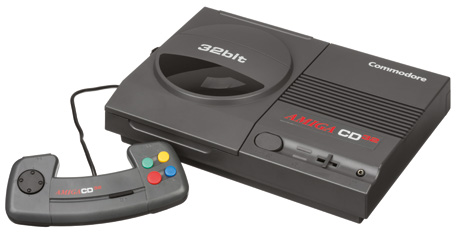

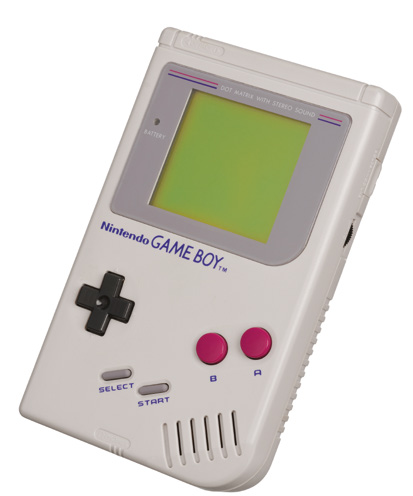

**Și cum te-ai adaptat la lucrul cu atât de multe formate de-a lungul anilor?**

A început cu multe limitări. Trei note în același timp, memorie limitată și așa mai departe. Lucrurile s-au îmbunătățit încet cu Amiga, apoi cu Super Nintendo, unde puteam reda opt sunete deodată. A fost o tranziție destul de ușoară până acolo. Apoi am ajuns la PlayStation și mai departe. Acum aveam nevoie de un studio muzical complet ca să-mi creez muzica, dar eram pregătit, pentru că produsesem deja primul meu album pe CD în 1992, numit Sounds Digital. Pe la 2000, am început să lucrez tot mai mult la sunet pentru console portabile. Asta a închis cercul, înapoi la zilele limitărilor, dar a însemnat că eram unul dintre puținii compozitori rămași cu abilitățile de școală veche necesare pentru a le folosi pe deplin capabilitățile audio. Azi ne-am întors la muzica produsă în studio, dar în limitele muzicii adaptive: un amestec de abilități vechi și noi, și probabil era mea preferată de până acum.

**Care e cea mai mare diferență între atunci și acum?**

E ciudat. Lucrurile au închis cercul. Pe vremuri puteam crea muzică pe 8 biți pe un singur calculator. Asta s-a schimbat dramatic când am avut nevoie de un studio complet pentru muzica de PlayStation. În zilele noastre, însă, m-am întors la un singur calculator, cu toate instrumentele și sunetele mele într-un singur loc.

Dacă ar trebui să aleg o singură diferență, ar fi în alegerile pe care le am acum la îndemână. În orice moment pot aduce orice sunet de care am nevoie, fără să-mi fac griji despre cum îl voi face. Există atât de multe biblioteci de instrumente și sunete, bogate și variate, încât aproape că ești răsfățat cu alegeri.

> **NOTA TRADUCĂTORULUI**
> Linkul scurt wfmag.cc/brimble din text nu mai funcționează; albumul The Spectrum Works se găsește la [allisterbrimble.bandcamp.com](https://allisterbrimble.bandcamp.com). Muzica și efectele sonore create de Allister Brimble pentru cele cinci jocuri din carte se află în folderele `music` și `sounds` din [codul_sursa](codul_sursa/); merită ascultate cu urechea la sfaturile din acest capitol.

---

[← Capitolul 7 – Interviu: Dan Malone](Capitolul07_Interviu_Dan_Malone_despre_grafica.md) | [Înapoi la cuprins](README.md)
