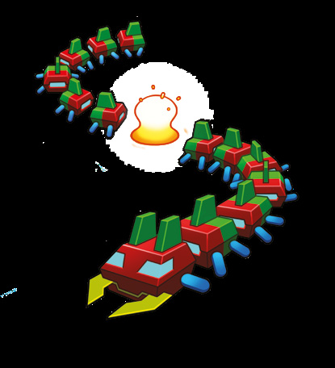
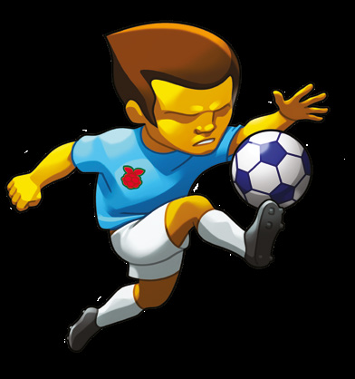
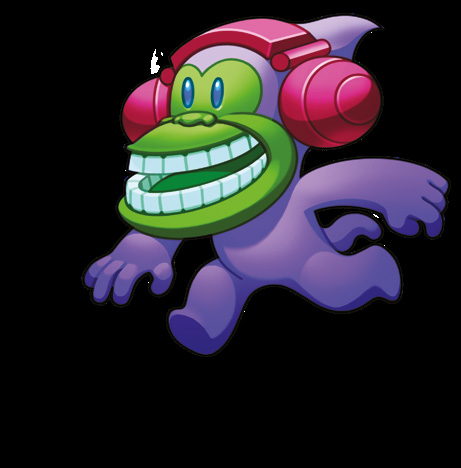

# Cuvânt înainte

> *de David Perry*

> **DESPRE AUTOR**
> David Perry este unul dintre cei mai de succes dezvoltatori din industria jocurilor. Și-a început cariera citind cărți ca aceasta și a scris chiar el câteva. De atunci a produs multe jocuri populare, printre care Aladdin și Earthworm Jim.

Când începeam eu în lumea jocurilor, cumpăram reviste și cărți care conțineau programe de jocuri video, iar dacă voiam să le încerc, trebuia să tastez codul.

Unele erau scurte și simple; altele erau simulatoare de zbor și îți lua zile întregi să le tastezi. Dar aveau două rosturi: m-au ajutat să tastez mai bine și mi-au dat ocazia să studiez codul și să învăț de la maeștri. Le vedeam trucurile și vedeam cum funcționau jocurile lor pe dinăuntru.

Curând scriam eu însumi articole de revistă și cărți, iar mai târziu am ajuns să fac jocuri complete. Din fericire, editorii au vrut să le pună pe rafturile magazinelor de jocuri.

Lucrez profesionist în această industrie de peste 30 de ani. Am avut hituri pe locul întâi și am vândut jocuri video de peste un miliard de dolari.

Sunt întrebat „Care e secretul ca designul jocului tău să devină un hit?”, dar explic doar versiunea „simplă” a răspunsului: toate jocurile care creează dependență trebuie să îmbine, în fiecare clipă, îndemânarea, riscul și strategia. Dacă lipsește una dintre ele, jocul devine plictisitor foarte repede! Tetris? Da. Call of Duty? Da. Angry Birds? Da.

Dar, special pentru tine… îți voi da răspunsul complet la această întrebare. Așa că iată adevăratul secret pentru ca designul jocului tău să fie un hit.

**Trebuie să existe vină.** Jucătorul trebuie să se învinovățească pe sine pentru orice înfrângere. Dacă dă vina pe echilibrul jocului sau pe lucruri pe care nu le poate controla, ai pierdut.

**Trebuie să existe o rată de reîncercare.** Jucătorul trebuie să poată încerca din nou, în câteva secunde, dacă a eșuat. Tetris ar fi eșuat dacă ar fi trebuit să ne uităm la un filmuleț animat înainte să putem încerca iar.

**Trebuie să existe progres.** Jucătorii trebuie să vadă progres după tot ce fac. Pe vremuri aveam scoruri, și tot de aceea în World of Warcraft avansezi constant în nivel.

**Și trebuie să existe feedback.** Dacă faci ceva impresionant sau uimitor, jocul trebuie să răspundă pe măsură. Ca Bejeweled, care o lua razna când se potriveau lanțuri lungi de pietre. Sau ca aparatele de pinball, care intrau în modul super multi-ball cu toate luminile clipind. Gândește-te la joc ca și cum ar avea propria stare emoțională.

Acum, iată factorul X. Aceștia sunt multiplicatori care fac jocul tău și mai captivant:

**Răzbunarea.** Lasă-i pe jucători să se răzbune pe cineva sau pe ceva care i-a frustrat cu adevărat. „E vremea răfuielii!” Da, poți chiar să le amintești: „Tipul ăsta de aici te-a omorât data trecută!”

**Social / multiplayer / spectatori.** Alți oameni, chiar dacă doar privesc, adaugă cu siguranță ceva experienței. Așa că îmbrățișează cât mai mult ceilalți jucători și comunitatea.

**Acceleratoarele de timp.** Surprinde-l pe jucător lăsându-l să progreseze mai repede decât se aștepta. De aceea vezi „experience boosts” în jocurile masiv multiplayer: sunt incredibil de populare, pentru că economisesc timp.

Ultimul meu sfat?

**Umorul.** Este cel mai rar și mai valoros lucru din industria jocurilor video. Oamenii nu uită niciodată jocurile la care au râs. Chiar și un strop de umor ajută: de exemplu, au existat o mulțime de jocuri plictisitoare cu catapulte înainte ca Angry Birds să devină un mare hit.

> *Oamenii nu uită niciodată jocurile la care au râs. Chiar și un strop de umor ajută.*

Dacă urmezi aceste idei, vei avea un avans fantastic față de ceilalți oameni care vor să facă jocuri.

Abia aștept să văd ce vei crea!

---

[Capitolul 1 – Tenis: Pong și Boing! →](Capitolul01_Tenis_Pong_si_Boing.md)
