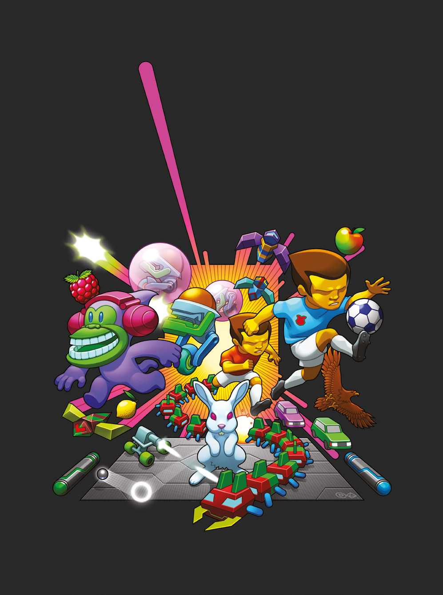
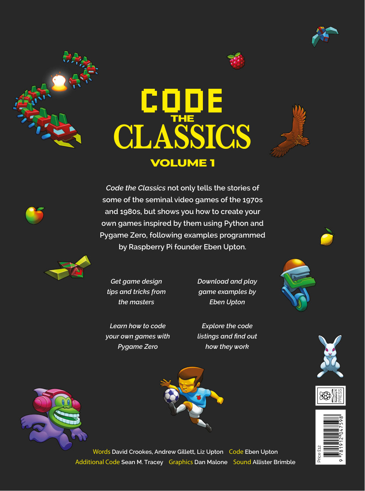

# Programează jocurile clasice – Volumul I
## Autor: Echipa revistei Wireframe (Raspberry Pi Press)
### Traducere și adaptare: Dan Paraschiv

## Despre această carte

Această carte spune poveștile unora dintre cele mai importante jocuri video ale anilor '70, '80 și '90, apoi îți arată cum să scrii tu însuți, în Python, câte un joc inspirat din fiecare. Pentru fiecare joc clasic, cartea are două părți:

- **Povestea jocului original**, scrisă de jurnalistul David Crookes pe baza interviurilor cu creatorii: Nolan Bushnell, cofondatorul Atari (Pong), Stephen Ruddy, autorul conversiilor Bubble Bobble pentru calculatoarele de acasă, John D. Harris, care a portat Frogger pe calculatoarele Atari, Dona Bailey, coautoarea lui Centipede, și Jon Hare, creatorul lui Sensible Soccer. Afli ce i-a inspirat, ce probleme au avut de rezolvat și ce sfaturi au pentru cine vrea să refacă jocul.
- **„Programăm azi”**, în care Andrew Gillett și Eben Upton explică, pas cu pas, un joc nou, scris în Python cu biblioteca **Pygame Zero**, în stilul jocului clasic: Boing!, Cavern, Infinite Bunner, Myriapod și Substitute Soccer. Codul complet al fiecărui joc este reprodus în carte, cu grafică de Dan Malone și muzică de Allister Brimble, și se găsește în folderul [codul_sursa](codul_sursa/).

Cartea se încheie cu un capitol de instalare (Python, Pygame Zero și un editor de cod) și cu două interviuri lungi: unul despre grafica jocurilor, cu artistul Dan Malone, și unul despre muzică și efecte sonore, cu compozitorul Allister Brimble.

Cartea, publicată în 2019 de Raspberry Pi Press în colecția revistei **Wireframe**, este scrisă pentru cititori care știu deja puțin Python. Dacă ai parcurs [Programare simplă cu Python](../Programare_simpla_cu_Python/) și [Să facem jocuri cu Python și Pygame](../Sa_facem_jocuri_cu_Python_si_Pygame/), ești pregătit.

## Cuprins

- [**Cuvânt înainte**](Cuvant_inainte.md) - de David Perry
1. [**Capitolul 1**](Capitolul01_Tenis_Pong_si_Boing.md) - Tenis: Pong și Boing! – multe se pot învăța refăcând acțiunea simplă cu paletă și minge din Pong
2. [**Capitolul 2**](Capitolul02_Platformer_de_actiune_Bubble_Bobble_si_Cavern.md) - Platformer de acțiune: Bubble Bobble și Cavern – programează-ți propriul joc de platforme pe un singur ecran
3. [**Capitolul 3**](Capitolul03_Platformer_vazut_de_sus_Frogger_si_Infinite_Bunner.md) - Platformer văzut de sus: Frogger și Infinite Bunner – schimbă perspectiva și creează un omagiu cu derulare verticală
4. [**Capitolul 4**](Capitolul04_Shooter_pe_un_ecran_Centipede_si_Myriapod.md) - Shooter pe un singur ecran: Centipede și Myriapod – refă acțiunea arcade a clasicului Centipede
5. [**Capitolul 5**](Capitolul05_Joc_de_fotbal_Sensible_Soccer_si_Substitute_Soccer.md) - Joc de fotbal: Sensible Soccer și Substitute Soccer – un joc de fotbal văzut de sus
6. [**Capitolul 6**](Capitolul06_Instalarea.md) - Instalarea – tot ce trebuie să știi ca să rulezi și să modifici jocurile din carte
7. [**Capitolul 7**](Capitolul07_Interviu_Dan_Malone_despre_grafica.md) - Interviu: Dan Malone – despre grafica jocurilor clasice
8. [**Capitolul 8**](Capitolul08_Interviu_Allister_Brimble_despre_sunet.md) - Interviu: Allister Brimble – despre muzica și sunetul jocurilor

Imaginile, fotografiile și capturile de ecran din cartea originală se găsesc în folderul [imagini](imagini/). Cartea originală, în limba engleză, este inclusă în acest folder: [Code_the_Classics_Vol1_EN_Original.pdf](Code_the_Classics_Vol1_EN_Original.pdf); ea poate fi descărcată gratuit și din depozitul Raspberry Pi Press: [github.com/raspberrypipress/released-pdfs](https://github.com/raspberrypipress/released-pdfs).

## Cum să folosiți această carte

### Pentru copii și tineri

Această carte e pentru tine dacă ai scris deja câteva programe în Python și vrei să vezi cum arată un joc adevărat, cu meniu, scor, sunete, muzică și un adversar controlat de calculator. Jocurile au între 300 și 800 de linii de cod, adică sunt mai mari decât exemplele dintr-un manual, dar destul de mici ca să le poți citi și înțelege în întregime.

**Citește mai întâi Capitolul 6, Instalarea.** Ai nevoie de Python, de biblioteca Pygame Zero și de un editor de cod (Thonny, IDLE sau Visual Studio Code). Instrucțiunile scurte sunt și în [codul_sursa/README.md](codul_sursa/README.md).

**Joacă jocul înainte să citești codul.** Fiecare capitol are codul complet în folderul [codul_sursa](codul_sursa/). Pornește-l, joacă-l, apoi citește explicațiile din carte cu codul deschis alături. Așa vei ști ce face fiecare bucată.

**Scrie codul cu mâna ta.** Listările sunt lungi, dar tastarea lor este exact felul în care au învățat să programeze autorii cărții, pe vremea revistelor cu programe de tastat. Dacă nu ai răbdare pentru tot, tastează măcar clasele principale și copiază restul.

**Ia provocările în serios.** La sfârșitul fiecărei secțiuni „Programăm azi” există o casetă cu provocări: mici modificări sau întrebări despre cod. Ele sunt partea în care înveți cel mai mult.

---

### Pentru părinți

Cartea nu conține proiecte periculoase și nu cere niciun echipament în afara unui calculator obișnuit (Windows, macOS, Linux sau Raspberry Pi) cu Python instalat gratuit. Poveștile jocurilor clasice sunt o lectură plăcută și pentru adulți; ele vorbesc despre oameni care au făcut lucruri mari cu resurse foarte puține și pot fi un bun prilej de discuție. Nivelul de programare este intermediar: dacă copilul dumneavoastră este la primele programe, începeți cu cărțile de Scratch și cu „Programare simplă cu Python” din această colecție.

---

### Pentru profesori și educatori

Fiecare joc este un studiu de caz complet, potrivit pentru un club de programare sau pentru orele de informatică din liceu: clase și moștenire, automate finite (stările meniu / joc / final), vectori și normalizare, detecția coliziunilor, inteligență artificială simplă, sunet și muzică. Capitolele pot fi parcurse în orice ordine, dar Boing! (Capitolul 1) este cel mai simplu și explică noțiunile folosite în restul cărții. Interviurile din capitolele 7 și 8 sunt utile pentru discuții despre meseriile din industria jocurilor.

## Convenții folosite în carte

### Codul

Codul apare în casete cu font de cod, marcat ca Python. Numele claselor, funcțiilor și variabilelor apar în text cu font de cod, de exemplu `update`, `Actor` sau `dx`. Listările din carte sunt versiunea fără comentarii a fișierelor din depozitul editurii; versiunea completă, cu comentariile autorilor în limba engleză, este în folderul [codul_sursa](codul_sursa/). Codul folosește indentare cu 3 spații, ca în original.

### Casete informative

> **NOTĂ**
> Informații importante de reținut

> **Provocări**
> Întrebări și idei de modificat în cod, la sfârșitul fiecărei secțiuni „Programăm azi”

> **DESPRE AUTOR**
> Cine a scris textul respectiv, în cartea originală

> **NOTA TRADUCĂTORULUI**
> Explicații adăugate în traducere: linkuri care nu mai funcționează, mici neconcordanțe între text și cod, diferențe față de versiunile actuale de software

Citatele evidențiate în paginile cărții originale apar ca citate în cursive.

### Ce s-a schimbat față de original

- **Linkuri.** Linkurile scurte de forma wfmag.cc/… din carte nu mai funcționează, revista Wireframe încetându-și apariția. Codul la care trimiteau este inclus în folderul [codul_sursa](codul_sursa/), copiat din depozitul oficial [github.com/Wireframe-Magazine/Code-the-Classics](https://github.com/Wireframe-Magazine/Code-the-Classics).
- **Versiuni de software.** Cartea a fost scrisă pentru Python 3.6+ și Pygame Zero 1.2. Jocurile funcționează și cu versiunile actuale; unde e cazul, o notă a traducătorului precizează diferențele.
- **Imagini.** Fotografiile, capturile de ecran și sprite-urile sunt cele din cartea originală. Câteva diagrame desenate vectorial în carte au fost decupate din paginile originale.

## Despre autori

Aceasta este traducerea în limba română a cărții **Code the Classics – Volume I**, publicată de Raspberry Pi (Trading) Ltd. în 2019 (ISBN 978-1-912047-59-8), în colecția revistei de jocuri Wireframe.

- **Concept și director de publicare:** Russell Barnes
- **Redactor:** Phil King
- **Redactor secund:** Nicola King
- **Design:** Critical Media; Lee Allen (șef de design)
- **Text:** David Crookes (poveștile jocurilor), Andrew Gillett (explicațiile de cod), Liz Upton
- **Cod:** Eben Upton
- **Cod suplimentar:** Sean M. Tracey
- **Ilustrații și grafica jocurilor:** Dan Malone
- **Muzică și efecte sonore:** Allister Brimble
- **Cuvânt înainte:** David Perry

Traducerea și adaptarea în limba română au fost realizate de Dan Paraschiv, inițiatorul proiectului TechLab Junior. Față de original, traducerea adaugă casete „Nota traducătorului”, care explică ce s-a schimbat de la apariția cărții.

*Textul de pe coperta a patra:* „Code the Classics nu doar spune poveștile unora dintre jocurile video fondatoare ale anilor '70 și '80, ci îți arată și cum să-ți creezi propriile jocuri inspirate din ele, folosind Python și Pygame Zero, urmând exemplele programate de fondatorul Raspberry Pi, Eben Upton.”

## Licență

Cartea originală este publicată sub licența **Creative Commons Attribution-NonCommercial-ShareAlike 3.0 Unported (CC BY-NC-SA 3.0)**, cu excepția materialelor marcate altfel, iar această traducere este publicată sub aceeași licență.

---

#### Ce înseamnă această licență

Ești liber să:

- **Partajezi** – să copiezi și să redistribui materialul în orice format
- **Adaptezi** – să remixezi, transformi și construiești pe baza materialului

Cu respectarea următoarelor condiții:

| Condiție | Simbol | Ce presupune |
|---|---|---|
| **Atribuire** | BY | Trebuie să acorzi credit autorilor originali (Wireframe / Raspberry Pi Press) și traducerii, să incluzi un link către licență și să indici dacă au fost făcute modificări. |
| **NonComercial** | NC | Nu poți folosi materialul în scopuri comerciale. |
| **Distribuire în condiții identice** | SA | Dacă remixezi, transformi sau construiești pe baza materialului, trebuie să distribui contribuțiile tale sub aceeași licență ca originalul. |

---

#### În limbaj simplu

> **Profesori și educatori** – Puteți distribui capitole elevilor, puteți folosi materialul în clasă și puteți crea fișe de lucru bazate pe această carte, cu condiția să menționați sursa.
>
> **Elevi și părinți** – Puteți copia, printa și partaja cartea cu prietenii și colegii, gratuit.
>
> **Traducători și creatori de conținut** – Puteți traduce sau adapta materialul, dar rezultatul trebuie publicat sub aceeași licență CC BY-NC-SA și trebuie să menționați lucrarea originală.
>
> **Nimeni** nu poate vinde această carte sau derivatele ei.

---

#### Textul complet al licenței

🔗 [https://creativecommons.org/licenses/by-nc-sa/3.0/legalcode](https://creativecommons.org/licenses/by-nc-sa/3.0/legalcode)

Rezumatul licenței, pe înțelesul tuturor:

🔗 [https://creativecommons.org/licenses/by-nc-sa/3.0/](https://creativecommons.org/licenses/by-nc-sa/3.0/)

---

#### Precizare

Această traducere a fost creată cu scopul de a face programarea jocurilor în Python accesibilă tinerilor din România. Dacă această carte te-a ajutat, cel mai frumos mod de a mulțumi este să o recomanzi altcuiva care ar putea beneficia de ea. Pygame Zero este un proiect open-source: [pygame-zero.readthedocs.io](https://pygame-zero.readthedocs.io). Cărțile Raspberry Pi Press se găsesc la [magazine.raspberrypi.com/books](https://magazine.raspberrypi.com/books).

---

*Programează jocurile clasice – Volumul I*
*Traducere și adaptare, 2026*
